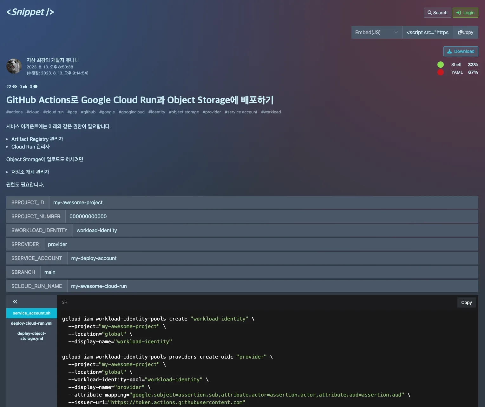
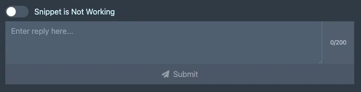
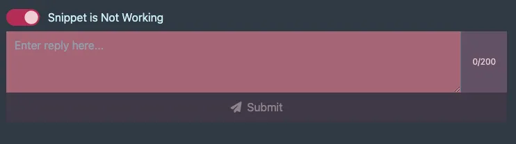
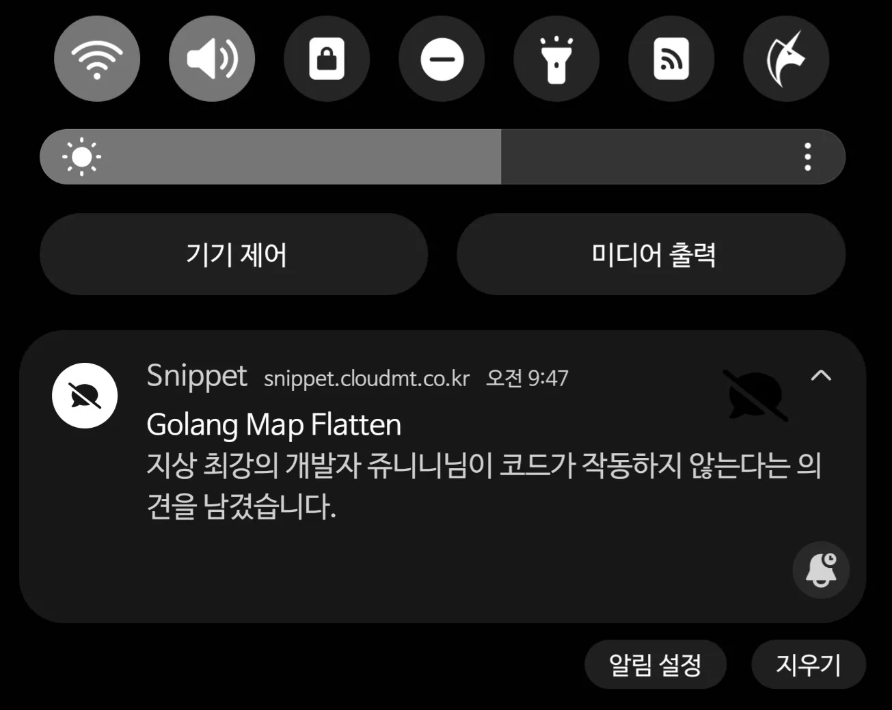
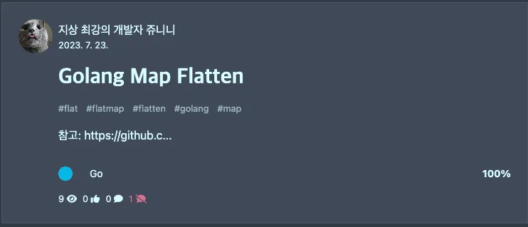
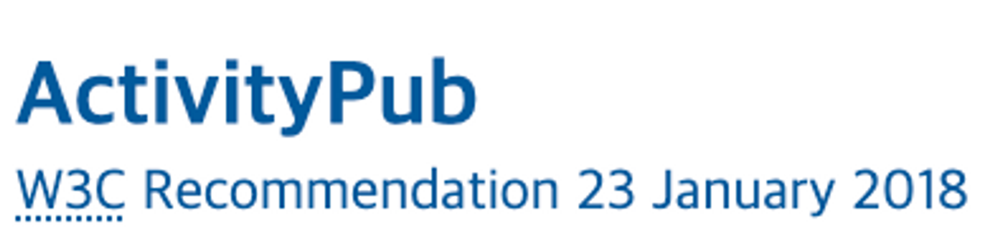

# 많은 관심 부탁드립니다

~~이제 찐찐막 퍼블릭 오픈~~  
여러분도 이제 가입해서 자유롭게 사용하실 수 있습니다!  

https://snippet.cloudmt.co.kr/

~~일 하고 남는 시간에 혼자서 짬짬히 만든거라  
디자인이라던가 만듦새가 막 좋다는 느낌은 안들 수 있습니다.~~

회사 내에 구축되어 있는 인증 시스템을 붙였는데,  
이 인증 시스템이 대외용으로 만들어지지 않았다보니

처음엔 회사 외부 계정에 권한이 안들어가서  
가입 후 아무것도 못하는 문제가 생기기도 하고  
그 외 자잘한 문제들이 발생하는걸 해결해가며  
*마참내* 오픈하게 되었습니다.

~~사실 그거 말고도 방해꾼이 많았음~~

---

# 이게 뭐하는건가?

> 블로그와 [gist]의 중간 포지션의 플랫폼입니다.

블로그처럼 긴 설명 없이 200자 내의 매우 짧은 설명과  
동작하는 코드만을 공유하는 곳입니다.

## 왜 만든건가?

뭔가 검색하면 우린 보통

- StackOverflow
- 블로그
- GitHub 이슈
- 아니면 다른 잡다한 어딘가

를 만나게 됩니다.

근데 보통은 내가 뭔가를 구현해야 하거나  
어떤 에러를 만나서 그저 그거만 해결하고 싶을 뿐인데  
블로그에 들어가면 종종 장황한 설명과 함께  
중간 혹은 마지막에서야 내가 필요한 코드를 만나게 됩니다.

이게 나쁜건 아닌데, 내가 설명을 바라지 않았다면 굉장히 피로감을 느낍니다.  
"나는 그냥 작동하는 코드만 복붙해가고 싶은데"  
하는 기분을 느끼면서 말이죠.

~~저도 몇년 전 까진 "당연히 다 이해하고 써야지!" 라고 했었습니다  
시간이 지나다보니 이렇게 되었을 뿐이죠~~

# Snippet 소개

위 스크린샷의 링크: https://snippet.cloudmt.co.kr/snippets/6f47b4b3-cf7b-43ff-945c-967373077ce3  
(위 스크린샷을 iframe으로 embed하면 아래처럼 나옵니다.)



- 짧은 설명이 있을 뿐이고
- 어느 부분을 바꿔야 하는지 명확히 보이면서
- 작동하는 코드가 공유되는

그런 곳이 있으면 좋겠다는 생각으로 이 서비스를 만들었습니다.

위의 스크린샷은 GitHub Actions에서 Google Cloud Run으로 자동배포 하기 위한 코드인데,  
Service Account에 권한을 주는 준비 과정도 같이 들어있습니다.

별거 아닌데 이거 찾느라고 엄청나게 시간을 들이고 고생도 했습니다.  
그냥 이렇게 써주면 금방 해볼텐데 말입니다.

이렇게 실은 별거 아닌데  
별거 아닌거에 시간을 많이 쓰고 고생하게 되는 경험이 많지 않으십니까?

이런 것들을 쉽게 공유하고 싶어서 만든 서비스입니다.  
이런게 쿠버네티스같은 클라우드 엔지니어링엔 엄청 많다보니 더…  
~~실은 쿠버네티스 하다가 빢쳐서 시작한 프로젝트긴 합니다~~

# Snippet의 특징

기본적인 기능은 위의 스크린샷에서 대부분 보실 수 있을겁니다.

- Snippet에 구성된 언어 비율
- 짧은 설명(마크다운, 200자 제한)
    - 200자가 매우 불편하긴 하지만 일단 지켜보려 합니다.  
    이 부분에서 블로그와 차별을 두고 싶어서요.
- 변수 할당
- 다운로드 및 embed

사실 이런 기본적인거 말고 Snippet에서 강조하고 싶은건  
"코드가 작동하지 않아요" 기능합니다.

로그인을 하면 댓글을 달 수 있게 되는데,  
`Snippet is Not Working` 을 클릭하면 빨갛게 변합니다.

이 상태에서 댓글을 남기면 아래와 같이 작성자에게 푸시가 가죠

카드에는 이런 식으로 안돼요를 몇개 받았는지 표시가 됩니다.

후에는 안돼요에 대해 해결됨도 추가하려고 하는데,  
표시될 때 안돼요의 갯수를 줄일지 옆에 해결됨 아이콘으로 추가할지 아직 고민중입니다.

안돼요를 받았던 흔적을 가리는 기분이 들어서  
안돼요를 받았지만 해결했다는걸 보여주는게 더 좋지 않을까 하는 생각도 들고 말이죠.

“안돼요" 기능은 종종 검색으로 코드를 찾을 때  
버전이 오르거나 하며 그대로 써서는 동작하지 않는 코드를 만나게 되는데  
이런 식으로 보는 사람이 마음의 준비라도 되어있으면 해서 만들었습니다.  
(덤으로 안돼요에 어찌 해결하는지도 써주면 사람들이 참고할 수 있을테니까요)

# 예정중인 기능

## ActivityPub

https://www.w3.org/TR/activitypub/

[ActivityPub]은 전에 트위터 한창 말 많을 때  
사람들이 블루스카이와 마스토돈으로 많이 떠났는데

그 중 마스토돈이 이 [ActivityPub]으로 되어있어서  
자기 서버 만들어도 다른 마스토돈 서버들이랑 연결된다며  
그 때 처음으로 대중들에게 알려지게 됐는데,  
무려 W3C에서 관리되는 겁니다.

~~이왜진~~

SEO 설정도 열심히 해놨고 시간이 지나면 구글 검색에 나오기야 하겠지만  
[Snippet]에 작성된 코드가 [ActivityPub]의 연합우주로 전파될 수 있다면  
재밌지 않을까 하는 생각에서 구현하고 있습니다.

## velog처럼 트랜딩/최신 보여주기

일단 필수 기능들 먼저 구현하자는 생각에 이런 부분들은 차후 구현으로 미뤄졌습니다.  
블로그랑 [gist]의 중간 포지션을 만들고싶다보니,  
[velog]처럼 랜딩페이지에 트랜딩 이라던가, 최신순 이런식으로 보여줄 수 있으면 좋지 않을까 생각중입니다.

## 비공개 Snippet 기능

누군가는 고생해서 만든걸 공개하고 싶지 않은 경우도 있지 않을까 하는 생각이 있긴 합니다.  
(저는 고생해서 만들었으니 공개해야 한다는 쪽이긴 하지만요)

그래서 추후에 비공개 Snippet을 만드는 기능도 추가 할 계획입니다.  
그리고 이 기능은 그룹 기능이 만들어진다면 가장 유용할 것 같아 그룹도 같이 만들 예정입니다.  

# 마지막으로

여러분, [Snippet] 많이 관심가져 주세요!  
지속적으로 개선해나가겠습니다!  
감사합니다!

[Snippet]: https://snippet.cloudmt.co.kr/
[ActivityPub]: https://www.w3.org/TR/activitypub/
[velog]: https://velog.io/
[gist]: https://gist.github.com/
