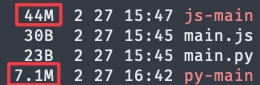
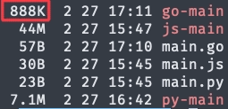
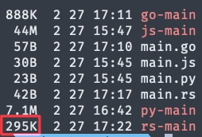
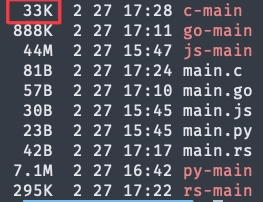

Reference: [Golang 하면 존123나 카리스마있어](https://velog.io/@juunini/golang-john123na-carisma)

회사에서 일하다가 비개발자 동료가 노가다 하는거 보고  
*'아.. 저거 내가 코드 몇 줄 짜주면 자동화 될 것 같은데..'* 하는 마음에  
잠깐 시간 내서 코드 몇 줄 짜준 경험 다들 있으실겁니다.  
~~없...을수도?~~

요즘 ~~Java~~ Python, NodeJS 이런 언어 많이들 쓰시지 않습니까?  
이런걸로 코드 만들어서 줄려 그러면  
그 동료 자리에 가서  

**"제가 좀 도와드리려고 코드를 만들어 왔는데요, 우선 Python(또는 NodeJS)를 설치해야 되거든요. 제가 설치해드릴게요."**  
~~아, 자바는 설치되어 있으시군요... 그러니 다시 자바 16을 설치해서~~

하면서 설치해주고 있을겁니다.  
좀 극단적인 상황을 예로 들자면,  
이미 해당 언어가 설치되어 있는데 구버전인 상황일 수도 있을겁니다.  

**"아, 이미 설치 되어 있는데 구버전이네요... 아, 이거 업무떔에 설치해두신거에요? 버전 바꾸면 안되겠네요? 그러면 conda를 설치해서 이거 쓸 때는 conda activate ..."**  
**"이 위치에서 Shift + 우클릭 해서 터미널 열어갖구요, python(또는 node) \<파일명\> 하면 돼요."**

이러고 있으면 비개발자 동료가 이런 표정 지으면서  

*'아... johnna 어렵네... 그냥 손으로 하는게 낫겠다...'*

라고 속으로 생각하고 있을겁니다.  

그런데, `.exe` 파일 하나 메신저로 던져주면서  
"그 엑셀 파일 있는 폴더에 넣고 실행시키세요"  
이렇게 하면

## 어떻게 그렇게 하죠?

여러분, 옛날에 컴퓨터실에서 포*몬(RGBY) 하려고  
디스켓에 GBA Emulator, ROM, Save 파일 다 넣어서 다녔던 적이 있으십니까?  
그 디스켓의 용량이 1.44MB 밖에 안됩니다.

~~요즘 애들은 이런거 모른다던데 이거 알면 틀...~~

그런데, 그 디스켓을 들고 컴퓨터실 가서  
뭘 **'설치'** 해야 했나요?  
그냥 더블클릭 해서 실행하면 잘 되지 않았던가요?

## 하지만 코드를 실행하기 위해선 언어가 설치되어 있어야 하는데요?

프로그래밍 언어는 크게 **컴파일 언어**와 **인터프리터 언어**로 나뉩니다.  
컴파일 언어는 '빌드' 라는 행위로 실행파일을 만들어내는 언어고,  
인터프리터 언어는 코드를 실행하기 위해 해당 언어의 인터프리터가 필요한 언어입니다.

인터프리터 언어는 실행파일로 못만드냐 하면  
[pyinstaller](https://pyinstaller.org/) 나 [pkg](https://github.com/vercel/pkg) 같은걸 쓰면 되긴 하는데,  
그게 썩 나이스하진 않습니다.

만들긴 했는데, 용량도 너무 크고 실행 속도도 느리고,  
M1 맥을 쓰는 사람이면 윈도우 쓰는 사람한테는 이런 방식으로 전달도 불가능합니다.

그럼 컴파일 언어는 어떤지 살펴보자면,

위 스크린샷은 Golang을 이용해 `Hello, World!` 를 출력하는 코드를 작성한 후  
빌드한 결과물의 용량입니다.

Python이나 NodeJS로 만든 것과는 용량의 차이가 크고,  
실행속도도 빠릅니다.  

~~하지만 컴파일 언어와 인터프리터 언어를 비교하는건 불법(?)입니다~~  
~~뻔뻔하게 이런거 비교하면 안된다고 예시를 든거에요. 암 그렇고 말고~~

인터프리터 언어 간에도 성능 차이가 있는 것 처럼  
컴파일 언어도 빌드 용량 차이와 성능 차이가 있습니다.

Rust로 작성한 코드를 빌드하면 용량이 훨씬 작은걸 확인할 수 있죠.  
성능도 Rust가 더 뛰어납니다.  

어?

## 그럼 인터프리터 언어는 왜 쓰나요?

이렇게만 설명하면 마치 인터프리터 언어는  
컴파일 언어에 비해 열등하게 생각될 수도 있습니다.

컴파일 언어는 빌드를 통해 실행파일로 만든 뒤에야 실행해볼 수 있습니다.  
옛날에는 컴퓨터의 성능도 지금보다 떨어졌고, 빌드하는데 시간도 오래 걸렸기에  
한 번 실행해보려면 꽤나 많은 시간을 써야했습니다.

~~담배도 피고 화장실도 갔다가 커피를 마시고 와도 안끝나있다는 전설도 있다는...~~

하지만 인터프리터 언어는 코드를 작성한 후 바로 실행해볼 수 있습니다.  
(golang이나 rust는 최근에 만들어진 언어라 컴파일 없이 실행해볼 수 있는 특이한 케이스입니다.)

이런 장점이 있기에 인터프리터 언어는 성능 보다는  
개발자의 생산성을 위해 더 쉽고 인간의 언어와 비슷한 구조를 가지는 경우가 많습니다.  
타입도 추론해주는 경우가 많기에, 코드에 타입을 명시하지 않아도 잘 돌아가는 경우도 대부분이구요.

컴파일 언어와 인터프리터 언어는 각자의 장단점이 있고,  
그 분류 내에서도 각 언어마다 또 장단점이 다르기에  
어떤 언어가 더 우월하다고 할 수는 없습니다.

## 그러니 이것저것 해보세요

요즘 Python이나 NodeJS같은 스크립트 언어로 입문하는 사람들이 많다보니  
의외로 컴파일 언어와 인터프리터 언어라는 개념을 모르는 분들도 종종 계셔서  
이런 글을 써보았습니다.

상황에 따라 특정 언어의 장점이 부각되는 영역들이 있다보니  
여러 언어들을 경험해보시는게 좋습니다.

~~그래야 존1나 카리스마 있는 개발자가 될 수 있습니다.~~
