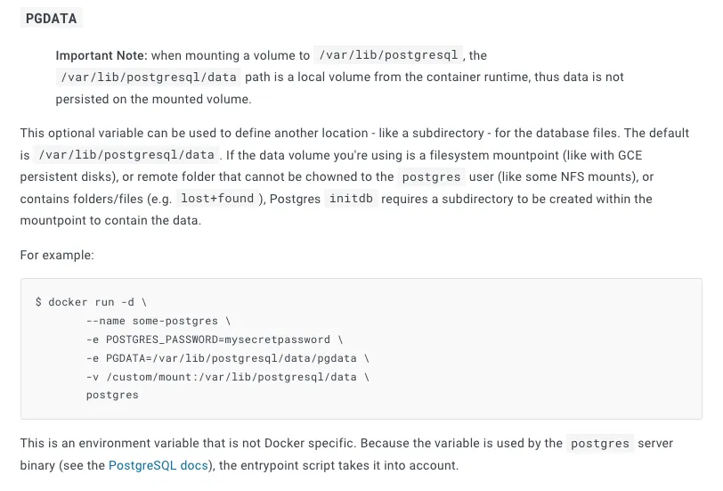
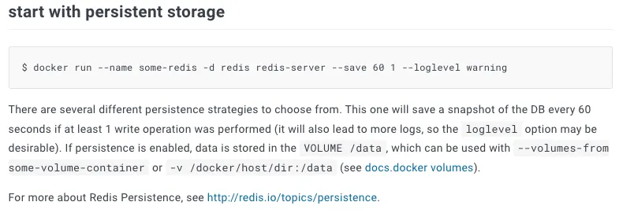

친구가 액티비티펍 서버관리를 좀 해줄 수 있냐고 물어보길래 (이게 쉽지 않을텐데 혼자 했다길래) 기대 반, 걱정 반으로 시작하게 됐습니다.  
도메인이 [yodangang.express](https://yodangang.express) 라서 '본격적으로 하려나본데' 하면서 말이죠.

[Misskey] 라는걸로 구축했던데, VM 들어가보니 생각보다 잘 해놨길래  
"어… 야, 개발자 함 해볼래?" 하고 농담하면서 직접 관리해주기로 하며 시작됐습니다.

# 들어가기 전에

본 글은 Misskey를 라즈베리파이에 올린 글이지만,  
Mastodon도 직접 해본 바에 의하면 둘 다 구성은 거의 비슷하기에  
Mastodon으로도 따라해볼 수 있습니다.

# 서버 구축 시도

다들 각자 많이 한 개발 분야가 달라서 숙달된 정도도 다르기 때문에 패시브 스킬(passive skill)로 발동되는 영역이 다를겁니다.
** 패시브 스킬(Passive Skill)은 스킬을 지니고 있는 것만으로 항상 효과가 발휘된 상태로 유지되는 스킬을 말한다. 
기존처럼 플레이어가 직접 사용하는 스킬은 액티브 스킬이라는 명칭으로 구분한다. 

- 컨테이너라이즈
- 컨테이너 DB의 데이터를 클라우드 버킷에 백업
- 클라우드 스토리지 연결

저는 이렇게 세 가지에 집중해서 작업했습니다.

## 후보1 - 서버리스

처음에는 '서버리스로 올리면 사용자가 적을 땐 돈이 많이 절약되겠지?'라고 희망회로를 돌리며 
컨테이너라이즈 해서 구글의 Cloud Run으로 올렸습니다.

다만 올려놓고 보니 vCPU 2개, Mem 4GB 가 안되면 죽는걸 보고  
생각보다 무거운 사양에 이건 그냥 VM보다 비싸겠다 싶어서 첫 시도는 실패했었습니다.

그리고 액티비티펍을 직접 구축하려고 프로토콜을 보며 알게됐는데,  
팔로우 관계나 연합 관계에 따라 새로 올라오는 노트나 활동등을  
팔로잉 노드나 연합으로 모두 던지는 구조이기에  
내 서버 사용자가 적어도 다른 서버에서 무언가를 계속해서 보내옵니다. (새벽에도 계속 보내옵니다)

결국 light weight한 컨테이너로 만든다 한들  
서버리스로 쓰기엔 적절하지 않은거죠.

## 후보2 - VM

돈만 낼 수 있으면 제일 무난합니다.  
DB와 Redis도 VM내에 띄우면 되구요.  
하지만, VM을 쓰면 한달에 2만원 정도는 계속 지출이 되어야 하기에

"이거 5달만 쓰면 라즈베리파이 사겠는데…"
하는 생각에 이르게 됩니다.

## 후보3 - 라즈베리파이

그래서 결국 라즈베리파이4 모델B 를 샀습니다.  
마침 타이밍 좋게 국내에 물량이 입고된 터라  
Pi 4 Model B 8GB 사양을 구입했습니다.

대략 12만원 주고 구입했는데  
ARMv8 4코어 1.5GHz에 메모리 8GB 라서  
진짜 가성비가 좋습니다.

개인적으로 물리장비에 서버를 세팅할 때는 주의해야 할 점이 몇 가지가 있다고 생각합니다. (매우 개인적인 관점이니 참고만 해주세요.)

- 물리장비는 언제든 죽을 수 있고, 디스크가 증발하는 상황을 대비해야 한다.
- 아무리 Raid 구성을 한다고 한들, 화재가 나거나, 폭발하면 하면 다 사라진다.
- 물리장비가 죽었을 때 언제든 다른곳에 올려서 빠르게 복구할 수 있도록 해야한다.

이 경험들에 기반해서 라즈베리파이에 몇가지 준비를 했습니다.

# 도커를 이용해 라즈베리파이에 서버 올리기

Misskey는 PostgreSQL과 Redis를 필요로 합니다.  
근데, Mastodon도 동일하기 때문에 그대로 쓰셔도 무방합니다.



## PostgreSQL

[docker hub의 postgres](https://hub.docker.com/_/postgres) 문서를 보면



데이터를 mount 시키는 예제가 나와있는데,  
이걸 이용해서 dump가 아닌 mount폴더 전체를 gzip 압축해서  
클라우드 버킷에 백업하는 형태로,

언제든 라즈베리파이가 죽었을 때 이 폴더를 받아서 압축을 풀고  
다른 컨테이너에 마운트해서 DB를 복구할 수 있도록 해놨습니다.

```bash
tar cvzf /misskey/postgres.tgz /misskey/postgres &&\
gcloud auth activate-service-account --key-file /misskey/google_cloud_creds.json &&\
gsutil -m cp /misskey/postgres.tgz gs://<bucket-name>/postgres.tgz
```

이렇게 데이터 폴더를 압축 후 클라우드 버킷에 업로드를 시키고 있습니다.  
백업은 cron 작업을 해서 일정 시간마다 자동으로 백업되게 해두었구요.

## Redis

Redis도 PostgreSQL과 마찬가지로  
[Docker hub 문서](https://hub.docker.com/_/redis)를 보면 persistent storage 사용 방법이 설명되어 있습니다.



```bash
tar cvzf /misskey/redis.tgz /misskey/redis &&\
gcloud auth activate-service-account --key-file /misskey/google_cloud_creds.json &&\
gsutil -m cp /misskey/redis.tgz gs://****/redis.tgz
```

위 스크립트를 cron 작업으로 클라우드 버킷에 업로드 시키고 있습니다.  

Redis도 마찬가지로 죽더라도 해당 백업 파일을 기반으로 언제든 되살릴 수 있게 해뒀습니다.  
하지만, Redis는 DB가 아니라 캐시이기에  
굳이 백업을 안해도 아무런 문제가 없습니다.

## 액티비티펍 서버

misskey에서 컨테이너 이미지를 제공하기는 하는데  
그게 arm64를 지원하진 않아서 직접 arm64 v8 용으로  
직접 컨테이너라이즈 했습니다.

https://hub.docker.com/r/juunini/misskey

어떻게 만들었는지는 [여기](https://github.com/yodangang-express/misskey/blob/develop/YodangangExpress.Dockerfile)서 볼 수 있습니다.  
조금 특이한 부분이라면, [빌더 이미지](https://github.com/yodangang-express/misskey/blob/develop/Builder.Dockerfile)를 따로 만들었는데,  
해당 도커파일을 살펴보면 `linux/arm64` 라고 플랫폼을 명시해뒀습니다.  

그리고 컨테이너 이미지를 빌드 할 때도 [GitHub Workflow](https://github.com/yodangang-express/misskey/blob/develop/.github/workflows/yodangang-express-deploy.yml)에 `linux/arm64/v8` 이라고 명시해뒀습니다.  
라즈베리파이에서 쓰기 위해 이렇게 해둔거죠.

### files 폴더 모니터링

서버에서 활동에 의해 생기는 파일들을 클라우드 버킷에 올리고 연동시키면 되는데,  
`inoticoming` 을 이용해서 파일이 생길 때 마다 클라우드로 업로드 시키고 있습니다.

```bash
inoticoming /misskey/files gsutil -- cp -r /misskey/files/{} gs://yodangang-express/{} \;
```

`inoticoming` 을 이용해 폴더에 변동이 생기면 클라우드 버킷으로 복사하고 있습니다.

좀 더 조치를 하자면, DB에 트리거를 만들어서 로컬 주소를 버킷의 주소로 변경할 수도 있겠지요.  
fuse를 써볼 수 있겠으나, 컨테이너와 원활하게 연동이 안돼서 포기했습니다.

혹은… Google Cloud bucket과 잘 연동이 되도록 직접 코드를 수정해서  
Pull Request를 넣는 방법도 있겠네요…    
절실하면 그렇게 했을 것 같지만, 굳이 그렇게까진 안했습니다.

# 쿠버네티스를 이용해 서버 올리기

아직 쿠버네티스까진 사용하고 있지 않지만,  
포스팅을 하기 위해 간단한 샘플을 만들어왔습니다.

다만 몇 가지의 전제가 깔려있습니다.

1. 컨테이너 이미지에 gcsfuse가 설치되어 있어야 한다.
2. 클러스터에 ingress-nginx와 cert-manager가 설치되어 있다.



위의 코드 중 `deployment.yaml` 을 보면, `spec.template.spec.containers[0].lifecycle.postStart` 에서  
[gcsfuse] 로 마운트 시키는 부분이 나옵니다.  
도커를 이용해서 꼽을 땐 잘 안됐는데, 쿠버네티스를 이용할 땐 잘 되더군요... 알 수 없는 fuse

만약 구글 클라우드가 아니라 다른곳을 이용한다면 fuse를 이용해서 비슷하게 꼽으시면 됩니다.  
PostgreSQL과 Redis는 위 코드에 포함되어있지 않지만, 비슷하게 만들어서 추가하면 됩니다.

위 코드가 샘플용으로 만들어놓은거라 굉장히 심플하게 들어가있는데,  
실제 프로덕션으로 사용하시려면 [Argo Rollouts] 같은걸 이용해서 Canary나 Blue-Green 배포 같은걸 하면 좋을겁니다.

# 왜 안 쿠버네티스요?

아직은 라즈베리파이 하나로만 돌리고 있기에,  
쿠버네티스를 쓰는건 자원의 낭비로 여겨져서 쓰지 않았습니다.

만약, 라즈베리파이 한 대로 감당이 안되는 상황이 온다면  
하나 더 사서 쿠버네티스 구성을 하겠지요.

서버는 물리장비에서 돌고있지만,  
데이터는 모두 클라우드 버킷에 백업이 되고있기에  
어떤 형태로 서버를 실행하든 상관 없도록 만들어둔게 가장 중요하다고 생각됩니다.

여차하면 라즈베리파이 대신 클라우드로 이사해도 문제가 없고  
하이브리드 클라우드로 만들어도 전혀 문제가 없을테니까요.

아마 내년쯤이면 친구에게 서버 관리 보상(?)으로  
라즈베리파이 하나 사달라고 해서 쿠버네티스 구성을 해보려 하고 있습니다.  

# 막판 회사 홍보

클라우드메이트에는 저처럼 
하이브리드 클라우드나 네이티브 클라우드를 자유자재로 다룰 수 있는 분들이 많습니다.

개발자 출신의 클라우드 엔지니어가 많이 포진하고 있으니  
고객으로 방문하신다면, 어떤 문제가 있는지 공감하고 시원하게 문제를 해결해드릴 수 있을겁니다.


클라우드 관련 어려운 문제나  
**든든한** 파트너사가 필요하시다면 언제든 연락해주세요.

https://cloudmt.co.kr/

[Mastodon]: https://github.com/mastodon/mastodon
[Misskey]: https://github.com/misskey-dev/misskey
[gcsfuse]: https://cloud.google.com/storage/docs/gcs-fuse?hl=ko
[Argo Rollouts]: https://argoproj.github.io/rollouts/
