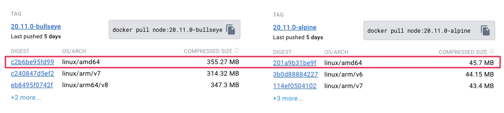

개발자의 본업은 개발입니다.  
인프라에 신경쓰기보단 개발에 집중할 수 있어야 합니다.

그렇기에 개발자가 알야야 할  
도커와 쿠버네티스에 대한 지식을 알려드리겠습니다.

# Docker

도커는 이것만 알면 됩니다.

- docker run -dit \\  
    --name \<컨테이너 이름\> \\  
    -p \<host port\>:\<container port\> \\  
    -e \<env_key=env_value\> \\  
    \<이미지 이름\> \\  
    \<CMD\(optional\)\>
- docker ps \(-a\)
- docker start \<컨테이너 이름 또는 ID\>
- docker exec -it \<컨테이너 이름 또는 ID\> \<CMD\>
- docker stop \<컨테이너 이름 또는 ID\>
- docker rm \(-f\) \<컨테이너 이름 또는 ID\>
- docker logs \<컨테이너 이름 또는 ID\>
- docker pull \<이미지 이름\>
- docker images
- docker rmi \<이미지 이름\>
- docker build .
- docker tag \<이미지 이름\> \<태그\>
- docker push \<이미지 이름 또는 태그\>

더 알면 좋기야 하지만  
이것만 알아도 됩니다.

# Kubernetes

몰라도 됩니다.  
쿠버네티스 공부하지 말고  
**Dockerfile** 작성법을 익히세요.  

# Dockerfile

개발자 여러분이 Dockerfile에 대해 알아야 할건 5가지면 충분합니다.  

- FROM \<이미지 이름\>
- RUN \<쉘 명령어\>
- ADD \<host path\>:\<container path\>
- CMD \<쉘 명령어\>

그리고 **alpine**

아래는 NodeJS의 컨테이너 이미지에서  
bullseye(debian)와 alpine의 용량 비교입니다.  

| Container Image | Size |
| -: | :- |
| Debian bullseye | 52MB |
| Alpine 3.19 | 3MB |

Dockerfile을 작성할 때  
공식 문서를 참고해도 좋지만, 아래 링크를 참고해도 좋습니다.

https://github.com/docker/awesome-compose

위 링크는 docker compose에 대한 awesome 문서이지만  
작성하신 애플리케이션의 언어나 프레임워크를 검색하면 대부분 나오고  
눌러서 들어가보면 docker compose만 있는게 아니라 Dockerfile도 포함되어 있습니다.  

# 왜?

Dockerfile 작성법을 익혀서  
애플리케이션을 컨테이너로 만들 수 있으면  
어느 클라우드를 사용하든 서버리스 애플리케이션으로  
배포가 가능합니다.

개발자는 여기까지만 할 줄 알아도 굉장히 훌륭합니다.  
그리고 k8s로 넘어가도 Dockerfile이 아주 중요합니다.  
~~근데 여기까지도 몰라도 잘 먹고 살더라~~

> k8s는 써야할 때 써야지  
> 안써도 될 때 쓰면 비용이 굉장히 비쌉니다.

# 왜 여기까지만 알아도 되는가?

기존의 아키텍쳐가 SRE를 보장할 수 없는 상태가 된다면  
개발자는 피쳐 개발이나 버그 수정만 해도 매우 힘든 시기일겁니다.  

그런 상황이 된다면  
개발자는 개발에 집중할 수 있어야 합니다.

k8s 세팅 때문에  
워크로드는 뭘로 관리할 것인가?  
클라우드에서 제공하는걸 쓸건가? Argo 같은걸 쓸건가?  
이런 고민 하고있으면 안됩니다.

이런 플랫폼 엔지니어링은 하루이틀 해서 되는 쉬운 그런게 아닙니다.  
담당자를 지정하고 지속적으로 구축 / 운영 / 개선을 해야합니다.

담당할 사람이 없어서 곤란하시다면  
저희 클라우드메이트에 연락주세요!
