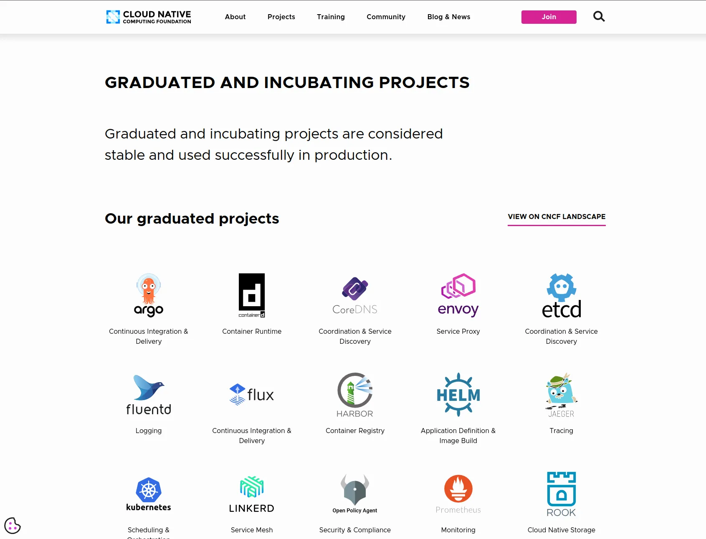
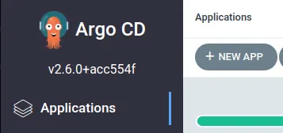
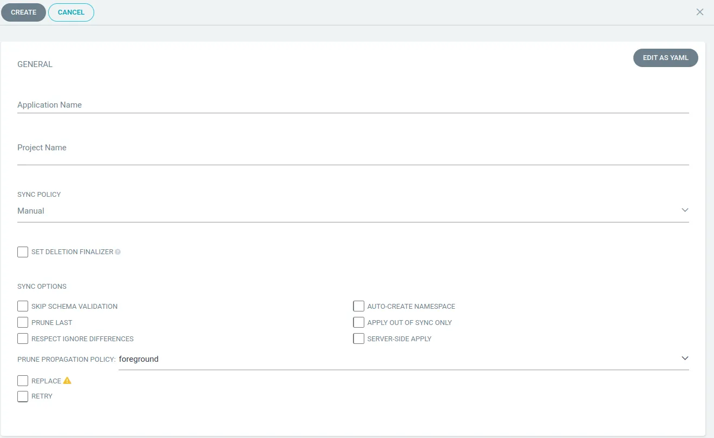
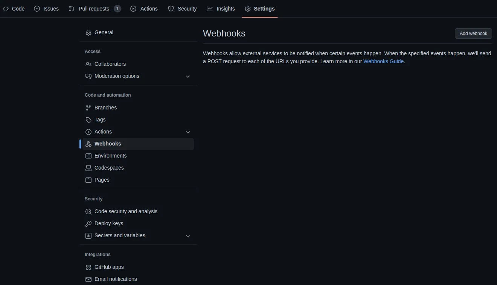
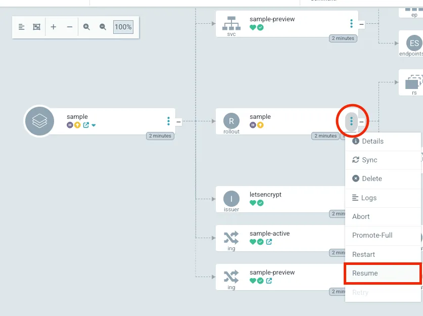
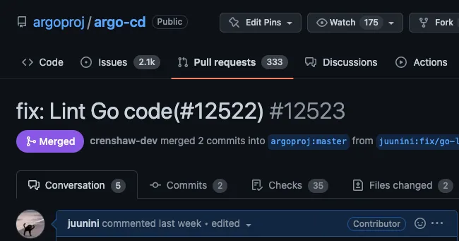
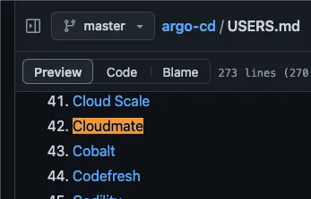

# 서문

## Argo란 무엇인가?

Argo는 2023년 2월 기준  
[Argo CD], [Argo Workflows], [Argo Rollouts], [Argo Events] 이렇게 4가지 제품이 있습니다.

[Argo CD]는 `Kubernetes`를 위한 GitOps Continuos Delivery 도구이고,  
[Argo Workflows]는 Kubernetes에서 병렬 작업을 오케스트레이션 하기 위한 워크플로우 엔진입니다.

[Argo Workflows]와 [Argo CD]를 이용해 CI/CD 를 구축할 수 있습니다.  
([Argo Workflows]는 CI 외에도 MLOps 등의 역할도 가능합니다.)

## 왜 Argo를 선택했는가?

AWS, Azure, GCP 같은 유명 클라우드 서비스 제공 업체의 쿠버네티스 GitOps 가이드를 보면 자사 제품과 함께 문어처럼 보이는 녀석이 표시되어 있습니다.


_~~꼴뚜기 왕자님?~~_

또한, CNCF의 Graduated 프로젝트에도 포함이 되어 있습니다. 여기저기 안 끼는 곳이 없다는 것은? 사용성과 안정성을 널리 인정받고 있다는 것을 잘 보여주는 것이 아닐까요.



### 파편화되고 종속적인 CI/CD


CI/CD를 구축하는 방법은 여러가지가 있습니다.

- AWS CodePipeline
- Azure Pipelines
- GCP Cloud Build
- GitHub Workflows
- ...

특정 클라우드 서비스 제공 업체가 제공하는 도구를 이용해 CI/CD를 구축하는 것은 양날의 검과 같습니다. 툴체인 구성이 간편하다는 장점이 있는 반면에 자칫 특정 서비스에 종속되는 잠재적인 문제를 안고 가야 할 수도 있습니다. 가령 특성 서비스로 CI/CD를 구축해 잘 쓰고 있었는데, 회사에서 클라우드 서비스 제공 업체를 다른 곳으로 바꿀 경우 해당 환경에 맞게 다시 구축해야 합니다.

종속 걱정 없이 하이브리드 멀티 클라우드 전략에 맞게 CI/CD를 구축하는 가장 확실한 길은 ‘쿠버네티스’ 표준을 따르는 모든 환경에 적용할 수 있는 툴체인을 구성하는 것입니다. 이런 이유로 특정 클라우드 제공 업체의 서비스 종속으로부터 자유로운 Argo를 이용해 CI/CD를 구축하게 되었습니다.

### Argo vs ...

Argo를 쓴다고 이야기를 하니 주변에서  
[AirFlow]와 [Flux CD] 등 다른 대안을 추천하는 분도 있었습니다.
Argo의 경우에는 [Argo CD]와 [Argo Workflow]로 CI/CD를 모두 지원하기에
일관성 있게 Argo 제품군으로 통일해서 사용해보기로 헀습니다.

[Jenkins]도 CI/CD가 되지 않느냐 라고 할 수 있지만,  
Argo의 경우엔 [Argo CD]를 통해 쿠버네티스로 배포된 자원까지 모니터링을 할 수 있어
쿠버네티스 환경에선 Argo 제품이 더 사용하기 좋은 측면이 있습니다.

---

# 핸즈온

아래 핸즈온을 따라하면 누구나 쉽게 Argo를 설치해 사용해 볼 수 있습니다.
핸즈온에서는 Argo로 Blue-Green 배포와 함께 [Ingress Nginx]와 [Cert Manager]를 이용해  
[Let's Encrypt] 인증서를 발급받아 적용시키는 과정이 포함되어 있습니다.

## 설치하기

아래 스크립트를 쉘에 입력하면 다음과 같은 작업이 실행됩니다.

- [Argo CD] 설치
- [Argo Rollouts] 설치
- [Argo Workflows] 설치
- [Argo Events] 설치
- [Ingress Nginx] 설치
- [Cert Manager] 설치
- 로그인 할 수 있는 ID, Password 표시
- https://localhost:8080 으로 포트포워딩
- https://localhost:2746 으로 포트포워딩



```sh
GREEN='\033[0;32m'
RESET='\033[0;37m'

echo -e "${GREEN}
┌───────────────────────┐
│ Install start argo-cd │
└───────────────────────┘
${RESET}"
kubectl create namespace argocd
kubectl apply -f https://raw.githubusercontent.com/argoproj/argo-cd/stable/manifests/ha/install.yaml -n argocd
kubectl rollout status deployment -n argocd
kubectl apply -n argocd -f https://raw.githubusercontent.com/argoproj-labs/rollout-extension/v0.2.1/manifests/install.yaml

echo -e "${GREEN}
┌─────────────────────────────┐
│ Install start argo-rollouts │
└─────────────────────────────┘
${RESET}"
kubectl create namespace argo-rollouts
kubectl apply -n argo-rollouts -f https://github.com/argoproj/argo-rollouts/releases/latest/download/install.yaml
kubectl rollout status deployment -n argo-rollouts

echo -e "${GREEN}
┌──────────────────────────────┐
│ Install start argo-workflows │
└──────────────────────────────┘
${RESET}"
kubectl create namespace argo
kubectl apply -n argo -f https://github.com/argoproj/argo-workflows/releases/download/v3.4.4/install.yaml
kubectl rollout status deployment -n argo
kubectl patch deployment \
  argo-server \
  --namespace argo \
  --type='json' \
  -p='[{"op": "replace", "path": "/spec/template/spec/containers/0/args", "value": [
  "server",
  "--auth-mode=server"
]}]'

echo -e "${GREEN}
┌───────────────────────────┐
│ Install start argo-events │
└───────────────────────────┘
${RESET}"
kubectl create namespace argo-events
kubectl apply -n argo-events -f https://github.com/argoproj/argo-events/releases/download/v1.7.5/install.yaml
ubectl apply -n argo-events -f https://github.com/argoproj/argo-events/releases/download/v1.7.5/install-validating-webhook.yaml
kubectl rollout status deployment -n argo-events

echo -e "${GREEN}
┌─────────────────────────────┐
│ Install start ingress-nginx │
└─────────────────────────────┘
${RESET}"
kubectl apply -f https://raw.githubusercontent.com/kubernetes/ingress-nginx/controller-v1.5.1/deploy/static/provider/cloud/deploy.yaml
kubectl rollout status deployment ingress-nginx-controller -n ingress-nginx

echo -e "${GREEN}
┌────────────────────────────┐
│ Install start cert-manager │
└────────────────────────────┘
${RESET}"
kubectl apply -f https://github.com/cert-manager/cert-manager/releases/download/v1.11.0/cert-manager.yaml
kubectl rollout status deployment -n cert-manager

PASSWORD=$(kubectl -n argocd get secret argocd-initial-admin-secret -o jsonpath="{.data.password}" | base64 -d)
echo -e "
USERNAME: admin
PASSWORD: ${PASSWORD}

Argo CD: https://localhost:8080
Argo Workflows: https://localhost:2746
"
kubectl -n argocd port-forward service/argocd-server 8080:443 &
kubectl -n argo port-forward deployment/argo-server 2746:2746 &
```



## 코드 리포지토리

아래 파일은 Golang으로 구현한 간단한 웹서버 입니다.  
웹서버를 빌드해서 컨테이너라이즈 해주는 `Dockerfile`도 함께 포함되어 있죠.  
아래 파일들을 복사해서 GitHub 리포지토리를 만들어보세요.  
(꼭 GitHub가 아니어도 상관은 없습니다. Git이면 됩니다.)

이 리포지토리는 [Argo Workflows]에서 CI를 위해 사용됩니다.



### main.go

```go
package main

import (
    "fmt"
    "log"
    "net/http"
)

func index(w http.ResponseWriter, r *http.Request) {
    fmt.Fprintf(w, "Hello, World!")
}

func main() {
    http.HandleFunc("/", index)
    log.Fatal(http.ListenAndServe(":8080", nil))
}
```

### Dockerfile

```dockerfile
FROM golang:1.20.1-alpine3.17 AS builder
WORKDIR /work
COPY . /work/
RUN go build -o server main.go

FROM alpine:3.14
COPY --from=builder /work/server /work/server
ENTRYPOINT ["/work/server"]
```



## GitOps 리포지토리

Argo CD는 GitOps 도구이기 때문에 Git 리포지토리에 Kustomize를 작성해서  
CD를 처리하도록 권장하고 있습니다.  
(혹은 [Helm]을 이용하거나요)

이 리포지토리는 [Argo CD]에서 CD를 위해 사용됩니다.

아래의 `_preview` 라고 붙는 부분은 Blue-Green 배포시  
Green으로 변경하기 전에 미리보기를 제공하는 부분입니다.



### kustomization.yaml

```yaml
resources:
  - rollout.yaml
  - secret.yaml
  - service.yaml
  - service_preview.yaml
  - ingress.yaml
  - ingress_preview.yaml
  - issuer.yaml
```

### rollout.yaml

```yaml
apiVersion: argoproj.io/v1alpha1
kind: Rollout
metadata:
  name: my-awesome-app
  namespace: my-awesome-app
spec:
  replicas: 3
  selector:
    matchLabels:
      app: my-awesome-app
  template:
    metadata:
      labels:
        app: my-awesome-app
    spec:
      containers:
        - name: my-awesome-app
          image: juunini.azurecr.io/juunini/hello:latest
          imagePullPolicy: Always
          ports:
            - containerPort: 8080
      imagePullSecrets:
        - name: regcred
  strategy:
    blueGreen:
      activeService: my-awesome-app
      autoPromotionEnabled: false
```

### secret.yaml

```yaml
apiVersion: v1
kind: Secret
metadata:
  name: regcred
  namespace: my-awesome-app
type: kubernetes.io/dockerconfigjson
data:
  .dockerconfigjson: >-
    eyJhdXRocyI6eyJ5b3VyLnJlZ2lzdHJ5LnNlcnZlci5jb20iOnsidXNlcm5hbWUiOiJ1c2VybmFtZSIsInBhc3N3b3JkIjoicGFzc3dvcmQiLCJlbWFpbCI6InlvdXJAZW1haWwuY29tIiwiYXV0aCI6ImRYTmxjbTVoYldVNmNHRnpjM2R2Y21RPSJ9fX0=
```

> 위의 `.dockerconfigjson` 의 내용은 base64 디코딩 하면 나오는데,
>
> ```json
> {
>   "auths": {
>     "your.registry.server.com": {
>       "username": "username",
>       "password": "password",
>       "email": "your@email.com",
>       "auth": "dXNlcm5hbWU6cGFzc3dvcmQ="
>     }
>   }
> }
> ```
>
> 이런 내용이고, `auth` 안의 내용도 base64 디코딩을 하면  
> `username:password`  
> 이런 내용입니다. `<username>:<password>` 이죠.

#### service.yaml

```yaml
apiVersion: v1
kind: Service
metadata:
  name: my-awesome-app
  namespace: my-awesome-app
spec:
  selector:
    app: my-awesome-app
  ports:
    - protocol: TCP
      port: 8080
      targetPort: 8080
```

#### service-preview.yaml

```yaml
apiVersion: v1
kind: Service
metadata:
  name: my-awesome-app-preview
  namespace: my-awesome-app
spec:
  selector:
    app: my-awesome-app
  ports:
    - protocol: TCP
      port: 8080
      targetPort: 8080
```

#### ingress.yaml

```yaml
apiVersion: networking.k8s.io/v1
kind: Ingress
metadata:
  name: my-awesome-app
  namespace: my-awesome-app
  annotations:
    kubernetes.io/ingress.class: nginx
    cert-manager.io/issuer: letsencrypt
spec:
  tls:
    - hosts:
        - my-awesome-app.your.domain
      secretName: letsencrypt-tls
  rules:
    - host: my-awesome-app.your.domain
      http:
        paths:
          - path: /
            pathType: Prefix
            backend:
              service:
                name: my-awesome-app
                port:
                  number: 8080
```

#### ingress-preview.yaml

```yaml
apiVersion: networking.k8s.io/v1
kind: Ingress
metadata:
  name: my-awesome-app-preview
  namespace: my-awesome-app
  annotations:
    kubernetes.io/ingress.class: nginx
    cert-manager.io/issuer: letsencrypt
spec:
  tls:
    - hosts:
        - my-awesome-app-preview.your.domain
      secretName: letsencrypt-tls
  rules:
    - host: my-awesome-app-preview.your.domain
      http:
        paths:
          - path: /
            pathType: Prefix
            backend:
              service:
                name: my-awesome-app-preview
                port:
                  number: 8080
```

#### issuer.yaml

```yaml
apiVersion: cert-manager.io/v1
kind: Issuer
metadata:
  name: letsencrypt
  namespace: my-awesome-app
spec:
  acme:
    server: https://acme-v02.api.letsencrypt.org/directory
    email: your@email.com
    privateKeySecretRef:
      name: letsencrypt
    solvers:
      - http01:
          ingress:
            class: nginx
```



위의 코드를 작성하고 Git 리포지토리에 등록한 후 Argo CD에 등록해야 합니다.



처음 Argo CD에 로그인하면 위와 같은 화면을 볼 수 있는데, 여기서 +NEW APP 버튼을 클릭하면 아래같은 화면이 오른쪽에서 슬라이드되며 나타날겁니다.

정보를 넣고 `CREATE` 버튼을 클릭하면 앱이 생성됩니다.



### \[팁\] Argo Workflows에서 Argo CD를 호출하는 방법

[Argo Workflows]에서 CI를 마친 후, [Argo CD]를 호출해야 CD가 진행 됩니다.  
https://localhost:8080/swagger-ui 로 들어가면 [Argo CD API](https://localhost:8080/swagger-ui)를 볼 수 있는데,  
여기서 [Sync API](https://localhost:8080/swagger-ui#operation/ApplicationService_Sync)를 호출하면 됩니다.

API를 그냥은 호출할 수 없고, 호출 가능한 토큰이 필요한데, 이는 [Session API](https://localhost:8080/swagger-ui#operation/SessionService_Create)를 호출해서 얻을 수 있습니다.  
아래와 같이 토큰을 얻은 다음 [Sync API](https://localhost:8080/swagger-ui#operation/ApplicationService_Sync)를 호출하는 식이죠.

```sh
PASSWORD="<Your Argo CD Password>"
APP_NAME="<Registered Argo CD Application Name>"
TOKEN=$(
  curl -s -k https://localhost:8080/api/v1/session -d "{
    \"username\":\"admin\",
    \"password\":\"${PASSWORD}\"
  }" |\
    sed -e 's/{"token":"//' |\
    sed -e 's/"}//'
)
curl -k -X POST https://localhost:8080/api/v1/applications/${APP_NAME}/sync -H "Authorization: Bearer ${TOKEN}"
```

이걸 [Argo Workflows]의 Sensor의 Workflow에 넣으면 됩니다.  
(이건 아래의 `Argo Workflows에 CI 구축하기`에서 다루고 있습니다.)

### Argo Workflows에 CI 구축하기

아래의 배포 스크립트를 실행하면 다음과 같은 과정이 진행됩니다.

- 네임스페이스 생성
- RBAC를 위한 Role과 ServiceAccount 생성
- Argo CD 서버를 호출하기 위한 Secret 생성(Env로 쓰기 위해)
- 컨테이너 레지스트리에 푸시하기 위해 Secret 생성
- Git이 프라이빗 리포지토리일 경우 SSH 클론을 할 수 있도록 SSH 키를 담는 Secret 생성
- https://your.webhook.domain.com 이라는 주소로 POST 요청을 받으면 CI가 실행되도록 EventSource와 Ingress 설정
- 리포지토리를 클론 후 Dockerfile을 기반으로 컨테이너라이징 후 컨테이너 레지스트리에 푸시하는 Sensor

아래 스크립트를 참고해 각자의 상황에 맞게 수정해 사용하면 됩니다.
[Argo CD]의 주소는 쿠버네티스 내부의 `CLUSTER-IP` 를 넣으면 됩니다.
[Argo Workflows]도, [Argo CD]도 전부 쿠버네티스 내부에서 작동하는 도구니까요.

아래 파일을 `ci.yaml` 라고 저장한 다음 `kubectl apply -f ci.yaml` 이라고 하면 작동합니다.



```yaml
apiVersion: v1
kind: Namespace
metadata:
  labels:
    app.kubernetes.io/instance: ci
    app.kubernetes.io/name: ci
  name: ci
---
apiVersion: v1
kind: ServiceAccount
metadata:
  name: ci
  namespace: ci
---
apiVersion: rbac.authorization.k8s.io/v1
kind: Role
metadata:
  name: ci
  namespace: ci
rules:
  - apiGroups:
      - argoproj.io
    resources:
      - workflows
      - workflowtemplates
      - cronworkflows
      - clusterworkflowtemplates
    verbs:
      - "*"
---
apiVersion: rbac.authorization.k8s.io/v1
kind: Role
metadata:
  annotations:
    workflows.argoproj.io/description: |
      Recomended minimum permissions for the `emissary` executor.
  name: ci-role
  namespace: ci
rules:
  - apiGroups:
      - argoproj.io
    resources:
      - workflowtaskresults
    verbs:
      - create
      - patch
---
apiVersion: rbac.authorization.k8s.io/v1
kind: RoleBinding
metadata:
  name: ci
  namespace: ci
roleRef:
  apiGroup: rbac.authorization.k8s.io
  kind: Role
  name: ci
subjects:
  - kind: ServiceAccount
    name: ci
---
apiVersion: rbac.authorization.k8s.io/v1
kind: RoleBinding
metadata:
  name: ci-role-binding
  namespace: ci
roleRef:
  apiGroup: rbac.authorization.k8s.io
  kind: Role
  name: ci-role
subjects:
  - kind: ServiceAccount
    name: default
---
apiVersion: v1
data:
  argocd-server: aHR0cHM6Ly8xMC4wLjE3OC44Mg==
  password: cGFzc3dvcmQ=
  username: YWRtaW4=
kind: Secret
metadata:
  name: argocd-config
  namespace: ci
---
apiVersion: v1
data:
  config.json: eyJhdXRocyI6eyJ5b3VyLnJlZ2lzdGVyLmRvbWFpbi5jb20iOnsiYXV0aCI6ImRYTmxjbTVoYldVNmNHRnpjM2R2Y21RPSJ9fX0=
kind: Secret
metadata:
  name: docker-config
  namespace: ci
---
apiVersion: v1
data:
  private-key: LS0tLS1CRUdJTiBPUEVOU1NIIFBSSVZBVEUgS0VZLS0tLS0KLi4uCi0tLS0tRU5EIE9QRU5TU0ggUFJJVkFURSBLRVktLS0tLQ==
kind: Secret
metadata:
  name: git-ssh-key
  namespace: ci
type: Opaque
---
apiVersion: v1
kind: Service
metadata:
  name: ci
  namespace: ci
spec:
  ports:
    - port: 12000
      targetPort: 12000
  selector:
    eventsource-name: ci
---
apiVersion: argoproj.io/v1alpha1
kind: EventBus
metadata:
  name: default
  namespace: ci
spec:
  nats:
    native:
      auth: token
      replicas: 3
---
apiVersion: argoproj.io/v1alpha1
kind: EventSource
metadata:
  name: ci
  namespace: ci
spec:
  service:
    ports:
      - port: 12000
        targetPort: 12000
  webhook:
    ci-event:
      endpoint: /
      method: POST
      port: "12000"
---
apiVersion: argoproj.io/v1alpha1
kind: Sensor
metadata:
  name: ci
  namespace: ci
spec:
  dependencies:
    - eventName: ci-event
      eventSourceName: ci
      name: ci
  template:
    serviceAccountName: ci
  triggers:
    - template:
        k8s:
          operation: create
          parameters:
            - dest: spec.templates.1.inputs.parameters.0.value
              src:
                dataTemplate:
                  '"{{ (index .Input.body.push.changes 0).new.target.hash
                  | substr 0 7 }}"'
                dependencyName: ci
          source:
            resource:
              apiVersion: argoproj.io/v1alpha1
              kind: Workflow
              metadata:
                generateName: ci-
                namespace: ci
              spec:
                entrypoint: main
                templates:
                  - dag:
                      tasks:
                        - name: image
                          template: image
                        - depends: image
                          name: sync-argo-cd
                          template: sync-argo-cd
                    name: main
                  - container:
                      args:
                        - build
                        - --frontend
                        - dockerfile.v0
                        - --local
                        - context=.
                        - --local
                        - dockerfile=.
                        - --output
                        - type=image,name=your.register.domain.com/juunini/hello-world:latest,push=true
                      command:
                        - buildctl-daemonless.sh
                      env:
                        - name: BUILDKITD_FLAGS
                          value: --oci-worker-no-process-sandbox
                        - name: DOCKER_CONFIG
                          value: /.docker
                      image: moby/buildkit:v0.11.0-rootless
                      securityContext:
                        privileged: true
                      volumeMounts:
                        - mountPath: /.docker
                          name: docker-config
                      workingDir: /work
                    inputs:
                      artifacts:
                        - git:
                            branch: main
                            depth: 1
                            repo: https://github.com/yourname/repository.git
                            singleBranch: true
                            sshPrivateKeySecret:
                              key: private-key
                              name: git-ssh-key
                          name: source
                          path: /work
                      parameters:
                        - name: tag
                    name: image
                    volumes:
                      - name: docker-config
                        secret:
                          secretName: docker-config
                  - container:
                      args:
                        - |-
                          apk --no-cache add curl
                          TOKEN=$(curl -s -k $ARGOCD_SERVER/api/v1/session -d "{\"username\":\"admin\",\"password\":\"$PASSWORD\"}" | sed -e 's/{"token":"//' | sed -e 's/"}//')
                          curl -k -X POST $ARGOCD_SERVER/api/v1/applications/my-awesome-app/sync -H "Authorization: Bearer $TOKEN"
                      command:
                        - sh
                        - -xuce
                      env:
                        - name: ARGOCD_SERVER
                          valueFrom:
                            secretKeyRef:
                              key: argocd-server
                              name: argocd-config
                        - name: PASSWORD
                          valueFrom:
                            secretKeyRef:
                              key: password
                              name: argocd-config
                      image: alpine:3.17
                    name: sync-argo-cd
                volumeClaimTemplates:
                  - metadata:
                      name: work
                    spec:
                      accessModes:
                        - ReadWriteOnce
                      resources:
                        requests:
                          storage: 64Mi
        name: ci-workflow-trigger
---
apiVersion: cert-manager.io/v1
kind: Issuer
metadata:
  name: letsencrypt
  namespace: ci
spec:
  acme:
    email: your@email.com
    privateKeySecretRef:
      name: letsencrypt
    server: https://acme-v02.api.letsencrypt.org/directory
    solvers:
      - http01:
          ingress:
            class: nginx
---
apiVersion: networking.k8s.io/v1
kind: Ingress
metadata:
  annotations:
    cert-manager.io/issuer: letsencrypt
    kubernetes.io/ingress.class: nginx
  name: ci
  namespace: ci
spec:
  rules:
    - host: your.webhook.domain.com
      http:
        paths:
          - backend:
              service:
                name: ci
                port:
                  number: 12000
            path: /
            pathType: Prefix
  tls:
    - hosts:
        - your.webhook.domain.com
      secretName: letsencrypt-tls
```



### 웹훅 등록하기

GitHub를 기준으로 설명하겠습니다. 리포지토리의 `Settings` 에 들어가면 `Webhooks` 라는 탭이 있습니다.  
여기서 웹훅을 생성해서 URL을 입력하면 됩니다.  
(위에서 `your.webhook.domain.com` 이라고 된 부분을 여러분의 상황에 맞게 변경하면 됩니다.)



GitHub이 아니라도 Git을 기반으로 하는 서비스들은 웹훅 설정이 어렵지 않게 비슷하게 되어있을겁니다.  
코드 리포지토리에 웹훅을 등록하고 push 이벤트를 발생시키면 Argo Workflows에서 CI가 실행이 됩니다.

### Blue-Green 진행시키기

위의 과정이 제대로 실행되었다면, Argo CD에 Sync까지 되었을텐데,  
두 번째부터는 완전히 Sync가 안되고 멈추어 있을 것입니다.

그럼 앱을 클릭해서 그래프를 보면 `rollout` 이라는 노드가 보일텐데,  
아래와 같이 `Resume`을 누르면 Green으로 배포가 됩니다.



GitOps 리포지토리에 올렸던 코드를 보면 `autoPromotionEnabled: false` 라는 부분이 있었는데,  
해당 부분이 Green의 배포를 수동으로 하도록 설정된 부분입니다.

아직 `Resume` 하지 않은 상태에서는 앞에 설정했던 `preview` 서버에서 Green 상태의 배포를 미리 확인할 수 있습니다.  
Green의 상태를 먼저 확인하고 배포할 수 있도록 되어있는 것이죠.

---

---

## P.S. Argo CD의 컨트리뷰터가 된 이야기

개인적으로 컨트리뷰터가 되는 것이 전문가로 성장하는 지름길이라 생각합니다.
그래서 컨트리뷰터가 되는 가장 쉬운 방법 중 하나인 [국제화(i18n)에 기여하기 위해 PR](https://github.com/argoproj/argo-cd/pull/12521)을 올렸었습니다.

PR을 올리고 보니, Golang 모듈 테스트에서 에러가 발생해  
[그걸 고치는 PR](https://github.com/argoproj/argo-cd/pull/12523)을 따로 올렸고, 컨트리뷰터가 되었습니다(?)



### Argo CD에 회사 이름이 올라감


PR Template에 체크리스트가 있었는데,  
`Optional. My organization is added to USERS.md.`  
라는 항목이 있길래 `USERS.md` 파일에 회사 이름을 추가했더니 같이 들어가서  
**클라우드메이트**가 Argo CD의 사용자에 추가가 되었습니다.



[argo cd]: https://argo-cd.readthedocs.io/en/stable/
[argo rollouts]: https://argo-rollouts.readthedocs.io/en/stable/
[argo workflows]: https://argoproj.github.io/argo-workflows/
[argo events]: https://argoproj.github.io/argo-events/
[ingress nginx]: https://github.com/kubernetes/ingress-nginx
[cert manager]: https://cert-manager.io/
[airflow]: https://airflow.apache.org/
[flux cd]: https://fluxcd.io/
[jenkins]: https://www.jenkins.io/
[let's encrypt]: https://letsencrypt.org/ko/
[helm]: https://helm.sh/
