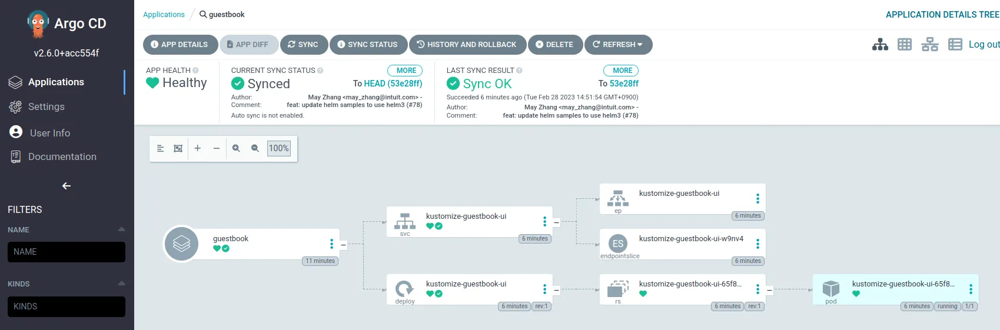

## Argo란 무엇인가?

Argo는 2023년 2월 기준  
`Argo CD`, `Argo Workflows`, `Argo Rollouts`, `Argo Events` 이렇게 4가지 제품이 있습니다.

Argo CD는 `Kubernetes`를 위한 GitOps Continuos Delivery 도구이고,  
Argo Workflows는 Kubernetes에서 병렬 작업을 오케스트레이션 하기 위한 워크플로우 엔진입니다.

Argo Workflows와 Argo CD를 이용해 CI/CD 를 구축할 수 있습니다.  
(Argo Workflows는 CI 외에도 MLOps 등의 역할도 가능합니다.)

## 왜 Argo를 선택했는가?

AWS, Azure, GCP 같은 유명한 클라우드 플랫폼의 Kubernetes GitOps 가이드를 보면  
다들 자사 제품과 함께 아래 그림에 보이는 문어같은 녀석이 표시되어 있습니다.


_~~꼴뚜기 왕자님?~~_

각 클라우드 플랫폼사의 쿠버네티스 GitOps 가이드에 언급 될 정도로 사용성이나 안정성에서 인정되었고,  
CNCF의 Graduated 프로젝트에도 포함이 되어있습니다.


### 파편화되고 종속적인 CI/CD


CI/CD를 구축하는 방법은 여러가지가 있습니다.

- AWS CodePipeline
- Azure Pipelines
- GCP Cloud Build
- GitHub Workflows
- ...

특정 클라우드 플랫폼의 제품을 이용하면 해당 플랫폼에 종속적이 될 수 밖에 없습니다.  
그런 경우에 다른 플랫폼으로 바꾸고 싶어지면 해당 플랫폼에 맞게 재작성해야 한다는 문제점도 생기게 되죠.

그래서 쿠버네티스 클러스터에 CI/CD를 할 수 있는 도구를 설치해서 사용한다면  
플랫폼 종속성이 사라지기에 Argo 제품을 이용해 CI/CD를 구축하기로 했습니다.

### Argo vs ...

Argo를 쓴다고 이야기를 하니 주변에서  
AirFlow와 Flux 등의 대체제를 추천해주셨지만,  
Argo의 경우에는 Argo CD와 Argo Workflow로 CI/CD가 나누어져있어  
하나의 제품이 너무 복잡해지는 문제점을 피할 수 있을 것 같아  
일관성 있게 Argo 제품군으로 통일해서 사용해보기로 헀습니다.

## Argo CD를 사용해보자

아래의 핸즈온을 따라하시면 Argo CD를 설치하고 사용해보실 수 있습니다.

### Argo CD 설치하기

아래 명령어를 넣으면 세 가지 일이 일어납니다.  
표시되는 ID와 패스워드로 로그인을 하시면 됩니다.

- Argo CD의 설치
- 로그인 할 수 있는 ID, Password 표시
- https://localhost:4000 으로 포트포워딩

```sh
kubectl create namespace argocd
kubectl apply -n argocd https://raw.githubusercontent.com/argoproj/argo-cd/stable/manifests/ha/install.yaml

echo -e "
USERNAME: \033[0;31madmin\033[0m
PASSWORD: \033[0;31m$(kubectl -n argocd get secret argocd-initial-admin-secret -o jsonpath="{.data.password}" | base64 -d)\033[0m

Enter https://localhost:4000"
kubectl port-forward service/argocd-server -n argocd 4000:443
```

### Argo CD를 이용해 GitOps 배포

Argo CD는 GitOps 도구입니다.  
Kustomize를 만들어서 Git 레포지토리에 배포해야 합니다.  
(Kustomize로 만들지 않고 Deployments와 Service만 있어도 되긴 하지만 Kustomize를 쓰는게 권장됩니다.)

맨땅에 만들어보려면 쉽지 않으니 만들어진 샘플을 보시는게 제일 좋을겁니다.  
https://github.com/argoproj/argocd-example-apps/tree/master/kustomize-guestbook  
위 주소로 들어가면 kustomize로 만들어진 샘플이 있습니다.  
Argo에서 제공하는 샘플이니 참고하기 좋죠.

그럼 위의 샘플을 이용해 배포를 하는 방법을 안내하겠습니다.


처음 Argo CD에 로그인 해서 들어가면 이런 화면의 `+NEW APP` 버튼이 보일텐데 그걸 클릭합니다.


그럼, 이런 화면이 오른쪽에서 슬라이딩하면서 나타날겁니다.  
저는 이렇게 내용을 입력했습니다.

- GENERAL
  - Application Name: guestbook
  - Project Name: default
- SOURCE
  - Repository URL: https://github.com/argoproj/argocd-example-apps.git
  - Revision: HEAD
  - Path: kustomize-guestbook
- DESTINATION
  - Cluster URL: https://kubernetes.default.svc
  - Namespace: guestbook


위의 화면과 같이 `AUTO-CREATE NAMESPACE` 를 눌러두면,  
원래는 Namespace가 없으면, 없다는 에러가 나며 진행되지 않는데  
이 항목을 체크하면 자동으로 Namespace를 생성해줍니다.


이대로 생성하면 위와 같은 화면이 나옵니다.  
아직 배포를 시작하지 않아서 이렇게 나오는데 `SYNC` 버튼을 눌러서 배포를 진행할 수 있습니다.


`SYNC` 버튼을 누르셨다면 우측에서 이런 화면이 나올텐데,  
`SYNCHRONIZE` 버튼을 누르면 배포가 시작됩니다.



Sync를 시작한 뒤 해당 앱을 클릭하면 이렇게 상세 페이지로 넘어올 수 있습니다.  
어떻게 배포가 되었는지 트리 형태의 이미지로 보여줍니다.

배포는 되었지만, 잘 배포가 되었는지 눈으로 화면을 볼 수가 없으니 그 다음 단계를 진행해보도록 하겠습니다.


```sh
kubectl get services -n guestbook
```

이렇게 입력하면 위와 같이 `EXTERNAL-IP` 가 표시되지 않습니다.  
그렇기 때문에 직접 HTTP 요청을 통해 호출이 불가능한데,  
아래 명령어로 Service의 타입을 `LoadBalancer`로 변경하면 `EXTERNAL-IP` 를 배정받게 됩니다.

```sh
kubectl patch svc kustomize-guestbook-ui -n guestbook -p '{"spec": {"type": "LoadBalancer"}}'

kubectl get services -n guestbook
```


`EXTERNAL-IP` 에 나타난 주소를 브라우저에 입력하면 배포된 앱을 확인하실 수 있습니다.


그리고 Argo CD에서도 해당 서비스를 클릭해 확인하면 타입이 `LoadBalancer`로 변경됐고,  
`HOSTNAME` 이 배정되어 있다는걸 보실 수 있습니다.


서비스의 타입을 바꾸지 않고 `Ingress`를 사용하고 싶으시다면 kustomize에 Ingress를 추가하여 배포하시면 됩니다.  
[Argo Rollouts](https://argo-rollouts.readthedocs.io/en/stable/)를 이용하시면 Blue-Green, Canary 등의 배포도 가능합니다.

---

---

## P.S. Argo CD의 컨트리뷰터가 된 이야기

저는 사용하는 도구의 컨트리뷰터가 되는게 가장 빠르게 전문가가 되는 길이라 생각하기 때문에  
컨트리뷰터가 되는 가장 쉬운 방법 중 하나인 [국제화(i18n)에 기여하기 위해 PR](https://github.com/argoproj/argo-cd/pull/12521)을 올렸었습니다.

PR을 올리고 보니, Golang 모듈 테스트에서 에러가 발생해  
[그걸 고치는 PR](https://github.com/argoproj/argo-cd/pull/12523)을 따로 올렸고, 컨트리뷰터가 되었습니다(?)


### Argo CD에 회사 이름이 올라감


PR Template에 체크리스트가 있었는데,  
`Optional. My organization is added to USERS.md.`  
라는 항목이 있길래 `USERS.md` 파일에 회사 이름을 추가했더니 같이 들어가서  
**클라우드메이트**가 Argo CD의 사용자에 추가가 되었습니다.


