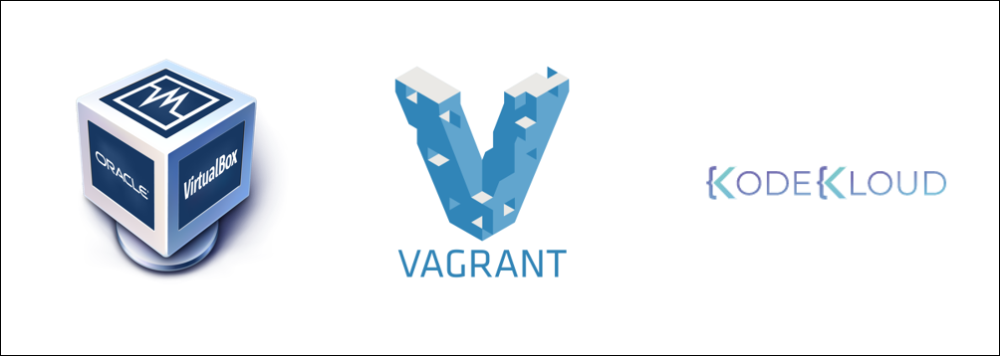
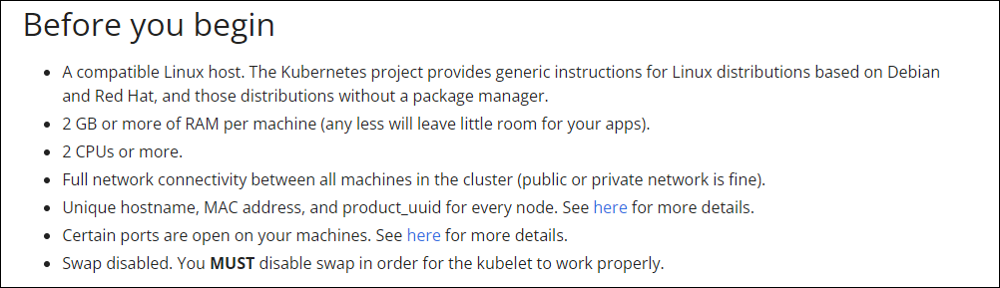
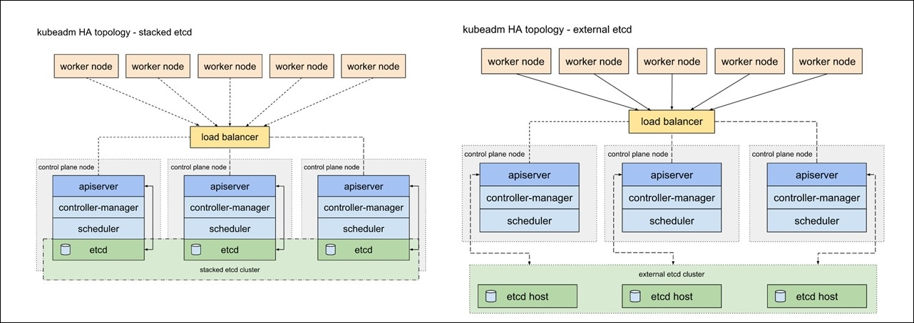
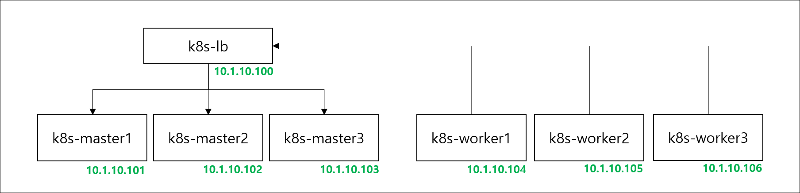
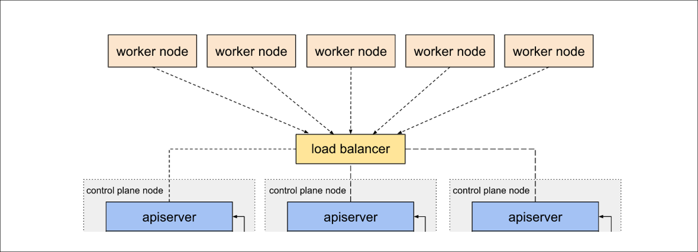
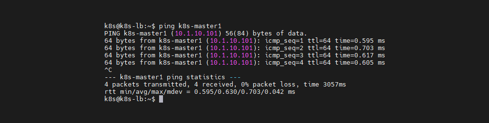

> 쿠버네티스를 *AKS*(Azure), *EKS*(Amazon), *GKE*(Google)와 같은 관리형 서비스로 구성하는 것이 아닌 물리서버 위에 Hyper-v 라는 가상화 환경에서 고가용성 형태로 구성하는 형태로 구축하려고 합니다.

### 참고사항

- 해당 글은 Hyper-v 및 OS 설치에 대한 설명은 하지 않습니다.
- 가상머신에 설치한 OS는 `Ubuntu Server 18.04.6 LTS` 으로 진행하였고, 설치가 완료된 상태라 가정하고 설명합니다.



보통 쿠버네티스를 공부할 때, 관리형 쿠버네티스 서비스 말고 자신의 PC 리소스를 활용해서 master1개, woker node 2개 형태로 설치하여 실습을 진행하는 방식으로 많이 연습합니다.  
이번에는 사내에 있는 컴퓨팅 자원을 활용하여 고가용성(HA) 쿠버네티스를 직접 구축해 보기로 했습니다.

### 최소 서버스펙



쿠버네티스를 설치하기 위해서는 최소 서버스펙을 요구합니다. [1]

- 2 CPU 이상, 2 GB 메모리 이상
- 디스크 크기는 운영체제(OS) 및 컨테이너를 몇개 다운 받기 때문에 최소 30~50GB 이상은 잡으시면 됩니다.
- 구성하는 클러스터에는 네트워크 통신이 되어야 합니다. (특정 포트도 열려 있어야 합니다.)
- linux swap을 비활성화 해야 한다고 합니다.

### 고가용성(HA) 클러스터를 구성하는 방식



etcd 구성에 따라 두가지 구성방식으로 나뉘게 됩니다. [2]  
어느 쪽을 선택하느냐에 따라 필요한 설치와 리소스 자원이 달라지게 됩니다.

| 중첩된 etcd 토플로지                         | 외부 etcd 토플로지                           |
| -------------------------------------------- | -------------------------------------------- |
| etcd 노드와 컨트롤 플레인 노드가 중첩된 방식 | etcd 노드와 컨트롤 플레인 노드가 분리된 방식 |

#### 래프트(Raft) 알고리즘


etcd에서 적용되어 사용하고 있는 알고리즘으로 분산합의 알고리즘이라고 합니다.  
다수결 형태로 결정하기 떄문에 클러스터의 노드는 홀수개로 이루어져야 하며, 최소 3개 이상의 노드가 필요합니다. [3]

#### 중첩된 etcd 토플로지

외부 etcd 토플로지는 중첩된 토플로지에 비해 호스트 개수가 두배나 필요하기 때문에 중첩된 etcd 토폴로지 방식으로 구축을 진행하고자 합니다.



실제 인프라 구성은 해당 페이지에서는 언급하지 않고, 각서버의 운영체제(OS)에서 작업을 시작하는 것으로 진행합니다.  
각 서버의 네트워크는 10.1.10.0/24 대역을 사용하고 서로 통신에는 문제가 없는 환경입니다.

#### 포트와 프로토콜

만약에 각 서버에 설치한 운영체제(OS) 방화벽을 사용한다면  
아래와 같이 쿠버네티스에서 사용하는 포트에 대해 검토가 필요합니다. [4]

**컨트롤 플레인 (k8s-master)**

| 프로토콜 | 방향     | 포트 범위 | 용도                     | 사용 주체            |
| -------- | -------- | --------- | ------------------------ | -------------------- |
| TCP      | 인바운드 | 6443      | 쿠버네티스 API 서버      | 전부                 |
| TCP      | 인바운드 | 2379-2380 | etcd 서버 클라이언트 API | kube-apiserver, etcd |
| TCP      | 인바운드 | 10250     | Kubelet API              | Self, 컨트롤 플레인  |
| TCP      | 인바운드 | 10259     | kube-scheduler           | Self                 |
| TCP      | 인바운드 | 10257     | kube-controller-manager  | Self                 |

etcd 포트가 컨트롤 플레인 섹션에 포함되어 있지만,  
외부 또는 사용자 지정 포트에서 자체 etcd 클러스터를 호스팅할 수도 있습니다.

**워커 노드 (k8s-worker)**

| 프로토콜 | 방향     | 포트 범위   | 용도             | 사용 주체           |
| -------- | -------- | ----------- | ---------------- | ------------------- |
| TCP      | 인바운드 | 10250       | Kubelet API      | Self, 컨트롤 플레인 |
| TCP      | 인바운드 | 30000-32767 | NodePort 서비스† | 전부                |

모든 기본 포트 번호를 재정의할 수 있습니다.  
사용자 지정 포트를 사용하는 경우 여기에 언급된 기본값 대신 해당 포트를 열어야 합니다.

종종 발생하는 한 가지 일반적인 예는 API 서버 포트를 443으로 변경하는 경우입니다.  
또는, API 서버의 기본 포트를 그대로 유지하고, 443 포트에서 수신 대기하는 로드 밸런서 뒤에 API 서버를 두고, 로드 밸런서에서 API 서버로 가는 요청을 API 서버의 기본 포트로 라우팅할 수도 있습니다.

#### 로드밸런서(load balancer)



고가용성(HA)을 위해 필요한 것이 로드밸런서(load balancer)입니다.  
로드밸런서 뒤에 있는 apiserver 중 한 개의 apiserver가 장애가 발생해도 나머지 두 개의 apiserver로 정상적인 서비스를 하도록 로드를 분배합니다. 또한 load balancer의 고가용성을 위해 이중화 구성을  고려할 수 있습니다.

로드밸런서(loadbalancer)는 HAproxy 라는 application을 설치합니다.

```shell
sudo apt update && sudo apt install -y haproxy
sudo cp /etc/haproxy/haproxy.cfg /etc/haproxy/haproxy.cfg-org
sudo vi /etc/haproxy/haproxy.cfg
```

HAproxy의 설정파일을 아래와 같이 입력합니다.

```shell
frontend kubernetes-master-lb
bind 0.0.0.0:6443
option tcplog
mode tcp
default_backend kubernetes-master-nodes
backend kubernetes-master-nodes
mode tcp
balance roundrobin
option tcp-check
option tcplog
server k8s-master1 10.1.10.101:6443 check
server k8s-master2 10.1.10.102:6443 check
server k8s-master3 10.1.10.103:6443 check
```

haproxy.cfg 설정 내용을 입력하였다면 아래와 같이 restart 명령을 하여 설정내용을 적용합니다. 

```shell
# haproxy를 restart 하여 haproxy.cfg 설정내용을 적용합니다.
sudo systemctl restart haproxy

# 해당 명령은 설치 후 1회만 실행하면 됩니다.
sudo systemctl enable haproxy
```

### 공통 작업


서버들에게 공통적으로 작업해야할 항목들이 있습니다.

**hosts 파일 설정**

```shell
sudo vi /etc/hosts
```

hosts 파일내용에 아래 내용을 추가합니다.

```shell
10.1.10.100 k8s-lb
10.1.10.101 k8s-master1
10.1.10.102 k8s-master2
10.1.10.103 k8s-master3
10.1.10.104 k8s-worker1
10.1.10.105 k8s-worker2
10.1.10.106 k8s-worker3
```



이렇게 hosts 파일을 수정하면 ip 대신 사용자가 정의한 이름으로 사용할 수 있습니다.  
아래 내용 부터는 haproxy 서버에서는 적용할 필요가 없는 내용입니다.

**Swap off**

kubelet이 제대로 작동하려면 Swap off를 필수적으로 해야한다고 가이드가 되어 있습니다. [1]

```shell
sudo -i
swapoff -a
echo 0 > /proc/sys/vm/swappiness
sed -e '/swap/ s/^#*/#/' -i /etc/fstab
```

#### docker 설치


docker을 설치하는 내용입니다.

```shell
sudo apt update
sudo apt install -y docker.io
sudo systemctl start docker
sudo systemctl enable docker
```

**docker 데몬 교체**

```shell
cat << EOF | sudo tee –a /etc/docker/daemon.json
{
  "exec-opts": ["native.cgroupdriver=systemd"],
  "log-driver": "json-file",
  "log-opts": {
    "max-size": "100m"
  },
  "storage-driver": "overlay2"
}
EOF
```

**docker 변경내용 적용**

```shell
sudo mkdir -p /etc/systemd/system/docker.service.d
sudo systemctl daemon-reload
sudo systemctl restart docker
```

#### kubernetes 설치


kubelet, kubeadm, kubectl을 설치하는 내용입니다.

```shell
sudo apt-get update
sudo apt-get install -y apt-transport-https ca-certificates curl
sudo curl -fsSLo /usr/share/keyrings/kubernetes-archive-keyring.gpg https://packages.cloud.google.com/apt/doc/apt-key.gpg
echo "deb [signed-by=/usr/share/keyrings/kubernetes-archive-keyring.gpg] https://apt.kubernetes.io/ kubernetes-xenial main" | sudo tee /etc/apt/sources.list.d/kubernetes.list
sudo apt-get update
sudo apt-get install -y kubelet kubeadm kubectl
sudo apt-mark hold kubelet kubeadm kubectl
```

### kubernetes 초기화 작업


k8s-master1서버에서 `kubeadm init` 명령어를 수행하여 kubernetes 초기화 작업을 진행합니다.

```shell
sudo kubeadm init --control-plane-endpoint=k8s-lb:6443 --pod-network-cidr=192.168.1.0/24 --upload-certs
```

- `control-plane-endpoint`은 로드밸런서 서버와 6443포트를 입력합니다.
- `pod-network-cidr`은 192.168.1.0/24 대역을 입력합니다.

kubeadm init 성공하게 되면 아래와 같은 정보를 확인 할 수 있습니다.

- 작업하는 환경마다 token, hash, key 값은 다릅니다.

```shell
Your Kubernetes control-plane has initialized successfully!

To start using your cluster, you need to run the following as a regular user:

  mkdir -p $HOME/.kube
  sudo cp -i /etc/kubernetes/admin.conf $HOME/.kube/config
  sudo chown $(id -u):$(id -g) $HOME/.kube/config

Alternatively, if you are the root user, you can run:

  export KUBECONFIG=/etc/kubernetes/admin.conf

You should now deploy a pod network to the cluster.
Run "kubectl apply -f [podnetwork].yaml" with one of the options listed at:
  https://kubernetes.io/docs/concepts/cluster-administration/addons/

You can now join any number of the control-plane node running the following command on each as root:

  kubeadm join k8s-lb:6443 --token jscz9z.i0kuu90uyobbgw2a \
        --discovery-token-ca-cert-hash sha256:e0d3e4089a09cddf1b0b2a82ed6c3f002a764c23349ec96d3c981a5b8cd59cd6 \
        --control-plane --certificate-key 1cff23e6825104b7ad1d0094754e041827d0f79576f3da71ad36868a35991030

Please note that the certificate-key gives access to cluster sensitive data, keep it secret!
As a safeguard, uploaded-certs will be deleted in two hours; If necessary, you can use
"kubeadm init phase upload-certs --upload-certs" to reload certs afterward.

Then you can join any number of worker nodes by running the following on each as root:

kubeadm join k8s-lb:6443 --token jscz9z.i0kuu90uyobbgw2a \
        --discovery-token-ca-cert-hash sha256:e0d3e4089a09cddf1b0b2a82ed6c3f002a764c23349ec96d3c981a5b8cd59cd6
k8s@k8s-master1:~$
```

현재 작업중인 `k8s-master1`서버의 유저계정(작업은`k8s`계정에서 진행)에서 아래와 같은 작업을 진행합니다.

```shell
mkdir -p $HOME/.kube
sudo cp -i /etc/kubernetes/admin.conf $HOME/.kube/config
sudo chown $(id -u):$(id -g) $HOME/.kube/config
```

만일, ROOT 계정이라면 아래와 같은 명령을 실행합니다.

```shell
export KUBECONFIG=/etc/kubernetes/admin.conf
```

### kubernetes join 작업


`k8s-master2`, `k8s-master3` 서버에서 아래와 같은 명령을 실행하여 `k8s-master1`으로 join을 합니다.

```shell
kubeadm join k8s-lb:6443 --token jscz9z.i0kuu90uyobbgw2a \
	--discovery-token-ca-cert-hash sha256:e0d3e4089a09cddf1b0b2a82ed6c3f002a764c23349ec96d3c981a5b8cd59cd6 \
	--control-plane --certificate-key 1cff23e6825104b7ad1d0094754e041827d0f79576f3da71ad36868a35991030
```

`k8s-worker1`, `,k8s-worker2`, `k8s-worker3` 에서는 `control-plane`으로 join 하기 위해 아래와 같은 명령어를 사용합니다.

```shell
kubeadm join k8s-lb:6443 --token jscz9z.i0kuu90uyobbgw2a \
        --discovery-token-ca-cert-hash sha256:e0d3e4089a09cddf1b0b2a82ed6c3f002a764c23349ec96d3c981a5b8cd59cd6
```

모든 노드에서 join이 성공하면 결과는 아래와 같습니다.

```shell
k8s@k8s-master1:~$ kubectl get nodes
NAME          STATUS     ROLES           AGE     VERSION
k8s-master1   NotReady   control-plane   49m     v1.24.2
k8s-master2   NotReady   control-plane   6m38s   v1.24.2
k8s-master3   NotReady   control-plane   37m     v1.24.2
k8s-worker1   NotReady   <none>          23m     v1.24.2
k8s-worker2   NotReady   <none>          22m     v1.24.2
k8s-worker3   NotReady   <none>          53s     v1.24.2
```

wide 옵션을 주면 추가적으로 확인 가능한 정보들이 많아집니다.

```shell
k8s@k8s-master1:~$ kubectl get nodes -o wide
NAME          STATUS     ROLES           AGE     VERSION   INTERNAL-IP   EXTERNAL-IP   OS-IMAGE             KERNEL-VERSION       CONTAINER-RUNTIME
k8s-master1   NotReady   control-plane   50m     v1.24.2   10.1.10.101   <none>        Ubuntu 18.04.6 LTS   4.15.0-187-generic   containerd://1.5.5
k8s-master2   NotReady   control-plane   8m17s   v1.24.2   10.1.10.102   <none>        Ubuntu 18.04.6 LTS   4.15.0-187-generic   containerd://1.5.5
k8s-master3   NotReady   control-plane   39m     v1.24.2   10.1.10.103   <none>        Ubuntu 18.04.6 LTS   4.15.0-187-generic   containerd://1.5.5
k8s-worker1   NotReady   <none>          25m     v1.24.2   10.1.10.104   <none>        Ubuntu 18.04.6 LTS   4.15.0-187-generic   containerd://1.5.5
k8s-worker2   NotReady   <none>          23m     v1.24.2   10.1.10.105   <none>        Ubuntu 18.04.6 LTS   4.15.0-187-generic   containerd://1.5.5
k8s-worker3   NotReady   <none>          2m32s   v1.24.2   10.1.10.106   <none>        Ubuntu 18.04.6 LTS   4.15.0-187-generic   containerd://1.5.5
```

#### 초기화 할 때, 오류가 발생하는 것 같다면?

가끔 설치 중에 오류가 발생할 수도 있습니다.   
`kubeadm init` 명령 입력 시 `v`옵션을 추가로 입력하면 상세한 정보를 확인 할 수 있습니다.

```shell
sudo kubeadm init --v=10
```

이렇게 하면 아래와 같이 `500 Internal Server Error`가 발생했음을 확인 할 수 있습니다.

```shell
I0615 15:49:22.201998    1224 round_trippers.go:553] POST https://10.1.10.101:6443/api/v1/namespaces/kube-system/serviceaccounts?timeout=10s 500 Internal Server Error in 138 milliseconds
I0615 15:49:22.202021    1224 round_trippers.go:570] HTTP Statistics: GetConnection 0 ms ServerProcessing 137 ms Duration 138 ms
I0615 15:49:22.202028    1224 round_trippers.go:577] Response Headers:
I0615 15:49:22.202035    1224 round_trippers.go:580]     Date: Wed, 15 Jun 2022 15:49:22 GMT
I0615 15:49:22.202042    1224 round_trippers.go:580]     Audit-Id: 58b00d5f-5f4f-4ab2-bbb3-c3479189f4bc
I0615 15:49:22.202048    1224 round_trippers.go:580]     Cache-Control: no-cache, private
I0615 15:49:22.202054    1224 round_trippers.go:580]     Content-Type: application/json
I0615 15:49:22.202060    1224 round_trippers.go:580]     X-Kubernetes-Pf-Flowschema-Uid: 4383fc49-8e46-40c9-8a5e-7031390e956f
I0615 15:49:22.202128    1224 round_trippers.go:580]     X-Kubernetes-Pf-Prioritylevel-Uid: 5e6fba37-152d-4f54-bbf7-e6829d7f15b1
I0615 15:49:22.202134    1224 round_trippers.go:580]     Content-Length: 169
I0615 15:49:22.202152    1224 request.go:1073] Response Body: {"kind":"Status","apiVersion":"v1","metadata":{},"status":"Failure","message":"rpc error: code = Unknown desc = malformed header: missing HTTP content-type","code":500}
rpc error: code = Unknown desc = malformed header: missing HTTP content-type
unable to create serviceaccount
k8s.io/kubernetes/cmd/kubeadm/app/util/apiclient.CreateOrUpdateServiceAccount
cmd/kubeadm/app/util/apiclient/idempotency.go:141
k8s.io/kubernetes/cmd/kubeadm/app/phases/addons/dns.createCoreDNSAddon
cmd/kubeadm/app/phases/addons/dns/dns.go:211
```

이렇게 막히는 경우 구글 검색으로 찾아보기도 하고 페이스북 그룹에서[5] 질문을 할 수도 있습니다.

### CNI(Container Network Interface) 설치


Cloud Native Computing Foundation 프로젝트인 CNI(Container Network Interface)는 지원되는 여러 플러그인과 함께 Linux 컨테이너에서 네트워크 인터페이스를 구성하기 위한 플러그인을 작성하기 위한 사양 및 라이브러리로 구성됩니다. [6]  
여러가지 CNI 플러그인이 있지만 그중에서 많은 서비스에서 채택하여 사용하고 있는 Calico를 사용합니다. [7]

#### Calico 설정

`curl` 명령을 사용하여 `yaml` 파일을 다운로드 받습니다.

```shell
curl https://docs.projectcalico.org/manifests/calico-typha.yaml -o calico.yaml
vi calico.yaml
```

**calico.yaml 수정**

```shell
- name: CALICO_IPV4POOL_CIDR
  value: "192.168.1.0/24"
```

- vi 편집기에서 `CALICO_IPV4POOL_CIDR` 검색합니다.
  `#`으로 주석처리가 되어 있습니다. `#`을 지워 주시면 됩니다.
- kubeadm 에서 pod cidr 네트워크 대역을 192.168.1.0/24으로 설정 했으면 calico.yaml 파일 편집 과정을 스킵하면 되는데 그게 아니니 수정을 해야합니다.

**calico.yaml 수정내용 적용합니다.**

```shell
kubectl apply -f calico.yaml
```

calico 적용 이전에는 READY 상태가 0/1 인 것을 확인 할 수 있습니다.

```shell
k8s@k8s-master1:~$ kubectl get pods --all-namespaces
NAMESPACE     NAME                                  READY   STATUS    RESTARTS   AGE
kube-system   coredns-6d4b75cb6d-c22gd              0/1     Pending   0          56m
kube-system   coredns-6d4b75cb6d-g9b67              0/1     Pending   0          56m
```

calico 적용하면 READY 상태가 0/1 에서 1/1로 변경된 것을 확인할 수 있습니다.

```shell
k8s@k8s-master1:~$ kubectl get pods --all-namespaces
NAMESPACE     NAME                                       READY   STATUS    RESTARTS   AGE
kube-system   calico-kube-controllers-56cdb7c587-xhkjf   1/1     Running   0          82s
kube-system   calico-node-84gxp                          1/1     Running   0          83s
kube-system   calico-node-brc5l                          1/1     Running   0          83s
kube-system   calico-node-fpsrt                          1/1     Running   0          83s
kube-system   calico-node-jcd95                          1/1     Running   0          83s
kube-system   calico-node-nz65p                          1/1     Running   0          83s
kube-system   calico-node-whbfh                          1/1     Running   0          83s
kube-system   calico-typha-6775694657-t4c6s              1/1     Running   0          83s
kube-system   coredns-6d4b75cb6d-c22gd                   1/1     Running   0          59m
kube-system   coredns-6d4b75cb6d-g9b67                   1/1     Running   0          59m
```

또한 CNI 배포 이후에 시간이 지나면 STATUS 상태가 NotReady에서 Ready로 변경되는 것을 확인할 수 있습니다.

```shell
k8s@k8s-master1:~$ kubectl get nodes
NAME          STATUS   ROLES           AGE   VERSION
k8s-master1   Ready    control-plane   45h   v1.24.2
k8s-master2   Ready    control-plane   45h   v1.24.2
k8s-master3   Ready    control-plane   45h   v1.24.2
k8s-worker1   Ready    <none>          45h   v1.24.2
k8s-worker2   Ready    <none>          45h   v1.24.2
k8s-worker3   Ready    <none>          45h   v1.24.2
```

### 정리


지금까지 작업한 내용을 정리해 봅시다!

1. ETCD를 중첩으로 구성할지 외부로 구성할지 결정합니다.
2. 로드밸런서를 설치합니다.
3. 도커와 쿠버네티스를 설치합니다.
4. master1 노드에서 kubeadm init 를 실행합니다.
5. control plane으로 구성할 노드에 kubeadm join 명령을 수행합니다. (master2,3)
6. data plane(worker node)으로 구성할 노드에 kubeadm join 명령을 수행합니다. (worker1,2,3)
7. CNI(Container Network Interface) 설치합니다. (master1)

### 참고자료

- [1] [Before you begin](https://kubernetes.io/docs/setup/production-environment/tools/kubeadm/install-kubeadm/#before-you-begin)
- [2] [고가용성 토폴로지 선택](https://kubernetes.io/ko/docs/setup/production-environment/tools/kubeadm/ha-topology/)
- [3] [The Raft Consensus Algorithm](https://raft.github.io/)
- [4] [쿠버네티스 포트와 프로토콜](https://kubernetes.io/ko/docs/reference/ports-and-protocols/)
- [5] [Kubernetes Korea Group](https://www.facebook.com/groups/k8skr)
- [6] [CNI - the Container Network Interface](https://github.com/containernetworking/cni)
- [7] [Kubernetes Network Plugins](https://kubedex.com/kubernetes-network-plugins/)
