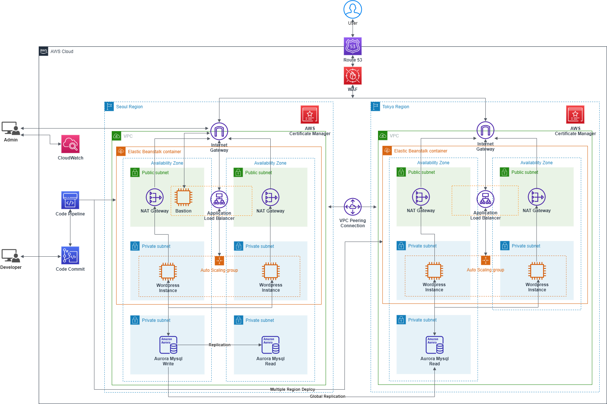
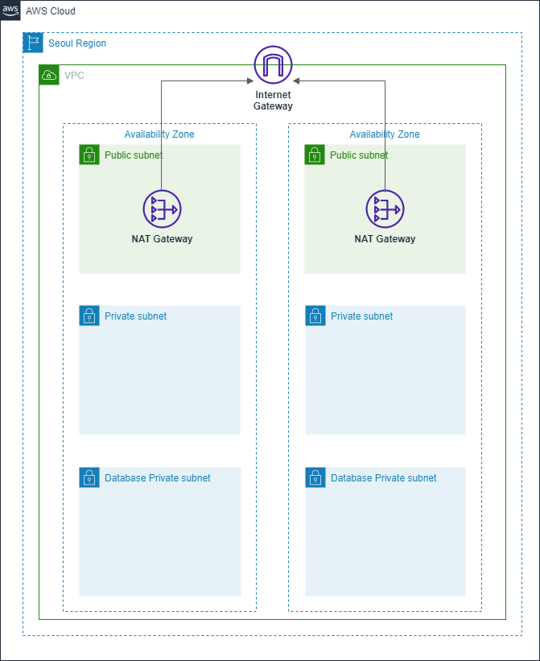
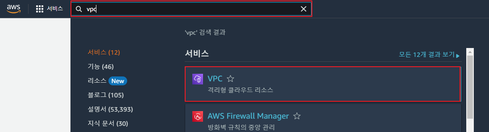
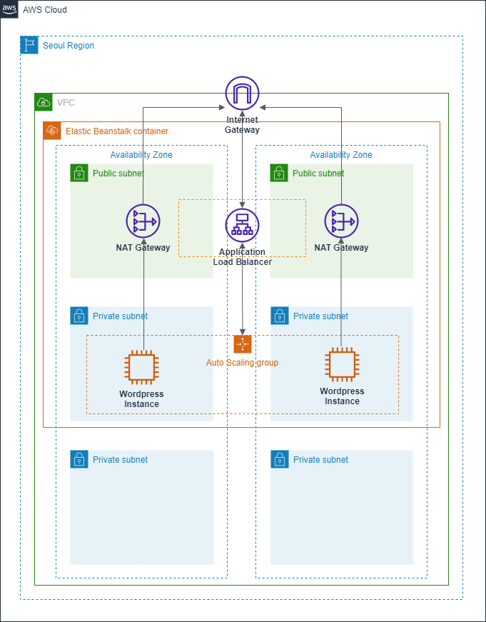
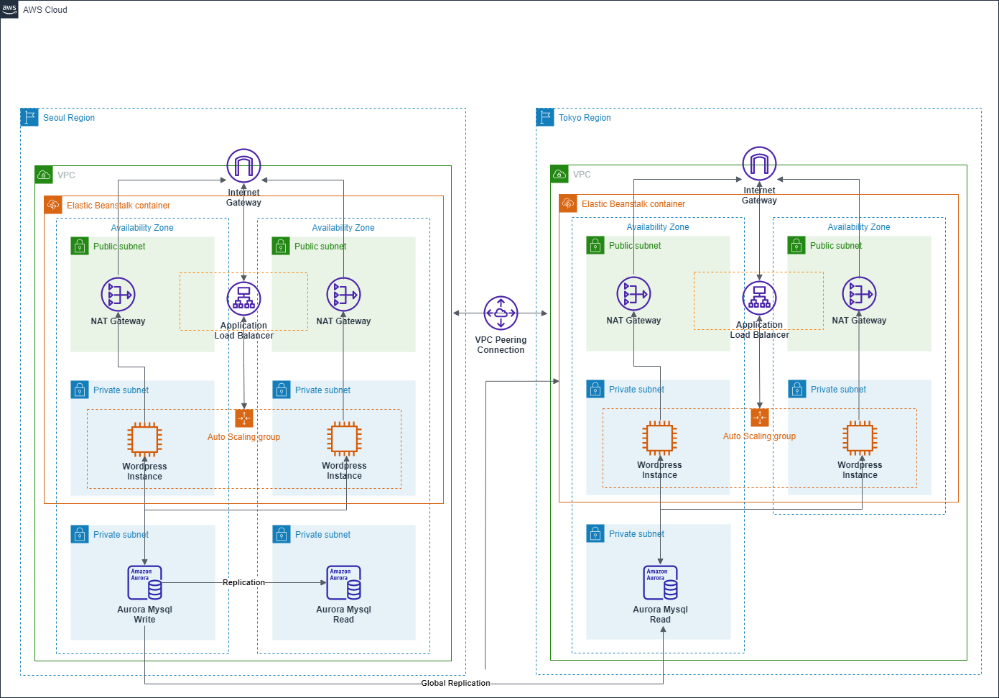

안녕하세요.
이번 내용에서는 AWS 환경에서 멀티 리전을 통해 WordPress 웹 사이트를 재해복구 환경으로 구성하는 내용으로 작성하였습니다. 


# 재해 복구(**Disaster Recovery**)란?

시스템을 운영하며 예상하지 못하고 발생되는 재해는 여러가지 일들이 있습니다. 지진 및 화재, 시스템 장애, 보안 사고 등 사전에 준비를 하여도 완벽하게 대처하지 못하는 일들로 인해 무중단 서비스를 계획하는 조직에서는 재해 복구 계획을 가지고 인프라를 구성하게 됩니다.

클라우드 환경에서는 가용성 구성을 통해 서비스의 중단을 최소화 할 수 있도록 지원하지만 해당 인프라를 제공하는 물리적인 장소의 문제에 대해서는 별도의 재해 복구 환경을 구성하도록 권장하고 있습니다.

## 재해 복구 아키텍처



이번 내용에서는 다음과 같은 아키텍처를 목표로 구성하여 서울(Northeast2) 리전이 운영 중 장애가 발생되면 도쿄(Northeast1) 리전으로 전환 될 수 있는 구조로 구성할 계획입니다.

# 아키텍처 구성하기

해당 환경 구성을 위해 다음 순서로 진행하도록 하겠습니다.

- 가상 네트워크 구성
- Elastic Beanstalk 배포
- 데이터베이스 구성
- 도메인 및 인증서 구성
- 애플리케이션 CI/CD 환경 구성
- 웹 애플리케이션 보안 적용

## 가상 네트워크 구성

전체 인프라를 구성하기 위해 서울 및 도쿄의 가상 네트워크 구성을 위해 VPC로 네트워크 환경을 구성 후 리전간 통신을 위해 피어링을 사용하여 연결합니다.

구성할 VPC 구조는 다음과 같습니다.



### 리전간 VPC 생성

1. AWS 포탈에서 VPC를 검색 후 이동합니다.



2. 상단의 VPC 생성 버튼을 클릭하여 생성 화면으로 진입 후 옵션값을 넣어 생성합니다.


위의 구성 내용을 참고하여 VPC의 옵션을 적용합니다.

생성 완료 후 도쿄(northeast1) 리전에도 동일하게 VPC를 구성합니다.

<aside>
💡 다른 리전에 VPC를 구성 시 기존 리전의 **CIDR** 범위와 중복되지 않도록 구성해야 됩니다.

</aside>

### 가상 네트워크 피어링 연결

현재 구성 완료된 리전간 VPC 통신을 위한 [피어링](https://docs.aws.amazon.com/ko_kr/vpc/latest/peering/what-is-vpc-peering.html)을 구성합니다.

1. VPC 왼쪽 패널의 **피어링 연결**을 클릭 후 **피어링 연결 생성**으로 이동합니다.


2. 연결 설정에 대한 정보값을 입력합니다.


- 피어링할 로컬 VPC 선택: 서울 리전에서 생성한 VPC를 지정합니다.
- 피어링할 다른 VPC 선택: 리전에 다른 리전을 체크 후 **도쿄 리전**을 선택하여 연결할 대상 **VPC ID**를 입력합니다.

3. 생성 정보를 입력 후 생성하기 버튼을 클릭하여 생성을 완료하면 다음과 같이 대상 리전에서 수락하기 위해 해당 리전으로 변경하라고 메시지가 표기됩니다.


4. 포탈 상단의 리전 변경 항목을 선택하여 도쿄 리전으로 변경합니다.


<aside>
💡 리전을 변경하면 상단에 다음과 같이 일주일 이내에 수락을 하도록 안내 메시지가 출력됩니다.


</aside>

5. 우측 상단 작업 항목에서 요청 수락을 선택하면 피어링이 생성되며 해당 리전간 통신이 가능하도록 구성됩니다.


## Elastic Beanstalk 배포

애플리케이션 환경을 구성하기 위한 인스턴스, 부하 분산을 위한 로드 밸런서 등의 구성을 손 쉽게 할 수 있는 **[Elastic Beanstalk](https://docs.aws.amazon.com/ko_kr/elasticbeanstalk/latest/dg/Welcome.html)**을 사용하여 인프라를 구성할 계획입니다.



1. AWS 포탈의 검색창에서 Elastic Beanstalk을 검색하여 해당 리소스 생성 단계로 이동합니다.


2. 해당 리소스 항목에서 우측 상단의 새 환경 생성으로 이동합니다. 생성 단계에서 이번 내용에선 WordPress 사이트 구성을 목표로 진행하기 때문에 웹 서버 환경을 선택 후 진행합니다.


3. 다음 단계에서 애플리케이션 이름 및 환경 이름을 지정합니다.  


4. 다음 플랫폼에서는 WordPress의 플랫폼인 PHP를 지정합니다. 브랜치 및 버전의 경우 기본값으로 진행합니다. 애플리케이션 코드 항목의 경우 샘플 애플리케이션을 지정합니다.


5. 지정 완료 후 환경 생성을 바로 누르지 않고 추가 옵션 구성을 선택하여 메뉴를 확장합니다.


<aside>
📢 해당 내용에서는 기본 구성을 위해 적용할 항목만 설명을 작성하였습니다. 로그 구성 및 추가 옵션의 경우 하단 내용을 참고 바랍니다.

</aside>

[새 환경 생성 마법사](https://docs.aws.amazon.com/ko_kr/elasticbeanstalk/latest/dg/environments-create-wizard.html)

6. 항목 중 용량으로 이동하여 Auto Scaling 그룹에 대한 정보를 입력합니다. 환경 유형의 경우 로드 밸런싱 수행, 인스턴스는 최소 2개, 최대 4개로 설정합니다.


7. 인스턴스 유형은 서비스를 고려하여 지정하고, 가용 영역은 VPC 구성 시 지정한 영역을 지정합니다. 다른 옵션의 경우 기본값으로 진행합니다.


8. 롤링 업데이트와 배포 수정 항목의 경우 적합한 방식을 지정합니다. 이번 내용에서는 롤링 업데이트를 통핸 배포를 선택하였습니다.


<aside>
📢 다른 배포 방식에 대한 내용은 하단 내용을 참고 바랍니다.

</aside>

[Elastic Beanstalk 환경에 애플리케이션 배포](https://docs.aws.amazon.com/ko_kr/elasticbeanstalk/latest/dg/using-features.deploy-existing-version.html)

9. 로드 밸런서 유형의 경우 **Application Load Balancer**를 선택합니다. 리스너 및 프로세스 등의 옵션의 경우 생성 완료 후 지정할 계획으로 기본값으로 진행합니다.


10. 보안 항목에서는 서비스의 역할 및 생성하는 인스턴스(EC2)에 대한 SSH 접근을 지원하는 키페어를 지정합니다.


<aside>
📢 키페어 생성에 대한 내용은 하단 내용을 참고하여 생성 후 적용하면 됩니다.

</aside>

[Amazon EC2 키 페어 및 Linux 인스턴스](https://docs.aws.amazon.com/ko_kr/AWSEC2/latest/UserGuide/ec2-key-pairs.html)

11. 네트워크 항목에서는 기본 아키텍쳐에 적용할 VPC를 지정합니다. 기존 생성한 VPC를 선택합니다


로드 밸런서 설정 부분에서는 기존 생성한 VPC의 퍼블릭 서브넷을 영역별로 할당합니다. 


인스턴스 서브넷의 경우 외부에서 직접적인 접근을 제어하기 위해 프라이빗 서브넷을 영역별로 할당합니다.


데이터베이스 서브넷도 인스턴스와 동일하게 프라이빗 서브넷을 할당합니다. 


<aside>
💡 해당 단계에서는 데이터베이스 서브넷만 할당하고 데이터베이스는 이후에 별도로 생성합니다.

</aside>

12. 생성을 진행하면 다음 화면에 출력되고 약 20분 정도 시간이 소요된 후 생성됩니다.


<aside>
💡 위의 내용과 동일한 방법으로 도쿄 리전에도 Elastic Beanstalk을 배포합니다.

</aside>

## Database 구성

웹 사이트 구성을 위한 데이터베이스를 구성합니다. 구성의 경우 멀티 리전을 고려하여 Amazon Aurora로 구성을 진행합니다. 



### 서브넷 그룹 생성

1. AWS 포탈에서 RDS를 검색하여 이동합니다.


2. 왼쪽 메뉴 중 서브넷 그룹을 클릭하여 이동 후 우측 상단의 **DB 서브넷 그룹 생성** 버튼을 클릭합니다.


3. DB 서브넷 그룹명을 지정 후 VPC를 선택합니다. 서브넷 추가 항목의 경우 Elastic Beanstalk을 구성 시 지정한 인스턴스의 서브넷과 다른 서브넷을 선택하여 구성합니다.


### 데이터베이스 생성

1. 기존 RDS 메뉴에서 데이터베이스 탭으로 이동 후 데이터베이스 생성 버튼을 클릭합니다. 다음 단계에서 엔진 옵션은 **Amazon Aurora**로 선택 후 에디션은 **Amazon Aurora MySQL 호환 버전**을 지정합니다.


2. 엔진 버전 항목에서 글로벌 데이터베이스 기능을 지원하는 버전 표시를 선택 후 사용 가능 버전에서 사용할 버전을 선택합니다. 


3. 템플릿의 경우 고가용성을 고려한 스펙의 DB 생성을 위해 프로덕션을 선택 후 하위 정보를 다 입력합니다.


4. 다음 단계에서 인스턴스 스펙을 지정하고 가용성 및 내구성 항목에서 동일 리전에 복제본을 구성하여 가용성을 적용할지 선택합니다.


5. 연결 항목에서는 해당 DB를 연결할 **VPC** 및 이전 생성한 **DB 서브넷 그룹**을 지정합니다. EC2 컴퓨팅 리소스 연결의 경우 생성 후 구성도 가능하기 때문에 기본값으로 진행합니다.


6. 다음 단계에서 퍼블릭 액세스는 아니오를 지정, VPC 보안 그룹은 새로 생성을 지정 및 이름을 입력합니다. 포트의 경우 MySQL 기본 포트를 사용하지 않는 경우 다른 포트를 입력하시면 됩니다.


모니터링의 경우 이번 내용에서는 제외하고 진행하며 관련 부분에 대한 내용은 하단 내용을 참고 바랍니다.

[Amazon RDS의 성능 개선 도우미 개요](https://docs.aws.amazon.com/ko_kr/AmazonRDS/latest/UserGuide/USER_PerfInsights.Overview.html)

7. 추가 구성을 확장 후 초기 데이터베이스 이름을 지정합니다. 다른 정보의 경우 


8. 다른 옵션의 경우 기본값으로 설정 후 데이터베이스 생성 버튼을 클릭하여 생성을 진행합니다.


### 글로벌 데이터베이스 생성

기존 구성한 데이터베이스를 다른 리전에 복제본을 추가 및 클러스터를 구성하기 위해서는 글로벌 데이터베이스를 구성하게 됩니다. 

1. 생성된 DB 클러스터를 지정 후 상단의 작업 버튼을 클릭하여 AWS 리전 추가를 진행합니다.


2. 생성할 클러스터의 이름을 지정 및 도쿄 리전을 선택합니다. 인스턴스 사이즈는 기존 리전과 동일한 구성으로 선택하였습니다.


3. 다른 리전의 경우에도 복제본을 추가로 구성하여 가용성 구성이 가능하지만 이번 내용에서는 단일 인스턴스만 추가하는 방법으로 진행합니다. VPC의 경우 기존 생성한 도쿄 리전의 VPC를 지정하고 DB 서브넷 그룹도 사전에 생성하여 지정해줍니다.


4. 추가 옵션에서 인스턴스명 및 파라미터 그룹 옵션 등은 기본값으로 두고 생성을 진행합니다. 모든 설정 완료 후 리전 추가 버튼을 클릭하여 진행합니다.


5. 생성이 완료되면 도쿄 리전에 **보조 클러스터** 및 **리더 인스턴스**가 추가됩니다.


## 도메인 및 인증서 구성

해당 사이트 사용을 위해 도메인 등록 및 인증서를 생성합니다.

### Route 53에 도메인 등록

해당 내용은 이미 도메인을 구매 및 보유한 상태를 기준으로 진행합니다. 도메인을 별도로 구매하거나 무료 도메인 제공 사이트를 통해 사전에 생성합니다.

1. AWS 포탈에서 Route 53을 검색하여 해당 리소스 항목으로 진입하여 호스팅 영역으로 이동 후 호스팅 영역 생성 버튼을 클릭합니다.


2. 도메인 이름에 Route 53에 등록할 도메인 주소를 입력하고 유형은 퍼블릭 호스팅 영역으로 지정 후 호스팅 영역 생성 버튼을 클릭하여 추가합니다.


3. 등록한 도메인을 Route 53에서 사용하기 위해서는 해당 도메인을 발급한 곳에 네임서버를 Route 53에서 제공하는 네임서버로 등록해야 됩니다.


### Certificate Manager를 사용하여 인증서 발급

1. 도메인 및 네임서버 등록 완료 후 서비스를 위한 인증서를 발급합니다. 인증서 발급을 위해 검색창에 Certificate Manager를 검색 후 해당 항목으로 이동합니다.


2. 인증서 항목에서 우측 상단 요청 버튼을 클릭하여 진행합니다. 진행 단계에서 인증서 유형은 기본값인 퍼블릭 인증서 요청이 선택된 상태로 진행합니다.


3. 도메인 이름을 입력하고 **이 인증서에 다른 이름 추가** 항목을 선택하여 기본 도메인에 2차 도메인을 사용할 수 있도록 추가 등록합니다. 검증 방법의 경우 Route 53을 통해 인증할 수 있도록 **DNS 검증**을 선택합니다.


4. 키 알고리즘은 기본값으로 선택하고 요청 버튼을 클릭하여 생성을 진행합니다.


5. 인증서 발급 요청 후 메인 페이지에서 확인 시 **검증 대기 중**으로 표기되며 **Route 53**을 통해 인증을 진행해야 됩니다. 인증서 ID를 선택하여 항목을 이동합니다.


6. 인증서 생성 항목에서 도메인 항목을 확인 시 검증 대기 중으로 상태가 표기되며 검증을 위해 상단의 **Route 53에서 레코드 생성** 버튼을 클릭합니다.


7. Route 53에 도메인이 등록된 경우 다음과 같이 내용이 표기되며 레코드 생성 버튼을 클릭하여 레코드를 생성합니다.


8. 등록 후 검증이 완료되면 다음과 같이 인증서가 발급됩니다.


<aside>
💡 Certificate Manager의 경우 리전이 다른 경우 추가 등록이 필요합니다. 도쿄 리전에서도 위와 동일한 방법으로 인증서를 등록합니다.

</aside>

### 로드 밸런서에 인증서 등록

웹 서비스를 위한 리스너에 인증서를 등록하기 위해 로드 밸런서에 인증서 연결을 진행합니다.

1. 검색창에 로드 밸런서를 검색 후 이동하여 Elastic Beanstalk을 배포 시 생성된 로드 밸런서를 검색합니다.


2. 로드 밸런서 항목에서 Elastic Beanstalk을 배포 시 생성된 로드 밸런서를 검색하고 해당 로드 밸런서의 리스너 탭으로 이동 후 리스너 추가 버튼을 클릭합니다.


3. 리스너의 경우 HTTPS와 HTTP는 리디렉션으로 등록을 합니다. 먼저 HTTPS의 경우 프로토콜 및 포트를 지정 후 Add Action 부분에서 Forward to를 선택하여 기본적으로 생성된 대상 그룹을 지정합니다.


4. Security Policy의 경우 해당 리스너에 적합한 값으로 선택이 가능하며 이번 내용에선 기본값으로 진행합니다. 인증서 선택 항목의 경우 이전 내용에서 생성한 인증서를 선택하여 진행합니다.


5. 기본 HTTPS 리스너를 생성 후 HTTP 리스너를 구성하여 리다이렉트 구성을 적용합니다. 최초 생성된 HTTP의 리스너를 삭제 후 다시 생성합니다. 구성의 경우 앞서 생성한 HTTPS로 리다이렉트 구성을 적용합니다.


<aside>
💡 도쿄 리전의 경우에도 동일한 방법으로 리스너를 등록합니다.

</aside>

## 애플리케이션 CI/CD 환경 구성

앞서 구성한 Elastic Beanstalk을 대상으로 서비스에 필요한 애플리케이션을 배포합니다.

### CodeCommit 리포지토리 생성

샘플 코드를 저장하고 관리할 리포지토리를 생성합니다.

1. CodeCommit을 검색하여 해당 리소스 항목으로 이동하여 우측 상단의 **리포지토리 생성** 버튼을 클릭합니다.


2. 리포지토리 정보를 입력하여 생성합니다.


3. 리포지토리 생성 완료 후 사용하기 위한 안내 페이지가 표기됩니다. 설명에 따라 Git 클라이언트를 설치합니다.


[Git Downloads](https://git-scm.com/downloads)

4. Git을 통해 CodeCommit의 리포지토리에 액세스하기 위해서는 인증 정보가 필요합니다. IAM을 검색하여 이동 후 **사용자** 탭으로 이동하여 **사용자 추가** 버튼을 클릭합니다.


5. 사용자 추가 단계에서 사용자명 및 액세스 유형 선택에서 액세스키를 선택합니다.


6. 권한 설정 항목에서 기존 정책 직접 연결을 선택후 필터에 **CodeCommit**을 검색하여 **AWSCodeCommitPowerUser**를 체크 후 다음을 눌러 진행합니다.


7. 다음 단계에서 태그는 임의적으로 입력 후 검토 단계에서 **사용자 만들기**를 눌러 완료합니다.


8. 사용자 생성 완료 후 해당 사용자를 검색 후 선택하여 보안 자격 증명 탭으로 이동 후 CodeCommit에 대한 키나 자격증명을 할당합니다.


<aside>
💡 인증 방법에는 SSH, HTTPS Git Credentials 두가지 방법이 있으며 해당 내용에서는 HTTPS Git Credentials를 통한 인증을 사용했습니다. 관련 세부 내용은 하단 링크를 참고 바랍니다.

</aside>

[SSH 연결을 위한 설정 단계AWS CodeCommitLinux, macOS 또는 Unix의 리포지토리](https://docs.aws.amazon.com/ko_kr/codecommit/latest/userguide/setting-up-ssh-unixes.html)

[Git 자격 증명을 사용하여 HTTPS 사용자를 위한 설정](https://docs.aws.amazon.com/ko_kr/codecommit/latest/userguide/setting-up-gc.html)

### CodeCommit에 코드 푸시

액세스 설정 및 Git 설치 등 완료되면 해당 리포지토리에 코드를 등록합니다.

1. 기존 생성한 리포지토리로 이동하여 코드 항목을 선택 후 URL 복제에서 HTTPS 복제를 선택합니다.


2. Git Clone을 통해 해당 리포지토리에 연결합니다.

```bash
git clone https://git-codecommit.ap-northeast-2.amazonaws.com/v1/repos/wordpress-test01
```

3. 다음 Username과 Password 입력을 요구하면 사전에 IAM에서 생성한 자격 증명 정보를 입력합니다.


4. Clone 후 생성된 폴더로 이동하여 git remote -v를 입력하면 해당 리포지토리의 주소 확인이 가능합니다.

```bash
# git remote -v
origin https://git-codecommit.ap-northeast-2.amazonaws.com/v1/repos/wordpress-test01 (fetch)
origin https://git-codecommit.ap-northeast-2.amazonaws.com/v1/repos/wordpress-test01 (push)
```

5. 배포할 코드를 로컬로 다운로드 및 리포지토리 폴더에 압축을 해제합니다.

```bash
wget https://wordpress.org/latest.tar.gz
tar -xzf latest.tar.gz -C wordpress-test01
```

6. 코드 다운로드 및 압축 해제 후 해당 경로의 코드를 CodeCommit 리포지토리로 푸시합니다.

```bash
git add .
git commit -m “first commit”
git push origin master
```

7. 정상적으로 푸시가 이뤄지면 해당 리포지토리에 브랜치가 생성되고 코드가 생성됩니다.


8. 기본 애플리케이션 배포 전 루트 경로에 wp-config-sample.php 파일을 wp-config.php로 복사 후 편집기로 파일을 열어 다음 값들을 수정합니다.

```php
/** The name of the database for WordPress */
define( 'DB_NAME', 'wordpress' );
/** Database username */
define( 'DB_USER', 'DB계정' );
/** Database password */
define( 'DB_PASSWORD', 'DB패스워드' );
/** Database hostname */
define( 'DB_HOST', 'DB호스트명' );
```

<aside>
💡 DB_HOST의 경우 RDS에서 생성한 Aurora MySQL의 엔드포인트 주소를 입력합니다.


</aside>

추가적으로 HTTP 트래픽을 HTTPS로 리디렉션하기 위해 다음 주석 밑에 해당 코드를 입력합니다.

```php
/** The database collate type. Don't change this if in doubt. */
if (strpos($_SERVER['HTTP_X_FORWARDED_PROTO'], 'https') !== false)
$_SERVER['HTTPS']='on';
```

9. 수정 완료 후 git 명령을 통해 코드를 다시 푸시합니다.

```bash
git add .
git commit -m “wp-config.php”
git push origin master
```

10. 동일한 방법을 통해 도쿄 리전의 CodeCommit에도 리포지토리를 생성하여 코드를 등록합니다.

<aside>
💡 도쿄 리전의 코드의 경우 DB 호스트 주소를 도쿄 리전의 인스턴스의 엔드포인트 주소를 입력합니다.

</aside>

### CodePipeline을 통한 애플리케이션 배포

CodeCommit에 등록한 리포지토리의 코드를 Elastic Beanstalk의 인스턴스에 배포하기 위해 CodePipeline을 사용하여 배포할 수 있도록 등록합니다.

1. **CodePipeline**을 검색하여 해당 항목으로 이동 후 **파이프라인 생성**을 눌러 작업을 생성합니다.


2. 파이프라인 설정 항목에서 이름을 입력 및 서비스 역할은 새 서비스 역할을 지정 후 다음을 눌러 진행합니다.


3. 소스 항목에서 소스 공급자는 **AWS CodeCommit**으로 등록 후 해당 리포지토리와 브랜치를 선택합니다. 변경 감지 옵션의 경우 **AWS CodePipeline**을 선택하고 진행합니다.


4. 다음 단계인 빌드 스테이지는 이번 내용에서는 건너뛰기를 눌러 진행합니다. 배포 단계에서 하단 이미지를 참고하여 기존 생성한 Elastic Beanstalk의 환경 및 애플리케이션을 선택합니다. 


5. 마지막 단계에서 설정한 값을 확인 후 파이프라인 생성을 누르면 다음과 같이 최초 배포 화면으로 이동되며 배포를 진행하게됩니다. 배포가 완료되면 다음과 같이 배포 완료가 됩니다.


<aside>
💡 배포를 진행 시 Elastic Beanstalk에서 상태에서 인스턴스의 상태가 확인으로 되어있어야 배포가 가능합니다.


</aside>

 

## 웹 애플리케이션 보안 구성

애플리케이션 배포가 완료되면 마지막으로 서비스에 대한 보안을 적용하기 위해 WAF를 구성하여 적용합니다.

### WAF(Web Application Firewall) 생성 및 리소스 연결

웹 애플리케이션을 외부 서비스 시 인입되는 공격에 대응하기 위해 WAF 모듈을 사용하여 로드 밸런서에 적용합니다.

1. 검색창에 WAF를 검색 후 해당 리소스로 이동합니다.


2. 메뉴 목록에서 **Web ACLs**를 선택 후 **서울 리전**을 지정 후 **Create web ACL** 버튼을 클릭합니다.


3. 리소스 이름 및 설명, 모니터링을 위한 CloudWatch 메트릭명을 입력 후 Resource type은 Regional resources를 선택하고 리전은 서울을 지정합니다.


4. Associated AWS resources 항목에서 해당 WAF를 적용할 로드 밸런서를 지정합니다. 지정 완료 후 다음 버튼을 클릭하여 진행합니다.


5. 다음 단계에서 WAF에 대한 보안 규칙을 구성합니다. **Rules** 항목에서 **Add rules**를 선택 후 **Add managed rule groups**를 선택합니다.


<aside>
💡 WCUs의 경우 Web ACL rule의 용량 단위로 기본적으로 1,500을 제공하며 추가적인 Rule 구성으로 확인이 필요한 경우 별도로 요청할 수 있습니다.

</aside>

[AWS WAF 할당량](https://docs.aws.amazon.com/ko_kr/waf/latest/developerguide/limits.html)

1. 보안 규칙의 경우 AWS에서 제공하는 규칙 및 외부 벤더에서 제공하는 방식을 선택할 수 있습니다. 외부 벤더의 경우 별도의 비용이 추가되며 해당 내용에서는 AWS에서 제공하는 방식으로 진행합니다.


2. 보안 규칙의 경우 PHP 및 WordPress 기반으로 보안을 적용하여 WCU에 맞도록 구성합니다.


<aside>
📢 규칙에 대한 설명은 하단 내용을 참고 바랍니다.

</aside>

[AWS관리형 규칙 규칙 그룹 목록](https://docs.aws.amazon.com/ko_kr/waf/latest/developerguide/aws-managed-rule-groups-list.html)

3. 다음 옵션은 ACL의 규칙에 포함되지 않는 트래픽에 대해서 처리하는 규칙을 지정합니다. 기본으로 Allow를 선택 후 진행합니다.


4. 생성 완료 후 동일한 방법으로 도쿄 리전의 로드 밸런서에도 WAF를 생성 및 적용합니다.

### Bastion Host 생성

모든 구성 완료 후 개별적으로 인스턴스 내부로 접근하거나 데이터베이스에 접속하기 위해서는 **Bastion Host**나 **Session Manager**를 사용하여 접근이 필요합니다.  해당 내용에서는 **EC2**를 사용하여 **Bastion Host**를 생성하고 해당 인스턴스를 통해 내부 네트워크로 접근을 합니다.

<aside>
📢 Session Manager에 대한 사용 방법은 하단 내용을 참고 바랍니다.

</aside>

[Session Manager를 사용하여 인스턴스에 대한 액세스 제어](https://aws.amazon.com/ko/premiumsupport/knowledge-center/ssm-session-manager-control-access/)

1. 포탈 검색창에 EC2를 검색 후 해당 항목으로 이동합니다.


2. EC2 이름을 지정하고 운영체제를 선택 후 진행합니다.


3. 인스턴스 유형에서 스펙을 지정하고 키페어를 지정합니다. 


4. 네트워크 설정의 경우 기존 구성한 VPC의 퍼블릭 서브넷을 할당하고 퍼블릭 IP도 할당합니다. 보안 그룹의 경우 새로 생성하고 사용 목적이 SSH 접속이기 때문에 SSH 관련 규칙을 할당하고 허용할 소스 IP는 접근할 PC의 공인 IP를 할당합니다.


5. 모든 설정 완료 후 인스턴스 시작 버튼을 클릭하여 인스턴스를 생성합니다. 생성 완료 후 EC2 인스턴스에서 해당 인스턴스를 검색 후 확인되는 퍼블릭 IP를 사용하여 SSH로 접속합니다.


6. SSH 접속 시 클라이언트(PuTTY)를 사용하여 접속하는 방법은 하단 링크를 참고 바랍니다.

[PuTTY를 사용하여 Windows에서 Linux 인스턴스에 연결](https://docs.aws.amazon.com/ko_kr/AWSEC2/latest/UserGuide/putty.html)

7. Bastion Host는 각각 리전간 연결된 피어링을 통해 접근이 가능하기 때문에 도쿄 리전에는 별도로 생성할 필요는 없습니다. 해당 리전별 EC2의 보안 그룹에 허용 규칙을 구성하여 사용합니다.

## 구성 완료 테스트

위의 내용에 따라 모든 구성을 완료 후 해당 도메인으로 접속하면 다음과 같이 언어 설정 및 DB 환경 설정 내용이 출력됩니다. 정보를 입력 후 설치를 진행합니다.


설치 완료 후 정상적으로 페이지 표기되는 것을 확인합니다.


### 페일오버 확인

구성 완료 후 재해 복구 처리를 확인하기 위해 페일오버 처리가 정상적으로 이뤄지는지 확인을 합니다.

1. 우선 서울 리전에서 서비스 중인 인스턴스(EC2)에 접근을 차단하기 위해 해당 보안 그룹에서 수신기 포트인 80 포트를 삭제합니다.


2. 보안 그룹 수정 후 사이트 접속 시 TimeOut 발생되는 것을 확인 및 Elastic Beanstalk의 상태에서 health check가 실패된 것을 확인합니다.


3. Route 53에서 서울 리전의 상태 검사가 비정상인 것을 확인하고 도쿄 리전의 정상 유무를 확인합니다.


4. RDS로 이동하여 글로벌 데이터베이스를 선택 후 상단의 작업에서 글로벌 데이터베이스 장애 조치를 선택합니다. 선택 후 도쿄 리전의 클러스터를 기본으로 설정합니다.


5. 페일오버 처리가 진행되며 완료 후 다시 도메인에 접속하여 정상적으로 접근되는 것을 확인합니다.


긴 내용 읽어주셔서 감사합니다.