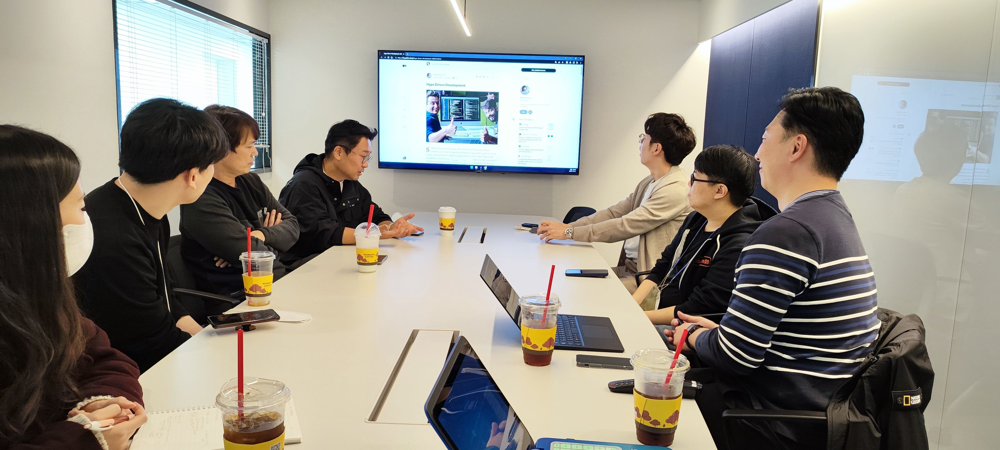
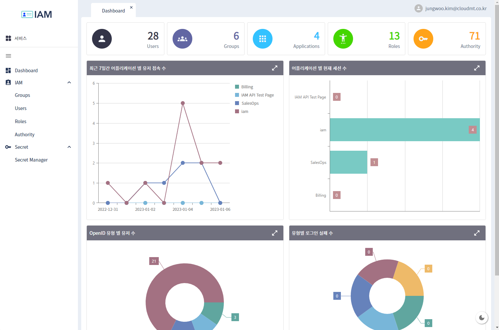
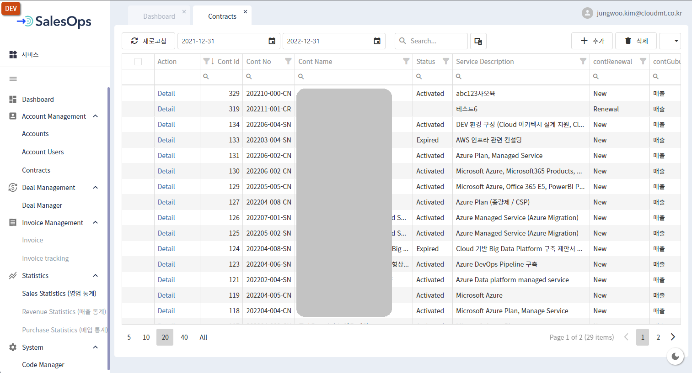
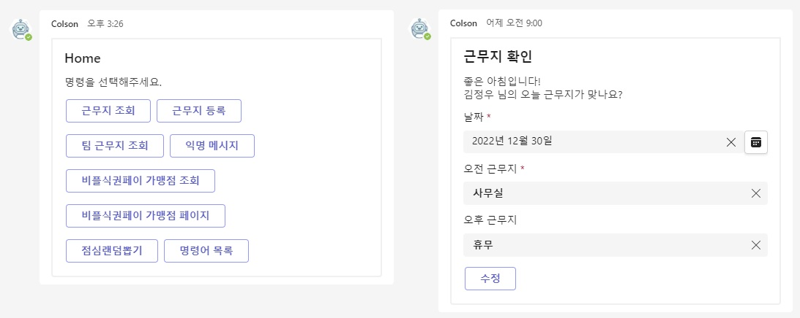
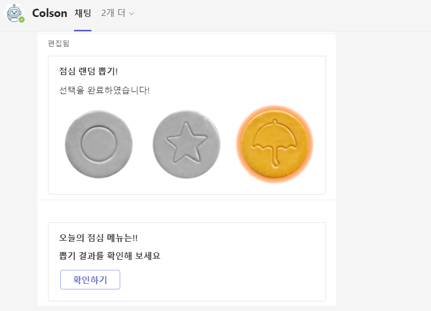
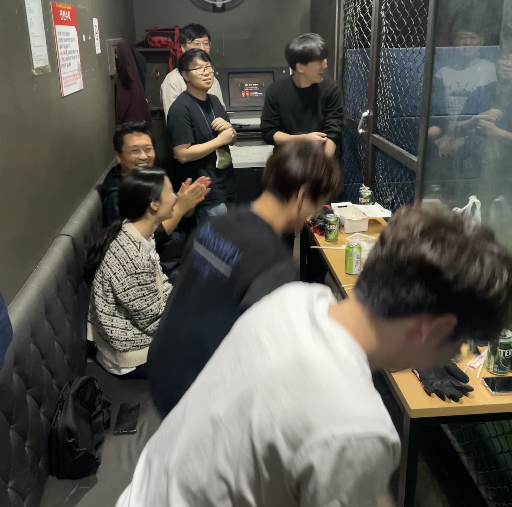
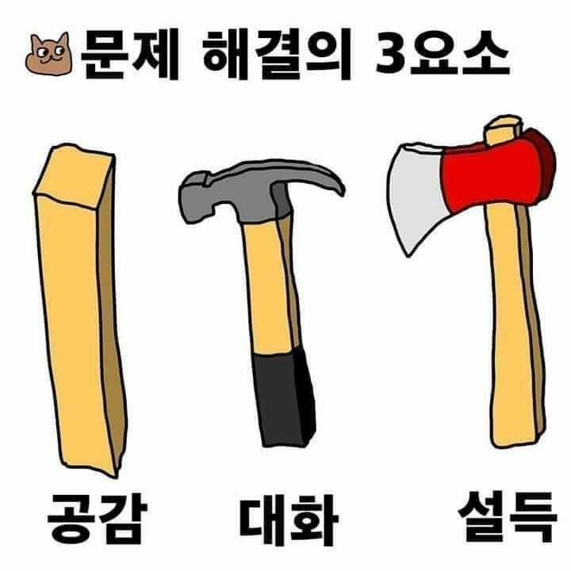

### 부제 : 클라우드 네이티브 그거 뭔데? 고민할 시간에 얼른 찍먹하기

---

# 도입

2022년은 나에게 하나의 새로운 시도였고 흥미진진했고 역동적이었다. SNS 상에 많은 분들 회고 글을 보면서 '나도 써볼까? 잼있겠는데?' 생각만 했었는데 올해부터는 나도 회고 글 쓰는 사람이 되어보려고 한다.

# 새 술은 새 부대에

신규 팀을 빌드하였다. 2020 ~ 2021년까지는 Lead Engineering 조직 내에서 SW 개발 일을 했었고 2022년부터는 보다 전문적이고 집중적으로 Service Development 하기 위해 참여 의사가 있는 크루들을 모으고 신규 팀을 만들어달라고 회사에 요청하여,

결국 **서비스개발팀** 이 만들어졌다. (두둥딱 ✨)

> _Hype Driven Development (설레발 주도 개발)이 얼마나 개발 조직에 해로운지에 대해서 토론하는 모습_

  

클라우드메이트에 입사하고 난 후부터 사내 또는 고객사에 딱 알맞는 기능을 갖춘 애플리케이션을 적시에 서비스하여 생산성을 끌어올릴 수 있겠다는 생각을 많이 했었고, 나 혼자만의 생각들이 실제 실무자들에게 필요한 것인지 검증하기 위해 사내 여러 동료들로부터 어떤 애플리케이션이 업무 상 필요한지 디스커션을 나누면서 정보를 모았다. 그런 과정을 통해서 2022년 서비스개발팀이 해야할 일에 대해서 경영진에게 보고하고 재가를 받았다. 일을 크게 벌려놓고는 항상 근심이 많다.

>**서비스개발팀**에서 해야할 일들은 다음과 같았다.
>1. 신규 서비스 런칭
> - IAM 서비스
> - 영업관리 서비스 (이하 SalesOps)
> - 챗봇 서비스 (이하 Colson[콜슨])
>2. 캐시 엔진 솔루션 개발
>3. 기존 애플리케이션 유지보수
>4. 고객사 애플리케이션 개발
>5. 고객사 개발 컨설팅
>6. 개발 경험 사내, 사외 전파

---

## 신규 서비스 런칭

### IAM (Identity and Access Management)

> _움짤이다. 후후.. 구름의 정숙한 움직임과 배경 그라데이션의 은은한 변화에 취해보자._

사내 임직원 뿐만 아니라 OAuth2.0 통해서 외부 고객사에서도 사용할 수 있는 계정 및 권한 관리 시스템이 꼭 필요했다. 그래서 IAM 서비스부터 개발하였고 KeyCloak과 Hashicorp Vault를 사용해서 사용자, 역할, 권한, 시크릿을 관리할 수 있는 웹애플리케이션을 출시했다. 이 과정에서 RBAC (Roll Base Access Control) 에 대해 깊이 고민 후 적용하게 되었고, OAuth2.0은 반드시 HTTPS 연결을 해야겠다고 판단했다.

> _이거슨 IAM Dashboard_

---

### SalesOps

IAM 출시 이후에 바로 이어서 **SalesOps**라고 하는 영업관리 웹애플리케이션 개발에 착수하였다. SalesOps는 영업 조직의 업무를 효율화하고 fileless한 업무 환경으로 가기 위해서 시작하였고, SalesOps에는 영업 관련된 기능과 CRM 일부 기능이 포함되어 2022년 12월까지 CBT(Closed Beta Test)를 진행했고 2023년 초에 정식으로 프로덕션하기 위해 막바지 작업이 한참이다.

---

### Colson

SalesOps를 개발하면서 동시에 Colson(콜슨) 챗봇 개발 역시 진행했다. Colson은 사내 다양한 질의응답, 재택/휴가 여부, 주변 식당 검색 등 을 챗봇을 통하여 빠르고 간편하게 확인할 수 있게 하기 위하여 기획하였다. Colson은 Teams 메신저 상에서 이용할 수 있는 챗봇이며 9월에 서비스를 시작하여 식당 조회, 근무지(재택,휴가,외근) 등록 및 조회, 생일자 복지 알림, 익명 칭찬 메시지 전달, 기술지원 업무 알림 등 다양한 서비스를 제공하고 있다. 클라우드메이트 구성원들로부터 좋은 평가를 받고 있다고 나는 생각한다. (과연..? 😂)

> _점심 메뉴도 랜덤으로 뽑아준다._

---

신규 3가지 서비스를 런칭하면서 느꼈던 점은 굉장히 많은데 조금 요약하자면, 하나의 서비스를 최초 기획, 최종 오픈할 때까지 정말 많은 구성원들에게 서비스 소개를 자주 해야 했었다. 나는 최대한 쉽게 풀어서 설명하려고 했으나 나의 설명 능력 부족으로 인해 듣는 사람은 다르게 해석하거나 그 서비스를 다른 시각에서 바라보는 경우가 많았다. 그래서 "이건 이런 서비스에요. 추가로 원하는게 있나요? 만들어드릴께요." 형태의 대화를 정말 많이 했다.

추가적으로 "가장 큰 결실"이라고 느꼈던 것은 웹 풀스택에 걸쳐서 클라우드메이트 만의 **웹 개발 기준 프레임워크**를 (아직 부족하지만) 마련했다는 거다. 이제 이 기준 프레임워크에 맞추어 다양한 서비스 또는 기능 추가를 조금 더 단시간에 적은 노력으로 할 수 있는 기틀이 마련되었다고 생각한다.

---

## 좋았던 점
개인적으로 2022년 가장 큰 즐거움은 팀 크루 10명이 어떻게 하면 즐겁게 일 할 수 있을까? 에 대해서 깊이 고민하고 즐겁고 경쾌하게 서로 업무할 수 있는 환경이 어느 정도는 만들어진 것 같아 그 점이 가장 좋은 기억으로 남는다.

기술적으로는 클라우드를 최대한 클라우드 답게 사용하려고 고민했던 한해였던 것 같다. Azure 서비스를 적극 활용해서 경험치를 쌓았고, IaaS와 PaaS를 서비스 목적, 용도, 그리고 요구되는 SLA에 맞춰서 적절히 혼합하여 사용하였다. (특히 Container Apps 넘나 좋은 것..)

백엔드 서비스 구축 관련해서는, Gateway server는 완벽하게 stateless하게 구성하고 그 요청을 path에 맞는 각각의 app으로 forwarding하도록 하였다. Session은 KeyCloak이 모두 책임지도록 하였고, 각각의 app은 모두 stateless하게 구성하여 Azure App Service, Container Apps의 인스턴스를 scale-out 하여도 작동에 아무런 문제가 없다.

프론트엔드에서는 React를 주력으로 잡고 일부 오픈소스 라이브러리를 제외하고는 모두 우리 크루들이 직접 구현하였다.

또한, 닷넷 애플리케이션을 리눅스에서 구동시키면서 다양한 경험을 해볼 수 있어서 좋았다. (`I love Satya Nadella.`)

### 크루들에게 전하는 고마운 말씀
__Special thanks to our crews.__

항상 나에게 기술적 조언과 경험 전달을 아끼지 않고 나의 힘든 점을 보듬어주려고 애써주시는 ✨성민님

인자한 미소와 함께 "나도 이런거 할 수 있으니까 시켜주세요." 라며 내 부담을 덜어주려고 하시는 ✨원균님

KeyCloak과 프리파라, 포켓몬의 광팬이면서 다양한 부분에서 엄청난 기여를 해주신 ✨광석님

React의 열렬한 지지자이면서 프론트엔드 개발과 프론트엔드 프로젝트의 중심을 잡아주신 그리고 종무식 때 잠시 켜졌던 카메라를 통해 cute한 땡땡이 잠옷을 보여주신 ✨진호님

타지에서 원격근무하면서도 항상 번뜩이는 아이디어와 개발 센스로 놀라운 퍼포먼스를 보여주시는 ✨진혁님

묵묵히 프론트 페이지를 개발 완수해 내시며 점점 더 개발 가속도가 붙는게 보이는 우윳빛깔 국밥요정 ✨예원님

Airflow를 魔개조하시고 CI/CD pipeline 마스터이면서 백엔드에서 많은 기여해주고 계시는 Ubuntu의 神 ✨영빈님

"닷넷이 미래다"라는 격언과 함께 MVVM XAML의 황제이면서 최근에는 Workflow 서버와 API를 무서운 속도로 개발하고 계시는 ✨상훈님

프론트엔드 포지션에서 무서운 속도로 성장하고 계시는 `a.k.a 효도르` ✨효연님

영업 데이터에 대한 탁월한 이해를 바탕으로 UI/UX에 대한 모든 기획을 도맡아 해주시는 ✨송희님

영업, 사업의 다양한 경험을 통하여 내가 생각하지 못했던 부분을 짚어주시고 늘상 도움을 주시는 ✨경이님

**디자인**의 **디귿**도 모르는 서비스개발팀에게 제품 디자인의 새로운 영감과 방향을 제시해주시고 큰 기여를 해주시는 ✨민지님까지..

>이건 개인의 회고이면서도 팀 크루들에게 감사한 마음을 표현하는 글이다. (수줍 ❤️)

 _2022년 10월경 서비스개발팀 플레이샵(실내 야구) 도중 모두가 빵터진 순간._

## 힘들었던 점

신규 개발과 기존 애플리케이션의 유지 보수를 넘나든다는 것이 내 두뇌에서 상당한 context switching cost가 발생해서, 일정 관리에 심혈을 기울였다. 종종 외근 나가서 어설픈 초식 몇가지를 선보이며 나의 경험을 표현해야 해서 꽤나 힘들었다.

## 아쉬웠던 점

개인적으로 아쉬웠던 점은, 다양한 개발 환경을 적극적으로 온전히 내 것으로 만들지 못한 것이 가장 아쉬웠던 점이다. 2023년에는 Go를 학습하여 내가 Go로 직접 개발한 애플리케이션을 프로덕션 서비스에 적용해볼 생각이다. 프로젝트 매니징 관점에서는, 코드 리뷰를 활발하게 하는 문화를 정착시키지 못하고 프로덕트 출시에 급급했던 면이 있다고 생각한다. 2023년에는 코드 리뷰를 활성화 시키도록 노력할 생각이다. 

## 2023년도 계획

개발 조직, 문화 등 큰 기류를 흐트리지 않으면서 다양한 부분에 변화를 주어 내가 하는 일을 조금 더 엔지니어링 쪽으로 집중할 생각이다. 또한 서비스개발팀 내에 다양한 **셀** 결성이나 **스쿼드**를 구성하여, 하나의 **셀** 또는 **스쿼드** 내에서 기획/개발/QA 를 모두 진행하여 프로덕트 하나를 전담하는 방식으로 제품 개발 방식을 바꾸어보려 한다.

> _2023년도에도 많은 공감, 대화, 설득이 필요할 것 같다._

클라우드메이트 모든 엔지니어들의 업무를 보다 효율화하고 자동화할 수 있는 다양한 애플리케이션 서비스를 개발하고 제공하기 위해 최선을 다 할 것이다. Workflow를 관리하는 애플리케이션을 만들어서 실제 서비스에 적용해볼 생각이다. `Airflow, Dagster 등 과 같은 훌륭한 애플리케이션이 있는데 왜 바퀴를 재발명하는가?` 하는 의문이 들 수 도 있지만, 기존 OSS (Open Source SW)를 학습할 시간에, 기존 OSS보다 복잡성은 낮추고 최소한의 필요한 기능 만을 제공하는 형태로 만들어서 우리 실무에 적용할 계획을 갖고 있다. 다양한 형태의 workflow 애플리케이션을 지원하여 사용자 편리성을 끌어올리고자 한다. (Bash, Python, Kotlin, C# 등)

  

개인적으로 변화를 줘야겠다고 생각한 3가지가 있다.

1. 블로그 글을 많이 양산(?)하는 것. 바쁘다는 핑계로 블로그 글을 못썼는데, 내가 주니어일 때 좋은 자료가 부족해서 힘들었던 만큼 그 시절을 떠올리며 앞으로 나와 같은 길을 걸을 누군가를 위해 좋은 자료를 쓰도록 노력하려 한다.
2. "데이터" 관련 개발에 조금 더 집중하려 한다.
3. VPoE (VP of Engineering) 포지션에 대한 고민과 도전. 경력이 쌓일수록 불가피한 일이기도 하지만 내가 수행할 수 있는 역량을 키우기 위해 최선을 다 할 것이다.

여기까지 **서비스개발팀**이라는 생동감 있는 개발 조직에서 2022년 격변의 시간을 보낸 회고를 마친다.

---

>_눈이 어마어마하게 내리던 어느 겨울날 눈 구경하는 내 뒷 모습_

---
`eof`