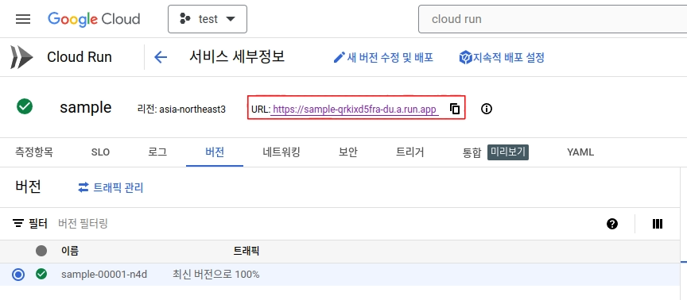

Referenced: https://velog.io/@juunini/service-monthly-keep-1000won

서비스 월 유지비 1000원,  
남의 이야기가 아닙니다. 당신도 할 수 있습니다.

여러분의 토이 프로젝트,  
더 이상 VM(aka. EC2)에 올려서 월 2만원씩 쓰지 마십시오.

https://snippet.cloudmt.co.kr/  
제가 만든 이 서비스가 그렇게 돌고 있습니다.


~~그래도 DNS 가격 제외하고 보면 대충 600원인데 혁명 아임미까?!~~

# 시작하기에 앞서

시작하기에 앞서 사전 지식이 필요한데요,  
Dockerfile을 작성하실 수 있어야 합니다.

하지만 모르셔도 지금 가서  
[실무에서 개발자는 여기까지만 알면 되는 도커 / 쿠버네티스](https://velog.io/@juunini/%EC%8B%A4%EB%AC%B4%EC%97%90%EC%84%9C-%EA%B0%9C%EB%B0%9C%EC%9E%90%EB%8A%94-%EC%97%AC%EA%B8%B0%EA%B9%8C%EC%A7%80%EB%A7%8C-%EC%95%8C%EB%A9%B4-%EB%90%98%EB%8A%94-%EB%8F%84%EC%BB%A4-%EC%BF%A0%EB%B2%84%EB%84%A4%ED%8B%B0%EC%8A%A4) 를 읽고 오시면  
금방 따라오실 수 있을겁니다.

# 구성

이번 글에서는 **Google Cloud**를 이용해 구축하는 방법을 설명할겁니다.  

- **Cloud Run** - 흔히들 아는 서버리스
- **Cloud Storage** - 저장소. sqlite를 여기에 저장하고 불러올 예정
- **Artifact Registry** - Container Image를 push 할 저장소

이게 끝입니다.


~~VM갖고 서버 올리는거밖에 할 줄 몰랐는데~~  
~~말로만 듣던 서버리스 해본다 카니~~  
~~콧구멍이 벌렁벌렁 하지 않으십니까~~

# 흐름

1. 작성한 코드를 Dockerfile을 이용해 Container Image로 만든다.
2. Artifact Registry로 Push 한다.
3. Artifact Registry의 이미지를 Cloud Run에 배포한다.
4. Cloud Run에 Cloud Storage를 Mount 시키는 설정을 추가한다.

대략 이런 간단한 흐름입니다.

# 시작

## 간단한 웹 앱 작성

- \[POST\] /api/tasks - task 생성
- \[DELETE\] /api/tasks/:id - task를 삭제
- \[GET\] /api/tasks - task 목록을 응답
- \[GET\] / - 웹 앱

이런 간단한 코드입니다.  
코드는 [여기](https://github.com/juunini/golang-simple-server-sample)에서 확인할 수 있습니다.


~~Golang 쓰세요 여러분, [Golang 하면 존123나 카리스마있어](https://velog.io/@juunini/golang-john123na-carisma)~~

## Dockerfile 작성

예제는 [여기](https://github.com/juunini/golang-simple-server-sample/blob/main/Dockerfile)서 볼 수 있습니다.  
하지만 가서 보기 귀찮으실테니

```dockerfile
FROM golang:alpine3.19 AS builder

WORKDIR /app
ADD . /app

ENV CGO_ENABLED=1
RUN apk add --no-cache gcc musl-dev &&\
    go build -o app

FROM alpine:3.19

WORKDIR /

COPY --from=builder /app/app /app

CMD ["/app"]
```

builder를 따로 두고  
빌드 된 실행파일만 alpine으로 옮겨서  
컨테이너 이미지로 빌드하는 구조입니다.  

## Container 빌드

다 됐으면 이제 잘 되는지 해봐야 합니다.  
~~왜냐면 나중에 안되는 컨테이너 이미지 올려놓고 안된다 카면 안되거든~~

```bash
docker build . -t sample
docker run -dit -p 8080:8080 --name sample sample
open http://localhost:8080
```

(마지막에 `open http://localhost:8080` 은 windows는 안될수도 있음)


대충 이런 화면이 나오면 잘 된겁니다.  
여기에 뭐 이것저것 아무거나 써서 add 눌러보면


대충 이런 식으로 추가가 되고 Delete 누르면 잘 삭제가 되는걸 확인하실 수 있습니다.

## Artifact Registry 생성


`Artifact Registry` 눌러서 들어가시면


이런 화면이 나올텐데  
누른다고 곧장 돈 나가는거 아니니 걱정 말고 사용 누르세요.


저는 대충 이렇게 입력했는데,  
여러분도 알아서 잘 입력하고 만들기 버튼을 누르세요.


이렇게 잘 만들어졌으면 잘 하신겁니다.  
다음 단계로 넘어가죠.

### Google Cloud Cli 로그인

[Google Cloud Cli](https://cloud.google.com/sdk/docs/install?hl=ko)를 설치해야 합니다.  
[링크](https://cloud.google.com/sdk/docs/install?hl=ko) 를 클릭해서 설치하세요.

설치를 마쳤으면 터미널에 아래 명령어를 입력합니다.

```bash
gcloud auth login
```

자동으로 웹브라우저가 열리며 로그인 절차를 밟으면 로그인이 됩니다.


완료가 되면 이런 메시지가 나올텐데,  
`PROJECT_ID`는 대시보드에서 확인할 수 있습니다.


```bash
gcloud config set project cultivated-link-416112
```

저의 경우엔 이렇게 입력했습니다.  
여러분의 `PROJECT_ID`를 집어넣으세요.  
~~위에꺼 그대로 복붙해놓고 안된다 소리 하지 마시고~~

## Artifact Registry에 Push

아까의 Artifact Registry로 다시 돌아가서,  
생성된 Repository를 누르면 아래와 같은 화면이 나옵니다.


`설정 안내`를 누르면 `gcloud` 명령어를 통해 `docker login` 하는 방법을 안내해줍니다.


맨 아래에 있는 명령어를 복사해서 입력하면 아래와 같은 화면이 나옵니다.


그럼 준비는 다 됐으니 아까 빌드한 컨테이너 이미지를 푸시하면 됩니다.


이 버튼을 누르면 Repository의 주소가 복사되는데, 그걸 이용해 태그를 입혀줍니다.  
저희 경우엔 아래처럼 입력했습니다.

```bash
docker tag sample asia-northeast3-docker.pkg.dev/cultivated-link-416112/sample/sample:0.1
docker push asia-northeast3-docker.pkg.dev/cultivated-link-416112/sample/sample:0.1
```


제대로 push 되었다면 이렇게 됩니다.


`0.1` 이라고 태그도 제대로 나오는게 확인됩니다.

여기까지 잘 따라오셨으면 이제  
~~서버 올리실 줄 알았겠지만~~  
sqlite를 mount 시킬 스토리지를 생성해야 합니다.

## Cloud Storage 생성


다 생성되고 나서, 제가 만든 코드에서는 `sqlite.db` 라는 파일을 사용하므로

```bash
touch sqlite.db
```

로 비어있는 `sqlite.db` 라는 파일을 만든 후 버킷에 업로드 시켰습니다.


## Cloud Run 생성


아까 push한 컨테이너 이미지를 선택할겁니다.


~~은행 대출 상품 체크하는 그건가~~  
빨간색 표시된 곳을 확인하시고,  
다 했으면 맨 아래의 화살표를 클릭합니다.


컨테이너 포트를 여러분의 컨테이너 이미지에 맞게 수정하세요.  
저는 8080으로 수정했습니다.


실행 환경은 꼭 2세대를 해야 합니다.  
그래야 Cloud Storage 마운트가 가능합니다.

다 되면 만들기 버튼을 클릭하세요.



표시된 URL을 클릭하면 컨테이너 앱을 확인할 수 있습니다.

### Cloud Storage 마운트

왠만하면 모든걸 웹 콘솔의 GUI 환경에서 진행하려 했는데  
Cloud Storage를 마운트 하는건 beta 기능이라 터미널에서만 설정할 수 있습니다.

참고: https://cloud.google.com/run/docs/configuring/services/cloud-storage-volume-mounts?hl=ko

```bash
gcloud beta run services update sample \
--execution-environment gen2 \
--add-volume=name=db_volume,type=cloud-storage,bucket=juunini-1000-won-sample \
--add-volume-mount=volume=db_volume,mount-path=/mnt/juunini-1000-won-sample \
--region=asia-northeast3
```

저는 위 처럼 입력했는데,  
여러분은 여러분의 상황에 맞게 잘 수정해서 넣으세요.  
~~그대로 복붙해놓고 안된다 그럼 안되는겨~~


잘 됐으면 이런식으로 표시가 됩니다.  
~~무수한 삽질의 흔적은 신경쓰지 마시길~~


그럼 이제 마운트 한 볼륨을 사용해야 하니 수정하러 들어갑시다.


제가 만든 웹 앱 코드에서  
`DB_FILE_NAME` 이라는 ENV값을 통해  
sqlite 파일의 경로를 바꿀 수 있게 해두었습니다.

이렇게 하고 수정하면 해당 환경변수에 설정된 경로의 파일을  
sqlite 파일로 사용할 것이므로  
Cloud Storage에 있는 파일을 sqlite db로 사용할 수 있습니다.

# 결과 확인!


Cloud Run으로 실행된 웹 앱에 들어가서 대충 이렇게 입력한 뒤에  
Cloud Storage에 들어가면...


용량이 0B 였는데 16KB로 변했습니다.


파일을 다운받아서 sqlite3 cli로 확인해보면  
입력한 내용이 잘 적용된 것을 확인할 수 있습니다.

이제 여러분은 서버리스를 이용해서  
여러분의 프로젝트를 월 1000원 선에서 유지가 가능합니다!

# 말 나올 부분을 미리 캐치하자면


여기서는 sqlite를 썼고,  
Cloud Storage 마운트는 GCSFuse를 쓰기에 속도가 느리니  
DB를 사용하는데 속도가 떨어질 수 밖에 없는 구조입니다.

그리고 인스턴스가 여러개 생성되면  
sqlite의 안정성에 대한 의문도 생길 수 있습니다.

여러 인스턴스가 하나의 sqlite 파일을 사용하는 경우,  
Read에서는 괜찮지만 Write 시에는 Lock 상태가 되어  
다른 요청들이 실패하게 됩니다.  
참고: https://www.sqlite.org/faq.html#q5

그러니 가벼운 '토이 프로젝트' 레벨에서만  
sqlite를 마운트 시켜 사용하는걸 권장합니다.

뭐, 토이 프로젝트라도 규모가 커져서 사용자가 많아지면  
따로 DB 인스턴스를 만들어 마이그레이션 하셔야 할겁니다.
