이번 포스팅에서는 본격적으로 소스 업로드부터 코드 정적 분석을 거쳐 배포하는 과정의 자동화를 구성해보도록 하겠습니다. 목차는 다음과 같습니다.

```
1. 개요 구성도
2. CI 구성하기
   a. Approval Rule 생성 및 테스트 브랜치 생성 및 PR 요청
   b. CodeBuild - 빌드 진행 확인, 분석 결과 확인, Merge 하기
   c. Approval Rule 생성
   d. 테스트 브랜치 생성
   e. PR 요청
3. CD 구성하기
   a. CodePipeline으로 배포 자동화 구성하기 이전에 배포할 환경 구성하기
   b. CodePipeline 구성하기
   c. Merge 하여 메인 브랜치로부터 Deploy하는 과정 확인 하기
```

# 들어가기 전

본 실습을 진행하시기 위해서는 이전 포스팅의 절차를 완료하셔야 합니다 : <URL>

본 실습은 AWS 콘솔에서 진행되며, 콘솔의 언어는 영어로 진행됩니다. 콘솔 웹페이지 좌측 하단에서 언어를 변경하실 수 있습니다. 

# 1. 개요 구성도

실습에 대한 구성은 다음과 같습니다.

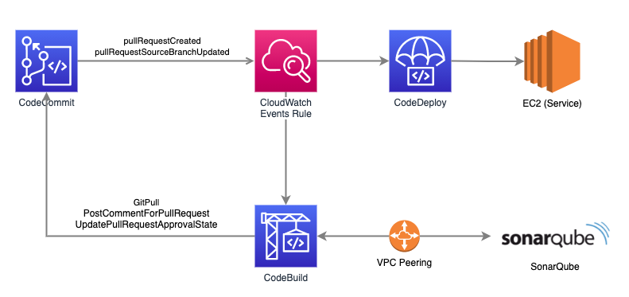

실습 시나리오는 다음과 같습니다.

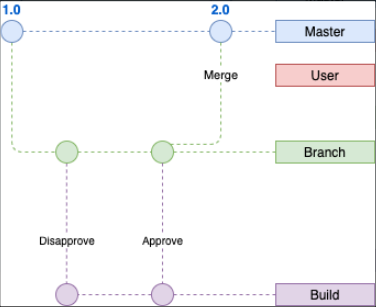

1. 최초 CodeCommit의 레포지토리에 코드가 저장되어 있습니다.
2. 임의의 유저가 테스트 브랜치를 만들어 코드를 git push 합니다.
3. CodeBuild의 타겟 브랜치에 대해 CodeBuild가 실행되어 SonarQube를 설치하는 도커 컨테이너를 통해 코드 정적 분석이 진행됩니다.
4. 끝내 코드 분석이 통과되면, 승인자가 테스트 브랜치에서 메인 브랜치로 Merge 합니다.
5. 메인 브랜치의 변화가 일어났으므로 CodePipeline을 통해 CodeDeploy가 진행되어 배포 환경에 배포됩니다.

SonarQube가 테스트 브랜치의 코드 분석이 승인하면, Pull Request의 Approval Status가 Approved됩니다. 이후 승인된 코드에 대해 유저가 Merge 시킬지 말지를 결정합니다. 유저가 Merge 하면 테스트 브랜치의 코드가 메인 브랜치로 코드가 복사됩니다.

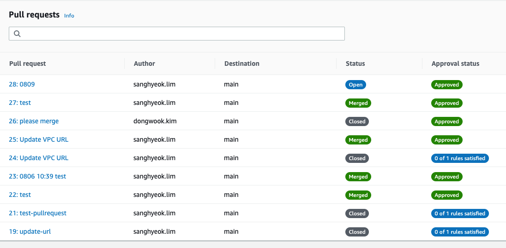

\[테이블 1. 풀리퀘스트 Status와 Approval status]

| Status \ Approval Status | **0 of 1 rules satisfied**                                                                       | **Approved**                                                                    |
| ------------------------ | ------------------------------------------------------------------------------------------------ | ------------------------------------------------------------------------------- |
| **Open**                 | **사람이 승인해주기 이전에, 애초에 코드 분석 단계부터 Revoked 된 상황입니다.**                                               | **SonarQube가 승인해주었지만, 유저가 Merge를 하지 않은 상태입니다.**                                 |
| **Closed**               | SonarQube가 통과되지 못하여, 테스트 브랜치에 한번 더 git push하게 되면 이전 Pull Request에서 보실 수 있습니다.                    | SonarQube의 분석은 통과되었지만, Merge를 하지 않고 한번 더 코드 수정이 되면 이전 Pull Request에서 보실 수 있습니다. |
| **Merged**               | SonarQube가 통과시키지 않았는데, 특별한 이유로 유저가 강제로 Merge 한 경우입니다. (**Override approval rules**를 한 경우 가능합니다.) | **SonarQube가 승인해주고, 유저도 Merge 시킨 상황입니다.** 테스트 브랜치의 코드가 마스터 브랜치로 이동될 것입니다.       |

# 2. CI 구성하기

먼저 Cloudformation - Stacks - <본인 스택 이름> - Resources 를 보시면 한눈에 리소스를 보실 수 있습니다.

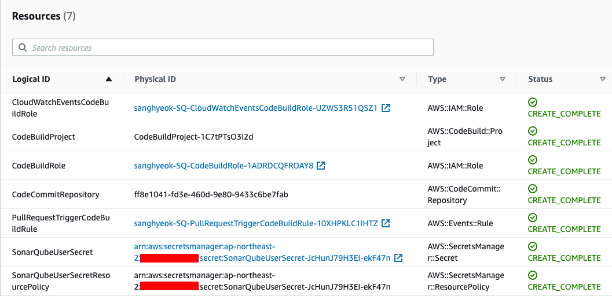

## a. Approval Rule 생성하기

CI/CD 구성을 위한 핵심적인 역할입니다. 브랜치 코드가 SonarQube가 담당하는 조건에 부합하는지 판단하기 위한 룰을 추가해야 합니다. 담당자는 사람이 아닌 Codebuild Role이 되겠습니다. 

CodeCommit - Repositories - Approval rule templates - Create template 로 들어가 rule을 추가합니다.

* Approval rule template name : <e.g. my approval rule>
* Number of approvals needed : 1
* Approval pool members : Add 클릭
* Approver type : Fully qualified ARN
* Value : <생성된 Codebuild IAM role의 assumed-role>/*
* Associated repositories : <생성된 CodeCommit 레포지토리>

Approval member의 Value 부분을 주의 깊게 봐야 합니다. Cloudformation - stack - Resources에서 CodeBuildRole 리소스로 들어가서 만들어진 Role의 ARN을 확인하면 다음과 같습니다.

Role ARN : `arn:aws:iam::782621889128:role/dongwook-SonarQube-template-CodeBuildRole-UNEPIY8TU8LS`

현재 이 Role은 sts:AssumeRole 정책(Policy)이 할당되어 있습니다. 이는 Approval pool member의 Value에 사용되기 위해서 인데요, 따라서 해당 ARN을 복사 후 iam 부분을 sts로, role 부분을 assumed-role로, 마지막에 /* 를 타이핑하여 고쳐주는 작업을 해야 합니다.

Approver pool member : `arn:aws:sts::<계정 번호>:assumed-role/<생성된 CodeBuild IAM role name>/*`

\[테이블 2. IAM ARN과 STS ARN 값 비교] 

| Role ARN                        | arn:aws:iam::<계정 번호>:role/<롤 이름>               |
| ------------------------------- | ---------------------------------------------- |
| **Approver pool member의 Value** | **arn:aws:sts::<계정 번호>:assumed-role/<롤 이름>/*** |

### 테스트 브랜치 생성

새로운 브랜치를 하나 생성합니다. CodeCommit - <생성된 레포지토리> 로 접근하면 좌측 네비게이션 메뉴에 Branches로 접근이 가능합니다. 이곳에서 Create branch를 눌러 브랜치 이름(e.g. test)을 입력 후, Branch from은 main으로 설정합니다. 

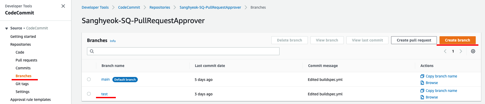

### 테스트 브랜치 코드 수정

위의 흐름대로 잘 진행되는지 확인하기 위해, 테스트 브랜치의 코드를 수정하여 push하는 간단한 테스트를 해보겠습니다. Codecommit - Repositories - <본인의 테스트 브랜치> 를 선택하여 buildspec.yaml 파일에 접근합니다.

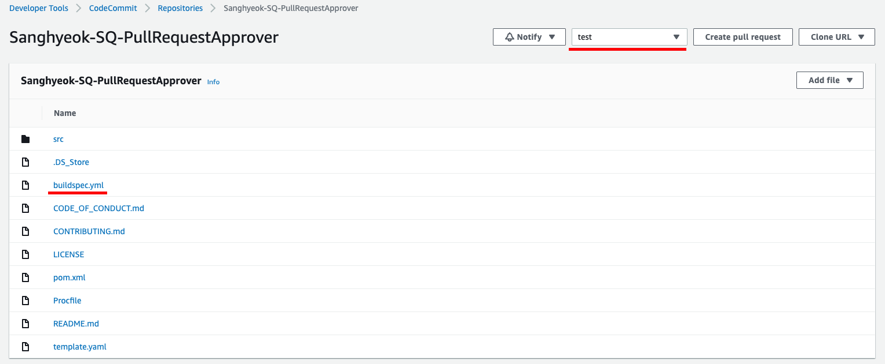

SonarQube 입장에서는, EC2 Instance에 설치된 SonarQube가 호스트 서버가 될것이고, Codebuild의 docker container가 SonarQube 클라이언트가 될 것입니다. 따라서 build 시 SonarQube 호스트에 접근할 수 있는 URL을 buildspec.yml 파일에 정의해야 합니다.

Sonarqube 호스트의 우측의 Edit 버튼을 눌러 sonar_host_url 의 값을 다음과 같이 설정합니다.

`- sonar_host_url='http://<본인 EC2의 private IP 주소>:<포트(디폴트 9000)>'`

그 후 github에서 커밋 작성하는 것과 동일하게 사용자의 이름과 이메일 주소, 적절한 커밋 메시지(e.g. `Modified: buildspec.yml`)를 작성 후 저장합니다.

### Pull Request 생성

b에 이어서 좌측 네비게이션 메뉴에서 Pull Request를 들어가 Create pull request를 클릭합니다. Destination은 main, Source는 <본인의 테스트 브랜치 e.g. test> 로 선택 후 Compare 합니다.

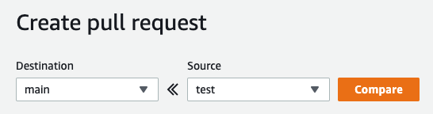

## b-1. Codebuild 결과 확인하기

여기까지 따라오시느라 고생하셨습니다. 이제는 CI 단계가 잘 진행되는지 눈으로 보는 일만 남았습니다. ~~(에러가 안뜬다면 말이죠)~~

조금 더 자세히 들여다 보면, 내부적으로 일어나는 일은 다음과 같습니다. CodeCommit에서 Pull Request가 생성되면, Amazon EventBridge 서비스가 이벤트를 캐치하여 CodeBuild를 동작시키게 됩니다. 

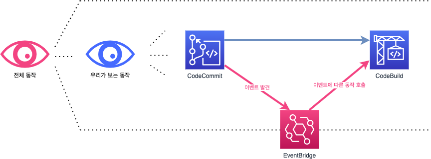

CodeBuild - Build projects 메뉴로 들어가게 되면, 생성된 프로젝트가 뱅글뱅글 돌아가게 됩니다. 잠시 후 Build status가 Succeeded 로 바뀌게 되면 CodeCommit - Pull Request로 돌아가서 Approved 되는 것을 보실 수 있습니다. 

Pull Request - Activity 탭으로 들어가보면 Quality Gate Passed 라는 코멘트가 남겨졌고, Approved 되었고 유저가 Merge할 수 있도록 Merge 버튼이 활성화 되었습니다.

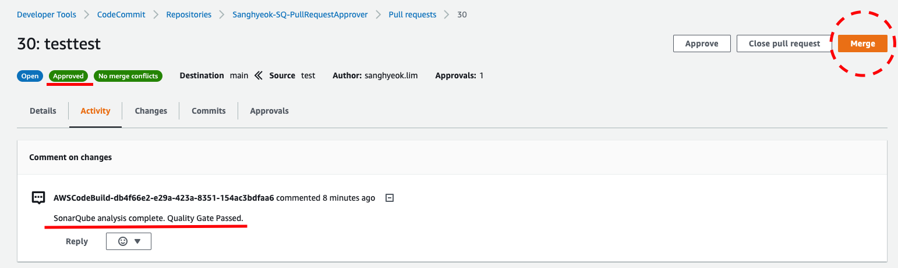

# 3. CD 구성하기

CodePipeline은 AWS에서 제공하는 완전관리형 지속적 전달 (CD ; Continuous Delivery) 서비스입니다.  이번 섹션에서는 테스트 브랜치에서 메인 브랜치로 Merge되어 변경된 메인 브랜치로부터, CodePipeline을 이용해 배포하는 과정을 소개합니다.

현재 저희는 CloudFormation의 템플릿을 이용해 CodeCommit 레포지토리, CodeBuild 프로젝트만 생성되어 있는 상태입니다. CodePipeline을 생성하고 이를 통해 CodeCommit → CodeDeploy 으로 배포되는 지속적 전달 환경을 구축해보겠습니다.

## 1. 배포 환경 구축하기

CodeDeploy를 구성하기 위해서는 배포할 환경이 갖추어져 있어야 합니다. 배포할 환경이 이미 On-premise 혹은 다른 환경에 만들어져 있는 분이라면 이 부분을 건너 뛰어도 됩니다. 실습에서는 배포 환경을 편하게 만들어주는 AWS Elastic Beanstalk 서비스를 이용해 배포 환경을 구성해보겠습니다.

* AWS 콘솔에서 Elastic Beanstalk - Environments 메뉴에서 Create a new environment를 클릭합니다. 
* Select environment tier는 Web server environment를 적용하고, Application name를 적절하게 입력하시고 다른 영역은 그대로 두시고 Platform으로 내려갑니다. 이 부분에서 여러분의 코드에 알맞는 플랫폼을 적용하시면 됩니다. 본 테스트는 Tomcat 8.5 with Corretto 11 running on 64bit Amazon Linux 2 환경으로 진행합니다.

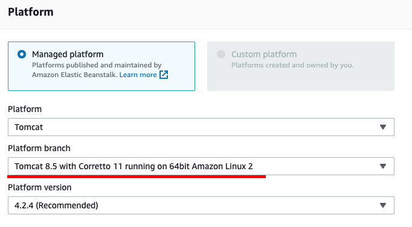

## 2. CodePipeline을 이용해 CodeCommit - CodeDeploy 파이프라인 구축하기

이제 배포 환경이 갖추어졌으니 CodePipeline을 이용하여 CodeCommit에서 → CodeDeploy로 전달하는 파이프라인을 구축해보겠습니다.

* CodePipelines - Pipelines 메뉴에서 Create pipeline를 클릭합니다.
* Step 1 : 파이프라인 이름을 설정하고 넘어갑니다. (e.g. Pipeline-SonarQube)
* Step 2 : source provider를 AWS CodeCommit으로 설정한 후, Repository name 란에 CloudFormation 으로부터 생성된 레포지토리를 선택합니다. Branch는 main 브랜치를 선택하고 넘어갑니다.
* Step 3 : Build 스테이지는 넘어갑니다.
* Step 4 : Deploy provider를 AWS Elastic Beanstalk 혹은 개인 환경에 맞게 선택한 후에 Deploy 합니다. 

## 3. 잘 구축되었는지 Merge하여 배포해보기

앞서 만들었던 CodeCommit 레포지토리의 SonarQube로 부터 승인된 Pull Request를 Merge 하여 배포가 잘 이루어지는지 확인해 보겠습니다.

* CodeCommit 레포지토리 선택 후 Pull Requests로 들어가 Merge 버튼을 클릭합니다. 상황에 맞게 Merge 후 branch를 삭제할 것인지 남겨놓을 것인지 옵션으로 결정한 후, Merge pull request를 클릭합니다.

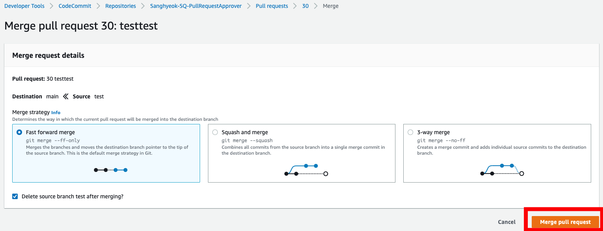

* Pull Request의 Status가 Open에서 Merged로 바뀐 것을 확인한 후, CodePipeline-Pipelines에서 생성한 파이프라인으로 들어가 Source → Deploy가 차례로 진행되는 과정을 확인합니다.

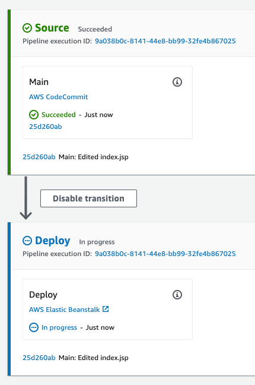

Deploy까지 성공적으로 마무리 되었을 것입니다, 실습에 따라 Beanstalk 환경을 구성하였다면, Deploy 스테이지에 있는 AWS Elastic Beanstalk 링크로 들어가서 본인의 Environment 링크를 엽니다. 테스트 코드는 /src/main/webapp/index.jsp 경로에 위치해 있습니다.

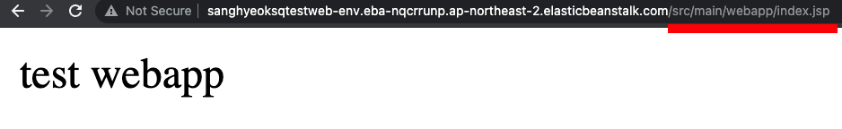

# 마무리

1편부터 우리가 구축한 내용은 다음과 같습니다.

* 1. Amazon VPC를 이용한 VPN 환경 구성
* 2. AWS의 Code 시리즈(CodeCommit, CodeBuild)를 이용한 코드 정적 분석 자동화
* 3. AWS의 Code 시리즈(CodeDeploy, CodePipeline)를 이용한 배포 자동화

## 2번과 3번을 왜 따로 하나요?

라는 질문에 답변드리자면, `CodePipeline에서는 Pull Request를 다룰 수 없어서` 입니다. 블로그를 작성하다가 저희도 이 부분에 많은 궁금증을 가지어 AWS 서포트 센터에 문의를 해보았지만 CodeCommit에서 Pull Request를 하는데 필수적인 환경 변수들이 존재하는데, 이 변수들은 CodeCommit에서만 다루어 진다는 답변을 받았습니다.

아무쪼록 원하시는 환경 구축에 본 포스팅이 도움이 되었으면 하네요. 읽어주셔서 감사합니다.