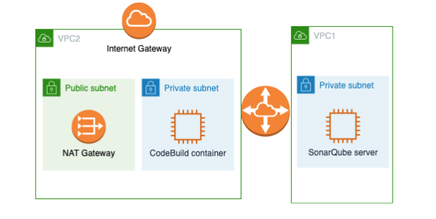
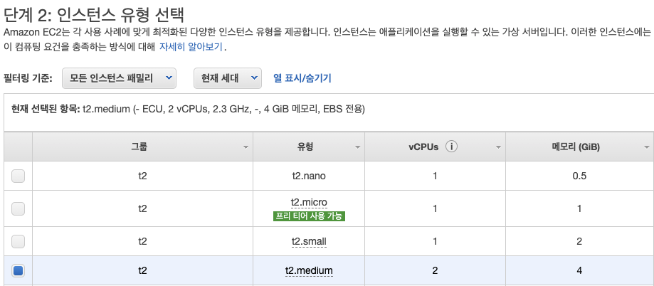
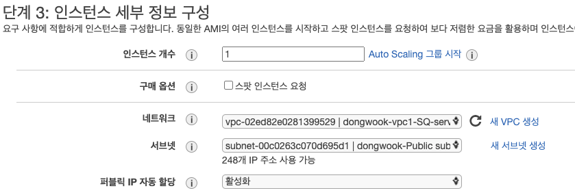
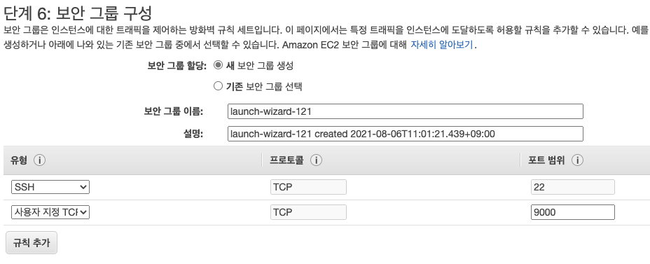
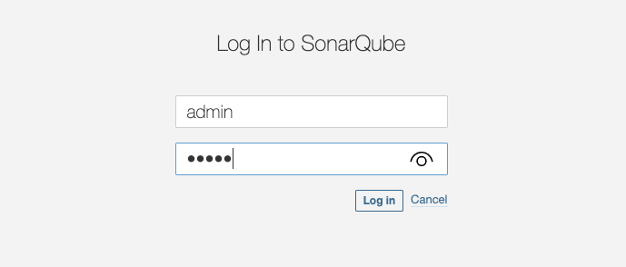
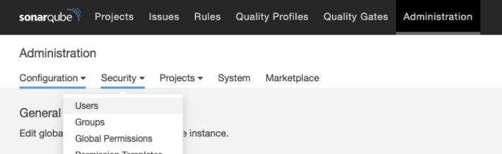
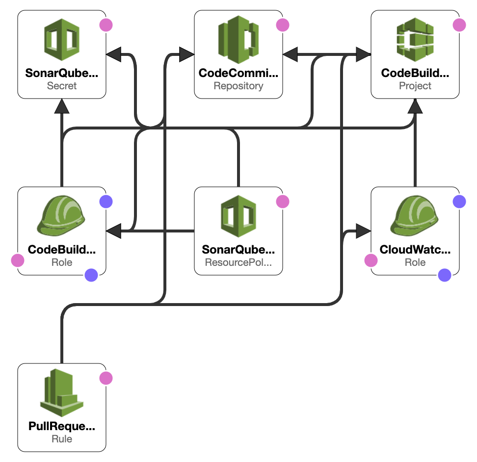
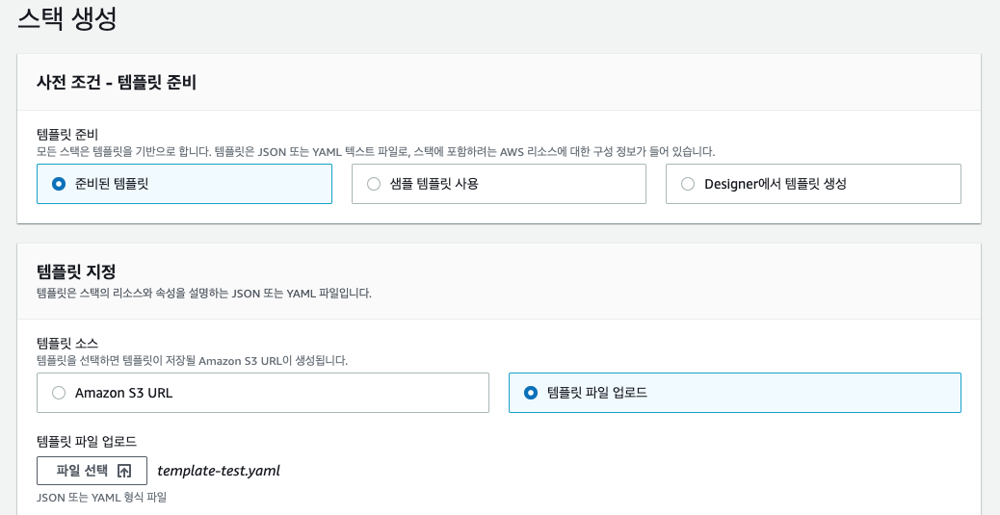
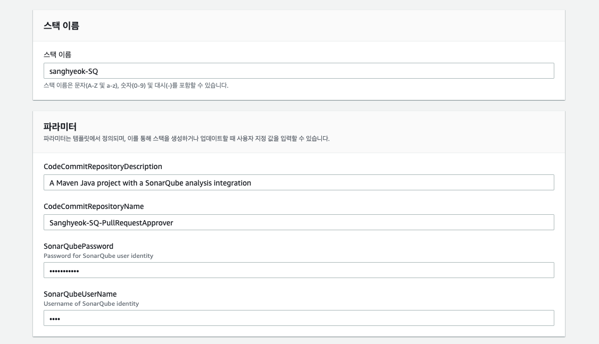
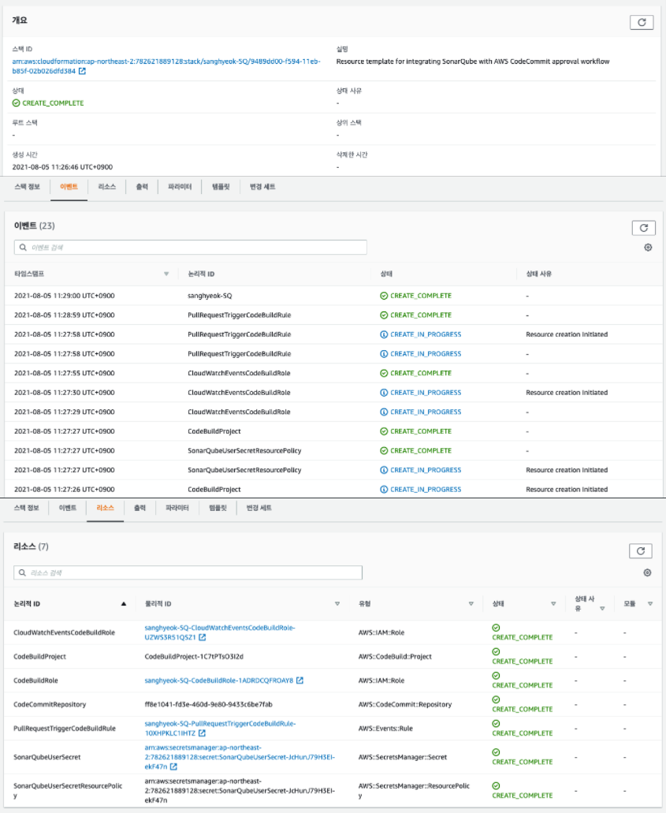

# 소개

## SonarQube


SonarQube는 20개 이상의 프로그래밍 언어에서 버그, 코드 스멜, 보안 취약점을 발견할 목적으로 정적 코드 분석으로 자동 리뷰를 수행하기 위한 지속적인 코드 품질 검사용 오픈 소스 플랫폼입니다. 중복 코드, 코딩 표준, 유닛 테스트, 코드 커버리지 등 코드 복잡도, 주석, 버그 및 보안 취약점의 보고서를 제공합니다.

이 포스팅에서는 Private Zone에 위치하는 SonarQube의 코드 정적분석 결과를 통해 안전한 CI/CD 환경을 구축하고자 합니다.

## 상황

> SonarQube가 On-premises Private Zone에 있고, AWS CodeCommit을 사용하여 AWS에서 개발 중입니다. 하지만, SonarQube가 AWS CodeCommit을 정식 지원하지 않고, Private Zone에 있어 코드 정적 분석이 어렵습니다.  

## 해결방안

1. AWS CodeCommit에 Commit
2. AWS CodePipeline에서 설정된 CloudWatch Event Role에 의해 AWS CodeBuild 호출
3. AWS CodeBuild의 buildspec.yaml을 통해 pre-build에서 SonarQube에 Source Code를 전달하여 정적 분석
4. SonarQube에서 분석된 내용을 기반으로 AWS CodeCommit에 메시지를 추가하여 Commit 혹은 AWS CodePipeline에 의해 지속적인 배포 진행

이 방법의 문제는 AWS CodeBuild에서 SonarQube에 접근해야 한다는 이슈가 있습니다. 이때 CodeBuild를 VPC 내에 배포하는 옵션을 구성하여 VPN을 통해 SonarQube와 안전하게 통신할 수 있습니다.  

## 구성도


- - -

# 환경 구성

## 1. VPC 및 VPC Peering



저희는 VPN 구성을 해야 하는 상황이었기에, VPC Peering Connection을 먼저 구성하고 실습을 진행했습니다. 실습에 필요한 일반적인 네트워크에 필요한 리소스는 다음과 같습니다.

* CodeBuild VPC : 10.1.0.0/16

  * Private subnet
  * Public subnet

    * NAT Gateway 
  * Internet Gateway
* SonarQube VPC : 10.0.0.0/16

  * Private subnet
* VPC Peering Connection

- - -

* CodeBuild VPC - Public Subnet Route Table

| Destination | Target                 |
| ----------- | ---------------------- |
| 10.1.0.0/16 | local                  |
| 0.0.0.0/0   | igw-인터넷 게이트웨이          |
| 10.0.0.0/16 | pcx-Peering Connection |

* CodeBuild VPC - Private Subnet Route Table

| Destination | Target        |
| ----------- | ------------- |
| 10.1.0.0/16 | local         |
| 0.0.0.0/0   | nat-NAT 게이트웨이 |

* SonarQube VPC - Private Subnet Route Table

| Destination | Target                 |
| ----------- | ---------------------- |
| 10.0.0.0/16 | local                  |
| 10.1.0.0/0  | pcx-Peering Connection |

CodeBuild Agent는 반드시 Private subnet에 위치되어야 합니다. 

SonarQube 인스턴스는 상황에 맞게 Public 혹은 Private subnet 어디에 배치해도 상관없지만, Private subnet에 배치하는 것이 일반적입니다. 다만 원활한 테스트를 위해 (SonarQube 서버에 간편한 접속을 위해) 일시적으로 Public Subnet에 배치하였습니다.

**현재 사용된 SonarQube VPC에 대한 네트워크 리소스 목록**

* SonarQube VPC : 10.0.0.0/16

  * Public subnet
* Internet Gateway 
* SonarQube VPC - Public Subnet Route Table

| Destination | Target                 |
| ----------- | ---------------------- |
| 10.0.0.0/16 | local                  |
| 0.0.0.0/0   | igw-인터넷 게이트웨이          |
| 10.1.0.0/0  | pcx-Peering Connection |

CodeBuild Agent와 SonarQube Instance간의 통신은 `<private IPv4 주소>:9000` 으로, User와 아웃바운드 통신은 `<Public IPv4 주소>:9000` 으로 접속하여 가입 및 코드 정적분석 내 확인을 합니다.

- - -

## 2. SonarQube 인스턴스 구성

테스트 환경을 위해 SonarQube를 EC2 인스턴스로 구성합니다.

> AMI: Amazon Linux 2 AMI Instance
> Type: t2.medium 
> VPC: \[VPN 환경을 위한 VPC] 
> Auto-assign Public IP: Enable 
> Security Group: SSH, TCP 9000 port Open





인스턴스 구성에서 인스턴스 유형이 중요합니다. **2GB이상의 메모리 성능과 1 vcpu 이상의 사양이 SonarQube의 최소 요구사양**입니다. 그러므로 인스턴스 유형은 **t2.medium 이상**의 설정이 필요합니다.

또한 테스트 접속을 위한 Public IP 할당과 VPN 구성을 위한 VPC 네트워크를 설정합니다.



SonarQube 웹서버 접속을 위해 `TCP 9000` 포트를 허용합니다.

### SonarQube 설치 및 실행

```yaml
$ sudo yum install java-11-amazon-corretto-headless
$ wget https://binaries.sonarsource.com/Distribution/sonarqube/sonarqube-9.0.1.46107.zip
```

SonarQube 동작을 위한 JDK 11 설치와 SonarQube Community 버전을 다운로드합니다.

```yaml
$ unzip sonarqube-9.0.1.46107.zip -d ~/
$ ~/sonarqube-8.0/bin/linux-x86-64/sonar.sh start
```

다운로드 받은 SonarQube 압축을 풀고 실행합니다.



초기 ID/PW는 `admin/admin`입니다.



admin 권한으로 접속하여 Administration탭에서 새로운 User를 생성하여 테스트를 진행합니다.

## 3. 테스트 리소스 구성



* CodeCommit repository
* Secrets Manager secret
* CodeBuild project
* CloudWatch Events rule
* IAM role (for CodeBuild to assume)
* IAM role (for CloudWatch Events to assume and invoke CodeBuild)

테스트를 위한 AWS 리소스 구성입니다. 하나하나 리소스를 만들지 않고 CloudFormation을 활용하여 구성하였습니다. 다음은 CloudFormation 스택 생성에 사용될 템플릿의 내용입니다.

### Parameters

```yaml
Parameters:
  CodeCommitRepositoryName:
    Type: String
    Default: sonarqube-repo-test
  CodeCommitRepositoryDescription:
    Type: String
    Default: A Maven Java project with a SonarQube analysis integration
  SonarQubeUserName:
    Type: String
    Description: Username of SonarQube identity
    MinLength: 3
    NoEcho: true
  SonarQubePassword:
    Type: String
    Description: Password for SonarQube user identity
    MinLength: 8
    NoEcho: true
```

CloudFormation 스택에서 사용될 파라미터 값들입니다. 리포지토리 이름, 설명과 앞서 만든 SonarQube Test 계정의 ID와 PW값을 입력받습니다.

### Secrets Manager secret

```yaml
SonarQubeUserSecret:
    Type: 'AWS::SecretsManager::Secret'
    Properties:
      Description: SonarQube user credentials
      SecretString: !Sub '{"username":"${SonarQubeUserName}","password":"${SonarQubePassword}"}'
```

Secrets Manager는 SonarQube 사용자 자격 증명을 저장 및 관리를 위해 사용합니다. CloudFormation 스택 생성 시 입력받은 SonarQube username과 password로 Secrets Manager 리소스를 생성합니다.

```yaml
SonarQubeUserSecretResourcePolicy:
    Type: 'AWS::SecretsManager::ResourcePolicy'
    Properties:
      SecretId: !Ref SonarQubeUserSecret
      ResourcePolicy:
        Version: 2012-10-17
        Statement:
          - Effect: Allow
            Principal:
              AWS: !GetAtt CodeBuildRole.Arn
            Action:
              - 'secretsmanager:GetSecretValue'
            Resource: '*'
            Condition:
              'ForAnyValue:StringEquals':
                'secretsmanager:VersionStage': AWSCURRENT
```

SecretId 값을 입력받은 파라미터 값으로 지정하고, 템릿에서 만든 CodeBuildRole을 가진 CodeBuild 프로젝트가 SecretId 값을 참조할 수 있도록 승인해주도록 합니다.

> `!Sub` 함수는 입력 문자열의 변수를 지정한 값으로 대체합니다. 템플릿에서 이 함수를 사용하여 스택을 만들거나 업데이트할 때까지 사용할 수 없는 값을 포함하는 명령이나 출력을 구성할 수 있습니다.

### CodeCommit repository

```yaml
CodeCommitRepository:
    Type: 'AWS::CodeCommit::Repository'
    Properties:
      RepositoryName: !Ref CodeCommitRepositoryName
      RepositoryDescription: !Ref CodeCommitRepositoryDescription
      Code:
        S3:
          Bucket: sonarqube-repo-test
          Key: sonarqube-repo-test.zip
```

CodeCommit의 리포지토리를 생성하기 위한 구문입니다. 

> `Ref` 내장 함수는 지정된 *파라미터* 또는 *리소스*에 대한 정보를 반환합니다.
>
> * 파라미터의 논리적 이름을 지정하면 파라미터의 값이 반환됩니다.
> * 리소스의 논리적 이름을 지정하면 해당 리소스를 참조하는 데 일반적으로 사용할 수 있는 값이 반환됩니다.
>
> 템플릿에서 리소스를 선언하는 데 이름으로 또 다른 템플릿 리소스를 지정해야 하는 경우 `Ref`를 사용하여 해당하는 다른 리소스를 참조할 수 있습니다. 일반적으로, `Ref`는 리소스의 이름을 반환합니다.

### CodeBuild Project

```yaml
CodeBuildProject:
    Type: 'AWS::CodeBuild::Project'
    Properties:
            ...
      Description: !Sub 'SonarQube analysis for repository ${CodeCommitRepositoryName}'
      Environment:
        ComputeType: BUILD_GENERAL1_MEDIUM
        Type: LINUX_CONTAINER
        Image: 'aws/codebuild/standard:4.0'
        EnvironmentVariables:
          - Name: SONARQUBE_USER_CREDENTIAL_SECRET
            Value: !Ref SonarQubeUserSecret
      ServiceRole: !GetAtt CodeBuildRole.Arn
      Source:
        Type: CODECOMMIT
        Location: !GetAtt CodeCommitRepository.CloneUrlHttp
```

CodeBuild 프로젝트를 생성하기 위한 구문입니다. CodeBuild에서 소스 코드를 사용할 위치와 사용할 빌드 환경을 구성합니다. Environment 설정에서는 \[ComputeType 종류]([Build environment compute types - AWS CodeBuild (amazon.com)](https://docs.aws.amazon.com/codebuild/latest/userguide/build-env-ref-compute-types.html))와 \[CodeBuild에서 제공하는 Docker 이미지]([CodeBuild 에서 제공하는 도커 이미지 - AWS CodeBuild (amazon.com)](https://docs.aws.amazon.com/ko_kr/codebuild/latest/userguide/build-env-ref-available.html))에 따라 원하는 빌드 환경을 구성하고 빌드에 필요한 소스 저장소를 설정합니다.

> `GetAtt` 함수는 템플릿의 리소스에서 특성값을 반환합니다.

### CodeBuild IAM role

```yaml
CodeBuildRole:
    Type: 'AWS::IAM::Role'
    Properties:
      ...
      Policies:
        - PolicyName: CodeBuildAccess
          PolicyDocument:
            Version: 2012-10-17
            Statement:
              - Action:
                  - 'logs:*'
                  - 'codecommit:PostCommentForPullRequest'
                  - 'codecommit:UpdatePullRequestApprovalState'
                Effect: Allow
                Resource: '*'
              - Action:
                  - 'codecommit:GitPull'
                Effect: Allow
                Resource: !GetAtt CodeCommitRepository.Arn
              - Action:
                  - 'secretsmanager:GetSecretValue'
                Effect: Allow
                Resource: !Ref SonarQubeUserSecret
```

CodeBuild IAM Role을 생성합니다. Policy 부분은 CodeCommit에서 작성된 승인규칙에 따라 승인 여부와 메시지 작성 Action, Pull Action, 다음에서 설명할 Secret Manager에 저장된 Value 값들을 가져오는 것을 허용합니다.

### CloudWatch Events rule

```yaml
PullRequestTriggerCodeBuildRule:
    Type: AWS::Events::Rule
    Properties: 
      Description: 'Rule to trigger build from CodeCommit pull request'
      EventPattern:
        source:
          - aws.codecommit
        detail-type:
          - 'CodeCommit Pull Request State Change'
        detail:
          event:
            - pullRequestCreated
            - pullRequestSourceBranchUpdated
        resources:
          - !GetAtt CodeCommitRepository.Arn
      State: ENABLED
      Targets: 
        - Arn: !GetAtt CodeBuildProject.Arn
          Id: codebuild
          RoleArn: !GetAtt CloudWatchEventsCodeBuildRole.Arn
          InputTransformer:
            InputTemplate: |
              {
                "sourceVersion": <sourceVersion>,
                "artifactsOverride": {"type": "NO_ARTIFACTS"},
                "environmentVariablesOverride": [
                   {
                       "name": "PULL_REQUEST_ID",
                       "value": <pullRequestId>,
                       "type": "PLAINTEXT"
                   },
                   {
                       "name": "REPOSITORY_NAME",
                       "value": <repositoryName>,
                       "type": "PLAINTEXT"
                   },
                   {
                       "name": "SOURCE_COMMIT",
                       "value": <sourceCommit>,
                       "type": "PLAINTEXT"
                   },
                   {
                       "name": "DESTINATION_COMMIT",
                       "value": <destinationCommit>,
                       "type": "PLAINTEXT"
                   },
                   {
                      "name" : "REVISION_ID",
                      "value": <revisionId>,
                      "type": "PLAINTEXT"
                   }
                ]
              }
            InputPathsMap:
              sourceVersion: "$.detail.sourceCommit"
              pullRequestId: "$.detail.pullRequestId"
              repositoryName: "$.detail.repositoryNames[0]"
              sourceCommit: "$.detail.sourceCommit"
              destinationCommit: "$.detail.destinationCommit"
              revisionId: "$.detail.revisionId"
```

CloudWatch Events rule은 CodeCommit의 Pull Request를 트리거할 Rule을 생성하기 위해 사용합니다. CodeCommit의 Pull Request 생성과 브랜치의 업데이트가 있을 때 이벤트가 발생합니다. 이벤트 발생 후 `Targets`인 CodeBuild 프로젝트에 빌드에 필요한 환경변수들을 전달합니다.

### CloudWatch Event IAM role

```yaml
CloudWatchEventsCodeBuildRole:
    Type: 'AWS::IAM::Role'
    Properties:
      ...
      Policies:
        - PolicyName: events-invoke-codebuild
          PolicyDocument:
            Version: 2012-10-17
            Statement:
              - Effect: Allow
                Resource: !GetAtt CodeBuildProject.Arn
                Action:
                  - 'codebuild:StartBuild'
```

Pull Request 트리거로부터 이벤트가 발생면, CodeBuild가 빌드를 시작하게 해주는 Role입니다. 대상 리소스는 CloudFormation에서 생성된 CodeBuild Project입니다.

- - -

## 4. 테스트 리소스 생성



앞서 작성한 CloudFormation 템플릿을 사용해 스택을 생성하여 리소스들을 생성합니다.



Secrets Manager와 CodeCommit 리소스에 필요한 파라미터 값을 입력하고, 스택을 생성합니다.



이상으로 테스트에서 사용할 리소스들이 작성한 CloudFormation 템플릿에 의해 모두 성공적으로 생성되었습니다.

이번 포스팅에서는 테스트 환경을 구성을 완료했습니다. 다음 포스팅에서는 앞서 만든 리소스들을 사용하여, CodeCommit의 소스 업데이트가 발생 시, SonarQube 정적분석 결과로 CodeDeploy를 용한 지속적인 서비스 배포를 다뤄보겠습니다.