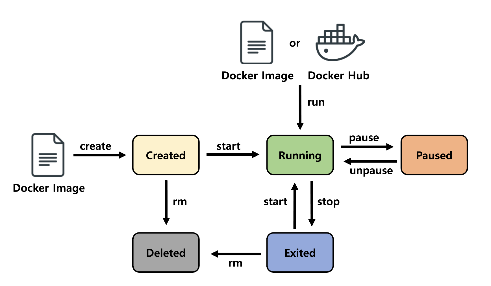

### 목차

1. 도커 이미지? 도커 컨테이너?

   1. 도커 이미지
   2. 도커 컨테이너
2. 기본적인 도커 명령어

   1. 도커 컨테이너

- - -

안녕하세요. 첫 번째 글을 작성하게 된 클라우드메이트 TE팀 이도현입니다.

점점 더 많은 기업에서 ECS, EKS 등 다양한 컨테이너 서비스를 검토 및 도입하는 추세입니다. 컨테이너 서비스 관련된 업무를 마주할 때마다 기반 지식이 단단하지 않아 관련 교육이 필요했었습니다. 도커 이미지와 도커 컨테이너의 개념을 간단하게 설명하고, 기본적인 도커 명령어에 대해 포스팅하겠습니다.

→ 컨테이너 개념 설명이 포함되어 있는 글도 보시면 좋을 것 같습니다.\
<https://cloudmt.co.kr/?p=3927>

# 도커 이미지? 도커 컨테이너?

## 도커 이미지(Docker Image)

도커 이미지는 **컨테이너를 만드는 데 사용**되는 **읽기 전용(Read-only)** 템플릿입니다.

컨테이너 실행에 필요한 파일과 설정값 등을 포함하고 있는 도커파일을 만든 후 **Dockerfile을 빌드** 하여 이미지를 만듭니다.

## 도커 컨테이너(Docker Container)

도커 **이미지를 실행한 상태**입니다. 이미지로 컨테이너를 생성하면 이미지의 목적에 맞는 파일이 들어있는 파일 시스템과 격리된 시스템 자원 및 네트워크를 사용할 수 있는 독립된 공간이 생성됩니다. 이것을 도커 컨테이너라고 합니다. 도커 컨테이너는 읽기 전용인 이미지에 변경된 사항을 저장하는 컨테이너 계층(Layer)에 저장합니다.


도커 이미지를 도넛 레시피에 비유한다면, 도커 컨테이너는 해당 레시피를 이용해 만든 도넛으로 비유할 수 있습니다. \
하나의 도넛 레시피에서 여러 가지 맛의 도넛을 만들 수 있는 것과 같이, **하나의 도커 이미지로 여러 개의 도커 컨테이너**를 만들 수 있습니다. \
또한, 기존의 도넛 레시피를 수정하게 되어도, 이미 기존 레시피로 만들어진 도넛에는 영향이 없듯이, \
이처럼 **도커 이미지를 변경**해도 **이미 실행 중인 도커 컨테이너에는 영향을 주지 않습니다.**

# 기본적인 도커 명령어

도커 명령어의 구조는 아래와 같습니다.

* **docker \[대상] \[액션]**

  → \[대상] : `container`(생략 가능), `image`, `volume`, `network` 등

  → \[액션] : `ls`, `inspect`, `start`, `run` 등

## 도커 컨테이너



* **docker (container) create**

  → 컨테이너를 생성하고 자동으로 시작하지는 않음

```shell
root@DH:~# docker create --name testos centos
Unable to find image 'centos:latest' locally
latest: Pulling from library/centos
a1d0c7532777: Pull complete
Digest: sha256:a27fd8080b517143cbbbab9dfb7c8571c40d67d534bbdee55bd6c473f432b177
Status: Downloaded newer image for centos:latest
875366cc4662d6ccdc21dfbaa654ed3eee74bb54d6a2ce34333a62924f7e0272
```

centos 이미지를 사용해서 컨테이너를 생성해 주는 명령어입니다.\
**`--name`** 옵션을 추가하여 컨테이너명은 testos로 설정하였습니다.\
    → name 옵션을 쓰지 않으면 임의의 name이 부여됩니다.

이미 생성된 컨테이너의 컨테이너 명을 바꾸고 싶으면 `docker rename [현재 이름] [바꿀 이름]` 명령어를 사용합니다. \
컨테이너 명을 변경하여도 컨테이너 ID는 변경되지 않습니다.

로컬 리포지토리에 이미지가 없으면 기본으로 docker hub에서 이미지를 pull 합니다. 한번 pull 한 이미지는 재사용이 가능합니다.

컨테이너를 생성할 때 옵션을 써줄 수도 있습니다.

```shell
docker create -it --name testos2 centos
```

해당 옵션들의 설명은 아래와 같습니다.

* **docker ps**

  → 실행(Up) 중인 컨테이너들의 목록을 확인

  → `docker container ls`와 같음

```shell
root@DH:~# docker ps
CONTAINER ID   IMAGE     COMMAND       CREATED          STATUS          PORTS     NAMES
adb6732a399d   centos    "/bin/bash"   51 seconds ago   Up 50 seconds             testos2
```

출력된 결과의 각 항목은 다음과 같이 설명할 수 있습니다.

> **\[CONTAINER ID] :**
>
> * 컨테이너에 할당되는 고유한 컨테이너 ID
> * 전체 ID에서 12자리만 출력
>
> **\[IMAGE] :**
>
> * 컨테이너를 생성할 때 사용된 이미지
>
> **\[COMMAND] :**
>
> * 컨테이너가 시작될 때 실행될 명령어
> * `docker run` 이나 `docker create` 명령어의 맨 끝에 새로운 명령어를 입력해서 컨테이너를 생성할 때 대체 가능
>
> **\[CREATED] :**
>
> * 컨테이너 생성 후 경과 시간
>
> **\[STATUS] :**
>
> * 컨테이너의 상태
> * 실행 중(Up), 종료(Exited), 일시 중지(Pause)
>
> **\[PORTS] :**
>
> * 컨테이너가 개방한 포트와 호스트에 연결된 포트
>
> **\[NAMES] :**
>
> * 컨테이너 이름

`-a` (all) 옵션을 함께 써주면 실행 중이지 않은 컨테이너를 포함하여 전체 컨테이너 목록을 출력합니다.

```shell
root@DH:~# docker ps -a
CONTAINER ID   IMAGE     COMMAND       CREATED          STATUS          PORTS     NAMES
adb6732a399d   centos    "/bin/bash"   55 seconds ago   Up 54 seconds             testos2
875366cc4662   centos    "/bin/bash"   5 hours ago      Created                   testos
```

`--no-trunc` 옵션을 함께 써주면 컨테이너 ID 전체를 보여줍니다.

```shell
root@DH:~# docker ps --no-trunc
CONTAINER ID                                                       IMAGE     COMMAND       CREATED         STATUS         PORTS     NAMES
adb6732a399de1d9d4d2d8e2b74d6a4c6829652c8e950c77daebe32afdc25430   centos    "/bin/bash"   5 minutes ago   Up 5 minutes             testos2
```

* **docker start**

  → 컨테이너를 시작(실행)

  → ***생성해둔 컨테이너***를 시작할 수 있음

```shell
root@DH:~# docker start -ai testos
[root@151f3b70b5a4 /]#
```

컨테이너(testos)를 시작하면서 `-ai` 옵션을 사용해 해당 컨테이너 내부로 접근하여 표준 입력을 받을 수 있도록 하였습니다.

해당 컨테이너에 접근한 상태로 exit 명령을 사용하면, `/bin/bash`가 종료되면서 컨테이너도 함께 종료됩니다.

때문에 순차적으로 `Ctrl + P`, `Ctrl + Q`를 눌러 컨테이너 실행 상태를 유지한 채로 빠져나온 후, 컨테이너가 실행 중(Up)인지 확인할 수 있습니다.

```shell
root@DH:~# docker ps
CONTAINER ID   IMAGE     COMMAND       CREATED          STATUS          PORTS     NAMES
151f3b70b5a4   centos    "/bin/bash"   44 seconds ago   Up 16 seconds             testos
```

* **docker stop**

  → 실행 중인 컨테이너를 종료

```shell
root@DH:~# docker stop testos
testos
```

컨테이너가 종료(Exited)된 것을 확인할 수 있습니다.

```shell
root@DH:~# docker ps -a
CONTAINER ID   IMAGE     COMMAND       CREATED         STATUS                      PORTS     NAMES
151f3b70b5a4   centos    "/bin/bash"   8 minutes ago   Exited (0) 19 seconds ago             testos
```

* **docker run**

  → 컨테이너를 시작하고 COMMAND를 실행

  → 로컬에 이미지가 있다면 해당 이미지로 실행하고, 없으면 도커허브에서 다운로드 후 실행

  → ***create + start***

```shell
root@DH:~# docker run -dit --name test centos
5d56fc765e3780fb06f5f3d5a66935e1a087087d7b9ab69e979e830773603a81

root@DH:~# docker ps
CONTAINER ID   IMAGE     COMMAND       CREATED        STATUS        PORTS     NAMES
5d56fc765e37   centos    "/bin/bash"   1 second ago   Up 1 second             test
```

`-d` 옵션을 사용해 사용자가 직접 컨테이너 안으로 접근하지 않고, 컨테이너의 **COMMAND를 백그라운드로 실행**할 수 있습니다.

컨테이너를 시작할 때, 명령어의 맨 뒤에 **임의로 COMMAND를 정의**할 수 있습니다.

```shell
root@DH:~# docker run -it --name date centos /bin/date
Tue Jun 28 08:56:41 UTC 2022

root@DH:~# docker ps -a
CONTAINER ID   IMAGE     COMMAND       CREATED              STATUS                          PORTS     NAMES
24a654120847   centos    "/bin/date"   About a minute ago   Exited (0) About a minute ago             date
```

COMMAND(`/bin/date`)가 종료되면서 컨테이너도 함께 종료된 것을 확인할 수 있습니다.

shell의 **환경 정보를 옵션으로 정의**하는 것도 가능합니다.

```shell
root@DH:~# docker run -it --name test -w "/tmpdir" -e "MYNAME=DH" centos

[root@8e01dc01c6f7 tmpdir]# pwd
/tmpdir

[root@8e01dc01c6f7 tmpdir]# echo $MYNAME
DH
```

`restart` 옵션을 통해 정해진 규칙에 따라 자동으로 **재시작**이 가능합니다.

```shell
root@DH:~# docker run -it --name test --restart always centos
[root@8dfcdfd3c5c6 /]# exit
exit

root@DH:~# docker ps
CONTAINER ID   IMAGE     COMMAND       CREATED          STATUS         PORTS     NAMES
8dfcdfd3c5c6   centos    "/bin/bash"   16 seconds ago   Up 3 seconds             test
```

동작 중인 컨테이너에서 `exit`을 하면 종료가 되어야 하는데 `restart` 옵션을 `always`로 설정했기 때문에 종료되어도 다시 시작(Up) 된 것을 확인할 수 있습니다.

아래의 표와 같은 `restart` 옵션을 사용할 수 있습니다.

컨테이너를 시작할 때 CPU와 메모리 등 **리소스 사용량을 제한**할 수 있습니다.

이 외에도 리소스를 제한하는 더 많은 옵션들이 있습니다.

* **docker attach**

  → 컨테이너 내부에 접근하여 ***STDIN/STDOUT/STDERR***를 사용

  → 컨테이너 PID=1 표준 입출력을 이용

```shell
root@DH:~# docker run -it --name test centos
[root@c8137246c2de /]# [Ctrl + p, Ctrl + q]

root@DH:~# docker ps -a
CONTAINER ID   IMAGE     COMMAND       CREATED          STATUS          PORTS     NAMES
c8137246c2de   centos    "/bin/bash"   29 seconds ago   Up 29 seconds             test

root@DH:~# docker attach test
[root@c8137246c2de /]# ps -e
  PID TTY          TIME CMD
    1 pts/0    00:00:00 bash
   15 pts/0    00:00:00 ps
```

* **docker exec**

  → 동작 중인 컨테이너에서 새로운 프로세스를 실행

  → COMMAND 말고 별도의 명령어를 실행

```shell
root@DH:~# docker run -d --name web httpd
4e02c31135d3eb2dda8dcdb8fd83b97d3aa0805ddb50235b5efbc71dfa19b604

root@DH:~# docker ps -a
CONTAINER ID   IMAGE     COMMAND              CREATED         STATUS        PORTS     NAMES
4e02c31135d3   httpd     "httpd-foreground"   2 seconds ago   Up 1 second   80/tcp    web

root@DH:~# docker exec -it web /bin/bash
root@4e02c31135d3:/usr/local/apache2#
```

웹서버 같은 경우는 COMMAND(PID=1)가 httpd로 정의되고, 쉘이 실행되지 않기 때문에 `docker attach`로 명령 입력이 불가능합니다.

때문에 쉘에 접근하기 위해서는 개별적으로 실행을 해줘야 합니다.

* **docker logs**

  → 컨테이너의 PID=1 프로세스의 STDIN/STDOUT/STDERR를 출력 가능

```shell
root@DH:~# docker run -dit --name pingtest centos /bin/ping localhost
85421d90d372895c5cc9f0219ffd6235c3536e31c9dde1eacdd641803999d59c

root@DH:~# docker ps
CONTAINER ID   IMAGE     COMMAND                 CREATED         STATUS         PORTS     NAMES
85421d90d372   centos    "/bin/ping localhost"   3 seconds ago   Up 2 seconds             pingtest

root@DH:~# docker logs -f pingtest
PING localhost (127.0.0.1) 56(84) bytes of data.
64 bytes from localhost (127.0.0.1): icmp_seq=1 ttl=64 time=0.019 ms
64 bytes from localhost (127.0.0.1): icmp_seq=2 ttl=64 time=0.036 ms
64 bytes from localhost (127.0.0.1): icmp_seq=3 ttl=64 time=0.069 ms

root@DH:~# docker logs -ft pingtest
2022-06-29T02:40:10.275963929Z PING localhost (127.0.0.1) 56(84) bytes of data.
2022-06-29T02:40:10.276917834Z 64 bytes from localhost (127.0.0.1): icmp_seq=1 ttl=64 time=0.019 ms
2022-06-29T02:40:11.277869637Z 64 bytes from localhost (127.0.0.1): icmp_seq=2 ttl=64 time=0.036 ms
```

몇 가지 옵션을 주어 로그를 다양한 방식으로 출력할 수 있습니다.

* **docker stats**

  → 동작 중인 컨테이너의 상태와 사용 중인 리소스의 양을 확인할 때 사용

  → 상태 확인이 끝나면 `Ctrl + C`를 눌러 명령을 종료

```shell
root@DH:~# docker run -dit --name test --cpus=0.3 stress
e1f401b606f3c1cbee21f2bbe83a656cf22c1382495055076451ceef90aee7d4

root@DH:~# docker stats
CONTAINER ID   NAME      CPU %     MEM USAGE / LIMIT   MEM %     NET I/O     BLOCK I/O   PIDS
e1f401b606f3   test      29.31%    752KiB / 12.36GiB   0.01%     906B / 0B   0B / 0B     4
```

부하 테스트를 할 수 있는 임의의 컨테이너(test)를 실행시킨 후, `docker stats`으로 확인해 보았습니다.

각 항목에 대한 설명입니다.

> **\[CONTAINER ID] :**
>
> * 컨테이너 ID
>
> **\[NAME] :**
>
> * 컨테이너 이름
>
> **\[CPU %] :**
>
> * CPU 사용률
>
> **\[MEM USAGE / LIMIT] :**
>
> * 메모리 사용량 / 컨테이너에서 사용할 수 있는 메모리 제한
>
> **\[MEM %] :**
>
> * 메모리 사용률
>
> **\[NET I/O] :**
>
> * 네트워크 I/O
>
> **\[BLOCK I/O] :**
>
> * 블록 I/O
>
> **\[PIDS] :**
>
> * 사용 중인 PID의 수(프로세스의 수)

* **docker top**

  → 동작 중인 컨테이너에서 실행되고 있는 프로세스를 확인할 때 사용

```shell
root@DH:~# docker run -dit --name test centos
e900da8137a077c9a82f3936899e9ac0d3f167a6a6e759cfacdcce17ef940979

root@DH:~# docker top test
UID                 PID                 PPID                C                   STIME               TTY                 TIME                CMD
root                3947                3927                0                   05:45               ?                   00:00:00            /bin/bash
```

컨테이너 내부 격리 환경에서 각 프로세스는 PID 1번이지만, **전체 운영체제에서의 PID가 출력**됩니다.

* **docker pause/unpause**

  → 컨테이너를 일시 중지하거나 일시 중지된 컨테이너를 재시작

```shell
root@DH:~# docker ps -a
CONTAINER ID   IMAGE     COMMAND       CREATED         STATUS         PORTS     NAMES
e900da8137a0   centos    "/bin/bash"   6 minutes ago   Up 5 minutes             test

root@DH:~# docker pause test
test

root@DH:~# docker ps -a
CONTAINER ID   IMAGE     COMMAND       CREATED         STATUS                  PORTS     NAMES
e900da8137a0   centos    "/bin/bash"   6 minutes ago   Up 6 minutes (Paused)             test

root@DH:~# docker attach test
You cannot attach to a paused container, unpause it first

root@DH:~# docker unpause test
test

root@DH:~# docker ps -a
CONTAINER ID   IMAGE     COMMAND       CREATED         STATUS         PORTS     NAMES
e900da8137a0   centos    "/bin/bash"   6 minutes ago   Up 6 minutes             test
```

동작 중인 컨테이너를 `pause` 명령어를 사용하여 일시 중지한 뒤에 `attach` 명령어로 접근을 시도하면 당연히 접근이 되지 않습니다. \
`unpause` 명령어로 일시 중지된 컨테이너를 재시작 해주어야 접근이 가능합니다. \
`docker ps -a`로 STATUS에 `Paused`가 출력되는 것을 확인할 수 있습니다.

* **docker rm**

  → 컨테이너를 삭제

```shell
root@DH:~# docker ps -a
CONTAINER ID   IMAGE     COMMAND       CREATED          STATUS                     PORTS     NAMES
2cbeab5acfb0   centos    "/bin/bash"   9 seconds ago    Exited (0) 8 seconds ago             test2
e900da8137a0   centos    "/bin/bash"   12 minutes ago   Up 12 minutes                        test

root@DH:~# docker rm test
Error response from daemon: You cannot remove a running container e900da8137a077c9a82f3936899e9ac0d3f167a6a6e759cfacdcce17ef940979. Stop the container before attempting removal or force remove

root@DH:~# docker rm test2
test2

root@DH:~# docker rm -f test
test

root@DH:~# docker ps -a
CONTAINER ID   IMAGE     COMMAND   CREATED   STATUS    PORTS     NAMES
```

`rm` 명령어를 사용해 종료된 컨테이너를 삭제할 수 있습니다. \
동작 중인(Up) 컨테이너를 삭제하려면 `stop` 명령어를 사용해 종료(Exited) 후 삭제하거나, \
`rm` 명령어에 `-f` 옵션을 사용해 삭제할 수 있습니다.

> **docker rmi \[이미지명]** → 이미지를 삭제

* **docker container prune**

  → 종료(Exited) 된 컨테이너를 일괄적으로 삭제

```shell
root@DH:~# docker ps -a
CONTAINER ID   IMAGE     COMMAND       CREATED              STATUS                      PORTS     NAMES
c6044f6e3d7e   centos    "/bin/bash"   44 seconds ago       Exited (0) 43 seconds ago             test4
7486f75a31e5   centos    "/bin/bash"   51 seconds ago       Exited (0) 51 seconds ago             test3
b22e767a3965   centos    "/bin/bash"   59 seconds ago       Up 58 seconds                         test2
54ca84644b86   centos    "/bin/bash"   About a minute ago   Up About a minute                     test

root@DH:~# docker container prune
WARNING! This will remove all stopped containers.
Are you sure you want to continue? [y/N] y
Deleted Containers:
c6044f6e3d7eeda4d692ecb848ec52d01d22681238d5c4d2b2f430df9ae6b06f
7486f75a31e5fb22120de3ed0bd45fa65cfcd5c940981d4625dbc241ea87150f

Total reclaimed space: 0B

root@DH:~# docker ps -a
CONTAINER ID   IMAGE     COMMAND       CREATED              STATUS              PORTS     NAMES
b22e767a3965   centos    "/bin/bash"   About a minute ago   Up About a minute             test2
54ca84644b86   centos    "/bin/bash"   About a minute ago   Up About a minute             test
```

`prune` 명령어를 사용하려면 앞에 **\[대상]을 명시**해주어야 합니다. \
ex) container, image, network, volume, system

동작 중인 컨테이너는 삭제되지 않고 종료된 컨테이너만 삭제합니다.

* **docker cp**

  → 컨테이너와 호스트 간의 파일 복사

```shell
root@DH:~# touch example.txt
root@DH:~# ls
example.txt

root@DH:~# docker run -dit --name test centos
5e43e97c988e78202f4d6dcb2b68b153c0a3c91e80ac2bdb5b8b7ae2a39f0592

root@DH:~# docker ps -a
CONTAINER ID   IMAGE     COMMAND       CREATED         STATUS         PORTS     NAMES
5e43e97c988e   centos    "/bin/bash"   6 seconds ago   Up 5 seconds             test

root@DH:~# docker cp ~/example.txt test:/

root@DH:~# docker exec test /bin/ls example.txt
example.txt

root@DH:~# docker cp test:/example.txt ~/example2.txt

root@DH:~# ls
example.txt  example2.txt
```

`docker cp` 명령어를 사용하여 컨테이너와 로컬 호스트 간의 파일을 복사할 수 있습니다. \
`docker cp [복사할 대상] [복사시킬 대상]` 구조로 사용할 수 있습니다. \
컨테이너 안의 디렉터리를 지정하려면 `[컨테이너명:경로]`의 구조로 사용해야 합니다.

* **docker diff**

  → 컨테이너가 생성된 시점부터 변경된 이력을 확인

  → writable layer의 변경 여부를 확인

```shell
root@DH:~# docker run -it --name test centos
[root@ba258fff1ae8 /]# useradd containeruser
[root@ba258fff1ae8 /]# [Ctrl + p, Ctrl + q]

root@DH:~# docker diff test
C /home
A /home/containeruser
A /home/containeruser/.bash_logout
A /home/containeruser/.bash_profile
A /home/containeruser/.bashrc
C /etc
A /etc/subuid-
C /etc/subgid
C /etc/passwd-
C /etc/shadow
C /etc/group
A /etc/subgid-
C /etc/subuid
C /etc/gshadow
C /etc/shadow-
C /etc/gshadow-
C /etc/passwd
C /etc/group-
C /var
C /var/log
C /var/log/lastlog
C /var/spool
C /var/spool/mail
A /var/spool/mail/containeruser
```

`diff` 명령어를 사용하여 컨테이너의 변경된 이력을 확인할 수 있습니다. \
**A(Add)**는 추가된 이력, **C(Change)**는 변경된 이력, **D(Delete)**는 삭제된 이력을 의미합니다.

### 글을 마치며

좋은 기회를 잡아 교육에 참여할 수 있었고, 뒤죽박죽 얽혀있던 개념들을 바로잡을 수 있는 계기가 되었습니다.

더 나아가 쿠버네티스까지 학습하여 정리할 수 있었으면 좋겠습니다.

업무를 책임져주신 팀원분들과 기회를 제공해 준 클라우드메이트에 감사의 인사를 전합니다.