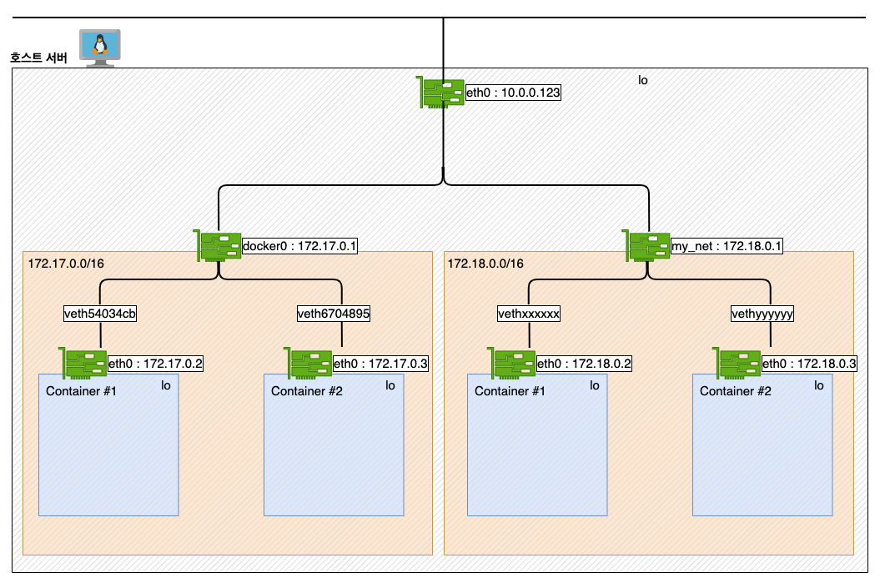

이전 게시글에서는 도커 컨테이너와 관련된 명령어들을 다루었습니다.

이번 시간에는 컨테이너 애플리케이션의 능력을 십분 발휘하게 하는 요소인 **볼륨**과 **네트워크**에 대해 다루겠습니다.

- - -

**목차**

[도커 볼륨 생성하기](#도커-볼륨-생성하기)
[── 생성한 컨테이너를 inspect하여 마운트 정보 관찰하기](#생성한-컨테이너를-inspect-하여-마운트-정보-관찰하기)
[── 읽기와 쓰기 허용(rw) vs 읽기 전용(ro) 디렉터리](#읽기와-쓰기-허용rw-vs-읽기-전용ro-디렉터리)
[── overlayfs에 대해 알아보기](#overlayfs-에-대해-알아보기)
[도커 컨테이너가 외부와 통신되는 것을 확인해보자](#도커-컨테이너가-외부와-통신되는-것을-확인해보자)
[── docker network 종류 알아보기](#docker-network-종류-알아보기)
[──── bridge 네트워크](#bridge-네트워크)
[──── host 네트워크](#host-네트워크)
[──── none 네트워크](#none-네트워크)
[── 사용자 정의 브릿지 네트워크](#사용자-정의-브릿지-네트워크)
[── 그 이외의 네트워크 종류](#그-이외의-네트워크-종류)

- - -

# 도커 볼륨 생성하기

일반적으로 가장 쉽게 도커 볼륨을 생성하는 방법은 **컨테이너 생성 시**에 `-v <docker volume 이름>:<컨테이너가 내부에서 사용할 경로>`옵션을 사용하는 방식입니다.

**볼륨 생성**

```bash
[root@localhost]# IMAGE=centos
[root@localhost]# CONT=myvol01
[root@localhost]# docker container run -it --name $CONT -v docker_vol:/cont_vol $IMAGE
```

❗️ Ctrl + C 로 종료하면 프로세스가 종료되므로 **Ctrl + P, Ctrl + Q** 를 사용하여 컨테이너를 빠져나갑니다.

`docker volume ls`를 통해 생성된 볼륨을 확인할 수 있습니다.

```bash
[container]# echo 'Hello, Volume!' > /cont_vol/hello.txt

[root@localhost]# docker volume ls
DRIVER    VOLUME NAME
local     docker_vol
```

테스트를 위해 컨테이너 내부 `/cont_vol` 경로에 파일을 하나 생성했습니다.

그렇다면 지금 상황에서 마운트 된 디렉터리에 저장된 데이터는 호스트의 어디에 위치할까요?

### 생성한 컨테이너를 inspect 하여 마운트 정보 관찰하기

도커 컨테이너에서 마운트 된 디렉터리와 매칭되는 **로컬 경로는 도커 볼륨의 마운트 타입**마다 상이합니다. 

도커 볼륨을 마운트 타입은 총 세 가지가 제공됩니다.


* **bind** :

  * `bind` 마운트를 사용하면 호스트 시스템의 선언된 디렉터리가 컨테이너에 마운트 됩니다.
  * 디렉터리 경로를 본인의 환경에 맞게 사용하는 장점이 있으나, 디렉터리 경로가 분산되어 **관리가 어려워질 수**도 있습니다.
  * `-v <호스트의 디렉터리 경로>:<컨테이너에서 마운트되는 경로>[:rw|ro]`
* **volume** :

  * Docker에서 관리하는 호스트 파일 시스템의 일부(Linux의 경우 */var/lib/docker/volumes/*)에 저장됩니다.
  * Docker에서 데이터를 유지하는 가장 좋은 방법입니다. (~~라고 도커 공식문서에 기재되어 있습ㄴ~~)
  * `-v <볼륨 이름>:<컨테이너에서 마운트되는 경로>[:rw|ro]`
* **tmpfs** :

  * 호스트 시스템의 메모리에 저장됩니다.
  * 보안 혹은 비영구 상태 데이터를 작성해야 하는 이유로 데이터를 유지하지 않으려는 경우에 가장 잘 사용됩니다.
  * `--tmpfs <컨테이너에서 마운트되는 경로>`

기본적으로 볼륨 마운트를 하면 `volume` 타입으로 마운트 됩니다. 호스트 OS가 Linux인 경우 `volume` 타입은 로컬 경로 `/var/lib/docker/volumes`에 데이터가 저장됩니다.


컨테이너 생성 시에 사용한  `-v <볼륨 이름>:<마운트 경로>` 옵션이 각각 `Source와 Destination`으로 매칭됩니다.

```bash
[root@localhost] # docker container inspect --format='{{json .Mounts}}' $CONT | jq
[
  {
    "Type": "volume",
    "Name": "docker_vol",
    "Source": "/var/lib/docker/volumes/docker_vol/_data",
    "Destination": "/cont_vol",
    "Driver": "local",
    "Mode": "z",
    "RW": true,
    "Propagation": ""
  }
]
```

```bash
[root@localhost] # tree /var/lib/docker/volumes/
/var/lib/docker/volumes/
├── docker_vol
│   └── _data
│       └── hello.txt
├── backingFsBlockDev
└── metadata.db
```

### 읽기와 쓰기 허용(rw) vs 읽기 전용(ro) 디렉터리

컨테이너에 볼륨 마운트를 할 때, `-v <volumeName>:<mount dir>[:rw | ro]` 명령어를 이용해 해당 디렉터리에 `읽기와 쓰기 권한(rw)` 또는 `읽기 전용 권한(ro)`을 부여할 수 있습니다.

다음은 두 개의 볼륨을 각각 `rw`와 `ro`로 마운트 후, 읽기 전용 디렉터리에는 파일 쓰기가 되지 않는 예시입니다. 권한을 명시하지 않을 때의 기본값은 `rw` 입니다.

```bash
[root@localhost]# docker container run -it --name=$CONT -v writable:/dirw -v readonly:/read_only:ro $IMAGE

[container]# echo 'can write' >> /dirw/file1 # 정상적으로 파일 쓰기 가능
[container]# echo 'cannot write' >> /read_only/file2
bash: /read_only/file2: Read-only file system # 쓰기가 불가하여 에러 발생
```

컨테이너에서 빠져나와, 방금 생성한 컨테이너를 inspect 해보면, 마운트 별로 `RW` 권한 값이 다른 것을 확인할 수 있습니다.

```bash
[root@localhost]# docker inspect --format='{{json .Mounts}}' $CONT | jq

[
  {
    "Name": "writable",
    "Source": "/var/lib/docker/volumes/writable/_data",
    "Destination": "/dirw",
    "RW": true,
  },
  {
    "Name": "readonly",
    "Source": "/var/lib/docker/volumes/readonly/_data",
    "Destination": "/read_only",
    "RW": false,
  }
]
```

### overlayFS 에 대해 알아보기

위 챕터에서는 데이터가 마운트 대상 디렉터리에 저장되는 경우에 로컬의 어디 경로에 데이터가 쓰이는지에 대해 알아봤습니다.

그렇다면 기존의 이미지로부터 쓰이는 데이터는 로컬의 어느 경로에 저장될까요? 

이에 관련된 기반 기술로 `overlay 스토리지 드라이버`에 대해 잠깐 설명드리겠습니다.

`overlay2` 는 현재 지원되는 모든 Linux 배포판에 대해 선호되는 스토리지 드라이버라고 도커 공식 문서에 소개되고 있습니다.

OverlayFS는 두 개의 디렉터리를 계층화하여 단일 디렉터리로 표시합니다. 이러한 디렉터리를 *layer* 라고 하며 통합 프로세스를 *union mount* 라고 합니다. 

도커의 스토리지 드라이버가 overlay인 경우, 하위 디렉터리를 `lowerdir`로 , 상위 디렉터리를 `upperdir` 로 참조합니다. 두 디렉터리는 하나로 합쳐진 `merged`이라는 자체 디렉터리를 통해 사용자에게 노출됩니다.


컨테이너의 *GraphDriver*를 살펴보면 각 레이어들에 매칭되는 디렉터리 경로를 알 수 있습니다.

```bash
[root@localhost]# docker inspect --format='{{json .GraphDriver}}' $CONT | jq
{
  "Data": {
    "LowerDir": "/var/lib/docker/overlay2/.../diff",
    "MergedDir": "/var/lib/docker/overlay2/.../merged",
    "UpperDir": "/var/lib/docker/overlay2/.../diff",
    "WorkDir": "/var/lib/docker/overlay2/.../work"
  },
  "Name": "overlay2"
}
```

`docker diff` 명령어를 통해 *lowerdir*를 기준으로 *upperdir*에서 변경된 사항을 확인할 수 있습니다. 

* **C** : 변경
* **A** : 추가
* **D** : 삭제

```bash
[예시] docker diff $CONT
A /cont_vol            # (LowerDir로 부터) /cont_vol/ 디렉터리가 추가되었다.
C /etc                 # (LowerDir로 부터) 아래 내용들이 변경되었다.
C /etc/gshadow
C /etc/gshadow-
C /etc/group
C /etc/group-
D /etc/yum.conf        # (LowerDir로 부터) /etc/yum.conf 파일이 삭제되었다.
```

조금 자세히 알아본 경향이 있지만, 컨테이너의 성향에 따라 `volume`으로 마운트 할지, `tmpfs`를 사용하여 프로세스 종료 시 데이터를 날려버릴 것인지를 잘 판단하여 적재적소에 맞게 마운트를 사용하시면 되겠습니다. 🙂

- - -

# 도커 컨테이너가 외부와 통신되는 것을 확인해보자.

다음은 도커 컨테이너가 통신이 되는 과정을 살펴보도록 하겠습니다.

컨테이너의 네트워크 동작을 쉽게 확인할 수 있는 방법 중 하나로 웹서버 컨테이너를 실행하여 접속해 보는 방법이 있습니다.

`-p <호스트 포트>:<컨테이너 포트>` 옵션으로 nginx 컨테이너를 동작시킨 후, `<호스트 IP>:<호스트 포트>` 로 통신을 하면 컨테이너와의 통신을 확인할 수 있습니다.

```bash
# -p 옵션은 호스트 포트를 지정해주어야 합니다.
# -P 옵션은 49152~65535 범위 중 하나의 호스트 포트가 오픈 됩니다.

[root@localhost]# docker run -dit --name web1 -p 8080:80 nginx
[root@localhost]# docker run -dit --name web2 -P nginx

# 포트 확인
[root@localhost]# docker ps
PORTS                                     NAMES
0.0.0.0:8080->80/tcp, :::8080->80/tcp     web1
0.0.0.0:49153->80/tcp, :::49153->80/tcp   web2

# 통신 확인
curl <Host IP>:8080
curl <Host IP>:49153

# output
<!DOCTYPE html>
<html>
<head>
<title>Welcome to nginx!</title>
...
```

컨테이너가 잘 동작함을 확인하였으니, `docker container inspect` 명령어를 통해 관련 정보를 확인해 보겠습니다.

`docker container inspect` 에서 `NetworkSettings` 부분에서 네트워크 관련 세팅을 확인할 수 있습니다.

```bash
[root@localhost]# docker inspect web1 --format='{{json .NetworkSettings}}' | jq
...
  "Ports": {
    "80/tcp": [
      {
        "HostIp": "0.0.0.0",
        "HostPort": "8080"
      }
    ]
  },
  "Networks": {
    "bridge": {  
      "IPAMConfig": null,
      "Links": null,
      "Aliases": null,
      "NetworkID": "...",
      "EndpointID": "...",
      "Gateway": "172.17.0.1",
      "IPAddress": "172.17.0.2",
      "IPPrefixLen": 16,
...

[root@localhost]# **docker inspect web2 --format='{{json .NetworkSettings}}' | jq
...
  "Ports": {
    "80/tcp": [
      {
        "HostIp": "0.0.0.0",
        "HostPort": "49153"
      }
    ]
  },
  "Networks": {
    "bridge": {  
      "IPAMConfig": null,
      "Links": null,
      "Aliases": null,
      "NetworkID": "...",
      "EndpointID": "...",
      "Gateway": "172.17.0.1",
      "IPAddress": "172.17.0.3",
      "IPPrefixLen": 16,
...
```

두 컨테이너의 inspect 내용을 보면, 컨테이너 포트는 nginx의 기본 포트인 80번, 호스트 포트는 각각 8080과 49153포트가 바인딩 되어 있습니다. `172.17.0.1`를 게이트웨이로 사용하며 `/16` 대역인 `bridge`라고 하는 네트워크에 존재하며 IP 주소는 `172.17.0.2` 와 `172.17.0.3` 을 사용하고 있습니다.

리눅스에서 네트워크 설정 정보를 확인하려면 `ip addr` 명령어를 사용합니다. `ip addr`를 입력해 보면 `172.17.0.1/16` 대역의 `docker0` 인터페이스가 생성되어 있는 것을 확인할 수 있습니다. 그 아래에는 `veth`로 시작되는 인터페이스가 있는데, 이것들은 도커 컨테이너의 통신을 위해 자동으로 만들어지는 가상 네트워크 인터페이스입니다.

```bash
[root@localhost]# ip addr

# lo : LOOPBACK, 자기 자신을 의미함
1: lo: <LOOPBACK,UP,LOWER_UP> mtu 65536 qdisc noqueue state UNKNOWN group default qlen 1000
    link/loopback 00:00:00:00:00:00 brd 00:00:00:00:00:00
    inet 127.0.0.1/8 scope host lo
       valid_lft forever preferred_lft forever

# eth0 : 호스트가 사용하는 네트워크 인터페이스
2: eth0: <BROADCAST,MULTICAST,UP,LOWER_UP> mtu 9001 qdisc pfifo_fast state UP group default qlen 1000
    link/ether 02:36:e2:b7:fd:04 brd ff:ff:ff:ff:ff:ff
    inet 10.0.0.123/24 brd 10.0.0.255 scope global dynamic eth0
       valid_lft 2511sec preferred_lft 2511sec

# docker0 : 도커 설치 시 자동으로 생성되는 네트워크 인터페이스
3: docker0: <BROADCAST,MULTICAST,UP,LOWER_UP> mtu 1500 qdisc noqueue state UP group default
    link/ether 02:42:de:2b:d2:1a brd ff:ff:ff:ff:ff:ff
    inet **172.17.0.1/16** brd 172.17.255.255 scope global docker0
       valid_lft forever preferred_lft forever

# veth : 도커 컨테이너를 생성하면 내부적으로는 docker0과 연결되는 네트워크 인터페이스가 생성됩니다.
49: veth54034cb@if48: <BROADCAST,MULTICAST,UP,LOWER_UP> mtu 1500 qdisc noqueue master docker0 state UP group default
    link/ether da:78:41:49:e0:b2 brd ff:ff:ff:ff:ff:ff link-netnsid 0

51: veth6704895@if50: <BROADCAST,MULTICAST,UP,LOWER_UP> mtu 1500 qdisc noqueue master docker0 state UP group default
    link/ether f6:bf:43:4f:90:89 brd ff:ff:ff:ff:ff:ff link-netnsid 1
```

두 개의 컨테이너를 inspect 한 내용을 기반으로 네트워크 흐름을 간략하게 다음과 같이 그림으로 표현하자면 다음과 같습니다.


도커 컨테이너를 생성할 시, 컨테이너는 호스트 서버와 `Network namespace`가 격리되어 있습니다. 격리된 컨테이너의 내부에는 가상 NIC (`eth0`)가 생성되어 있고, Host의 가상 NIC인 `veth` 과 peering이 되어 있습니다. 이 호스트 `veth`는 도커 설치 시 자동으로 구성되는 `docker0`라고 하는 브릿지 네트워크를 통해 하나의 호스트 IP로부터 NAPT(Network Address Port Translation)를 이용하여 각 컨테이너와 상호작용할 수 있게 됩니다.

<aside>
💡 도커는 다음과 같이 내부 IP를 순차적으로 할당 합니다.

* 도커가 사용하는 기본 브릿지 IP 대역은 `172.17.0.0/16` 입니다.
* 도커 컨테이너 생성 시 IP 주소는 `172.17.0.2` 부터 시작합니다.
* 사용자 정의 브릿지 네트워크를 생성하면 `172.18.0.0/16` 대역부터 순차적으로 할당됩니다.

## docker network 종류 알아보기

`docker network ls` 를 하게 되면 기본적으로 **bridge, host, none** 라고 하는 네트워크가 하나씩 생성되어 있는 것을 확인할 수 있습니다.

```bash
[root@localhost]# docker network ls
NETWORK ID     NAME      DRIVER    SCOPE
184f2a9143b2   bridge    bridge    local
ac68fa3d569f   host      host      local
8d5a2b760629   none      null      local
```

* bridge: 기본 네트워크 드라이버로 컨테이너 실행 시 별도의 네트워크 지정 없이 독립적으로 실행되는 애플리케이션 컨테이너를 실행하는 경우 사용된다.
* host: 컨테이너와 호스트 간의 네트워크 격리를 제거하고 호스트의 네트워킹을 직접 사용할 수 있다. 이 기능을 통해 호스트의 포트를 이용하여 바로 서비스할 수 있다.
* none: 컨테이너의 네트워크를 사용하지 않도록 설정되며, none 네트워크를 사용하는 컨테이너는 외부와의 통신이 단절된다.

### **bridge 네트워크**

* bridge 네트워크의 NAPT(Network Address Port Translation)는 `iptables`를 기반으로 변환됩니다.

리눅스에서는 호스트 방화벽 기능을 위해 보통 `iptables`을 많이 사용합니다. 실제로는 리눅스 커널에 내장된 `netfilter`라는 리눅스 커널 모듈을 통해 실제로 필터링이 이루어지는데, iptables은 netfilter를 이용할 수 있도록 해주는 User-Space 프로그램입니다.

Linux에서의 Docker는 `iptables` 규칙을 통해 네트워크 격리를 제공합니다. 도커를 설치하게 되면 `DOCKER`라는 `Chain`이 생성되며, 도커 체인 안에 `Rule` 들이 설정되게 됩니다.

컨테이너 생성 후 `nat` 테이블을 조회 해보면 도커 체인에 룰이 추가되는 것을 확인할 수 있습니다.

```bash
[root@localhost]# iptables -nL -t nat
Chain DOCKER (2 references)
target     prot opt source               destination         
RETURN     all  --  0.0.0.0/0            0.0.0.0/0           
DNAT       tcp  --  0.0.0.0/0            0.0.0.0/0            tcp dpt:8080 to:172.17.0.2:80
DNAT       tcp  --  0.0.0.0/0            0.0.0.0/0            tcp dpt:49153 to:172.17.0.3:80
```

### **host 네트워크**

`--network host` 옵션으로 사용할 수 있는 host 네트워크의 특징은 다음과 같습니다.

* docker0를 포함한 `bridge` 네트워크를 사용하지 않는다.
* 호스트 네트워크의 환경을 그대로 사용한다.
* 별도의 포트 포워딩 없이 바로 사용 가능하다.

예를 들어 포트 80에 바인딩 된 컨테이너를 실행하고 호스트 네트워킹을 사용하는 경우 컨테이너의 애플리케이션은 **호스트 IP 주소의 포트 80**에서 사용할 수 있습니다.

```bash
[root@localhost]# docker run -it --name net3 --network host nginx

curl <Host IP>

# output
<!DOCTYPE html>
<html>
<head>
<title>Welcome to nginx!</title>
...
```

* `host` 타입은 브릿지 네트워크를 거치지 않아 **응답 속도를 높일 수 있지만 잠재적 보안 위험을 야기할 수 있습니다.**

### **none 네트워크**

none 네트워크는 말 그대로 네트워크를 사용하지 않기를 원할 때 쓰는 타입입니다.

```bash
[root@localhost]# docker run --rm -dit --network none --name no-net-alpine alpine:latest ash

# none 네트워크로 컨테이너 실행 시 피어링되는 가상 인터페이스가 존재하지 않아 외부 통신이 불가
[root@localhost]# docker exec no-net-alpine ip link show 
1: lo: <LOOPBACK,UP,LOWER_UP> mtu 65536 qdisc noqueue state UNKNOWN qlen 1000
    link/loopback 00:00:00:00:00:00 brd 00:00:00:00:00:00
```

## 사용자 정의 브릿지 네트워크



`docker0`이 아닌 새로운 브릿지를 사용하는 브릿지 모드를 생성할 수 있습니다. 이를 거창하게는 ***사용자 정의 브릿지(User-defined bridges) 네트워크***라고 합니다.

이 사용자 정의 브릿지 네트워크를 이용하면 우수한 격리성을 가진 네트워크를 사용할 수 있는 점은 물론, 사용자 정의 브릿지 네트워크에 속한 컨테이너들은 IP가 아닌 컨테이너 이름을 상호 간의 연결 포인트로 사용할 수 있게 됩니다.

예를 들어 WAS와 DB가 구성되어 있는 애플리케이션이라고 가정한다면, 이를 디폴트 브릿지 네트워크인 `docker0`에서 사용한다면 상호 간 질의 시 IP를 직접 입력하여 접근합니다. 디폴트 브릿지 네트워크에서 이를 해결하기 위해서는 `/etc/hosts` 파일을 수정하거나 `--link` 옵션을 통해 수동으로 링크해 줘야 합니다. 반면, 사용자 정의 브릿지 네트워크에서 생성된 컨테이너들은 이러한 작업이 필요하지 않습니다. IP 컨테이너 이름을 통해 통신을 하면 통신하고자 하는 컨테이너의 IP가 만약 바뀐다 하더라도 그에 신경 쓰지 않고 통신을 할 수 있는 장점이 있습니다.

아래 코드는 워드프레스를 구성할 때, DB 연결 시 호스트명을 ip가 아닌 mysql 컨테이너의 이름으로 수행하는 예시입니다.

```bash
# 1. my_net이라는 사용자 정의 브릿지를 생성합니다.
[root@localhost]# docker network create my_net

# 2. my_net에 mysql_app 이라는 이름의 컨테이너를 생성합니다.
[root@localhost]# docker run -dit --name=mysql_app \
-v mysql_data:/var/lib/mysql \
--net my_net \
-e MYSQL_ROOT_PASSWORD=password \
-e MYSQL_DATABASE=wpdb \
-e MYSQL_USER=wpuser \ 
-e MYSQL_PASSWORD=password \
mysql

# 3. wordpress 앱 생성 시 HOST를 mysql_app:3306 으로 설정할 수 있습니다.
[root@localhost]# docker run -dit --name wp_app \
--net my_net \
-e WORDPRESS_DB_HOST=mysql_app:3306 \
-e WORDPRESS_DB_NAME=wpdb \
-e WORDPRESS_DB_USER=wpuser \
-e MYSQL_PASSWORD=password \
wordpress
```

지금 시점에서 호스트에서 `ip addr`를 사용하여 여러 개의 컨테이너와 브릿지 정보를 파악할 수 있습니다. `ip addr`는 유용하긴 하지만 아마 필요 없는 정보가 많아 파악에 어려움이 있을 수 있습니다.

호스트에서 브릿지의 정보를 한눈에 파악할 수 있는 좋은 도구로 `brctl`이 있습니다. `brctl show`로 브릿지와 그에 피어링된 인터페이스를 확인할 수 있습니다.

```bash
[root@localhost]# brctl show
bridge name	        bridge id	        	interfaces
br-f218f72bd5d1		8000.024250cdf17e		veth4e8f2ea
								        	veth836eda3
docker0		        8000.0242de2bd21a		veth54034cb
								        	veth6704895
```

## 그 이외의 네트워크 종류

이 외에도 도커에서는 더 다양한 종류의 네트워크를 제공합니다.

* **`overlay`**: 다중 호스트 도커 서버를 이용한 클러스터 (도커 스웜 등)를 이용할 경우 도커 데몬 간의 연결을 통해 컨테이너 서비스를 수행할 수 있습니다. 도커 스웜 구축 시 호스트와 호스트 간의 컨테이너 연결에 사용됩니다.
* **`macvlan`**: 물리적 네트워크에 컨테이너 mac 주소를 통한 직접 연결 구현 시 사용됩니다. 이때 도커 데몬은 mac 주소별로 트래픽을 라우팅합니다.
* **`ipvlan`**: L2 VLAN 태깅 또는 L3 라우팅 기능을 제공합니다.

- - -

지금까지 컨테이너 애플리케이션의 능력을 십분 발휘하게 하는 요소 중 볼륨과 네트워크에 대해 다루어 보았습니다. 

다음 편에서는 도커 이미지에 대한 내용과 명령어를 미리 선언하여 컨테이너를 통합 관리하는 기술인 도커 컴포즈 내용으로 이어집니다.

감사합니다.

- - -

<참고 문서> : <https://docs.docker.com/storage/volumes/> , <https://docs.docker.com/network/>
