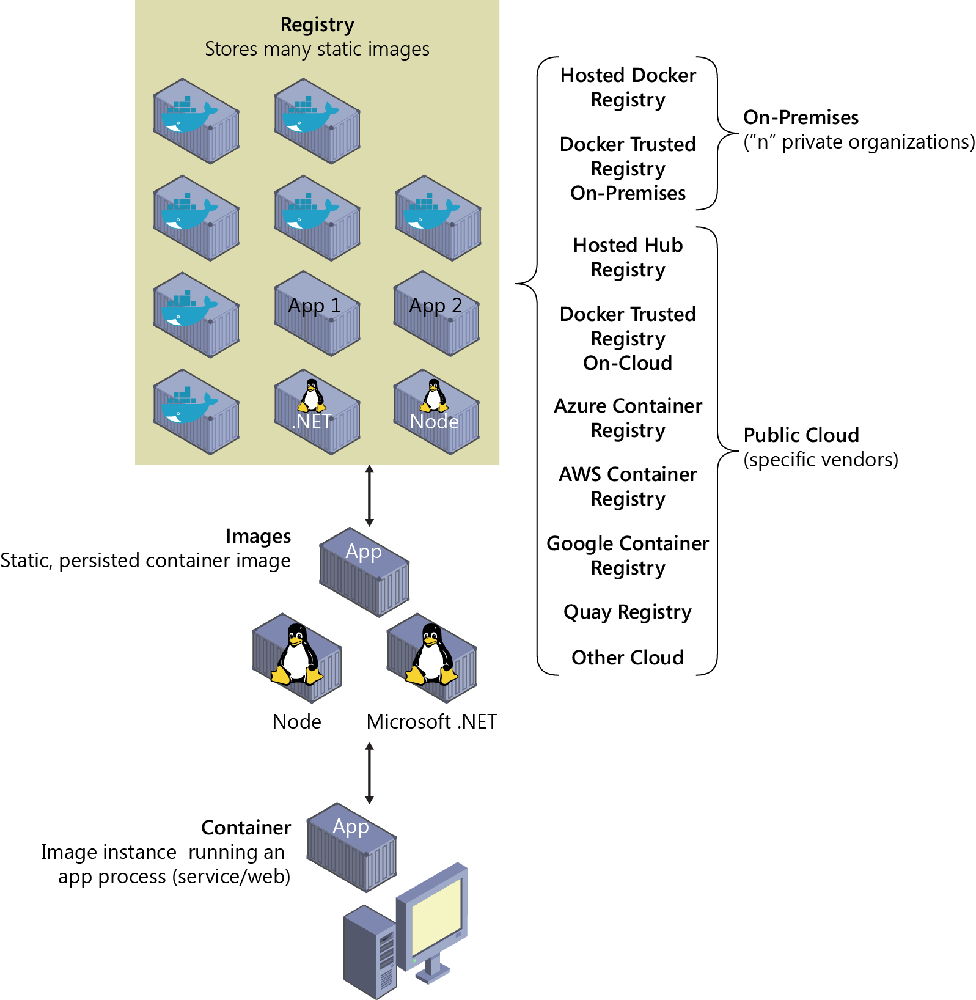
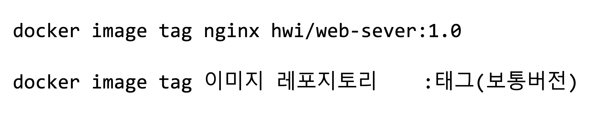
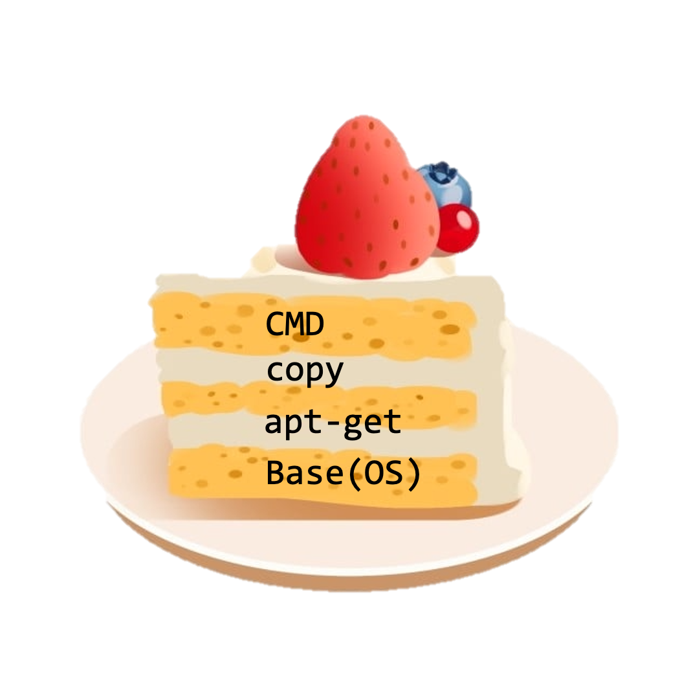
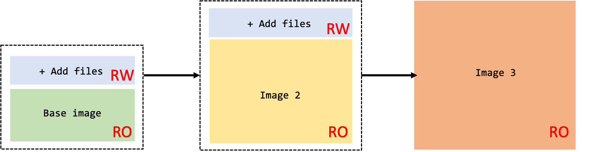
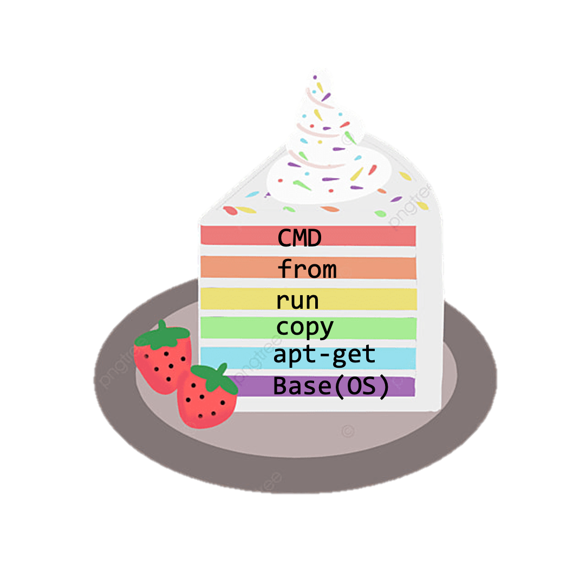
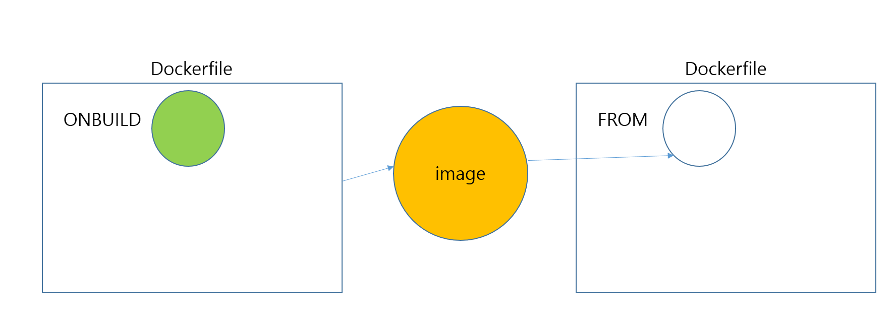

안녕하세요. 세 번째 글을 작성하게 된 클라우드메이트 TE팀 정휘영입니다.

제가 작성할 컨텐츠는 도커의 꽃 !
도커 이미지, 도커파일, 도커 컴포즈를 알아보겠습니다.
사실 제가 입사하고 나서 가장 궁금했던 부분이였기 때문에 더 자세히 공유하고자 합니다.
아무리 찾아봐도 작성법이나 어떻게 해야할지 정리가 제대로 되어있지 않아서 이번에 제가 정리하고자 합니다! 😎
이 블로그를 보시고 도커 이미지, 도커 파일, 도커 컴포즈에 대한 개념을 조금이나마 알아가셨으면 좋겠습니다.

- - -

# 도커 이미지(Docker Image)

## 1. 개념

\#도커 사이트

📍 도커 사이트 : GitHub 나 Bitbucket과 같은 소스코드 관리 툴과 연계하여 코드를 빌드하는 기능이나 실행 가능한 애플리케이션의 이미지를 관리하는 Docker의 공식 리포지토리 서비스입니다.

<https://hub.docker.com/>

여기서 여러분의 이미지를 확인할 수 있어요. 

간단하게 ‘nginx’로 검색해보면 official과 verified publisher로 정해져있습니다.
official은 해당 제조사가 만든 공식 이미지이며 나머지는 특정 유저가 만들어 놓은 이미지입니다.

```
[root@hwi ~]# docker search nginx
NAME                                              DESCRIPTION                                     STARS     OFFICIAL   AUTOMATED
nginx                                             Official build of Nginx.                        16975     [OK]
linuxserver/nginx                                 An Nginx container, brought to you by LinuxS…   169
bitnami/nginx                                     Bitnami nginx Docker Image                      131                  [OK]
ubuntu/nginx                                      Nginx, a high-performance reverse proxy & we…   52
bitnami/nginx-ingress-controller                  Bitnami Docker Image for NGINX Ingress Contr…   18                   [OK]
rancher/nginx-ingress-controller                                                                  10
```

이렇게 `docker search [image]` 검색하면 바로 찾을 수 있습니다. 

**DESCRIPTION**에서 official을 확인하실 수 있습니다.

* **레지스트리 :** 레지스트리 서버의 IP 주소 또는 도메인 이름 (default : dockerhub)

 이 레지스트리는 저장소라고 하면 쉽습니다. 내가 사용하는 이미지가 도커허브에서 다운을 받았거나 추후에 설명하는 도커파일로 내가 만들어서 내부에서 만든 레지스트리일 수도 있습니다.



온 프레미스일 수도 있고 클라우드 벤더사에서 제공하는 레지스트리일수도 있죠. 예로 든 docker.io는 기본적으로 도커 허브이며 내가 지정한 레지스트리가 있으면 변경하면 됩니다.

* **저장소 :** 하나 이상의 컨테이너 이미지를 저장하는 장소입니다. official한 repository 이름은 library입니다.
* **이미지 :** 컨테이너의 기본이 되는 이미지, 주로 이미지의 역할과 관련된 이름을 붙이며 생략할 수 없습니다.

 이미지는 이미지 자체로는 사용할 수 없고 컨테이너에 추가해야지만 사용할 수 있는 패키지 같은 느낌입니다.


이미지(앞바퀴) 없으면 컨테이너(자전거) 안돌아가는 것처럼요.

* **태그 :** 이미지의 버전을 기록합니다. 만약에 태그를 생략하면 도커 엔진은 이미지의 태그를 latest로 인식하고 해당 버전을 기록합니다. latest는 말 그대로 최신 이미지를 의미하겠죠?

이미지를 먼저 찾으려면 docker search \[image] 로 찾을 수 있지만 리스트가 너무 많으면 찾기 힘드니까(?) 사람들이 좋다고 점찍어준 이미지를 찾습니다.

```
[root@hwi ~]# docker search nginx -f stars=10
NAME                                              DESCRIPTION                                     STARS     OFFICIAL   AUTOMATED
nginx                                             Official build of Nginx.                        16975     [OK]
linuxserver/nginx                                 An Nginx container, brought to you by LinuxS…   169
bitnami/nginx                                     Bitnami nginx Docker Image                      13

[root@hwi ~]# docker pull nginx
Using default tag: latest
latest: Pulling from library/nginx
42c077c10790: Pull complete #레이어
62c70f376f6a: Pull complete #레이어
915cc9bd79c2: Pull complete #레이어
75a963e94de0: Pull complete #레이어
7b1fab684d70: Pull complete #레이어
db24d06d5af4: Pull complete #레이어
Digest: sha256:2bcabc23b45489fb0885d69a06ba1d648aeda973fae7bb981bafbb884165e514 #다이제스트
Status: Downloaded newer image for nginx:latest #상태확인
```

여기서 `stars`는 즐겨찾기 수입니다. 그만큼 인기많으면 별점 받잖아요 (벌점아님).  여러분이 원하는 이미지 기준에 따라 찾으시면 됩니다. 보통 official이 별점이 많습니다.


많으면 좋아요 별이 많으면 다다익선


---

## 2. 도커 이미지 관리


### 1) 도커 이미지 관리

도커 이미지는 내가 만들지 않는 이상 공식적인 Docker Hub등 Docker Registry로 부터 Docker 이미지를 다운로드합니다

[명령어] 

```
docker image pull
```


미지를 나에게 끌고온다라는 느낌으로 생각하시면 쉬울 듯합니다!

이미지를 다운 받게 되면 항상 ‘확인' 하는 습관을 들여야합니다. 

docker image ls = docker images 로 찾아볼 수 있습니다.

```
[root@hwi ~]# docker images
REPOSITORY                                                         TAG       IMAGE ID       CREATED        SIZE
nginx                                                              latest    0e901e68141f   3 weeks ago    142MB
wordpress                                                          latest    744143078625   2 months ago   605MB
```


추가적인 명령어도 있습니다.

`--digets` : 다이제스트(Hash value) 출력 결정
`--no-trunc` :  결과 필드 정보를 자르지 않고 모두 출력


```
[root@hwi ~]# docker images --no-trunc
REPOSITORY   TAG       IMAGE ID                                                                  CREATED       SIZE
nginx        latest    sha256:0e901e68141fd02f237cf63eb842529f8a9500636a9419e3cf4fb986b8fe3d5d   3 weeks ago   142MB
```


`--quiet or  -q` Docker 이미지 ID만 출력

```
[root@hwi ~]# docker images -q
0e901e68141f
```

그럼 이 다운받은 이미지를 확인해봐야겠죠?
docker image inspect [image] 로 이미지의 상세출력을 봅시다.


너무 길어서 적당히 잘랐습니다!

```
[root@hwi ~]# docker image inspect nginx
[
    {
        "Id": "sha256:0e901e68141fd02f237cf63eb842529f8a9500636a9419e3cf4fb986b8fe3d5d",
        "RepoTags": [
            "nginx:latest"
        ],
        "RepoDigests": [
            "nginx@sha256:2bcabc23b45489fb0885d69a06ba1d648aeda973fae7bb981bafbb884165e514"
        ],
        "Parent": "",
        "Comment": "",
        "Created": "2022-05-28T05:41:03.228946845Z",
        "Container": "0a702bec7d2ceb935c6501ae3dfc1ab850f9ea46b9296eb1323b2b826595f954",
        "ContainerConfig": {
            "Hostname": "0a702bec7d2c",
            "Domainname": "",
          ~
            "Env": [
					~
						"LowerDir": "/var/lib/docker/overlay2/18b0f66197b1c3b184009e453762bf4dd82f3982838611ea17e31ad2c49b862f/diff:/var/lib/docker/overlay2/7101605454e893bfede15c36adbd1c0ca7f632e6107396e5439f62bb6337f526/diff:/var/lib/docker/overlay2/9dee816d85c48960d00ff48500518fc6e77d7755d9b78fc8236b5e4d3b728d5d/diff:/var/lib/docker/overlay2/2cc907c7ab13e225b1c6b54a4f7bbbd514a85bd4c22b9419d4672d57e2af0ecc/diff:/var/lib/docker/overlay2/e93d3298009dd5bc315d14a32ffd9beb9a99dba48a2bc065583a33e3fb42fde5/diff",
                "MergedDir": "/var/lib/docker/overlay2/bdfb696b6704e1384708596a13ab84a8deed8cde84ad61a43cd88e679c21baee/merged",
                "UpperDir": "/var/lib/docker/overlay2/bdfb696b6704e1384708596a13ab84a8deed8cde84ad61a43cd88e679c21baee/diff",
                "WorkDir": "/var/lib/docker/overlay2/bdfb696b6704e1384708596a13ab84a8deed8cde84ad61a43cd88e679c21baee/work"
            },
            "Name": "overlay2"
        },
        "RootFS": {
            "Type": "layers",
            "Layers": [
                "sha256:ad6562704f3759fb50f0d3de5f80a38f65a85e709b77fd24491253990f30b6be",
                "sha256:58354abe5f0e9e8cf3849a697cd86bfefb8448b9deb74e3d13aa3e4c98dd3665",
                "sha256:53ae81198b641f2911dfc469313edde2fe690bf230efaa823a4aa836d08336e0",
                "sha256:57d3fc88cb3f95fe3daac8591dabe1c161af0fcfd4cf099aa3f994c888ac7877",
                "sha256:747b7a567071ddb822a072c4dadc2ef50ef6d1bf35ce477e9a559f1df1b7c571",
                "sha256:33e3df466e11254954ba3b06301c93c066a1f699e2ddd80f0214340236d57935"
            ]
        },
        "Metadata": {
            "LastTagTime": "0001-01-01T00:00:00Z"
        }
    }
]
```

이렇게 상세 정보로 찾으면 추후에 도커파일이 위치한 디렉토리나 어떤 OS운영체제로 돌아가는지도 알 수 있기 때문에 나중에 트러블 슈팅할 때도 좋겠죠?

나는 이미지를 다운받았어도 구분하기 위한 무언가가 필요할 수 있잖아요 그래서 우리는 태그를 사용합니다.

```bash
[root@hwi ~]# docker image tag nginx hwi/web-sever:1.0
[root@hwi ~]# docker images
REPOSITORY      TAG       IMAGE ID       CREATED       SIZE
hwi/web-sever   1.0       0e901e68141f   3 weeks ago   142MB
nginx           latest    0e901e68141f   3 weeks ago   142MB

```

원래 이미지의 IMAGE ID( 0e901e68141f) 새로운 이미지의 IMAGE ID가 동일하죠? 다른 이미지가 아니라 동일한 이미지로 이미지에 별명만 새롭게 붙인 것입니다. 그렇기 때문에 이미지 자체가 변경 된 것은 아닙니다.




어떻게 어디서 해야할지 모르겠다면 이 그림 참조하시고 바꿔보세요 🙂 

개인적으로 저도 많이 몰랐어서 꼭 짚고 넘어가셨으면 해요


### 2) 도커 이미지 생성

도커 이미지를 생성을 할 수도 있습니다. 

기존의 있는 이미지를 컨테이너로부터 이미지를 생성을 해올 수 가 있습니다.

[명령어]

```bash
docker container commit
```

```bash
docker container commit -m "Message" [containerFrom] [REPO/IMG:TAG]
```

`--author, -a`  : 작성자 설정 
`--message, -m` : 메시지를 지정

먼저 테스트를 해보겠습니다.

```
#### 사전 작업
docker run -it --name myweb01 ubuntu
> apt-get update
> apt-get -y install nginx
> useradd webuser
> cat /usr/share/nginx/html/index.html

# 기존 내용 변경
> echo 'my test web' > /usr/share/nginx/html/index.html
> Ctrl+PQ # 종료하지 말고 빠져나오기

#### 커밋으로 이미지 생성
docker commit -a "hwiyoung" -m "modify: index.html" myweb01 hwi/myweb:1.0
> sha256:2fd80466d9e4dfc576a2478bfc17af4fed41461c1353da1921c109abaf27dc95

docker image ls
REPOSITORY      TAG       IMAGE ID       CREATED          SIZE
hwi/myweb       1.0       2fd80466d9e4   19 seconds ago   168MB
ubuntu          latest    27941809078c   2 weeks ago      77.8MB
hwi/web-sever   1.0       0e901e68141f   3 weeks ago      142MB

```

이렇게 commit을 하면 image id가 바뀌게 됩니다.

**그런데 만약에 인터넷이 되지 않는다면?** 

그럴 때는 이미지를 전달할 때 이미지 그대로가 아니라 ‘압축’ 파일로 전달해야합니다.

이럴 때는 export / import 명령어를 사용합니다.

```

### 인터넷이 되지 않는 폐쇄망에서 이미지를 전달하기 위해서는, USB로 압축 파일로 전달.


# 파일 시스템 형태로 아카이브
docker container export  [containerName] > [tarName.tar]   # container -> tar
cat [tarName.tar] | docker image import - [REPO/IMG:TAG]   # tar -> image

# 이미지 레이어 형태로 아카이브
docker image save -o [tarName.tar] # image -> tar
docker image load -i save.tar      # tar -> image 
```

먼저 기존에 돌아가고 있는 컨테이너를 tar로 압축합니다.

```
[root@hwi ~]# docker container export 1c82bc3e55c6 > myweb02.tar
[root@hwi ~]# ls
myweb02.tar
```

가동 중인 컨테이너의 디렉토리와 파일들을 모아서 tar 형태의 아카이브 파일로 생성합니다. Container > tar

압축이 잘 되었는지 확인합니다.

```
[root@hwi ~]# tar -tvf myweb02.tar | head -10
-rwxr-xr-x 0/0               0 2022-06-23 07:19 .dockerenv
lrwxrwxrwx 0/0               0 2022-05-31 15:42 bin -> usr/bin
drwxr-xr-x 0/0               0 2022-04-18 10:28 boot/
drwxr-xr-x 0/0               0 2022-06-23 07:19 dev/
-rwxr-xr-x 0/0               0 2022-06-23 07:19 dev/console
drwxr-xr-x 0/0               0 2022-06-23 07:19 dev/pts/
drwxr-xr-x 0/0               0 2022-06-23 07:19 dev/shm/
drwxr-xr-x 0/0               0 2022-06-23 07:19 etc/
-rw------- 0/0               0 2022-05-31 15:42 etc/.pwd.lock
-rw-r--r-- 0/0            3028 2022-05-31 15:42 etc/adduser.conf

```

 해당 tar 파일을 가지고 다른 서버에서 컨테이너를 가동시킬 수 있습니다.  tar > image 

```
[root@hwi ~]# cat myweb02.tar | docker image import - hwi/myweb:1.1
sha256:2bf33dae93725a82e3c88b0fe3cff013b43168001feba7e634203eb3371f9016

[root@hwi ~]# docker images
REPOSITORY      TAG       IMAGE ID       CREATED         SIZE
**hwi/myweb       1.1       2bf33dae9372   6 seconds ago   168MB**
hwi/myweb       1.0       2fd80466d9e4   2 hours ago     168MB
ubuntu          latest    27941809078c   2 weeks ago     77.8MB
hwi/web-sever   1.0       0e901e68141f   3 weeks ago     142MB
nginx           latest    0e901e68141f   3 weeks ago     142MB
```

import 명령어를 통해서 새롭게 만들어진 이미지를 확인할 수 있습니다.

save / load로도 이미지를 옮길 수 있습니다.

Docker 이미지를 tar 파일로 저장하고 tar 이미지로부터 이미지를 다시 생성하는 과정입니다.

```
[root@hwi ~]# docker images
REPOSITORY      TAG       IMAGE ID       CREATED        SIZE
ubuntu          latest    27941809078c   2 weeks ago    77.8MB
nginx           latest    0e901e68141f   3 weeks ago    142MB

[root@hwi ~]# docker image save -o nginx2.tar nginx

[root@hwi ~]# tar -tvf nginx2.tar | grep layer
-rw-r--r-- 0/0            3072 2022-05-28 05:41 3b5d311d2f840e0a6143c2d84801fd2377fd86a98257b76c040691bf5d83bed2/layer.tar
-rw-r--r-- 0/0            4096 2022-05-28 05:41 402f9faefe30663d398f6a1758ae88632e1a67221d8f33034df0ba07ec72bef2/layer.tar
-rw-r--r-- 0/0            3584 2022-05-28 05:41 74d7f8c7f19ae04fff1755131e41968c46d80b9741001771b23b17116162cf3c/layer.tar
-rw-r--r-- 0/0        62004736 2022-05-28 05:41 b1509af541dd9f3ea40425ba5ab3073acef7db7e7aa7ca01f98f7414f8e5e1e7/layer.tar
-rw-r--r-- 0/0        83896832 2022-05-28 05:41 b8c3926d6865a53a5b55a36e83878172f0af98ba1e9970fc32e399d57cebf890/layer.tar
-rw-r--r-- 0/0            7168 2022-05-28 05:41 da17b82cfa7b52346a642ba3488e16f7324a151dcacaab6f3c60111b13a33300/layer.tar

```

save 명령어를  통해 이미지를 tar 파일로 저장합니다.

여기서 하나 또 알고 넘어가는 명령어 

### 3) 도커 이미지 삭제

[명령어]

```\
docker image rm [image]

—force, -f #이미지 강제 삭제
-no-prune #중간 이미지를 삭제하지 않음
```

기존의 ngnix는 지워봅니다

```
[root@hwi ~]# docker image rm -f nginx
Untagged: nginx:latest
Untagged: nginx@sha256:2bcabc23b45489fb0885d69a06ba1d648aeda973fae7bb981bafbb884165e514
```

다시 돌아와서 

load 명령어로 이미지를 다시 생성합니다.

```
[root@hwi ~]# docker image load -i nginx2.tar
Loaded image: nginx:latest

[root@hwi ~]# docker images
REPOSITORY      TAG       IMAGE ID       CREATED        SIZE
ubuntu          latest    27941809078c   2 weeks ago    77.8MB
**nginx           latest    0e901e68141f   3 weeks ago    142MB**
```

지운 nginx 이미지가 다시 생겼네요!


### 그렇다면 export/import 와 save/load의 차이점은 ?

- 같은 이미지에 명령을 진행해도 export 와 save는 내부적인 디렉토리와 파일 구조가 다릅니다.
- export를 통해서 tar파일을 생성하면, 컨테이너 내부의 각 개별 파일을 아카이브하는 것이고 save는 이미지의 레이어 구조로 포함된 형태로 아카이브하는 것입니다.

```bash
#export
[root@hwi ~]# tar -tvf myweb02.tar | head -5
-rwxr-xr-x 0/0               0 2022-06-23 07:19 .dockerenv
lrwxrwxrwx 0/0               0 2022-05-31 15:42 bin -> usr/bin
drwxr-xr-x 0/0               0 2022-04-18 10:28 boot/
drwxr-xr-x 0/0               0 2022-06-23 07:19 dev/
-rwxr-xr-x 0/0               0 2022-06-23 07:19 dev/console

#save
[root@hwi ~]# tar -tvf nginx2.tar | grep layer
-rw-r--r-- 0/0            3072 2022-05-28 05:41 3b5d311d2f840e0a6143c2d84801fd2377fd86a98257b76c040691bf5d83bed2/layer.tar
-rw-r--r-- 0/0            4096 2022-05-28 05:41 402f9faefe30663d398f6a1758ae88632e1a67221d8f33034df0ba07ec72bef2/layer.tar
-rw-r--r-- 0/0            3584 2022-05-28 05:41 74d7f8c7f19ae04fff1755131e41968c46d80b9741001771b23b17116162cf3c/layer.tar
-rw-r--r-- 0/0        62004736 2022-05-28 05:41 b1509af541dd9f3ea40425ba5ab3073acef7db7e7aa7ca01f98f7414f8e5e1e7/layer.tar
-rw-r--r-- 0/0        83896832 2022-05-28 05:41 b8c3926d6865a53a5b55a36e83878172f0af98ba1e9970fc32e399d57cebf890/layer.tar
-rw-r--r-- 0/0            7168 2022-05-28 05:41 da17b82cfa7b52346a642ba3488e16f7324a151dcacaab6f3c60111b13a33300/layer.tar
```

이렇게 도커 이미지를 관리하는 법을 알게되었지만 내가 원하는 방법으로 만들었으면 좋겠다거나 회사망에서만 써야한다거나 그런 상황이 생길 수 있잖아요? 


그렇다면 우리는 수작업이라는 것도 할 줄 알아야합니다.


# 도커 이미지 빌드 (Docker Image Build)

Dockerfile은 Docker에서 인프라 구성을 기술한 파일입니다. ~~대충만들면 안됩니다.~~

먼저 도커파일을 작성하는 법을 알아볼게요

여기는 필수로 들어가야할 것이 있는데요.

```bash
FROM #운영체제 이미지

RUN  #실행할 명령어

CMD #컨테이너 명령 실행
```

운영체제 이미지가 베이스로 여러가지 라이브러리를 가져다가 동작시키기 때문에 메모리 등도 고려하면서 작성해야할 필요가 있습니다. 그렇기에 실행할 명령어와 컨테이너 자체의 명령어가 필요합니다.

그렇기 때문에 어쩔 수 없이 암기해야하는 것은 짚고 넘어갈게요

## 1. Dockerfile 문법(암기필수)

| 명령 | 설명 | 명령 | 설명 |
| --- | --- | --- | --- |
| FROM | 베이스 이미지 지정 | VOLUME | 볼륨 마운트 |
| RUN | 명령 실행 | USER | 사용자 지정 |
| CMD | 컨테이너 실행 명령 | WORKDIR | 작업 디렉토리 |
| LABEL | 라벨 설정 | ARG | Dockerfile 안의 변수 |
| EXPOSE | 포트 노출 | ONBUILD | 빌드 완료 후 실행되는 명령 |
| ENV | 환경 변수 | STOPSIGNAL | 종료 시그널 설정 |
| ADD | 파일/디렉토리 추가 | HEALTHCHECK | 컨테이너의 상태 체크 |
| COPY | 파일 복사 | SHELL | 기본 쉘 설정 |
| ENTRYPOINT | 컨테이너 실행 명령 |  |  |


대다수의 Dockerfile을 보면 FROM 부터 시작합니다. 

운영체제를 지정하는데 메모리 기반으로 돌아가기 때문에 컨테이너 용량을 적게 하게끔 설정하는 것이 필요하거든요.

제가 설정한 Dockerfile을 보고가겠습니다 !

```bash
[ec2-user@hwi dockerfile_dir]$ cat -n Dockerfile.1
     1	FROM ubuntu
		 2	RUN  apt-get update && apt-get install -y -q nginx
     3	COPY index.html /var/www/html/
     4  CMD ["nginx", "-g", "daemon off; " ]
```

먼저, 이 파일을 더 잘 이해하기위해서는 Image Layer을 알고 넘어가야합니다.

컨테이너는 기존 게시글에서 정의했듯이 Host OS에 컨테이너를 만들고 어플리케이션을 작동시키기 위해서 필요한 라이브러리나 어플리케이션등을 하나로 모아서 별로의 서버처럼 만들 수 있게 한 것인데요. 

이미지 전송시간을 줄이기 위해 Read-only image layer를 공유합니다. 

여러분은 케이크 만들 때 시트를 쌓고 크림, 시트를 차곡차곡 쌓아서 만드는거 알고 계실거에요.

컨테이너도 마찬가지로 레이어를 쌓아서 만든다고 생각하시면 됩니다.





그럼 이미지가 만들어지는 과정을 볼게요



간단하게 설명해보자면 현재 OS로 사용하고 있는 base image 입니다. Read only 입니다. 여기에 파일을 하나씩 추가한다면 그 위에 레이어가 쌓이게 되는 거죠 upper layer를 하게되면 (프로그램 설치) Read, Write가 되고 그 이후에 image 2 는 전체가 Read only가 됩니다. 이렇게 명령어가 하나씩 실행될 때마다 add file로 upper layer (프로그램 설치)가 반복이 됩니다. 그렇게 image 3가 만들어지면 전체가 Read only가 되는 것이죠.

그런데, 이렇게 명령어가 많아진다면?




끊임없이 레이어가 쌓이게 되니까 메모리는 점점 많아질 거에요. 

### [실습]

생성된 이미지입니다. Size는 133MB네요.

```
REPOSITORY   TAG       IMAGE ID       CREATED          SIZE
hwi01        1.0       e4cfc041c8a5   3 hours ago      168MB
```

우리는 메모리를 조금이라도 적게 사용하고 싶어서 컨테이너를 이용하는건데 만약에 명령어를 계속 계속 한 줄씩 쓰게 된다면..?  이미지가 메모리가 많이 들거에요.

그것을 방지하고자 몇 가지 방법을 소개하도록 하겠습니다.

첫 번째, 이미지 내부 임시 파일 삭제하기

```
[ec2-user@hwi dockerfile_dir]$ cat -n Dockerfile.2
     1	FROM ubuntu
     2	RUN  apt-get update && apt-get install -y -q nginx
     **3	RUN  rm -rf /var/lib/apt/lists/***
     4	COPY index.html /var/www/html/
     5	CMD ["nginx", "-g", "daemon off; " ]
```

[결과]

```bash
REPOSITORY   TAG       IMAGE ID       CREATED          SIZE
hwi01        2.0       b8604a39a49d   3 minutes ago    168MB
hwi01        1.0       e4cfc041c8a5   3 hours ago      168MB
```

아..?! **rm -rf로** 이미지 내부 임시 파일을 **삭제했는데도 이미지는 그대로네요.**

이유는 Image Layer가 증가되어있기 때문입니다. 한 줄에 하나 하나 명령어가 있을 때마다 레이어가 쌓여서 나 중에는 점점 용량이 늘어나서 사용하고자 하는 목적에 벗어나게 되죠.

이렇기 때문에 불필요한 image Layer를 줄여야합니다. 

바로 단일 RUN으로, 즉 RUN의 명령어를 한줄로 줄이는겁니다.

```
[ec2-user@hwi dockerfile_dir]$ cat -n Dockerfile.2-1
     1	FROM ubuntu
     2	RUN  apt-get update && \
     3	     apt-get install -y -q nginx && \
     4	     rm -rf /var/lib/apt/lists/*
     5	COPY index.html /var/www/html/
     6	CMD ["nginx", "-g", "daemon off; " ]
```

### [실습결과]

```bash
[ec2-user@hwi dockerfile_dir]$ docker build -t hwi01:3.0 -f Dockerfile.2-1 .
[ec2-user@hwi dockerfile_dir]$ docker images
REPOSITORY   TAG       IMAGE ID       CREATED          SIZE
**hwi01        3.0       716837dee7fa   21 seconds ago   133MB**
hwi01        2.0       b8604a39a49d   3 minutes ago    168MB
hwi01        1.0       e4cfc041c8a5   3 hours ago      168MB

```

실행결과로 용량도 줄어든 것을 확인할 수 있어요!  이미지 레이어가 줄어들었다는거죠.

이렇게 레이어 다이어트 가능하다니 부럽네요. 제 다이어트는 언제쯤

이렇게 기본적인 도커파일을 작성한다면 명령어를 넣어서 나만의 도커파일은 만들 수있어요. 

명령어 몇 개만 알아보고 넘어가겠습니다!

## RUN

이미지 생성과정에서 애플리케이션 /미들 웨어를 설치, 환경 설정을 위한 명령 등을 정의합니다.

2가지 기술이 있습니다.

1) shell 형식 기술

- 쉘 프롬프트에 명령을 기술하는 방식입니다.

```bash
RUN apt-get update && apt-get install -y nginx
```

- 베이스 이미지 위에서`/bin/sh -c` 를 사용해서 명령을 수행하는 것과 동일합니다.
- 기본 쉘 변경 시 SHELL 명령을 통해서 따로 정의합니다.

2) exec 형식 기술

- 쉘을 경유하지 않는 것이 특징입니다.
- 직접 실행이 아니라 $SHOME 같은 쉘 환경 변수를 사용할 수 없다.
- 명령어가 단독적으로 실행이 아니기 때문에 JSON 배열 형식으로 정의합니다.

```bash
RUN ["/bin/bash", "apt-get install -y nginx" ]

EX)
ps --forest

[ec2-user@hwi dockerfile_dir]$ ps --forest
  PID TTY          TIME CMD
 2572 pts/0    00:00:00 bash
30154 pts/0    00:00:00  \_ ps
```

## CMD

- 생성된 이미지를 바탕으로 컨테이너 내부에서 수행될 작업이나 명령을 실행합니다.
- Dockerfile에 하나의 CMD 명령만 기술 가능하기 때문에 여러 개를 기록하게 된다면 마지막 명령만 유효합니다.

예를 든다면 Nginx web container 이미지를 생성 할 때 Nginx 설치하는 것은 RUN 명령어지만  Nginx Daemon 실행하는 것은 CMD 명령어입니다. 컨테이너 내부에서 수행될 작업 명령을 실행하는 것이 CMD 인 것이죠.

- shell 형식과 exec 형식을 지원합니다.

```bash
#shell
CMD nginx -g ’daemon o ff;'

#exec
CMD ["nginx", "-g", "daemon o ff;" ] _
```

## ONBUILD

개념을 조금 이해하고 가야하는데요. 곧 여름이니까 맛있는 복숭아를 예로 들겠습니다.


~~전 딱복이 제 스타일이에요~~


보통 복숭아를 수확하려면 처음에 묘묙을 심고 나무가 자라서 열매를 맺어야 얻을 수 있잖아요. 하지만 농부는 복숭아 나무가 있음에도 묘묙을 사서 심곤하죠. 


본인이 그 묘묙에서 자라는 복숭아를 먹기 위해서일까요? 아닙니다. 묘목은 본인의 후손을 위해서입니다.

이것도 같은 원리라고 생각하면 쉬울 것 같아요.

ONBUILD를 쓰는 이유는 import 하는 추후의 이미지에서 쓰여지기 위해 사용합니다.





✔ Dockerfile 에 ONBUILD 명령을 사용하여 어떤 명령을 실행하도록 설정하여 빌드하고 이미지를 작성 하게 되면 그 이미지를 다른 Dockerfile 에서 베이스 이미지로 설정하여 빌드했을 때 ONBUILD 명령에서 지정한 명령을 실행하는 것이죠. 웹 서비스 환경 구성 시 OS 설치 및 미들웨어 관련 설정을 기본 이미지로 만들고, 개발자들에 의해서 추가되는 부분을 ONBUILD 구문으로 구성하면, 개발자들이 좀 더 쉽게 docker 이미지를 빌드 할 수 있습니다.


말해 뭐해! 실습으로 보여드릴게요.

### [실습1]

```bash
[ec2-user@hwi dockerfile_dir]$ cat -n Dockerfile.4
     1	ROM ubuntu
     2	RUN apt-get -y update && apt-get install -y nginx
     3	EXPOSE 80
     4	ONBUILD ADD webdata.tar /var/www/html/
     5	CMD ["nginx", "-g", "daemon off;" ]
```

### [실습결과1]

```bash
[ec2-user@hwi dockerfile_dir]$ docker build -t webbase:1.0 -f Dockerfile.4 .
Sending build context to Docker daemon  6.144kB
-------------------------
Step 3/5 : EXPOSE 80
 ---> Running in c1e5f48a377d
Removing intermediate container c1e5f48a377d
 ---> 077e3335369d
**Step 4/5 : ONBUILD ADD webdata.tar /var/www/html/**
 ---> Running in 0843f437404d
Removing intermediate container 0843f437404d
 ---> 9ff4d0faf0a6
Step 5/5 : CMD ["nginx", "-g", "daemon off;" ]
 ---> Running in 469f1e63dc01
Removing intermediate container 469f1e63dc01
 ---> f930a750c35f
Successfully built f930a750c35f
Successfully tagged webbase:1.0
```

ONBUILD ADD webdata.tar /var/www/html/ 으로 **webdata.tar 파일이 존재하지 않지만 error 없이 진행합니다. 지금 현재에 영향을 미치는 것이 아니기 때문이죠. (묘묙을 심었다고 보면 되요)**

그럼 이제 webdata.tar를 만들어보겠습니다.

### [실습2]

```bash
[ec2-user@hwi dockerfile_dir]$ touch {a,b,c}.html && tar -cf webdata.tar {a,b,c}.html
[ec2-user@hwi dockerfile_dir]$ cat -n Dockerfile.5
     1	FROM webbase:1.0
[ec2-user@hwi dockerfile_dir]$ docker build -t webservice:1.0 -f Dockerfile.5 .
Sending build context to Docker daemon  19.46kB
Step 1/1 : FROM webbase:1.0
# Executing 1 build trigger
 ---> b32e9b443fa2
Successfully built b32e9b443fa2
Successfully tagged webservice:1.0

[ec2-user@hwi ~]$ docker images
REPOSITORY   TAG       IMAGE ID       CREATED              SIZE
webservice   1.0       b32e9b443fa2   About a minute ago   168MB
webbase      1.0       f930a750c35f   10 minutes ago       168MB
```

이렇게 만들어진 이미지로 컨테이너를 생성해서 내부에 접속해보겠습니다.

파일이 있는지 확인해야죠.

### [실습결과2]

```bash
CONTAINER ID   IMAGE            COMMAND                  CREATED          STATUS          PORTS                               NAMES
25bfed235f51   webservice:1.0   "nginx -g 'daemon of…"   26 seconds ago   Up 26 seconds   0.0.0.0:80->80/tcp, :::80->80/tcp   sleepy_knuth

[ec2-user@hwi ~]$ docker exec -it sleepy_knuth /bin/bash

root@25bfed235f51:/# ls /usr/share/nginx/html/
a.html  b.html  c.html  index.html

```

이렇게 도커파일 생성 시 만들어집니다.

이렇게 곧 당장 사용하지 않아도 나중에 만들어질 컨테이너를 위해 큰 그림 그리고) 설정하는 ONBUILD에 대해 알아보았습니다.

## ENV +) ARG

가끔 사용하다보면 일일히 입력하기가 힘들기 때문에 고정시켜버릴 수 없을까? 생각이 들 때가 있죠. 도커파일 내부에서도 환경변수로 가능합니다.

한번 만들어보겠습니다. 위에서 배운 내용 그대로 레이어를 하나씩 쌓지 않도록 명령어를 잘 설정하세요 🙂

```bash
#잘못된 예
FROM nginx
ENV Food “Chicken”
ENV Summer Cola Sea Vacation
ENV Time 1116

CMD ["/bin/bash"]

#레이어를 줄인 예

FROM nginx
ENV Food “Chicken” \
Summer Cola Sea Vacation \
ENV Time 1116
CMD ["/bin/bash"]
```

이 경우는 컨테이너 실행 시 `--env` 옵션으로 변경 가능합니다. 

```bash
[ec2-user@hwi dockerfile_dir]$ sudo docker build -t hwipage:2sudo docker run -it -e Myname=hwi -e Mynumber=1116 hwipage:2.0.0 -f Dockerfile.7 .

[ec2-user@hwi dockerfile_dir]$ docker images
REPOSITORY   TAG       IMAGE ID       CREATED          SIZE
hwipage      2.0       319b91f24c62   39 seconds ago   142MB

HOSTNAME=07e07155b972
PWD=/
PKG_RELEASE=1~bullseye
HOME=/root
NJS_VERSION=0.7.5
TERM=xterm
SHLVL=1
PATH=/usr/local/sbin:/usr/local/bin:/usr/sbin:/usr/bin:/sbin:/bin
NGINX_VERSION=1.23.0
**Food=“Chicken” Summer Cola Sea Vacation ENV Time 1116**
_=/usr/bin/env
```

내부에서도 설정 가능하지만 docker 를 run할 때도 바로 사용할 수 있습니다.

이미지에서도 존재하지만 수정도 가능합니다. 도커 실행시 명령어에 추가하면 됩니다.

```bash

[ec2-user@hwi dockerfile_dir]$ sudo docker run -it -e Myname=hwi -e Mynumber=1116 hwipage:2.0
root@6ef8e59f67e2:/# env
Myname=hwi
HOSTNAME=6ef8e59f67e2
PWD=/
PKG_RELEASE=1~bullseye
HOME=/root
NJS_VERSION=0.7.5
TERM=xterm
SHLVL=1
Mynumber=1116
PATH=/usr/local/sbin:/usr/local/bin:/usr/sbin:/usr/bin:/sbin:/bin
NGINX_VERSION=1.23.0
Food=“Chicken” Summer Cola Sea Vacation ENV Time 1116
_=/usr/bin/env
```

### **여기서 잠깐 !**

도커파일 안에서 인수나 환경변수를 정의할 때 사용되는 ARG도 있는데 ENV와의 차이는?

`ENV`는 컨테이너 내부에서 사용하는 환경 변수입니다. `ARG`는 빌드 되는 과정에서만 사용하는 환경 변수입니다.

```bash
[ec2-user@hwi dockerfile_dir]$ cat -n Dockerfile.8
     1	FROM ubuntu
     2	ARG myName="Hwi"
     3	RUN echo $myName

[ec2-user@hwi dockerfile_dir]$ docker build -t hwiarg:1.0 -f Dockerfile.8 .

Sending build context to Docker daemon   21.5kB
Step 1/3 : FROM ubuntu
 ---> 27941809078c
Step 2/3 : ARG myName="Hwi"
 ---> Running in 5fc29f2d2ebd
Removing intermediate container 5fc29f2d2ebd
 ---> 11bae31238fd
**Step 3/3 : RUN echo $myName
 ---> Running in 0fb25ca04733
Hwi #값을 설정할 수 있음.**
Removing intermediate container 0fb25ca04733
 ---> 711429178447
Successfully built 711429178447
Successfully tagged hwiarg:1.0
```

## EXPOSE

나중에 웹서비스를 한다면 가장 많이 쓰게 될 것이라고 확신하는 명령어입니다. 컨테이너 의 공개포트를 지정하고 컨테이너가 대기하고 있는 포트를 알려줍니다. **`docker run -p`** 옵션을 통해서 호스트의 포트 번호와 매핑할 수 있습니다. 예를 들면 **`-p 8080:443`** 처럼 사용할 수 있습니다.

```bash
[ec2-user@hwi dockerfile_dir]$ cat -n Dockerfile.9
     1	FROM nginx
     2	EXPOSE 443
```

이미지 빌드 후 컨테이너로 실행합니다.

```bash
[ec2-user@hwi dockerfile_dir]$ docker build -t hwiexpose:1.0 -f Dockerfile.9 .
Sending build context to Docker daemon  22.53kB
Step 1/2 : FROM nginx
 ---> 55f4b40fe486
Step 2/2 : EXPOSE 443
 ---> Running in b9319d39cad5
Removing intermediate container b9319d39cad5
 ---> c55ceb92d125
Successfully built c55ceb92d125
Successfully tagged hwiexpose:1.0

[ec2-user@hwi dockerfile_dir]$ docker run -d -p 8080:443 hwiexpose:1.0
faece43076b1eea181a15b8066531b9f16b6d0959a7df596e068cb3b43a18b26

[ec2-user@hwi dockerfile_dir]$ docker ps
CONTAINER ID   IMAGE            COMMAND                  CREATED          STATUS          PORTS                                             NAMES
faece43076b1   hwiexpose:1.0    "/docker-entrypoint.…"   5 seconds ago    Up 3 seconds    **80/tcp, 0.0.0.0:8080->443/tcp, :::8080->443/tcp**   objective_kapitsa
```

이렇게 도커파일을 작성해서 이미지를 만드는데 귀찮은게 있죠.

이미지 만들어서 바로 컨테이너 배포까지 하면 안될까?.. 이미지 만들고 배포하는거 따로따로 하려니까 영 힘듭니다. 데이터베이스랑 연결해야하기도 하고 환경변수 수정도 해야하고 여간 신경쓸게 아니죠 그래서 우리는 이것을 관리할 수있는 도구인 Docker compose라는 것을 사용해보겠습니다. 

---

# 도커 컴포즈(Docker compose)

Docker Compose는 여러 개의 컨테이너(container)로 구성된 애플리케이션을 관리하기 위한 간단한 오케스트레이션(Orchestration) 도구입니다. 또한 여러 개의 컨테이너를 코드 (YAML 파일)를 통해서 통합 관리하기 위한 툴이기도 하죠. 최신 버전을 설치하기 위해서 직접 다운 받아서 사용할 수 있습니다.

도커 컴포즈의 장점을 ‘다시' 사용할 수 있다의 장점이 큰 듯해요.

먼저 YAML파일에 대해서 알고 가야겠죠

### YAML (YAML Ain't Markup Language)

• 구조화 데이터나 오브젝트를 문자열로 변환하기 위한 데이터 형식의 한 종류입니다.
• Space를 사용한 들여쓰기를 통해 데이터 계층을 표시하는데요.

절대로!!!! **tab키 사용하지 않기로 합니다. 이유는** 같은 parents를 가지는 값은 **들여쓰기의 크기가 반드시 동일 해야 합니다.**

## docker compose  파일의 구조

### Top level  4가지(들여쓰기를 하지않는다)

```yaml
version: ()
services: (docker container)
volumes: (docker volume)
networks: (docker network)
```

`version` :  지원 버전을 확인합니다.

`services` :  컨테이너의 설정을 확인합니다.

`volumes` : 도커 볼륨 (docker volume create ..)에 대한 설명입니다.

`networks` : 도커 네트워크 ( docker network create …)에 대한 설명입니다.

이렇게 크게 4가지를 잡고 도커 컴포즈 파일을 만들어갑니다.

## compose file format

[Compose file versions and upgrading](https://docs.docker.com/compose/compose-file/compose-versioning/)

compose 파일은 버전관리를 해서 사용할 수 있습니다.

 `Version 1`  (미사용)
• 서비스에 관한 부분만 정의 ( volumes, network, build arguments 정의 불가 )합니다.
• 모든 컨테이너가 default bridge 에만 연결이 가능합니다.
• 컨테이너 사이의 통신을 위해서는 link 기능을 사용 합니다.

```bash
web:
  build: .
  ports:
   - "8000:5000"
  volumes:
   - .:/code
  links:
   - redis
redis:
  image: redis
```

`Version 2` 
• Service 아래 서비스 부분을 정의합니다.
• volumes, network등의 키가 생기면서 named volume 과 같은 디테일한 설정이 가능합니다.

```bash
version: "2.4"
services:
  web:
    build: .
    ports:
     - "8000:5000"
    volumes:
     - .:/code
  redis:
    image: redis
```

`Version 3`
• docker compose 와 Docker Engine의 swam mode를 호환할 수 있도록 구성되어 있습니다.
• 버전 별로 지원하는 기능 차이가 있기 때문에 위의 공식링크의 메뉴얼을 꼭 확인해야합니다.

## compose file structure

`build` :  build context(Dockerfile)이 위치하는 디렉토리 경로입니다.

```bash
version: "3.7"
services:
 webapp:
  build: ./dir
or
version: "3.7"
services:
 webapp:
  build:
   context: ./dir
   dockerfile:
   args:
    buildno: 1 
```

`image` : 서비스 컨테이너를 실행 시키기 위한 이미지입니다.
`dockerfile`은 Dockerfile-alternate Dockerfile의 이름을 명시적으로 정의해야 하는 경우 사용합니다.

만약 실제 build 되는 동안에 환경 변수로 사용할 값이 있다면 `buildno`로 기록합니다. 

```bash
services:
 db: 
  image: postgres
  environm ent:
   - POSTGRES_DB=testdb
   - POSTGRES_USER=testuser
   - POSTGRES_PASSWORD=testecret
   - POSTGRES_INITDB_ARGS=-encoding=UTF-8
env_file: envfile
```

`environment`: 컨테이너 내부에서 사용할 환경 변수 , 환경변수가 많은 경우 `env_file`을 사용합니다.

`restart` : 컨테이너 종료 시 재시작 횟수를 정의합니다.  3가지의 옵션이 있습니다.
• no: 수동으로재시작
• always : 컨테이너를 수동으로 끄기 전까지 항상 재시작
• on-failure: 비정상 코드로 종료한 경우 재시작

`depends_on` : 컨테이너 간의 시작과 종료를 위한 의존성 정보를 적습니다. 

```bash
wordpress: 
	**depends_on**:
		- db #db와의 의존성
	image: wordpress:latest 
 ports:
   - " 8000:80"
	**restart**: alway
```

`container_name` : docker compose에서 생성된 컨테이너 이름

`port` : 컨테이너가 노출할 컨테이너의 포트입니다. 작성은 (호스트_포트:컨테이너_포트) 식으로 작성합니다. 호스트 포트를 정의하지 않으면 임의로 정의합니다. 그리고 yaml 파일은 00:00은 시간 양식으로 인식하기 때문에 "8000:80"으로 기록됩니다. 

이렇게 간단하게 도커 컴포즈를 만드는 법을 알았다면 사용할 명령어도 알아야겠죠?

## Docker Compose Commands

*주의사항이 꼭 필요합니다.  

- **docker-compose.yaml 파일이 위치한 디렉토리 에서 실행 (반드시)**
- 특정 파일의 위치를 정의한다.

```bash
 docker-compose up #서비스와 관련된 컨테이너 생성 그리고 시작
```

```bash
docker-compose down # 서비스와 관련된 컨테이너 종료 후 제거
```

```bash
docker-compose start/stop/restart #서비스 관련 컨테이너 시작 / 종료 / 재시작
```

```bash
docker-compose kill #실행 중인 컨테이너에 SIGKH 시그널을 통해서 강제 종료
```

```bash
docker-compose pause/ unpause  #컨테이너 정지 /재가동
```

이것 외에도 많은 명령어가 있습니다. 

전부 다 담을 수는 없지만 여러분께 조금이나마 도움이 되었으면 좋겠습니다.

도커에 대한 이해가 필요했는데 이렇게나마 기록으로 남깁니다. 도커의 기본, 네트워크가 궁금하신 분은 앞의 1,2편도 함께 봐주세요

지금까지 도커이미지, 도커파일, 도커컴포즈에 대해 알아보았습니다. 감사합니다!
