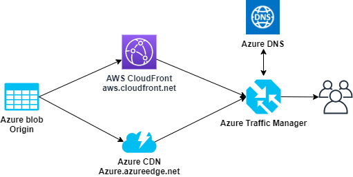
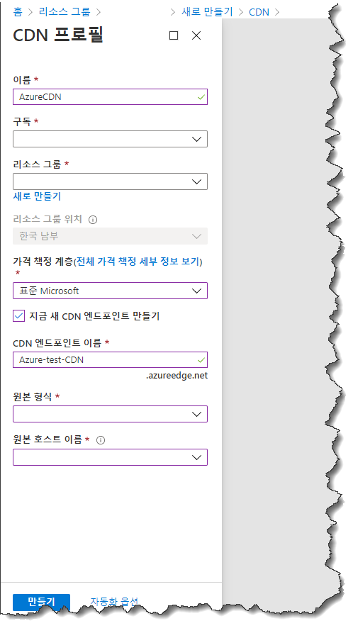
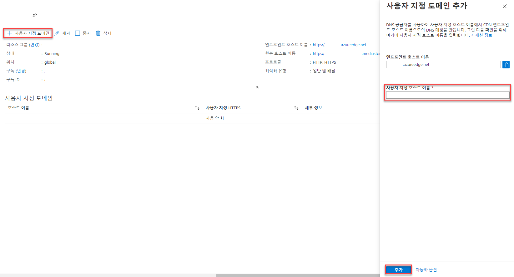
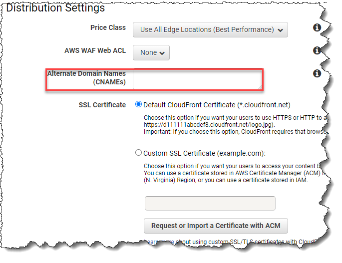

---
authors:
- chansung park
date: "2020-06-09T00:00:00Z"
categories:
- Post
tags:
- CDN
- Azure CDN
- AWS Cloudfront
title: Azure CDN과 AWS CloudFront를 이용한 Multi CDN 구성 방법
---

# Azure CDN과 AWS CloudFront를 이용한 Multi CDN 구성 방법

이번 지면에서는 서로 다른 Public Cloud를 이용하여 Multiple CDN(Content Delivery Network) 서비스를 구성하는 방법을 다뤄보겠습니다.

Multiple CDN 구성으로 취할 수 있는 강점으로는 Public cloud 공급사(社) 혹은 Region 단위의 대형 장애 등 크리티컬한 이벤트에 대응이 용이하여 어떤 상황에서도 무중단 CDN서비스를 공급 할 수 있습니다. 이외에도 다양한 이점을 취할 수 있으니, 안정적인 CDN서비스를 목표로 한다면 Multiple CDN은 서비스 구성에 지향점이 될 수 있을 것입니다.


* 구성 목표

    

```
모든 구성은 기본 구성으로, 실제 사용 시 용도에 따라 상세 설정에 대한 고민이 필요한 점 참고하시며 따라가 주시면 되겠습니다.
```
```
Origin과 서비스 도메인(ex; example.example.com) 등 CDN 이외 리소스는 생성이 되어 있다는 전제 하에 진행 됨을 참고 바랍니다.
```
-----

## 1. Azure CDN 구성

* CDN 프로필과 엔드포인트 생성

    
    - 구성에 필요한 설정을 진행하여 CDN 프로필과 엔드포인트를 생성해 줍니다.
    - 이때, 생성된 'CDN 엔드포인트 이름'(ex; Azure.azureedge.net)은 이후 Traffic Manager 구성 시 사용 되니 별도로 메모 등을 해 두도록 합니다.
        > **_참 쉽죠?_**

* 사용자 지정 도메인 구성

    
    - 서비스 도메인(example.example.com) 등록을 위해 위에서 생성된 엔드포인트에 사용자 지정 도메인을 설정해 줍니다.
    - 이때, 두 가지 방법을 고려할 수 있으며 아래와 같습니다.
        1) 서비스 도메인이 위에서 생성된 Azure CDN 엔드포인트를 가리키도록 CNAME 레코드를 만들 수 있습니다.
        2) 프로덕션 중인 서비스 도메인의 경우, 무중단 서비스를 위하여 'cdnverify'을 이용한 임시 CNAME매핑을 만들어 사용할 수도 있습니다.
        * [참조 링크](https://docs.microsoft.com/ko-kr/azure/cdn/cdn-map-content-to-custom-domain)


## 2. AWS CloudFront 구성

* CF Distribution 생성

    
    - 위 예시와 같이 원하는 서비스에 맞게 AWS CloudFront에서 신규 Distribution을 생성합니다.
    - 이때, 생성된 Distribution의 '도메인 이름'(ex; aws.cloudfront.net)은 이후 Traffic Manager 구성 시 사용 되니 별도로 메모 등을 해 두도록 합니다.

* Alternate Domain Names 구성

    
    - AWS CloudFront의 경우 신규 Distribution 생성 시 사용자가 지정한 서비스 도메인(example.example.com)을 설정할 수 있습니다. 물론, 생성 이후 수정을 통해 구성도 가능합니다.
    - 서비스 도메인 등록시 Azure CDN과의 차이점이라면, 해당 서비스 도메인에 대하여 customize 된 인증서를 사용하거나 혹은 AWS에서 제공하는 ACM을 통해 인증 하여 사용할 수 있습니다.


## 3. Azure Traffic Manager 구성

* Traffic Manager 프로필 생성

    
    - Traffic Manager 프로필을 생성합니다.
    - 라우팅 방법은 현재 '성능', '가중', '우선 순위', '지리적', '다중값', '서브넷' 이렇게 6가지 중 하나를 선택할 수 있으니 용도에 따라 설정해 줍니다.
    - 각 라우팅에 대한 자세한 설명 및 설정방법에 대해서는 아래 링크를 참조하시기 바랍니다.
        * [성능 기반 라우팅](https://docs.microsoft.com/ko-kr/azure/traffic-manager/traffic-manager-configure-performance-routing-method)
        * [가중치 라우팅](https://docs.microsoft.com/ko-kr/azure/traffic-manager/tutorial-traffic-manager-weighted-endpoint-routing)
        * [우선 순위 라우팅](https://docs.microsoft.com/ko-kr/azure/traffic-manager/traffic-manager-configure-priority-routing-method)
        * [지리 기반 라우팅](https://docs.microsoft.com/ko-kr/azure/traffic-manager/traffic-manager-configure-geographic-routing-method)
        * [다중값 라우팅](https://docs.microsoft.com/ko-kr/azure/traffic-manager/traffic-manager-configure-multivalue-routing-method)
        * [서브넷 기반 라우팅](https://docs.microsoft.com/ko-kr/azure/traffic-manager/traffic-manager-configure-subnet-routing-method)
    - 생성된 Traffic Manager 프로필의 엔드포인트(Azure.trafficmanager.net)는 이후 실제 사용하게 될 서비스 도메인(example.example.com)에 CNAME 등록이 필요하므로 잘 기억해 둡니다.

* Traffic Manager 엔드포인트 추가
    
    - 앞에서 생성시킨 Traffic Manager에 Azure CDN과 AWS CloudFront에 각각의 엔드포인트를 추가합니다.
    - 이때, 라우팅 방법에 따른 세부 설정도 추가로 진행해 줍니다.

```
위 과정을 모두 마쳤다면, 실사용 할 서비스 도메인(example.example.com)에 바로 앞 단계에서 생성한 Traffic Manager의 엔드포인트(Azure.trafficmanager.net)를 CNAME 등록해 주는 것으로 Multiple CDN을 사용하기 위한 준비가 완료 됩니다.
```

CDN 서비스 구성에 도움이 되셨길 바랍니다.
### _Things are always at their best in the beginning._
