안녕하세요 클라우드메이트 TE팀 정휘영입니다.

오늘은 2022년 10월 26일 수요일 클라우드메이트 오픈존에서 진행한 서버리스 코리아 유저그룹 밋업 후기를 적어보려고 합니다.

클라우드메이트 특집으로 OpenZone에서 진행하였습니다.

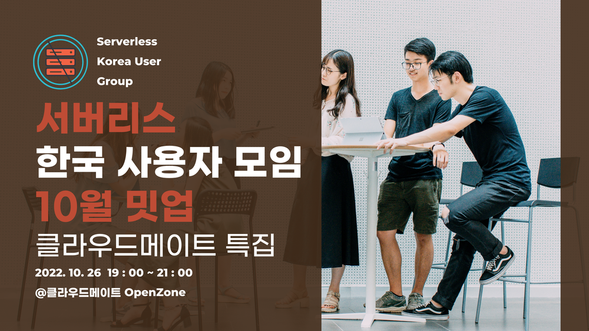

## 모집

이벤터스에서 등록하고 30명을 오프라인으로 모집했습니다.

[서버리스 한국 사용자 모임 10월 밋업 - 이벤터스](https://event-us.kr/bsBxCcQJioWM/event/49809)

## 발표

Azure Cloud와 AWS Cloud를 각각 하나씩 발표했습니다.

클라우드메이트의 김희원님이 Azure Container Apps로 마이크로서비스 빌드하기를 처음을 장식하고

클라우드메이트의 김정환님이 AWS Step Function 실전편 (EC2, RDS 인스턴스 사이즈 전환, 수행이 아닌 등록으로 구성하기) 마지막을 장식했습니다.

# 준비

저는 이번에 서버리스코리아 유저그룹의 운영자로 오픈존 대관과 행사준비를 했습니다.

오픈존에서 행사하는 것은 이번이 첫 번째랍니다!

클라우드메이트의 오픈존이 궁금하신 분은 이 게시글도 함께 봐주세요!

👇🏻👇🏻👇🏻OPENZONE 구경하기👇🏻👇🏻👇🏻

[디큐브시티 오피스로 이사했습니다! 클라우드메이트의 새로운 오피스는 어떤 모습일까요?](https://tech.cloudmt.co.kr/2022/10/13/%EB%94%94%ED%81%90%EB%B8%8C%EC%8B%9C%ED%8B%B0-%EC%98%A4%ED%94%BC%EC%8A%A4%EB%A1%9C-%EC%9D%B4%EC%82%AC%ED%96%88%EC%8A%B5%EB%8B%88%EB%8B%A4-%ED%81%B4%EB%9D%BC%EC%9A%B0%EB%93%9C%EB%A9%94%EC%9D%B4%ED%8A%B8%EC%9D%98-%EC%83%88%EB%A1%9C%EC%9A%B4-%EC%98%A4%ED%94%BC%EC%8A%A4%EB%8A%94-%EC%96%B4%EB%96%A4-%EB%AA%A8%EC%8A%B5%EC%9D%BC%EA%B9%8C%EC%9A%94/)

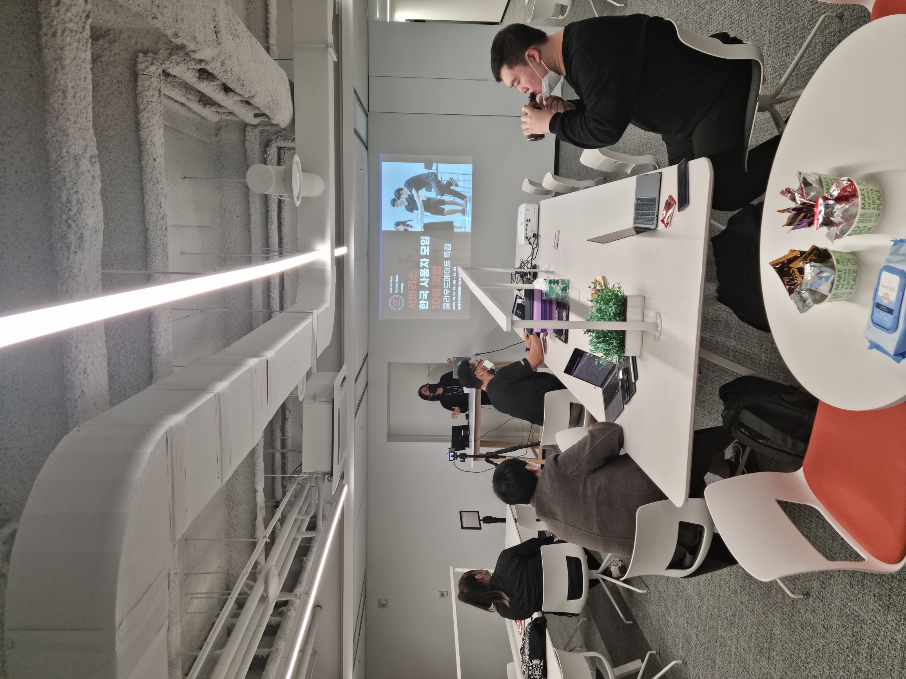

책상도 옮기고 과자와 커피도 세팅했습니다.

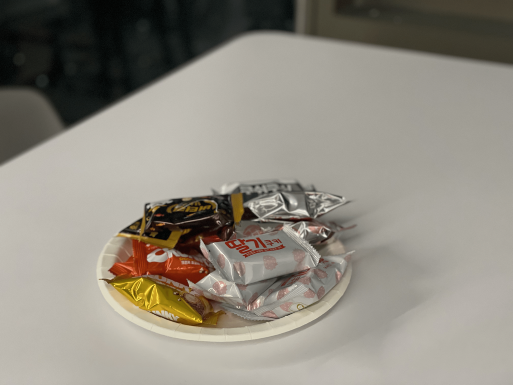

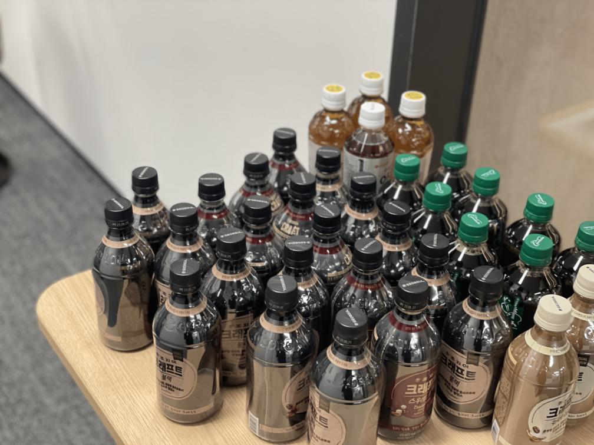

2시간동안 배고프니까요 ! 👍🏻👍🏻

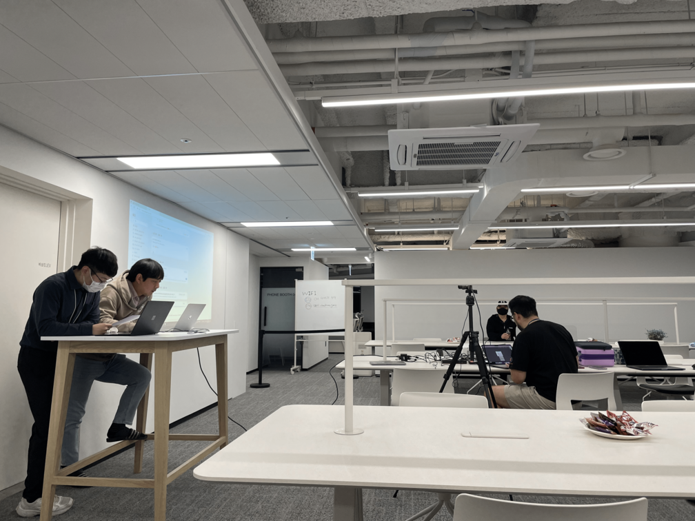

열심히 리허설 중입니다 !

서버리스 한국 사용자모임, 서버리스코리아 유저그룹은 클라우드를 기반으로 서버리스 기술에 관심이 있는 사람들이 모이는 커뮤니티입니다.

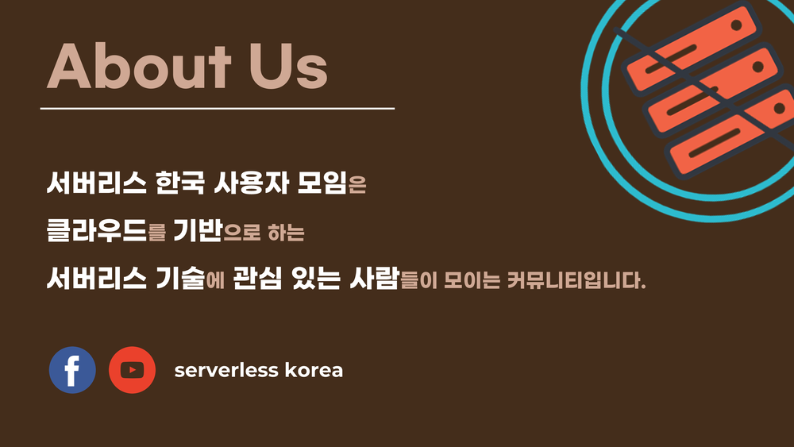

여러분이 사용하시는 클라우드 프로바이더에서 서비스로 제공하는 서버리스의 기술을 공유하거나 사용하면서 꿀팁 등을 알려드리는 곳입니다.

**발표를 원하시는 분은 언제든지 연락주세요 >_<!**

7시부터 발표를 진행했습니다!

\---

## 발표시작 - Chapter 1. Azure Cloud

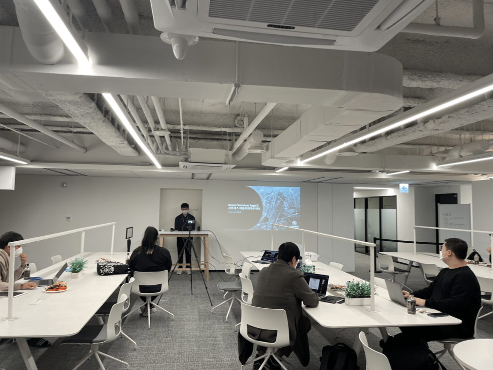

첫 번째 시간은 Azure Container Apps에 대해 알아보고, 이를 통해 간단한 웹 애플리케이션을 배포해보는 시간입니다!

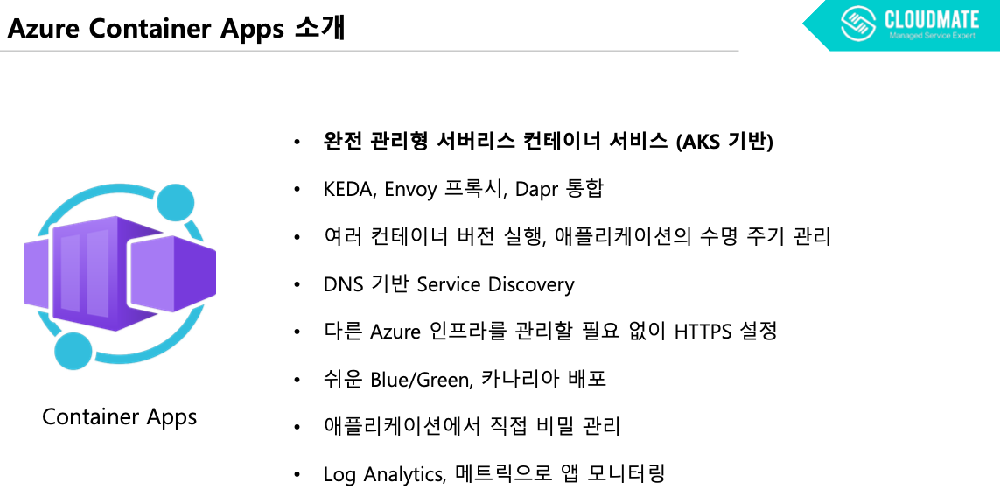

Container Apps는 서버리스 플랫폼에서 마이크로서비스 및 컨테이너화 된 애플리케이션을 실행할 수 있는 Azure Kubernetes Service 기반 PaaS 서비스입니다.

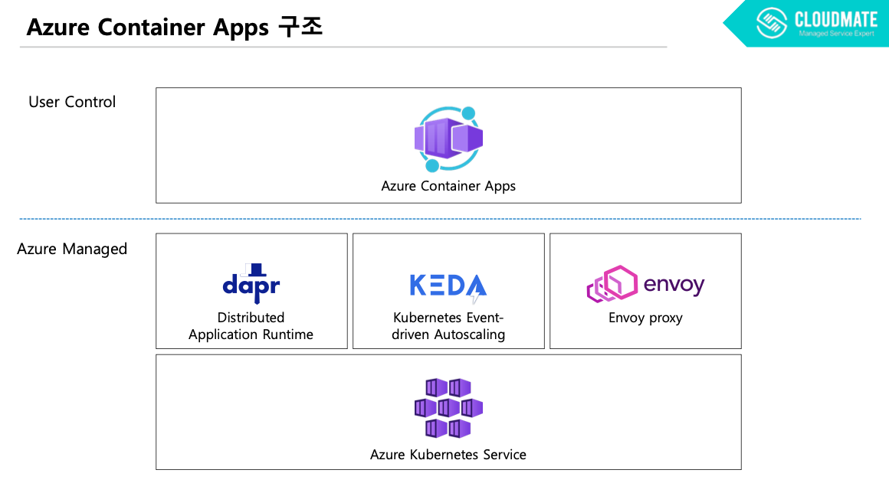

Container Apps는 복잡한 컨테이너 오케스트레이터의 관리 걱정없이 컨테이너를 실행할 수 있습니다.
니다. 사용자가 관리하는 부분이 적게 들죠.

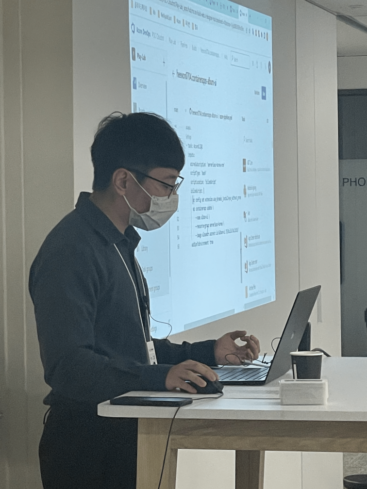

데모 진행과 함께 Container apss에서 꼼꼼히 봐야할 부분을 알려주셨습니다.

## 네트워킹타임

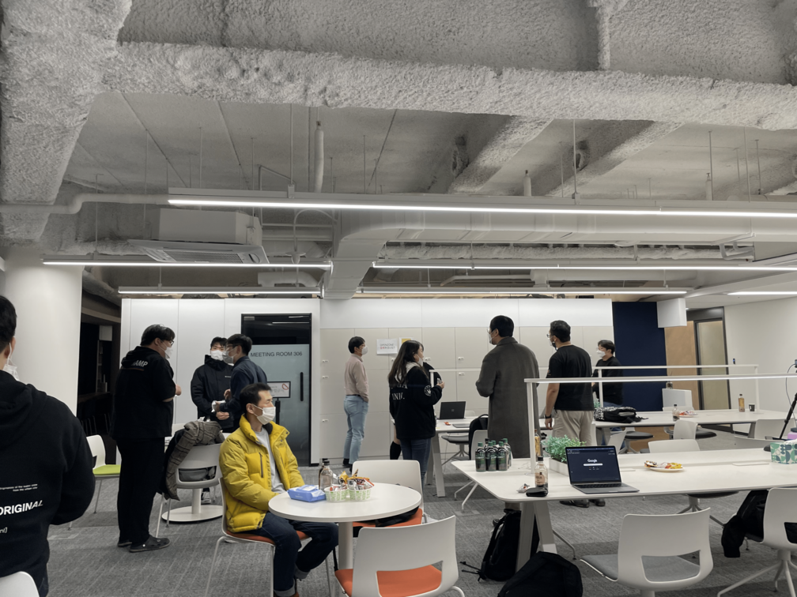

잠시 쉬는 시간을 가지고 명함도 교환하고 여러 이야기를 하는 시간을 가졌습니다!

이렇게 발표하고 숨 쉬는 시간도 있어야 엔지니어끼리 여러 이야기도 하고 경험을 공유할 수 있답니다.

저도 명함 교환하고 실제로 서버리스를 사용했던 경험을 많이 들었답니다.

**여러분도 커뮤니티 행사가 오프라인으로 있다면 주저하지말고 꼭 오세요!**

---

## 발표시작 - Chapter 2. AWS Cloud

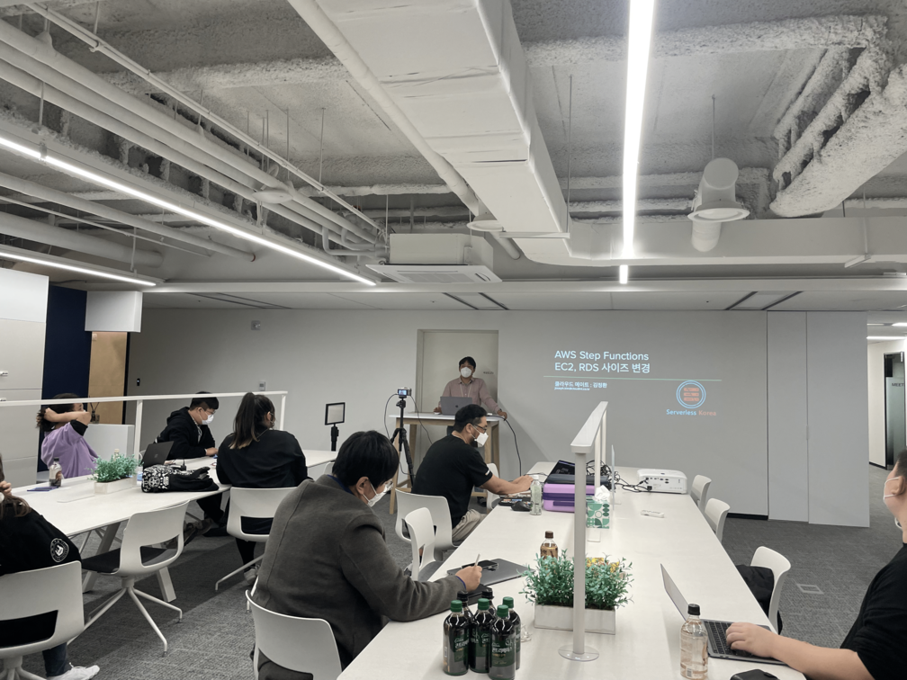

두 번째 시간은 AWS Step Functions을 알아보는 시간입니다. 특별히 기본이 아닌 실전과 꿀팁을 전수해주는 시간이였습니다.

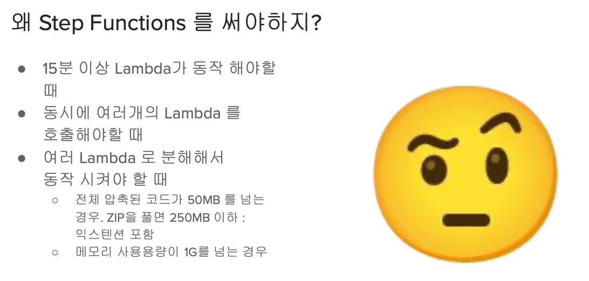

Lambda로 하면 다 될 줄 알았던 Step Function을 활용한 좌충우돌 완성기로 알려주셨습니다.

Step Function 을 활용할 수 있는 기본 과정을 따라해보면서 이해하실 수 있습니다.

고객사가 요청했던 사례를 가져와서 차근차근 설명해주셨습니다!

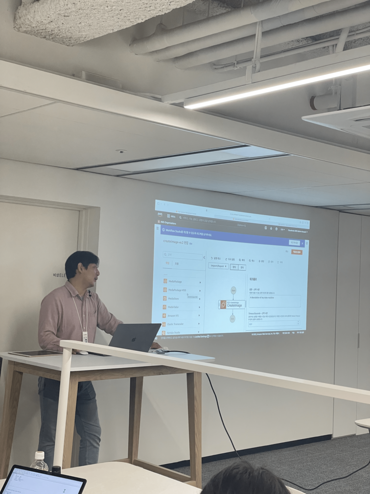

Step Functions 를 사용하면서 겪은 삽질의 내용 (?)으로 EC2 snapshot 을 만들기 위한 Step Functions 구성 및 RDS scale 조정을 위한 Step Functions 구성 

그리고 Step Functions 의 기본 내용 중 핵심을 알려주셨습니다.

직접 만들어보면서 사용자가 실수 할 수있는 부분도 체크해주셨습니다.

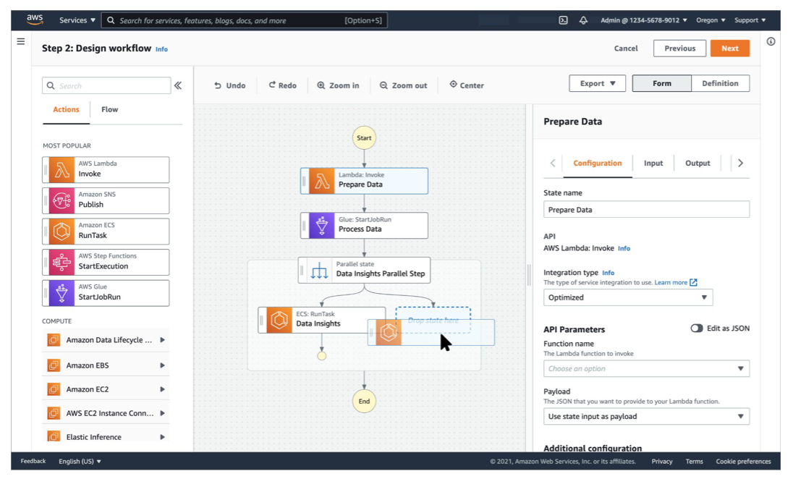

듣던 분들 모두 강사님인 줄 알았다며 박수를 주셨답니다 ㅎㅎㅎ

---

자세한 내용은 모두 유튜브에서 확인하실 수 있습니다!

조만간 올라갈 예정입니다 🙂

👇🏻👇🏻👇🏻YOUTUBE LINK👇🏻👇🏻👇🏻

[Serverless Korea](https://www.youtube.com/c/ServerlessKorea)

---

# 소감문

2시간의 행사였지만 오신 분들 모두 Azure와 AWS의 서버리스 서비스를 알게되었고 

온라인과는 또다른 오프라인의 기쁨을 느끼고 가셨답니다!

발표자 희원님께서 소감문을 남겨주셨는데요. 소감문을 마무리로 지으면서 서버리스 코리아 유저그룹 10월 밋업 클라우드메이트 특집 후기는 마무리하겠습니다 😊

### [ 김희원님의 소감문 ]

10월 26일에 클라우드메이트 오픈존에서 "Azure Container Apps로 서버리스 애플리케이션 배포"라는 주제로 발표했습니다.

사내 외부 발표 외에 개방된 형식의 발표는 처음이었고, 클라우드메이트 오픈존도 외부 커뮤니티 행사는 처음이라고 하니 더욱 뜻깊었던 것 같습니다.

발표가 끝나고 나서 많은 분들이 정말 잘 했다며 격려해 줬지만, 제 개인적으로는 아쉬움이 남는 발표였습니다.

사진으로 보니 표정, 동작에서 좀 경직된 게 보이더라고요.

다음에 이러한 발표를 하게 된다면 자연스럽게 대화하듯 발표하면 좋지 않을까라고 생각했습니다.

좋은 기회 주셔서 발표도 하고 값진 시간이었습니다. 감사합니다. 😍

---

