안녕하세요, 클라우드메이트 배지수입니다.

지난 시간에는 Linux 서버에서 AWS CloudWatch를 통해 프로세스 모니터링하고 재시작을 자동화하는 방법에 관해 이야기하였습니다. 이번 시간에는 여러 대의 EC2 인스턴스에 CloudWatch Alarm을 생성하는 방법을 테스트해 보고 정리했던 내용들을 공유하고자 합니다. 가볍게 읽어주시면 감사하겠습니다.

AWS CloudWatch에서는 하나의 EC2 인스턴스에 대해 CloudWatch Alarm을 생성할 수 있습니다. 따라서 여러 대의 EC2 인스턴스에 CloudWatch Alarm을 생성하는 방법에 대하여 고민해보았고 다음 두 가지 방법을 찾을 수 있었습니다.


1. EC2 인스턴스의 Tag를 통해 한 번에 여러 대의 EC2 인스턴스에 동일한 CloudWatch Alarm을 자동으로 생성하고 실행할 수 있습니다. 다만 새로 생성하는 EC2 인스턴스에 태그를 추가하거나 기존 EC2 인스턴스에 태그를 등록한 후 인스턴스를 중지 및 재시작해야 합니다.

2. AWS CLI를 통해 실행 중인 여러 대의 EC2 인스턴스에 CloudWatch Alarm을 생성할 수 있습니다. 다만 하나의 CloudWatch Alarm에 인스턴스 여러 대를 등록할 수 없으며, 인스턴스 당 메트릭에 대한 경보를 각각 생성해야 합니다.

---

## CloudWatch

먼저 Amazon CloudWatch는 기본적으로 메트릭 저장소입니다. Amazon EC2와 같은 AWS 서비스는 메트릭을 리포지토리에 저장하고 해당 메트릭을 기반으로 통계를 검색합니다. 고유한 사용자 지정 메트릭을 리포지토리에 넣으면 이러한 메트릭에 대한 통계를 검색할 수 있습니다.

Amazon CloudWatch의 작동 방식은 다음과 같습니다.


CloudWatch에서는 AWS 서비스의 기본 메트릭을 수집하여 대시보드 형태로 모니터링할 수 있으며 여러 대시보드를 생성할 수 있습니다.

또한 가장 많이 사용하는 대시보드를 default 대시보드로 지정하여 CloudWatch 콘솔의 첫 화면에 띄워서 항상 모니터링이 가능합니다. 기본 대시보드는 사용자가 대시보드를 생성할 때 CloudWatch-Default 또는 CloudWatch-Default-ResourceGroupName으로 이름을 지정한 사용자 지정 대시보드입니다.


---

## 1. EC2 인스턴스 Tag를 사용하여 여러 EC2 인스턴스에 CloudWatch Alarm 생성하기

대규모 EC2 인스턴스 집합에 대한 CloudWatch Alarm을 생성하고 구성하는 것은 시간이 오래 걸리고 관리가 어렵습니다. 이는 인스턴스에 대한 동일한 Alarm을 신속하게 설정하려는 대규모 마이그레이션 및 다중 계정 환경에서 유용합니다. 또한 새로 생성하는 인스턴스와 실행 중인 인스턴스에 대한 표준 CloudWatch Alarm을 빠르고 일관되게 설정할 수 있으며 인스턴스가 종료되면 경보를 삭제하는 데 도움이 됩니다.

EC2 인스턴스 Tag를 사용하여 특정 태그를 가지고 있는 EC2 인스턴스에 대한 CloudWatch Alarm을 자동으로 생성하고 실행할 수 있습니다. 태그 키가 Create_Auto_Alarms인 EC2 인스턴스가 시작할 때 CloudWatch Alarm이 생성되며 EC2 인스턴스가 종료될 때 CloudWatch Alarm이 삭제됩니다. Tag Key 또는 Value를 변경하고 EC2 인스턴스를 중지 및 재시작하여 CloudWatch Alarm을 업데이트할 수도 있습니다.

또한 원하는 메트릭을 CloudWatch Alarm의 지표로 등록할 수 있으며 SNS와 통합하여 SNS Topic에 구독된 이메일로 해당 Alarm을 전송할 수 있습니다. 테스트는 오픈소스 CloudWatchAutoAlarms Lambda 함수를 기반으로 하는 AWS 공식문서의 가이드를 참고하였습니다.

AWS에서 제공하는 메트릭의 이름 구문은 다음과 같습니다.

```linux
AutoAlarm-<Namespace>-<MetricName>-<ComparisonOperator>-<Period>-<Statistic>
```

* Namespace: 지표에 대한 CloudWatch Alarm Namespace입니다. AWS에서 제공하는 EC2 지표의 경우 Namespace는 AWS/EC2입니다. CloudWatch Agent가 제공하는 메트릭의 경우 Namespace는 기본적으로 CWAgent입니다. 또는 다른 이름을 지정할 수도 있습니다.
* MetricName: 지표의 이름입니다. 예를 들어 CPU Utilizaiton은 EC2의 총 CPU 사용률입니다.
* ComparisonOperator: PutMetricData Amazon CloudWatch API 작업에서 ComparisonOperator 매개 변수에 맞추어 사용되는 비교 연산자입니다.
* Period: 지표를 평가하는 데 사용되는 시간입니다. 정숫값 다음에 초를 s, 분을 m, 시간을 h, 일 수를 d, 주 수를 w로 지정할 수 있습니다. 평가 기간은 CloudWatch 평가 기간 제한을 준수해야 합니다.
* Statstic: 백분위 수가 아닌 지정된 MetricName에 대한 통계입니다.

Tag Value는 Alarm에 대한 임계값을 지정하는 데 사용됩니다. 예를 들어 dictionary default_alarms에 포함된 사전 구성된 기본 Alarm 중 하나는 AutoAlarm-AWS/EC2-CPU Utilization-GreaterThanThreshold-5m-Average입니다.

Tag Key Create_Auto_Alarms를 가진 인스턴스가 실행 중 상태가 되면, AWS에서 제공하는 CloudWatch EC2 메트릭인 CPUUtilization에 대한 Alarm이 생성됩니다.

### **CloudWatchAutoAlarms Lambda 함수 구성**

[CloudWatchAutoAlarms Lambda 함수](https://github.com/aws-samples/amazon-cloudwatch-auto-alarms)를 사용하면 식별 태그로 태그를 지정할 때 EC2 인스턴스 및 AWS Lambda 함수에 대한 표준 경보 세트를 생성할 수 있습니다.

기본 구성은 다음 메트릭을 사용하며 GitHub에서 제공하는 코드에서는 모든 Windows, Amazon Linux, Red Hat, Ubuntu 또는 SUSE Linux EC2 인스턴스에 대한 Alarm을 생성합니다.

* CPU Utilization
* CPU Credit Balance(T 클래스 인스턴스용)
* Disk Space(Amazon CloudWatch Agent 사전 정의 기본 메트릭)
* Memory(Amazon CloudWatch Agent 사전 정의 기본 메트릭)

환경 변수는 다음과 같으며 업데이트하여 기본 Alarm에 대한 임계값을 변경할 수 있습니다.

* ALARM_CPU_HIGH_THRESHOLD: 75
* ALARM_CPU_CREDIT_BALANCE_LOW_THRESHOLD: 100
* ALARM_MEMORY_HIGH_THRESHOLD: 75
* ALARM_DISK_PERCENT_LOW_THRESHOLD: 20

예를 들어 테스트에서 기본 Alarm 중 하나는 AutoAlarm-AWS/EC2-CPUUtilization-GreaterThanThreshold-5m-Average입니다. Create_Auto_Alarms라는 EC2 인스턴스 Tag Key가 있는 인스턴스가 실행 중 상태가 되면 해당 인스턴스에 대한 Alarm이 생성되고 AWS Lambda 환경 변수 ALARM_CPU_HIGH_THRESHOLD가 Alarm에 대한 임계값으로 사용됩니다. cw_auto_alarms.py의 dictionary default_alarms에 정의된 Alarm을 기반으로 다른 Alarm도 생성됩니다.

이러한 기본 Alarm 외에도 다음 Tag Key 구문으로 인스턴스에 태그를 지정하여 EC2 메트릭에 대한 Alarm을 생성할 수 있습니다.

```linux
AutoAlarm-<**Namespace**>-<**MetricName**>-<**ComparisonOperator**>-<**Period**>-<**Statistic**>
```

### **CloudWatchAutoAlarms Lambda 함수 배포**

다음 단계에 따라 CloudWatchAutoAlarms Lambda 함수를 AWS 계정에 배포합니다.

1. GitHub 리포지토리를 컴퓨터에 복제하고 디렉터리로 변경합니다.

```bash
git clone https://github.com/aws-samples/amazon-cloudwatch-auto-alarms
cd amazon-cloudwatch-auto-alarms
```

2. AWS 계정의 자격 증명으로 AWS CLI를 구성합니다. 이렇게 하면 AWS CLI에서 사용할 적절한 자격 증명으로 AWS 환경 변수 AWS_ACCESS_KEY_ID, AWS_SECRET_ACCESS_KEY 및 AWS_SESSION_TOKEN이 설정됩니다.

```bash
aws configure
```
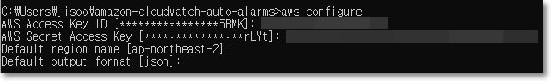

3. CloudWatchAutoAlarms가 알림에 사용할 Amazon SNS Topic을 생성합니다. 샘플 Amazon SNS CloudFormation 템플릿을 사용하여 SNS Topic을 생성할 수 있습니다. 매개변수 OrganizationID는 다중 계정 배포에 사용되므로 비워 둡니다.

```bash
aws cloudformation create-stack --stack-name amazon-cloudwatch-auto-alarms-sns-topic \
--template-body file://CloudWatchAutoAlarms-SNS.yaml \
--parameters ParameterKey=OrganizationID,ParameterValue="" \
--region <enter your aws region id, e.g. "us-east-1">
```

4. Amazon SNS Topic이 생성된 후 Alarm 임계값이 위반될 때마다 알림을 받을 수 있도록 Topic에 대한 이메일 주소를 구독해야 합니다.

a) Amazon SNS 콘솔로 이동합니다.

b) Topic을 클릭한 다음 Amazon SNS Topic을 클릭합니다. 샘플 Amazon SNS CloudFormation 템플릿을 사용하였을 때 Topic 이름은 **CloudWatchAutoAlarmsSNSTopic**입니다.

c) Create subscrption을 클릭하고 프로토콜로 이메일을 선택합니다. Endpoint에 이메일 주소를 입력한 다음 **Create subscription**을 클릭합니다. CloudWatch 경보 알림에 사용되는 Amazon SNS Topic에 이메일 주소를 추가합니다.

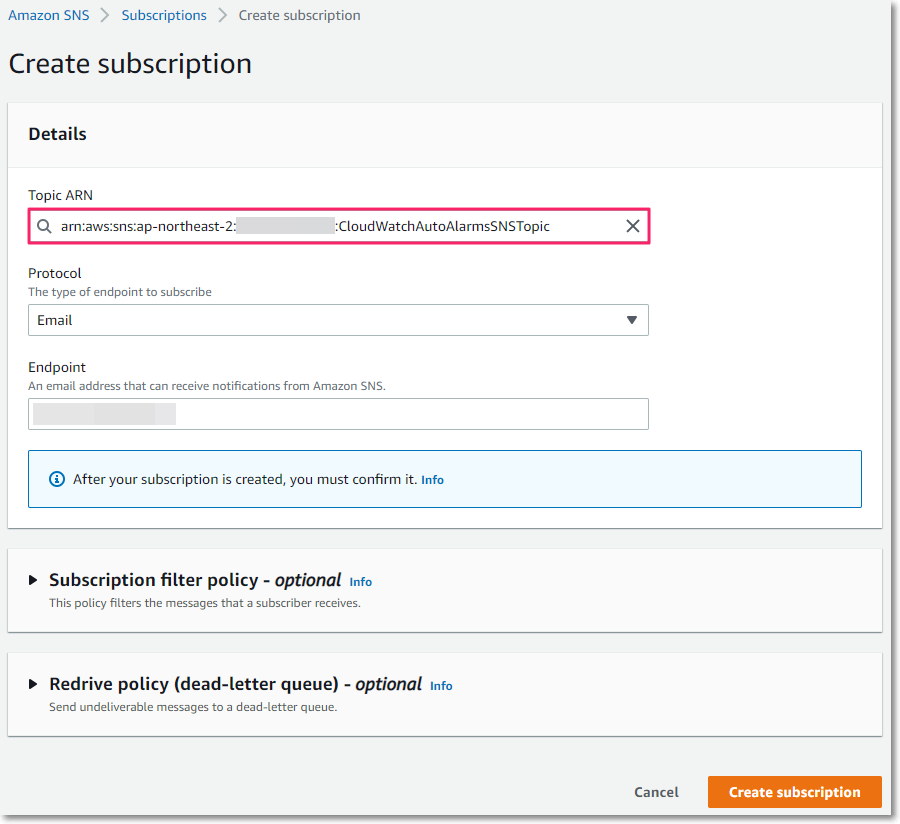

d) Confirm subscription의 링크를 클릭하여 구독을 확인합니다. CloudWatch 경보 Amazon SNS Topic에 대한 이메일 구독을 확인합니다.

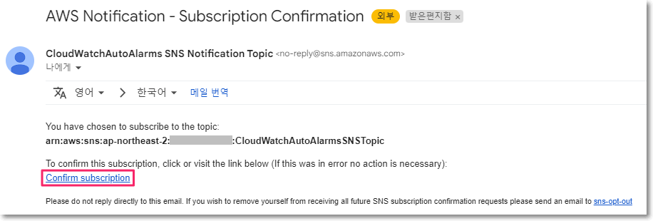
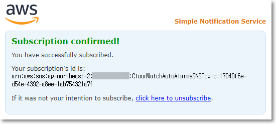

5. CloudWatchAutoAlarms Lambda 함수 배포 패키지를 저장하고 액세스하는 데 사용할 S3 버킷을 생성합니다. 샘플 CloudFormation 템플릿을 사용하여 S3 버킷을 생성할 수 있으며 매개변수 OrganizationID는 다중 계정 배포에 사용되므로 비워 둡니다.

```bash
aws cloudformation create-stack --stack-name amazon-cloudwatch-auto-alarms-s3-bucket \
--template-body file://CloudWatchAutoAlarms-S3.yaml \
--parameters ParameterKey=OrganizationID,ParameterValue="" \
--region <enter your aws region id, e.g. "us-east-1">
```

6. src 디렉터리에 있는 CloudWatchAutoAlarms AWS Lambda 함수 코드가 포함된 zip 파일을 생성합니다. AWS Lambda 함수를 배포하는 데 사용할 배포 패키지입니다.

```bash
zip -j amazon-cloudwatch-auto-alarms.zip src/*
```

💡 `[참고] S3 버킷 이름 찾는 방법(1) - 콘솔`

  * cloudwatch로 검색합니다.

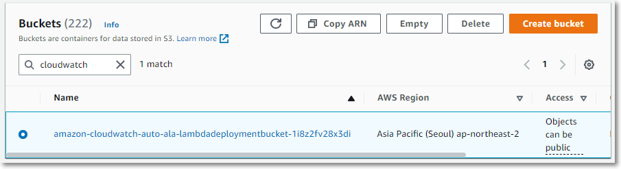


💡 `[참고] S3 버킷 이름 찾는 방법(2) - AWS CLI`

  * 다음 AWS CLI 명령을 실행하여 생성한 버킷 이름을 검색할 수 있습니다.

```bash
aws cloudformation describe-stacks --stack-name amazon-cloudwatch-auto-alarms-s3-bucket \
--query "Stacks[0].Outputs[?ExportName=='amazon-cloudwatch-auto-alarms-bucket-name'].OutputValue" \
--output text \
--region <enter your aws region id, e.g. "us-east-1">
```

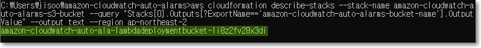

7. amazon-cloudwatch-auto-alarms.zip 파일을 S3 버킷에 복사합니다.

```bash
aws s3 cp amazon-cloudwatch-auto-alarms.zip s3://<your S3 bucket name>
```

8. CloudWatchAutoAlarms.yaml CloudFormation 템플릿과 S3 버킷에 업로드한 배포 패키지를 사용하여 AWS Lambda 함수를 배포합니다. 3단계에서 생성한 SNS Topic에 대한 ARN도 입력해야 합니다.


💡 `[참고] SNS Topic ARN 찾는 방법`

```bash
aws cloudformation describe-stacks --stack-name amazon-cloudwatch-auto-alarms-sns-topic \
--query "Stacks[0].Outputs[?ExportName=='amazon-cloudwatch-auto-alarms-sns-topic-arn'].OutputValue" \
--output text \
--region <enter your aws region id, e.g. "us-east-1">
```
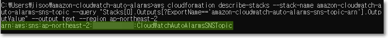

```bash
aws cloudformation create-stack --stack-name amazon-cloudwatch-auto-alarms \
--template-body file://CloudWatchAutoAlarms.yaml \
--capabilities CAPABILITY_IAM \
--parameters ParameterKey=S3DeploymentKey,ParameterValue=amazon-cloudwatch-auto-alarms.zip \
ParameterKey=S3DeploymentBucket,ParameterValue=<S3 bucket name with your deployment package> \
ParameterKey=AlarmNotificationARN,ParameterValue=<SNS Topic ARN for Alarm Notifications> \
--region <enter your aws region id, e.g. "us-east-1">
```

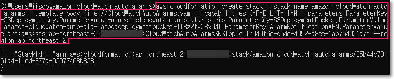


9. AWS CloudFormation 콘솔에서 amazon-cloudwatch-auto-alarms 스택이 생성되었는지 확인합니다.

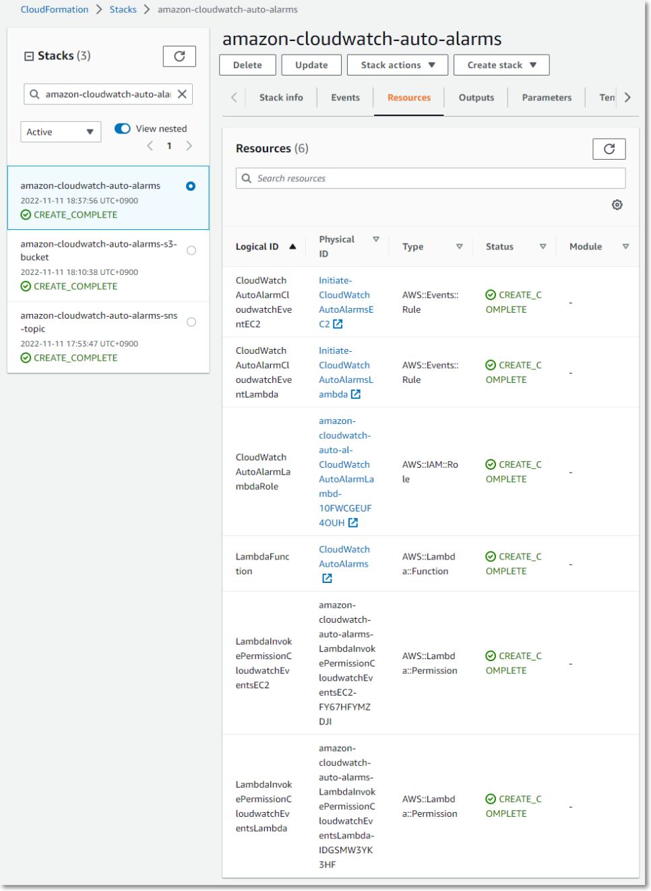


## **자동으로 생성된 CloudWatch 경보로 EC2 인스턴스 시작**

### **EC2 인스턴스에 대한 CloudWatch 권한이 있는 IAM 역할 생성**

먼저 EC2 인스턴스가 계정의 CloudWatch에 데이터를 보낼 수 있는 권한을 갖도록 IAM 역할을 생성해야 합니다. Amazon CloudWatch 설명서의 단계 에 따라 CloudWatchAgentServerRole을 생성합니다. 역할 CloudWatchAgentServerRole에 AWS 관리형 IAM 정책 AmazonSSMManagedInstanceCore를 포함합니다. 이렇게 하면 AWS Systems Manager Session Manager를 사용하여 인스턴스에 연결할 수 있습니다.

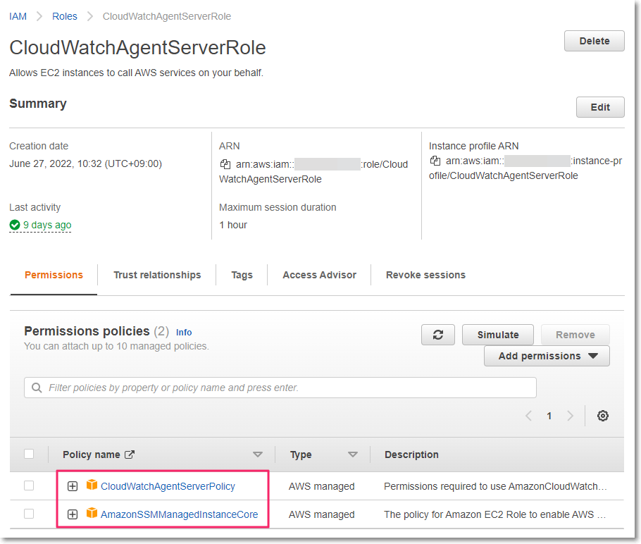

### **Amazon EC2 콘솔에서 새 EC2 인스턴스 시작**

테스트에서는 콘솔에서 기본 Alarm 생성에 필요한 Create_Auto_Alarms EC2 인스턴스 태그로 인스턴스를 수동으로 시작하였습니다.

1. Amazon EC2 콘솔에서 Launch Instance를 클릭합니다.

* Name에 인스턴스의 이름을 입력합니다.
* **Add additional tags**를 클릭합니다.
* Add tag를 클릭하고 Key에 Create_Auto_Alarms를 입력합니다. Tag Key Create_Auto_Alarms의 Value는 비워 둡니다. Tag Key를 추가하면 Lambda 함수 CloudWatchAutoAlarms가 EC2 인스턴스에 대한 Alarm을 자동으로 생성합니다.

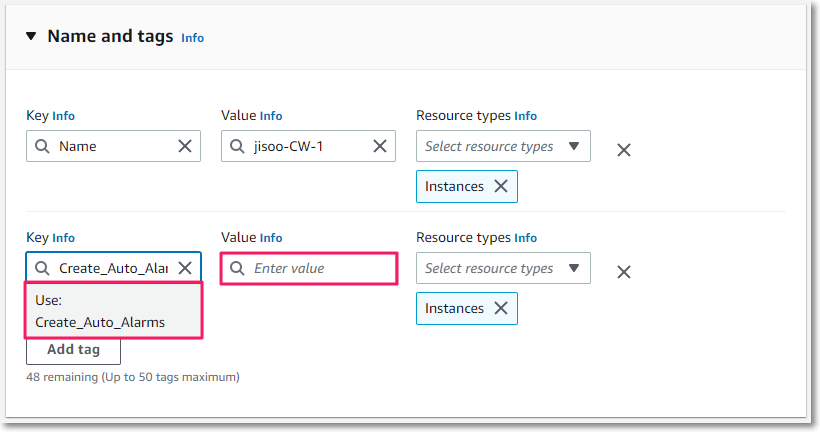

* 테스트에서는 **Amazon Linux 2 AMI**를 선택합니다.
* 인스턴스 유형은 **t2.micro**를 선택합니다.
* 테스트에서는 키 페어 없이 진행하기 위해 Proceed without a key pair를 선택하였습니다. AWS Systems Manager Agent는 기본적으로 Amazon Linux 인스턴스에 설치되고 AWS 관리형 IAM 정책 AmazonSSMManagedInstanceCore가 EC2 인스턴스에서 사용되는 역할에 연결되기 때문에 AWS Systems Manager를 사용하여 EC2 인스턴스에 계속 로그인할 수 있습니다.
* VPC와 서브넷을 선택합니다. CloudWatch Agent가 CloudWatch 서비스 엔드포인트에 연결할 수 있도록 인터넷에 연결된 서브넷을 선택합니다.
* Configure storage에서 스토리지는 기본값을 유지합니다.
* Advanced details 탭의 IAM 역할에서 이전에 생성한 역할 CloudWatchServerRole을 선택합니다. 이 역할은 EC2 인스턴스에 CloudWatch로 데이터를 보낼 수 있는 권한을 제공합니다.

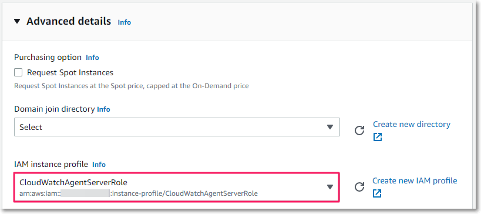

* User data에 Cloudwatch agent를 설치하는 명령어를 입력합니다. 이제 EC2에 필요한 Amazon CloudWatch Agent가 설치됩니다.

```bash
#!/usr/bin/env bash
yum install amazon-cloudwatch-agent -y
/opt/aws/amazon-cloudwatch-agent/bin/amazon-cloudwatch-agent-ctl -a fetch-config -m ec2 -c default -s
```

* Summary를 확인한 다음 Launch instance를 클릭합니다.

인스턴스가 실행 상태에 도달하는 즉시 규칙 Amazon CloudWatch Events Initiate-CloudWatchAutoAlarms가 트리거되고 Lambda 함수 CloudWatchAutoAlarms에 대한 호출이 시작됩니다. Lambda 함수는 시작된 인스턴스의 세부 정보를 가지고 Create_Auto_Alarms라는 EC2 인스턴스의 Tag Key를 확인합니다. Tag Key가 있는 경우 환경 변수 임계값을 사용하여 Alarm을 생성합니다.

* Amazon CloudWatch 콘솔의 Alarm 페이지에서 Alarm이 생성되었는지 확인합니다.

`💥 결과: Alarm이 생성되지 않았습니다.`

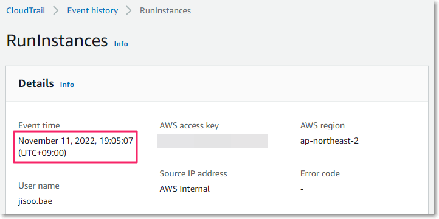
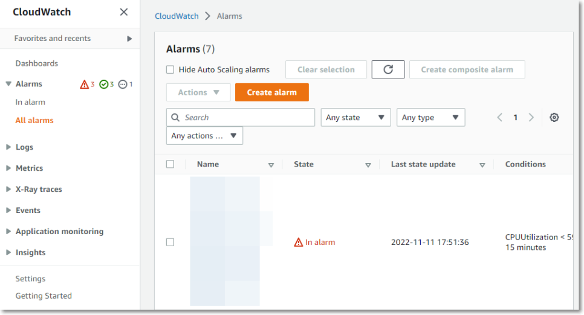
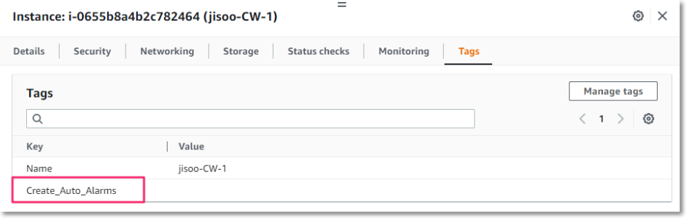

Cloudwatch의 Metrics에서 해당 인스턴스를 검색해보면 Cloudwatch agent에 있는 메트릭을 확인할 수 있습니다.

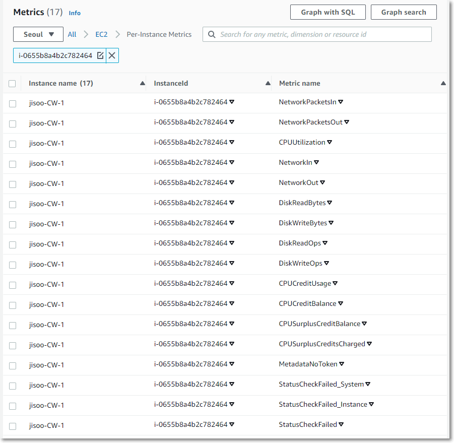

Lambda 함수에 빠진 부분이 있어 오류가 나는지 확인해 보았습니다.

코드 비교 툴 mergely([www.mergely.com](https://www.mergely.com/))를 사용하여 Lambda 함수 코드와 GitHub에 있는 코드를 비교해 보았지만, 결과는 같은 코드였습니다.

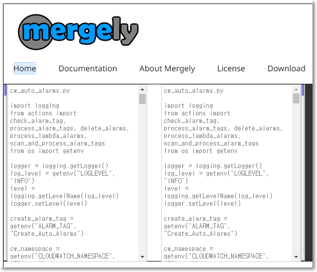

CloudWatch의 메트릭에서는 CW Agent가 수집한 EC2 인스턴스의 메트릭을 확인할 수 있습니다.


Lambda 함수의 Configure 탭을 확인하여 환경 변수를 확인해 봅니다.

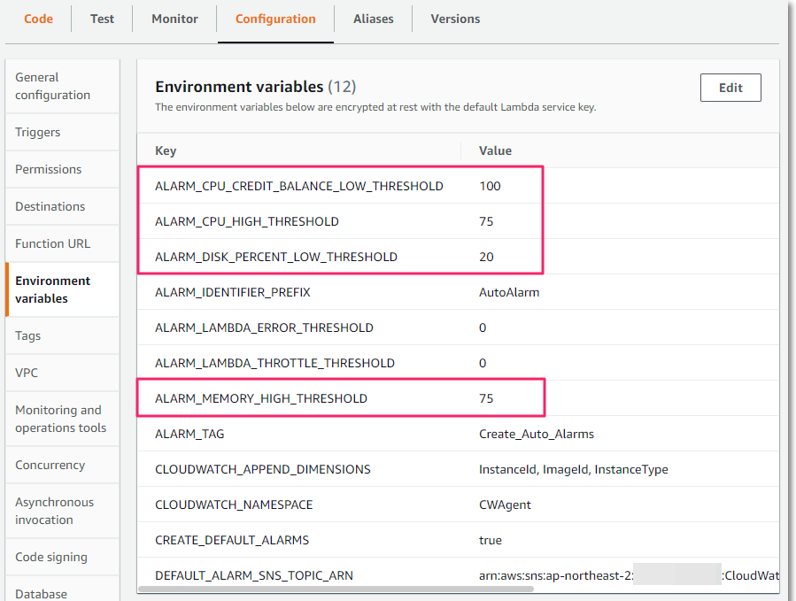


이후 인스턴스를 추가로 생성해 보니 Create_Auto_Alarms 태그가 정상적으로 동작하는 것을 알 수 있습니다.

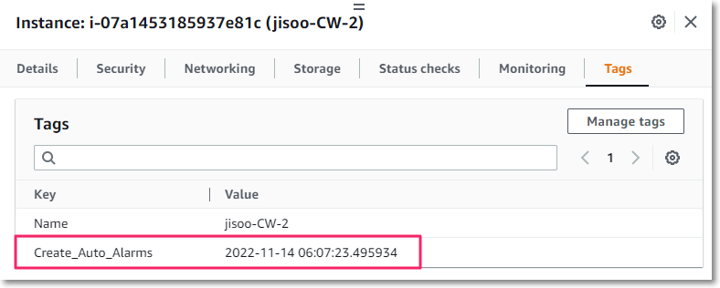
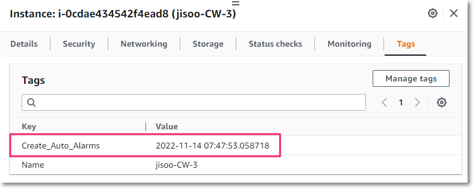

이제 Cloudwatch Alarm을 확인해 봅니다. 인스턴스 이름: jisoo-CW-2에 대한 CloudWatch Alarm이 생성되었습니다.

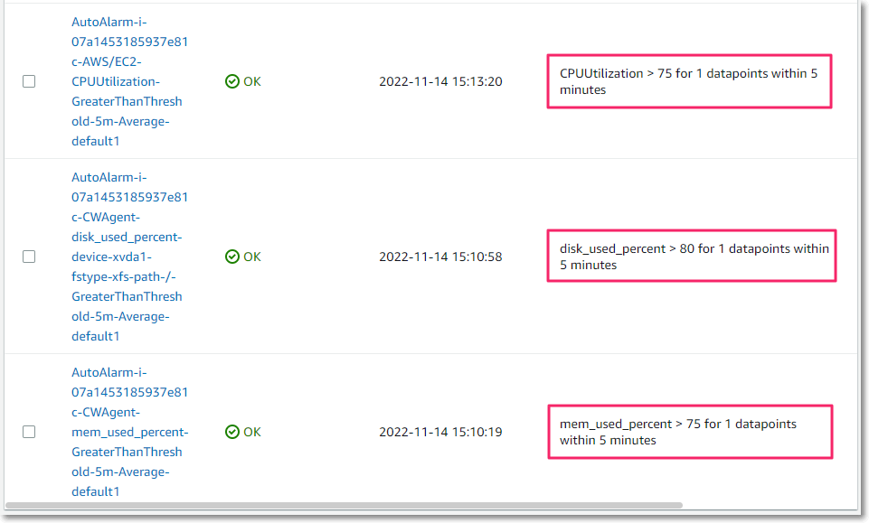

인스턴스 이름: jisoo-CW-3에 대한 Cloudwatch Alarm도 생성되었습니다.

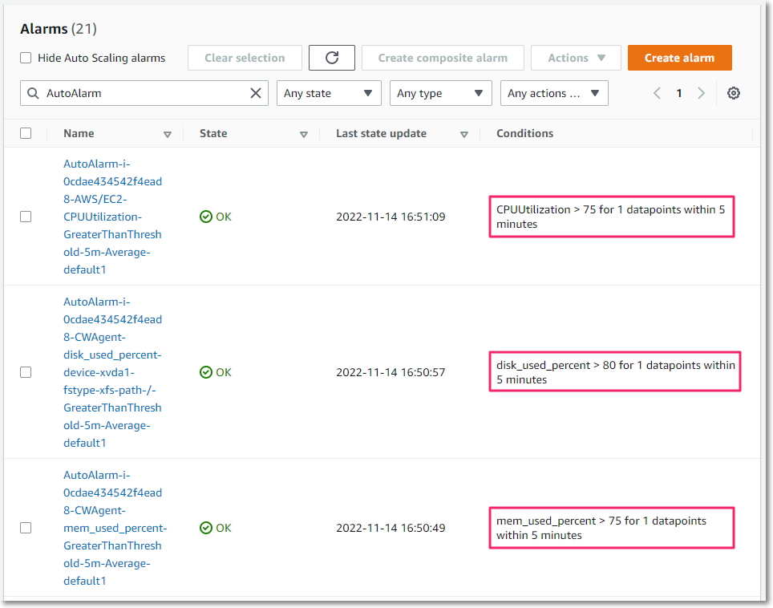

---

## 2. AWS CLI를 사용하여 EC2 인스턴스에 CloudWatch Alarm 생성하기

AWS CLI를 사용하여 다음 명령어를 실행하여 CloudWatch Alarm을 생성할 수 있습니다. CloudWatch Alarm을 생성하려는 인스턴스마다 Alarm 이름과 인스턴스 ID를 변경할 수 있으며 테스트에서는 메트릭 CPUUtiliization 및 disk_used_percent에 대한 CloudWatch Alarm을 생성하였습니다.

예제는 다음과 같습니다.

* CPUUtilization:

```bash
aws cloudwatch put-metric-alarm 
--alarm-name cpu-mon-[Instance ID]
--alarm-description "Alarm when CPU exceeds 70%" 
--metric-name CPUUtilization 
--namespace AWS/EC2 
--statistic Average 
--period 300 
--threshold 70 
--comparison-operator GreaterThanThreshold 
--dimensions  Name=InstanceId,Value=[Instance ID]
--evaluation-periods 2 
--alarm-actions arn:aws:sns:ap-northeast-2:[Account ID]:[SNS Topic Name]
--unit Percent
```

CloudWatch Alarm이 생성된 것을 확인할 수 있습니다.

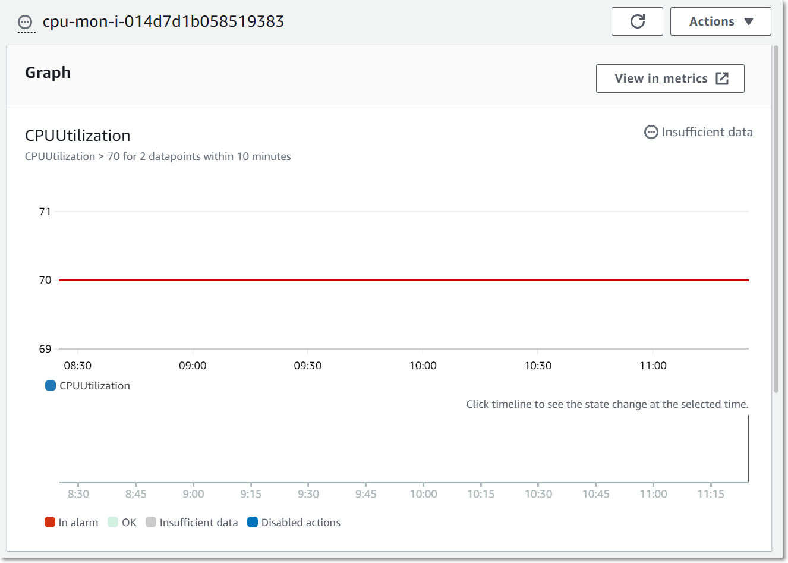

다양한 경우에서 EC2 인스턴스 메트릭에 대한 CloudWatch Alarm을 생성해 보았습니다.

읽어주셔서 감사합니다.

🔗 참고 링크:  
[1] Use tags to create and maintain Amazon CloudWatch alarms for Amazon EC2 instances (Part 1) - https://aws.amazon.com/ko/blogs/mt/use-tags-to-create-and-maintain-amazon-cloudwatch-alarms-for-amazon-ec2-instances-part-1/