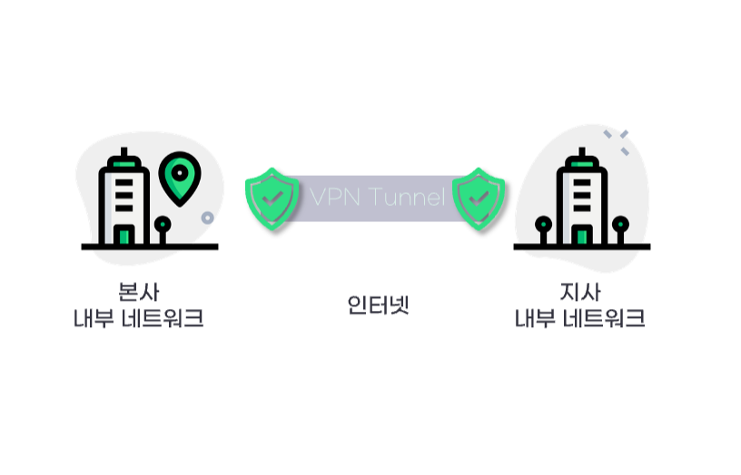
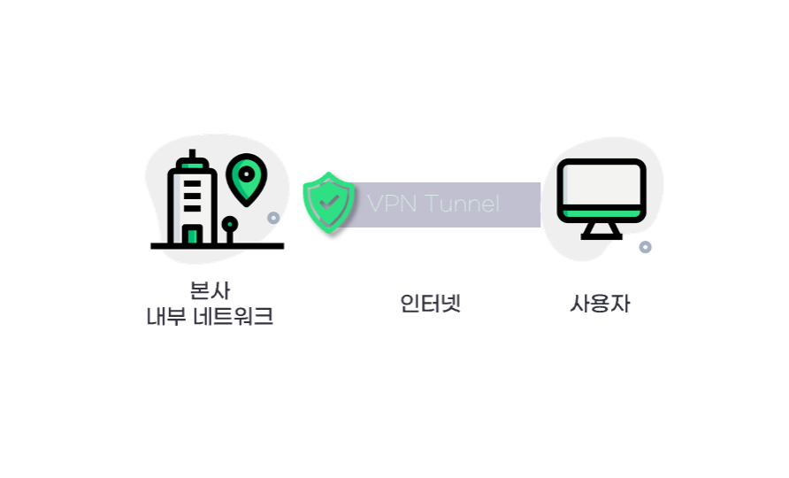
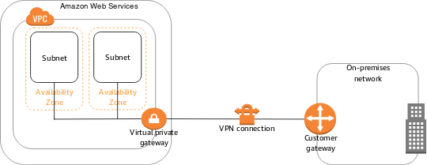
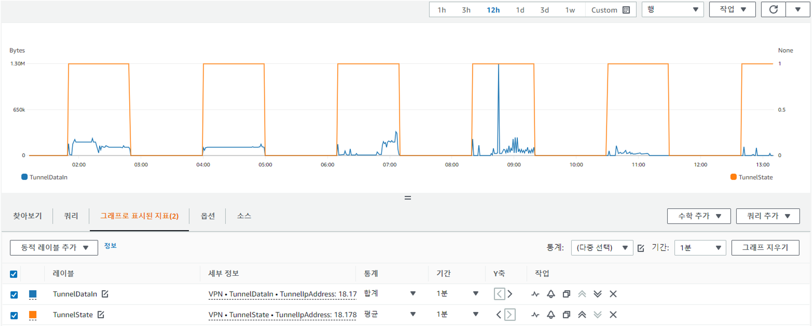

- - -

안녕하세요!

클라우메이트 TE팀 정휘영입니다.

오늘은 인프라 엔지니어라면 알아야하는 많은 것들 중에 \[네트워크]를 한번 정리해볼까합니다.

바로 VPN(Virtual Private Network) 입니다.

VPN은 가상사설네트워크의 줄임말로 사설네트워크를 물리적이 아니라 가상으로 연결해주는 네트워크 기술입니다. 
보통 신입 엔지니어는 (저 포함) 은 정확히 어떻게 동작하는지 모르는 분들이 있기도 하고 문제가 생기면 AWS 콘솔에서 어떤 것을 봐야할 지, 포인트가 뭔지 어려워하는 경우가 있었습니다. 

그래서 한번 공유하고자 글을 적어봅니다.

- - -

# "1. VPN"

VPN은 내가 가려는 목적지와 내 정보를 암호화 하는 것입니다. 

보통 사용자는 자신이 사용하는 휴대폰, 노트북처럼 인터넷에 연결하게 되면 통신사 기반의 네트워크를 거쳐 온라인으로 접속하게 되면 ‘기록’이라는 것이 남게 됩니다.

VPN을 사용하게 된다면 예시처럼 내가 보낸 문자를 암호화 시켜서 상대방에 보냈을 때 중간의 통신사에 남는 기록은 무용지물입니다.


예시는 간단하지만 중요한 것은  정보를 암호처리할 수 있다는 점입니다.

이렇게 VPN은 물리적으로는 전용선이 아니지만 가상으로 직접 연결한 것 같은 효과가 나도록 만들어주는 네트워크 기술로 전용선이 아니라 공중망을 통해서 가상의 사설 네트워크를 구성합니다. 그리고 private 통신을 제공합니다.

인터넷을 사용하다보면 한국에서 접속할 수 없는 사이트나 해외에 직접 들어가야하는 경우가 있는데 해외에서 리전별로 제한을 두는 경우가 있습니다.

우리는 보통 ‘우회’해서 들어가자고 말합니다. 우회해서 접속하는 방식 중의 하나가 VPN입니다.

- - -


그림처럼 VPN 프로토콜을 사용해 암호화된 데이터를 가지고 VPN 터널을 통하게 된다면 암호화된 데이터로 강력한 정보를 보호할 수 있습니다. 

이 연결망이 외부에 공개된다면 중간에 해킹이나 법적문제가 있을 가능성이 높습니다.  그래서 VPN은 암호화 그리고 제한된 인원의 정보 공개로 처리하는 것이 목적입니다. 

- - -

#### "네트워크 보안의 목표"

네트워크 보안의 목표는 외부 네트워크로부터 내부 네트워크를 보호하는 것입니다.

이때 외부로부터 보호받아야하는 네트워크가 트러스트 네트워크, 외부 네트워크가 언트러스트 네트워크라고 합니다. 여기서 VPN의 유형을 나누어서 나누어볼 수 있습니다.

VPN 장비를 사용하면 보호 받아야하는 트러스트 네트워크를 만들 수 있습니다.


그렇기에 VPN은 보통 3가지 유형으로 나뉩니다.

* Host와 Host의 통신보호
* Host와 Network로 접근할때 통신보호
* Network와 Network의 통신보호

1️⃣ **Host와 Host의 통신보호** 

* 두 호스트 간에 직접 VPN 터널 연동하는 기법입니다. 보통 VPN 구성으로 사용하지 않습니다.

2️⃣ **Host와 Network로 접근할때 통신보호**

* 사용자가 인터넷망을 통해 사내망으로 연결하는 경우입니다. IPSEC과 SSL Protocol이 모두 범용적으로 사용됩니다.

3️⃣ **Network와 Network의 통신보호**

* 특정 네트워크를 가진 두 endpoint를 연결 하는 경우 사용합니다. 이 경우는 IPSEC Protocol이 가장 많이 사용됩니다.

- - -

VPN은 가상 네트워크를 만들어주는 장비로 터널링 기법을 사용합니다. 

패킷을 터널링 프로토콜로 감싸 통신하는 기법이 터널링 기법이라고 합니다.

 그리고 현재 가장 많이 사용되는 보안 VPN 프로토콜은 IPSEC과 SSL입니다.

**\[ 본사 - 지사 ]  : IPSEC VPN**



본사-지사 간 네트워크 - 네트워크 연결 구성도

네트워크 간 연결은 보안이 강력한 IPSEC 기반의 VPN 기술을 사용합니다.

여기서는 VPN이 연결되는 본사와 지사에 모두 IPSEC VPN 기능을 지원하는 네트워크 장비가 필요합니다.

**\[본사 -  개인]  : SSL VPN**



\[개인 사용자-본사 간 네트워크 - 네트워크 연결 구성도]

네트워크 대 네트워크 연결이 아닌 PC 대 네트워크나 모바일 단말 대 네트워크 접속에 사용합니다. 

PC나 모바일 단말과 같은 원격지에서는 별도의 네트워크 장비 없이 VPN 연결을 사용할 수 있습니다. 회사에서 재택근무를 하는 환경을 적용해본다면 집에서 회사의 서버에 접속한다면 이 예를 이용해 이렇게 적용할 수 있겠습니다.

- - -

# "2. IDC + VPN + CLOUD"

고객사의 아키텍처를 보면 온프레미스 IDC에서 Cloud로 VPN을 연결해서 사용합니다. 

여기서 전 궁금한 점이 있었습니다.

 **❓ 왜 전부 Cloud로 마이그레이션 하지 않고 IDC에서 같이 사용하는걸까요?** 

그 이유를 IDC의 한계점과 그것을 보안해줄 수 있는 Cloud의 장점으로 생각해봤습니다.


Cloud는 탄력적이고 신속한 대응이 가능한 것이 큰 장점이죠.

A사와 B사는 티켓팅이나 트래픽이 많이 몰리는 이벤트가 많이 생기는 고객사입니다.  

IDC 서버와 AWS Instance를 VPN으로 연결해서 사용합니다. 이때 AWS에서 100대에서 150대씩 서버 증설을 신청합니다. 

B사도 사내에서 IDC와 함께 VPN으로 연결해서 사용합니다. 갑작스럽게 트래픽이 증가해서 서버가 부족하면 신속하게 프리워밍을 해서 프로비저닝을 할 수 있습니다.

**❓그렇다면 이렇게 좋은 Cloud를 두고 왜 IDC에서 VPN을 연결해서 사용할까요?** 

이렇게 On-Premise에서 해결해줄 수 없는 것을 클라우드는 가능케하지만 3가지로 생각해봤습니다.

**첫번째**는 IDC에서 클라우드로 연동하기가 쉽지 않다는 점

**두번째**는 비즈니적 관점으로 사용자의 데이터를 지켜내야하는 점

**세번째**는 Cloud 환경에서 동작하지 않는 On-Premise만의 레거시한 무언가가 있다고 생각했습니다.

- - -


**첫 번째 이유**는 IDC에서 클라우드로 확장하여 사용하는 것을 보통 Hybrid Cloud라고 합니다.Hybrid Cloud를 구성하기 위해선 전용선이나 VPN을 이용해야 합니다. 

이렇게 구성을 하면 On-Premise의 DataCenter나 클라우드 리소스 및 워크로드는 분리된 상태로 유지됩니다. 그렇지만 공통의 데이터 관리는 서로 연결됩니다. 

클라우드에 적합하지 않은 데이터를 포함하는 기존 시스템이 있다면 On-Premise에 분리해서 연결하는게 맞겠죠. 또한 전용선이나 해외 DR으로 구성할 가격이 정말 비싸기 때문에 백업용도로도 씁니다 . 

이건 비즈니스인 면으로도 **두번째 이유**로  이어집니다. 비용문제는 더불어서 데이터의 보안, 정확성, 가용성을 보장하기 위한 관행인 거버넌스의 돌파나 재인증이 필요하기도 합니다.

**마지막 이유**로 사용하고자 하는 장비가 클라우드에서 지원이 안된다거나 호환이 안되는 경우가 있습니다. (슬프게도..)  글로벌하게 사용하는 해외 VPN은 지원이 될 수 있으나 기술 지원이 힘든 장비를 사용한다면 운영하기가 힘들 테니까요.

# "3. CASE STUDY(1)-시나리오"

### S1. 단일 Site-to-Site VPN 연결



VPC에는 가상 프라이빗 게이트웨이가 연결되어 있고, 온프레미스(원격) 네트워크에는 고객 게이트웨이 디바이스가 있습니다. 단일 VPN 구성입니다. 보통 AWS는  VPN 터널 이중화 구성 설정을 권장합니다.  

이 상태는 고객의 온프레미스 환경에 장애가 생긴다면 대응 방법이 없습니다.

### S2. 다중 Site-to-Site VPN 연결


시나리오1 을 해결하기 위해서 온프레미스에 고객 게이트웨이 디바이스를 2대 사용합니다. 

시나리오 1과 다르게 높은 수준의 고가용성 환경을 가지고 있습니다. 
하지만 고객 게이트웨이 디바이스가 서로 클러스터링을 하지 못한다면 이 구성이 불가능하겠죠?

### S3. Static Routing 사용


그렇다면 시나리오 2에서 고객 게이트웨이 디바이스가 클러스터링을 미지원을 한다고 가정할 때 객 게이트웨이 디바이스의 이중화로 가용성을 높이는 구성을 만들어 볼 수 있겠습니다. 

DPD(Dead Peer Detect) 별도의 헬스 체크(ping 등)을 사용하는 것이 좋습니다. 
VPC 라우팅 테이블의 라우팅 전파 옵션을 활성화하기 위해 사용자가 직접 원격 네트워크의 경로에 대해서 설정합니다. 

역시나 높은 수준의 고가용성 환경이지만 터널 상태 감지가 되지 않을 때는 난감한 상황이 생길 수 있죠. 
또한 Static Routing 설정은 ‘수동’으로 해야하는 번거로움이 있습니다.

### S4.  Dynamic Routing (BGP) 사용


시나리오 3의 Static Routing 설정의 ‘수동’ 부분을 개선해줄 수 있는 것이  Dynamic Routing(BGP)입니다.

 AWS VPC 네트워크 대역과 온프레미스 네트워크 대역을 Dynamic Routing(BGP) 을 통하여 자동으로 정보를 알 수 있습니다. 
네트워크 대역 정보가 자동으로 학습 및 갱신됩되므로 변경되는 네트워크 대역 정보를 매번 수동 설정할 필요가 없습니다. 
여기서는 VPN 터널중에 하나가 연결이 끊기게 된다면 다른 장비로 넘어가서 Standby로 터널링을 그대로 승계받게 됩니다. 역시 높은 수준의 고가용성 환경을 만들 수 있습니다. 

👍🏻시나리오 3과 시나리오 4의 차이는 protocol failover의 수동 - 자동의 차이로 이해하시면 좋아요!👍🏻

- - -

# "4. CASE STUDY(2) - Checkpoint"

클라우드메이트에서 고객이 문의주신 사례를 한번 알아보겠습니다. 

### Case1. DPD



본사와 AWS 간 IPSec Tunnel 을 통한 통신이 정상적이지 않은 이슈로 문의를 주셨습니다.

해당 화면처럼 터널 다운이 생기고 있었습니다.  이것은 DPD(Dead Peer Detection) 구성을 의미하게 되는데요 

VPN은 연결된 터널에 트래픽 흐르지 않으면 Idle time을 기반으로 터널 연결은 중지(Down)합니다.

이를 탐지하는 설정이 DPD이며, AWS Site-to-site VPN은 이 값이 **기본 30초입니다.**

보통 DPD 설정은 On-premises VPN에서 설정을 하여 Tunnel이 Down된 것을 감지하면 일정 트래픽을 전송하여 다시 Up하는 로직을 가집니다.

AWS Site-to-site VPN은 DPD가 동작할 때 세션을 다시 연결하는 기능이 생겼습니다.

작업 - VPN 터널 옵션 수정을 선택하시면 다음 화면과 같이 특정 Tunnel에 대해 Tunnel을 다시 시작할 수 있으니 참고 바랍니다. 기본 값은 지우기(Tunnel Down) 입니다


터널 유지를 위해 온프레미스에서 DPD를 설정하거나 ping(ICMP:Internet Control Message Protocol)를 일정 간격으로 발생시켜 터널을 유지하는 것을 권장합니다.

### Case2. IKE_SA


또 다른 사례는 AWS VPN 터널 1개가 다운되어 조치 방법을 문의했고 Customer Gateway측으로부터 Delete IKE_SA에 대한 명령이 수신되었습니다. 

보통 VPN 터널의 IKE initiation 옵션은 Startup action과 DPD timeout action이 있습니다.  

전자의 사례와 다르게 DPD 제한 시작 작업을 바꾸는 것이 아닌 IKE 협상을 다시 진행해야합니다.

VPN으로 터널링을 만들고 그 사이로 데이터가 암호화된다고 했죠?

그 터널을 만드는 과정에서 사용되는 것이 IKE 프로토콜입니다. **IKE(Internet Key Exchange)_SA(Security association)** 는 통신에 사용할 암호화 방식에 대하여 보안 협상을 및 공유할 비밀키를 분배하는 과정의 설정 절차입니다. 

이걸 다시 해야한다는 의미입니다.


시작 작업(Startup action)은 새 VPN 연결이나 수정된 VPN 연결에 대해 VPN 터널을 설정할 때 수행할 작업입니다. 

고객 게이트웨이 디바이스는 IKE 협상 프로세스를 시작하여 터널표시대신 AWS가 IKE 협상 프로세스를 시작하도록 지정할 수 있습니다.

### 모니터링은?


**AWS CloudWatch를 사용하여 VPN 연결 모니터링을 할 수 있습니다.** 


15개월간 기록이 됩니다. 다만, 제공되는 메트릭은 제한적이고 따로 별도의 Log 등을 제공하지 않습니다.

* TunnelDataIn : VPN 터널을 통해서 수신된 데이터 (Byte 단위)입니다. Sum 통계를 사용할 수 있습니다.
* TunnelDataOut : VPN 터널을 통해서 전송 된 데이터 (Byte 단위)입니다. Sum 통계를 사용할 수 있습니다.
* TunnelState : 터널의 상태로 1은 터널이 연결 됨, 상태 0은 터널의 Down 입니다. BGP VPN의 경우도 마찬가지입니다.

AWS CLI를 사용하여 지표를 확인할 수 있습니다.

```linux
aws cloudwatch list-metrics --namespace "AWS/VPN"
```

**AWS Health 이벤트를 사용하여 VPN 연결 모니터링도 가능합니다.**

AWS Health Dashboard는 VPN 연결에 대해 2가지의 알림을 제공합니다.

* 터널 엔드포인트 교체 알림
* 단일 터널 VPN 알림  : Site-to-Site VPN 연결은 두 개의 터널로 구성됩니다. 
  고가용성을 위해 두 터널을 모두 구성하는 것이 좋죠. 
  VPN 연결에 있는 터널 하나는 가동 중이고 다른 하나는 하루에 1시간 이상 다운되는 경우 AWS Health Dashboard 이벤트를 통해 VPN 단일 터널 알림을 받습니다.

---

# "5. Hands-On "

실제로 해보는 것도 필요합니다.

VPN은 실제로 터널링을 해봐야 문제점을 파악하기가 쉽답니다.


IDC에서 클라우드로 확장하여 사용하는 것을 보통 Hybrid Cloud라고 말씀드렸지만 저는 Multi Cloud로 연결해보려고 합니다. Azure를 온프레미스라고 가정해봅니다. 

사실 제일 테스트하기 쉬운 건 클라우드죠. 

#### 역시 여기서도 클라우드의 장점이!

- - -

## Azure와 AWS의 설정

아래 표는 각각 Azure와 AWS의 설정을 간단하게 표로 정리한 것입니다. 


Azure에서 리소스 그룹을 생성합니다.
Azure는 리소스 그룹을 만들고 그 내부에서 리소스를 생성할 수 있습니다.

hwi-VPN-VN의 이름으로 Virtual Network인 가상네트워크를 설정합니다. 그리고 Private IP 대역대를 설정합니다.

**Azure의 Private IP 대역대 입니다.**


VPN-VPG에서의 공용 IP 주소는 AWS의 고객 게이트웨이 (Customer gateway)의 주소입니다. 

AWS의 Site to Site VPN Connection에서 확인할 수 있습니다. 


Azure의 Local Network Gateway에서 AWS VPN의 Tunnel IP 주소(외부 주소)를 입력합니다. 주소 공간은 AWS의 VPC 주소를 씁니다.

VPN Connection은 IDC 혹은 다른 클라우드의 장치와 Amazon VPC간의 보안 연결을 나타냅니다.

여기서 VPN Tunnel은 AWS VPC Network와 온프레미스 혹은 다른 클라우드의 네트워크 간 주고 받을 수 있는 링크입니다. 역시 암호화 되어있습니다.


\[연결] 에서 세팅을 완료한 후 상태를 확인할 수 있습니다.


AWS의 콘솔에서 확인하면 Tunnel 1이 업이 되어있음을 알 수 있습니다.

이렇게 다른 클라우드랑도 VPN을 사용할 수 있답니다 🙂

- - -

# "Connection Check"

이렇게 설정을 했어도 내가 과연 잘 했는지 설정이 궁금할 때가 있습니다.

저는 눈으로 흐름이 보고싶을 때가 있는데요

AWS와 Azure에 이렇게 확인 할 수 있는 서비스가 있습니다!

### \[ AWS Reachability Analyzer ]


AWS Reachability Analyzer 는 네트워크 구성이 의도한 대로 되었는지 확인하는 방법 중의 하나입니다.

점점 더 복잡해지는 네트워크 아키텍처를 구축함에 따라 잘못된 구성으로 인한 네트워크 연결 문제를 해결할 수 있는 도구이기도 하죠.

이렇게 세팅을 해놓으면 소스에서 대상까지 흐름을 눈으로 확인할 수 있답니다!.

* Source :  i-06afea8b224444eed (인스턴스)
* Destination :  vgw-0a0bf7fecaf716214 (VPN)
* Destination port : 22

### \[ Azure Network Watcher ]


Azure Network Watcher는 Azure 가상 네트워크의 리소스를 모니터링 및 진단을 할 수있습니다.
네트워크 구성이 의도한 대로 되었는지 확인하는 방법이죠. 

두 지가 있습니다. 눈금보기와 토플로지 보기가 있어요. 가상 네트워크의 리소스와 해당 리소스의 관계를 보기에 좋습니다. 

Network Watcher > 연결 문제 해결에서 지정할 수 있습니다.

Azure가 온프레미스라고 헀으니까 ICMP로 계속 ping을 날려보는 것으로 설정해서 체크해봤습니다.

- - -

## 정리하며…

네트워크에 대한 공부는 끊임이 없지만 VPN에 대해 공부하면서 전체적인 흐름을 이해할 수 있었습니다.

Amazon VPC의 있는 서비스를 이해하기 위해서 아직도 많이 알아야합니다. 

가장 기본이 되는 CIDR 과 Subnet, Router, Gateway 등등 하나씩 알아가보려고 합니다.

읽어주셔서 감사합니다.

- - -

\[📖 참고 도서]

따라하며 AWS 배우는 네트워크 입문(김원일, 서종호 저)

IT엔지니어를 위한 네트워크 입문(고재성, 이상훈 저)

\[🔗 참고 링크]

<https://docs.aws.amazon.com/vpn/latest/s2svpn/SetUpVPNConnections.html>

<https://aws.amazon.com/ko/blogs/korea/new-vpc-insights-analyzes-reachability-and-visibility-in-vpcs/>