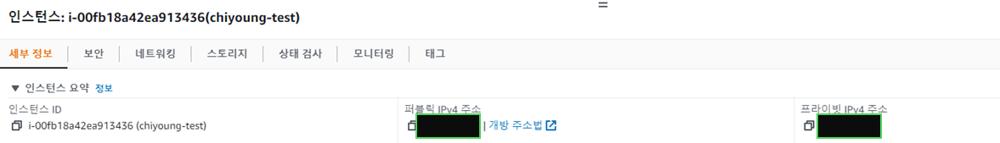

EC2_Instance_id의 경우,
EC2 대시보드의 Instance_ID를 사용합니다.

# 1. EC2

사전 준비물 : ec2 instance



기존에 존재하는 ec2 인스턴스를 테라폼을 통해서 변경해 보기로 합니다.

들어가기 전에, 해당 자료 진행시 리눅스 머신(ubuntu 20.04) 에 aws cli 구성 및 증명 파일이 설정되어 있습니다.

> https://docs.aws.amazon.com/ko_kr/cli/latest/userguide/cli-configure-files.html
> 

> /tf.state 받을 폴더


**Step 1. 구성 폴더 초기화하기**

```bash
terraform init
```

해당 명령어를 실행하여, 테라폼 구성 파일을 포함한
구성 폴더를 초기화합니다.

앞으로 기존에 사용하는 리소스를 **tf.state** 라는 파일을 통해서 받아옵니다.

**Metadata**를 계속 트래킹 할 수 있게끔 해주고, 대규모의 인프라를 향상시키기 위해서
테라폼은 인프라와 구성을 저장하게끔 되어 있습니다.

> /tf.state 받을 폴더

```bash
provider "aws" {
    region = "ap-northeast-2"
}
resource "aws_instance" "bar" {
  # (resource arguments)
}
```

초기에 임포트 할 리소스의 Template을 좌측과 같이 만듭니다.
그리고 하기 step을 거쳐 임포트 합니다.

여기서 bar는 유저가 명시한 리소스 명을 의미합니다.

**Step 2. 임포트 하기**

```bash
terraform import <resource type> <resource name> <EC2_Instance_id>
```

EC2_Instance_id의 경우, 리소스 타입, 리소스명, EC2 인스턴스 ID를 입력합니다.

실제 사용 명령어

```bash
terraform import aws_instance.bar i-00fb18a42ea913436
```


해당 명령을 사용하면, import가 완료됩니다.

import 내용을 확인합니다.

```bash
ls
```

명령어 수행 결과


**Step 3. tf 파일 읽어오기**

```bash
terraform show
```

해당 명령어는 state 혹은 plan 파일을 사람이 읽을 수 있도록 보여줍니다.


여기서 필요한 부분만 복사합니다.
여기서는 Name tag와 instance type을 변경하겠습니다.

```bash
provider "aws" {
    region = "ap-northeast-2"
}
resource "aws_instance" "bar" {
  # (resource arguments)
}
```

```bash
resource "aws_instance" "bar" {
    ami                                  = "ami-01d87646ef267ccd7"
    availability_zone                    = "ap-northeast-2a"
    instance_type                        = "t3.medium"
    key_name                             = "chiyoung_test"
    security_groups                      = [
        "ec2-rds-1",
        "launch-wizard-65",
    ]
    tags                                 = {
        "Name"     = "chiyoung-2022"
        "chiyoung" = "1"
    }
}
```


**Step 4. 테라폼 plan 확인하기**

해당 명령어를 실행하면 apply시 실행할 plan에 대해서 확인 가능합니다.

~ 명령어는 변경될 리소스, +는 추가될 리소스, -는 삭제될 리소스

를 나타냅니다.


**Step 5. 테라폼 파일 적용하기**

해당 명령어를 실행하면 plan이 적용됩니다.

Do you want to perform this actions?
라고 물을 경우, yes를 입력하면 적용됩니다.

변경 적용까지는 2분 20초가 소요됐습니다.

**결과 확인**

> /aws console/ EC2 대시보드


변경된 리소스 확인하기

리소스명, 인스턴스 유형이 변경된 것을
확인할 수 있습니다.

# **2. ELB Access Log**

> /elb.tf

EC2 이후에 ELB access log가 적용되어 있지 않은 ELB에 버킷을 생성하고
액세스 로그를 적재가 가능한지 테스트할 일이 있어 해당 내용을 테스트 해 보았습니다.

마찬가지로 리소스를 가져올 템플릿 파일을 만들어 봅니다.

```bash
provider "aws" {
    region = "ap-northeast-1"
}
resource "aws_lb" “example" {
  # (resource arguments)
}
```

초기에 임포트 할 리소스의 Template을 좌측과 같이 만듭니다.
Resource명이 aws_instance에서 aws_lb로 변경됩니다.

(테스트시 ec2와 달리 리전이 도쿄 리전 (ap-northeast-1) 이었습니다.)

> /elb.tf가 위치한 폴더

**Step 1. 구성 폴더 초기화**
다시금 해당 명령어를 실행하여, 테라폼 구성 파일을 포함한 구성 폴더를 초기화합니다.

```bash
terraform init
```

**Step 2. 임포트 하기**

```bash
terraform import <resource type> <resource name> <ELB ARN>
```

실제 사용 명령은 다음과 같습니다.

```bash
terraform import aws_lb.example arn:aws:elasticloadbalancing:ap-northeast-1:7XXXXXXXXXX8:loadbalancer/app/chiyoung-alb/7c6a359c72a9a02e
```

해당 명령을 사용하면, import가 완료됩니다.

**Step 3. tf 파일 읽어오기**

```bash
terraform show
```

EC2 때와 비슷하지만, 버킷을 생성하고 ELB Access Log를 활성화해야 하기 때문에
프로세스가 다소 차이가 있습니다.

해당 명령어를 실행하여, state 혹은 plan 파일을 사람이 읽을 수 있도록 보여줍니다.


EC2 때와 마찬가지로 4번 내용에 terraform show를 통해 확인된 내용을 집어넣고, ①,②,③번의 내용을 기입하여 신규 리소스를 생성합니다.

**Step 4. terraform plan 확인하기**

해당 명령어를 실행하면 apply시 실행할 plan에 대해서 확인 가능합니다.

**Step 5. terraform apply**

해당 명령어를 실행하여 리소스를 적용합니다.


액세스 로그가 적용된 내용을 확인합니다.


