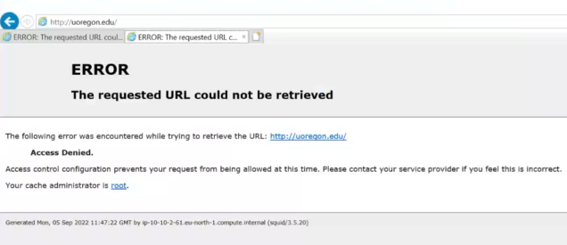
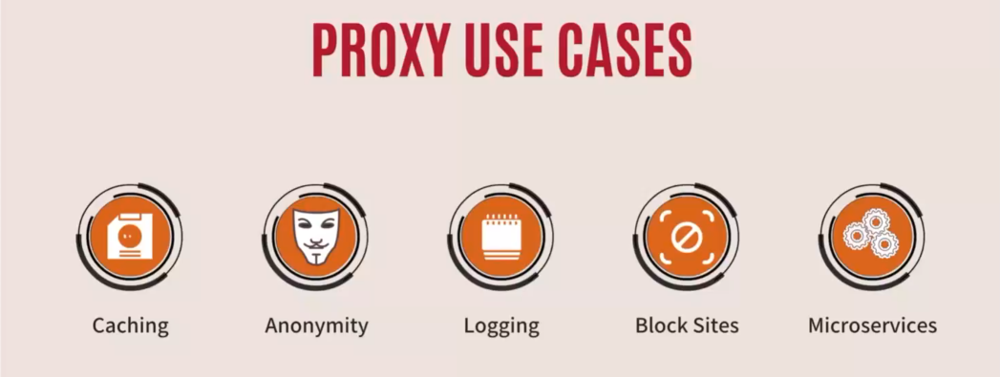
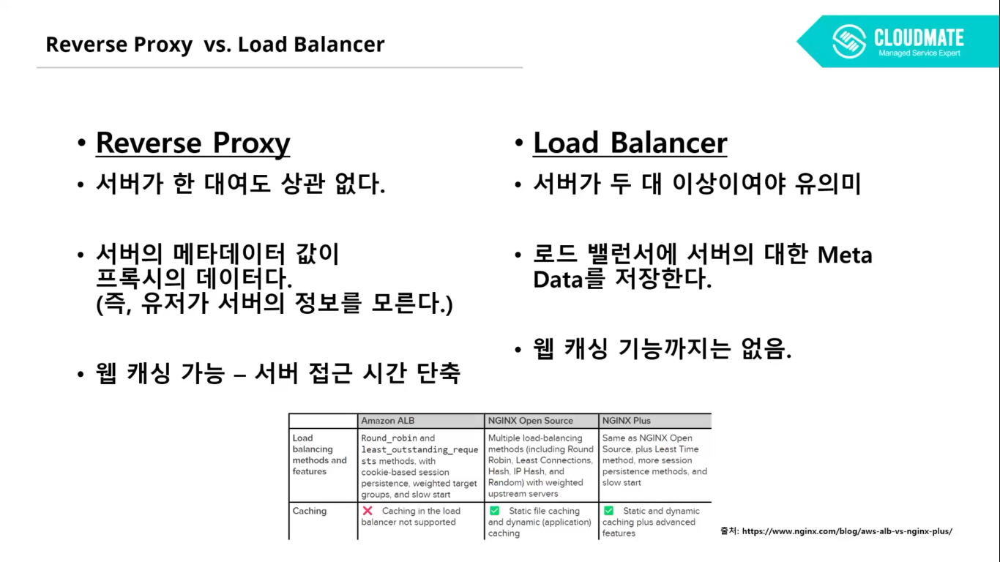
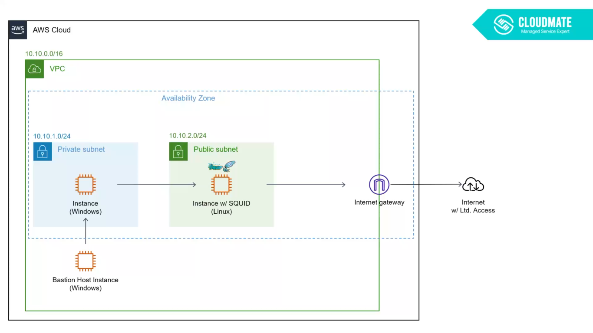
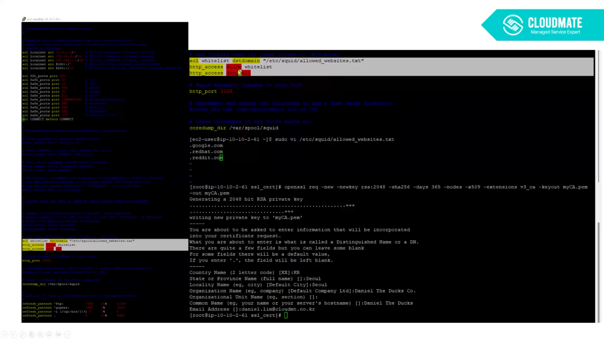
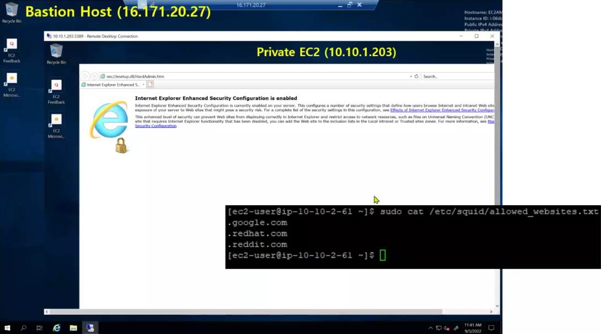
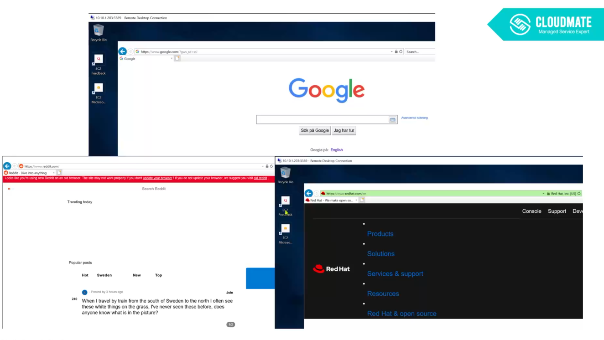
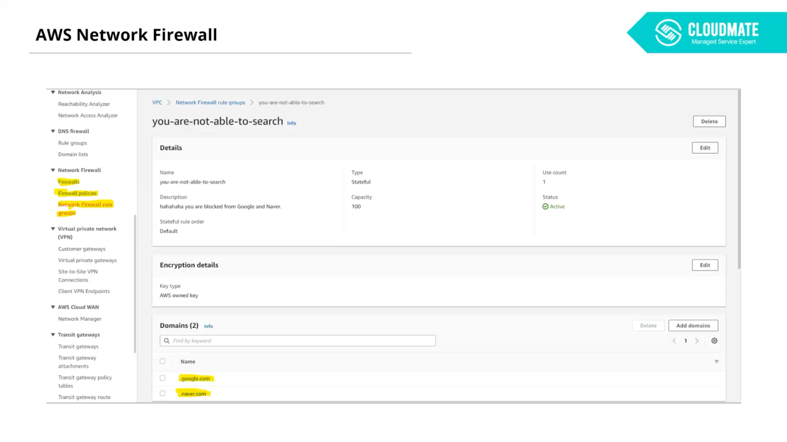
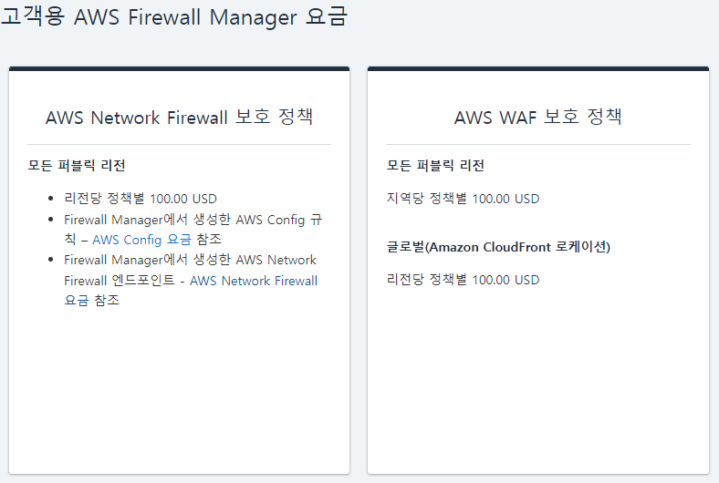

시작하기 전에 본인은 특정 기업의 특정 서비스를 홍보하고자 적는 글이 아닐지도 모른다(?)는 점을 미리 밝힌다. \
광고라고 생각한다면, 분명 기분 탓일 것이다. (특히, 거기 당신! 그 생각을 고이 접어 둬라)

인터넷에서 여러가지 일을 하다보면 가끔 다음과 같은 모습을 볼 수도 있을 것이다.

물론 이 모습만 보이는건 아니고 다른 형태도 있다.

이런 페이지가 보인다면 통상적으로 특정 위치에서 당신이나 \
혹은 되돌아오는 요청을 막았기에 저런 페이지가 보인다고 생각 하면 될 것이다. 

왜냐면 "Access Denied" 라고 떴으니까...

고로 본 글에서는 Access Denied의 대해서 알아보고자 한다.

\---

## 1. 뭐...뭐야... 왜 막힌거임?

가정에서든 회사에서든 어떠한 목적으로 특정 사이트를 막고 싶을 것이다.
뭐 예를들어 공부 하는데 페북이라던 페북이라던가 페북이라던가를 막고 싶다.
회사에서 보안상의 목적으로 특정 웹사이트를 막고 싶다.

그럴 때 쓰는게 프록시라는 녀석이다.

우선 프록시를 대략적으로 알아보자

프록시는 사용자/클라이언트와 서버 사이에 위치하는 중간 보스(?) 역할을 한다고 보면 된다. 
사용자의 접속 요청을 프록시라는 녀석에게 전달하고 프록시는 받은 요청을 본인이 가지고 있는 설정이나 조건을 기반으로
서버나 웹으로 보내주는 역할이라고 보면 된다.

마치 공항에 도착해서 입국심사 하는 느낌이라고 할까나?

프록시의 대략적인 역할은 다음과 같다.

* 웹 캐싱을 통해 서버 접속 시간을 줄여준다.

* 유저의 정보가 아닌 프록시의 정보를 서버로 넘겨준다.
  (즉, 유져의 익명성을 보장 할 수 있다.)
* 접속 로그를 확인 할 수 있다.
* 특정 사이트 접근을 설정을 통해 제어 할 수 있다.
* 마이크로서비스: 사용자의 목적에 따라 특정 서버로 이동 시킬 수 있다.

*아무리 봐도... 공항 입국심사스럽다...*

\---

## 2. 종류가 뭐가 있나요?

그리고 프록시 라고 하면 흔히 2.5 가지의 종류를 볼 수가 있다.

* Forward Proxy : 정방향 프록시
* Reverse Proxy : 역방향 프록시 

* Load Balancer : 로드 밸런서

(본인 기준으로 번역한 것이니 반박시 여러분들 말이 맞을 것이다.

포워드 프록시가 우리가 흔히 "프록시" 라고 하면 나오는 친구다.\
리버스 프록시는 포워드와 다르게 유저에 관점에서 바라보는 것이 아닌 "서버"의 관점에서 바라본다고 보면 된다. 

포워드 프록시와 기능이 비슷하나, 결정적인 차이점이 몇 가지 있다.

* 유저가 아닌 서버의 익명성을 보장한다.

* 로드 밸런서의 역할로도 수행 할 수 있다.
* Ingress 옵션을 설정 할 수 있다. (즉 유저의 활동에 따라 서버를 분산 시킬 수 있다.)
* 위를 바탕으로 카나리 배포같은 서비스 중 없는 업데이트도 가능하게 만들어 준다.

방금 본인이 2.5 가지라고 했을텐데, 그 이유는 이 리버스 프록시의 "로드 밸런싱" 역할 인 것이다.

사실 로드 밸런서 그 자체는 프록시라고 볼 수는 없고 그저 "로드 밸런서"일 뿐이지만\
리버스 프록시의 기능과의 차이를 설명하기 위해 본 글에서 쩜오로 간략히 소개 해보겠다. 

이 처럼 리버스 프록시와 로드 밸런서의 기능이 유사해 보이지만 완전히 다른 모습이다 라는 걸 알 수있다. \
익명성의 보장, 서버 수의 차이, 웹 캐싱 기능의 차이.

즉, 로드 밸런서는 그저 로드 밸런서일 뿐...

\---

## 3. 본론으로 들어가서 - DNS Filtering

자! 그렇다면 실제 웹/앱 서비스에서도 이러한 프록시 기능을 쓸 수 있을까?\
(뭐… 불가능하다면 이 글을 적지도 않았다.)

서비스를 운영 할 때 프록시를 쓴다는거는 사용하는 서버에 아웃바운드를 통제 한다는 의미라고 봐야 한다.

여러 방법이 있지만 그 한 기지인 오픈소스를 사용해보려고 한다.\
그 이름은 바로 **오징어 "SQUID"**. (넷\*\*스 떠오른 당신! 부디 반성하시기 바란다.)

오픈소스 스퀴드를 활용 하여 서버에 프록시를 구축한다는 것인데 오픈소스인 만큼 전기비와 서비 운영 비용을 제외한 나머지는 무료다.

자 설명은 이쯤 하고 직접 만들어 보자.

기본적인 구성은 이렇다:

쉽게 설명 하자면 다음과 같다.

* 서버에 스퀴드 소스를 설치 한다.

* 화이트리스트격인 whitelist "/etc..."를 스퀴드 서버 안에 넣어 준다. 
* 생성한 화이트리스트에다가 막고 싶은 사이트를 넣는다. (이 시점에서 DNS Filter의 의미를 알 수 있다.)

* 서버를 재시작 한다.
* 서버로 들어 가서 설정을 확인 해주고
* 화이트리스트로 작성한 페이지가 들어 가는지 확인 한다. 

작성 된 화이트리스트 기반으로 페이지가 보여지고 있다. 정말 다행이다(...)

솔직히 본인은 이거 하겠다고 3일 정도 걸렸던 기억이 있다.

고로 이 방법을 선택한다면 서버부터 네트워크 기타 설정과 스퀴드 설정을 일일히 해줘야 한다.\
이 얼마나 끔찍하고 무시무시한 일인가 싶다...

심지어 단순한 서비스를 한다면 몰라도 규모가 커지면서 중견급으로 넘어 가는 순간\
구성 난이도가 기하급수적으로 늘어 나게 된다. \
(적어도 본인 기준에서는)

물론, HA 구성을 위해 VMSS/Auto-scaling 을 활용 하여 서비스 환경에 따라 유연하게 대처 할 수 있다.\
하지만 구성 난이도는 머씨 말처럼 화성에 갈 수도 있다...

구성이나 데모 시연 관련 해서는 아래에서 본인이 직접 촬영한 영상에서 볼 수 있다. \
https://web.microsoftstream.com/video/d4ce2082-fbc7-45a4-8bff-b60cae2b417e?list=studio

\---

## 4. 그렇다 어렵다... 하지만,

그렇다 어렵다... 이 친구는 꽤나 어렵다!!
하지만, 이 모든 내용을 상대적으로 쉽게 하는 방법이 있다.

AWS Firewall 을 사용한다면 국가 기준으로, IP기준으로, 웹사이트 DNS 기준으로 조금 더 쉽게 설정이 가능하다.

그렇다... 이 페이지가 정말 끝이다.

확실히 직접 구성하는거 보다 AWS Firewall 을 사용하면 더 쉽게 구성이 가능 한 모습을 볼 수 있다.

하지만 문제는 캐쉬다… 그 캐쉬 말고 진짜 캐쉬(CASH)다.\
이전 포스트에서도 (링크) 얘기 했듯이, 세상에서 가장 어려운게 돈을 버는게 아니라 돈을 줄이는 것이라 했다.

AWS Firewall을 사용함에 있어서 과금이 꽤나 부담 스러울 수도 있다.

우선 단순 계산으로 한다 하더라도 기본 $100 부터 시작하니 부담이 없다고 할 수는 없다.

하지만 유지보수나, 구성 난이도, 장애 가능성을 생각한다면 서비스의 규모가 크면 클수록 Firewall을 사용하는게 \
더 마음이 편하지 않을까 하는 조심 스러운 의견인다.\
정말 소규모나 서비스가 급격하게 늘어나지 않는 다는 선에서는 스퀴드나 Nginx를 사용하여 직접 구착 하는 것도 매력적으로 보이나

서비스의 성장 가능성이 크고 급격하게 늘거나 큰 규모의 서비스를 운영 하고자 한다면 자본주의 상징인 CASH를 쓰는게 좋지 않을까?

저런… 어딜가든 자본주의는 피할 수 없는 숙명이였단 말인가…?
-의 깨달음을 다시 한 번 얻으면서

이 글을 마치고자 한다.
