# Netlify CMS 를 활용한 글 작성 및 게시

## 글 게시 권한 획득 

저장소에 커밋을 직접 푸시하려면, 클라우드메이트 GitHub Organization 의 구성원 이여야 합니다.
클라우드팀에 문의하여 본인 GitHub 계정 정보 전달 후, GitHub Organization 구성원 초대를 먼저 받으시기 바랍니다.

## Netlify CMS 접속

https://tech.cloudmt.co.kr/admin/ 으로 접속합니다. 화만 중앙의 `GitHub로 로그인` 버튼을 클릭하여 GitHub 계정으로 로그인 합니다.
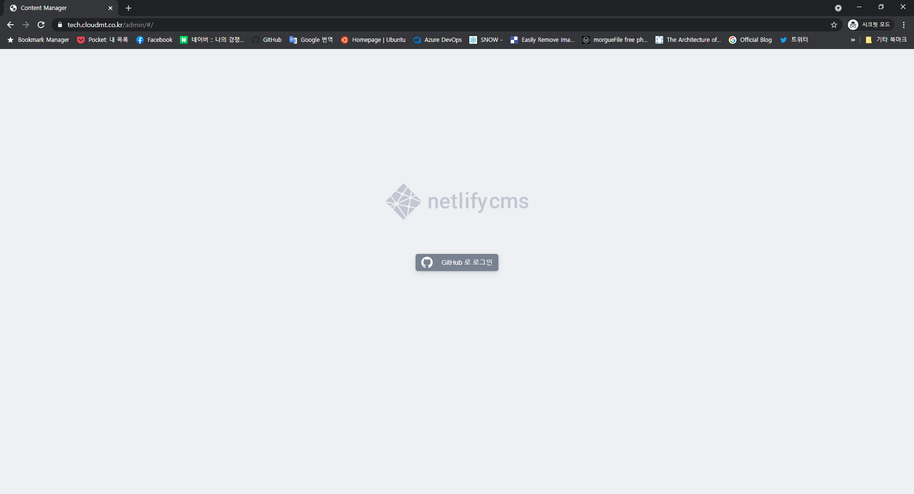
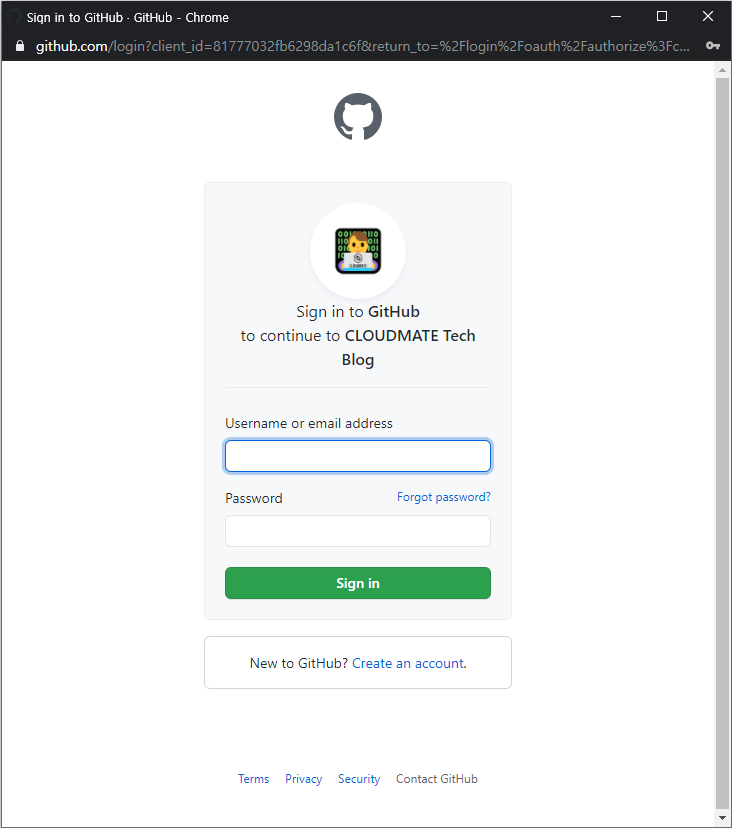

블로그 CMS에 처음 로그인 한 경우 아래와 같은 권한 허가 화면이 나타납니다. `cloudmatelabs` 에 체크표가 붙어 있는지 확인 후 `Authorize cloudmatelabs` 를 클릭하여 계속합니다.
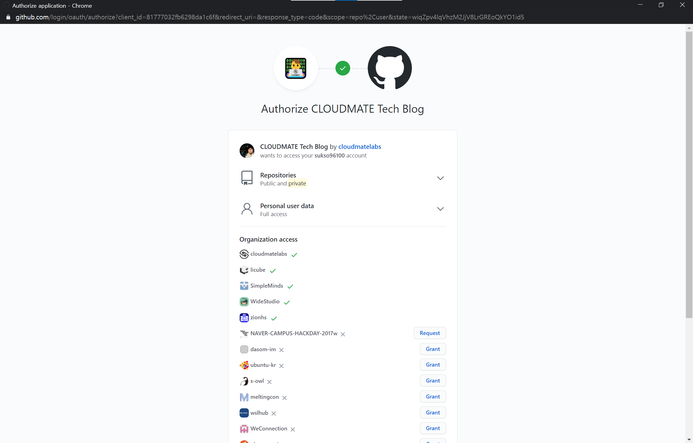

## 저자 등록
저자 등록을 하지 않았다면 먼저 합니다. 상단 메뉴에서 `콘텐츠` 를 선택 후, 좌측 `컬렉션` 에서 `저자` 를 선택합니다. 그리고 `새 저자 항목` 버튼을 클릭합니다.
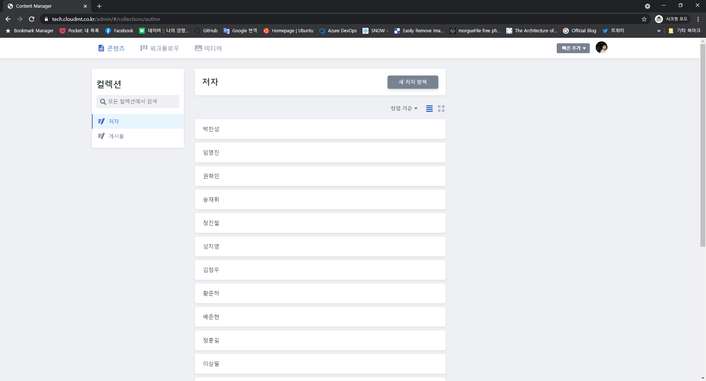

저자 정보를 입력합니다.

- 저자 ID: 본인 이름의 로마자 표시 (로마자 소문자로, 공백 대신 `-`로 입력)
  - 예: 홍길동 -> `gildong-hong`
- 저자 이름: 블로그에 실제로 표시되는 이름 입력 (예: `홍길동`)
- 저자 사진: 본인 프로필 사진 업로드. 
- 저자 소개: 간단한 자기소개를 입력합니다.

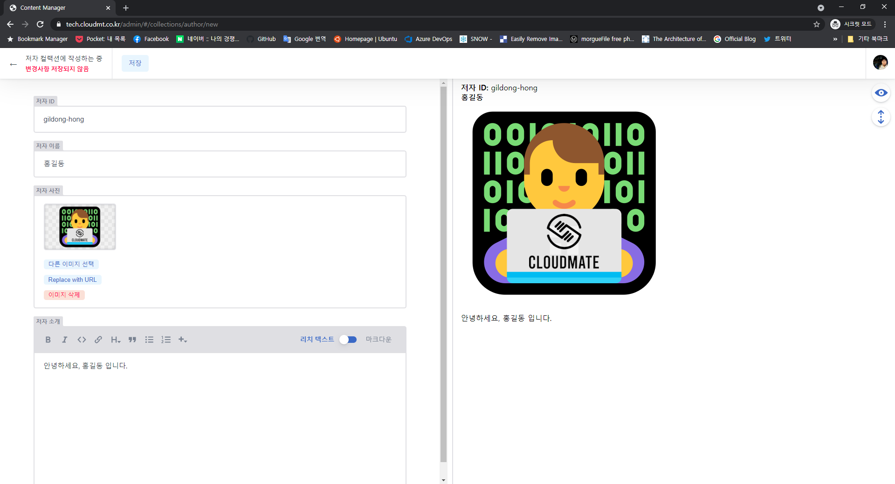

작성 완료 후, 저장 버튼을 눌러 저장합니다. `상태 설정`을 `준비됨`으로 설정하여 저장한 후, `게시`에서 `지금 게시`를 눌러 저자 정보를 게시합니다.
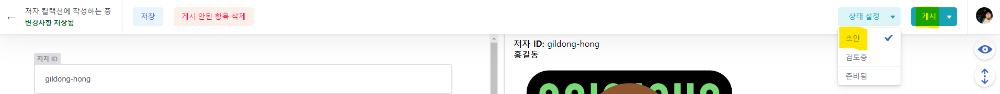

## 글 작성하기
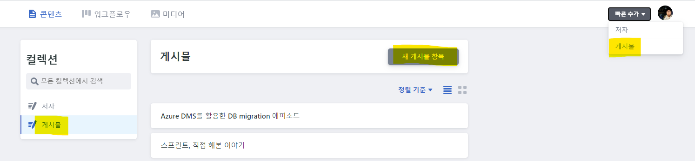
CMS 홈 화면에서 `콘텐츠` -> `게시물` -> `새 게시물 항목` 버튼을 누르거나, 우측 상단 메뉴의 `빠른 추가` -> `게시물` 을 클릭하여 게시물 작성 화면으로 들어갑니다.

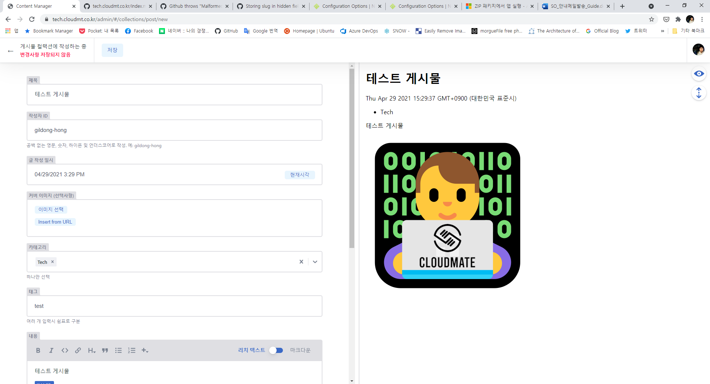

게시물 작성 화면에서 다음을 참고하여 게시물 기본 정보를 작성합니다.
- 제목: 글 제목 입력
- 작성자 ID: 앞에서 저장 등록 시 `저자ID` 에 입력한 것을 입력합니다.
- 글 작성 일시: 블로그에서 보여질 글 작성 일시 입니다. `현재시각` 버튼을 눌러 자동으로 채울 수 있습니다.
- 커버 이미지: 글 목록에서 표시할 게시물 커버 이미지를 업로드 합니다.
- 카테고리: 글 카테고리를 **하나만** 지정합니다.
- 태그: 글 테스를 자유롭게 입력합니다. 여러게 입력시 쉼표로 구분합니다.

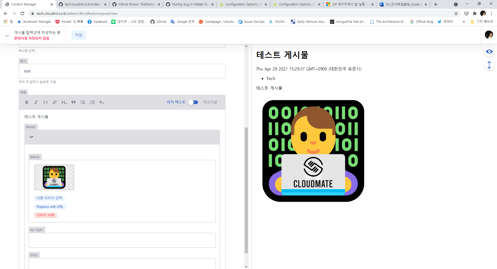

`내용` 칸에 글 내용을 입력합니다. `리치 텍스트` 로 위지윅 방식으로 작성하거나, `마크다운` 모드로 마크다운 문법으로 글을 작성할 수 있습니다. 글 작성시 우측에 미리보기가 나타납니다. 이미지를 첨부하려면, 툴바의 `+` 버튼으로 첨부할 수 있습니다.
## 작성 글 미리보기

작성한 게시물을 우선 저장 하면, GitHub 저장소 상에서는 별도 브랜치에 글이 저장되며, Pull Request 가 하나 자동으로 생성됩니다. 그러면 GitHub Actions 에서 해당 PR 에 대한 미리보기 빌드를 생성하며, 빌드 완료 후 미리보기 URL을 커멘트로 알려줍니다. 이 URL에 접속하여 실제 블로그에서 글이 어떻게 보이는지 확인할 수 있습니다.
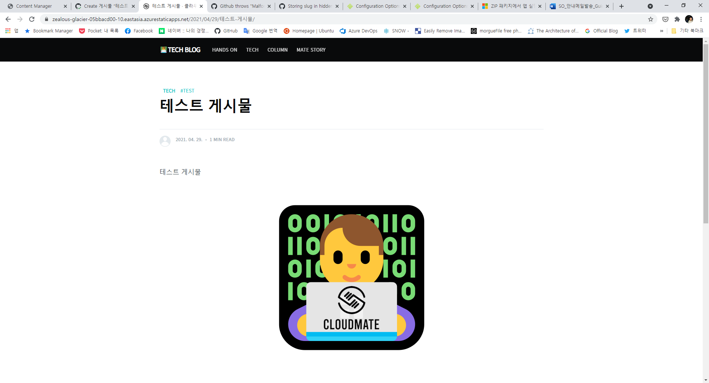
## 글 게시하기

저장된 글 편집 화면에서, `상태 설정`을 `준비됨` 으로 바꾸고, `게시` 버튼에서 `지금 게시`를 클릭하여 게시물이 실제 블로그에 게시 되도록 합니다.

워크플로우 화면에서 작성중이지만 아직 게시되지 않은 글을 모두 확인할 수 있습니다. 이 화면에서 게시하려면, 게시물 카드를 `준비됨` 영역에 옮기고, 해당 게시물 카드의 `새 항목 게시` 를 클릭하여 게시할 수 있습니다.
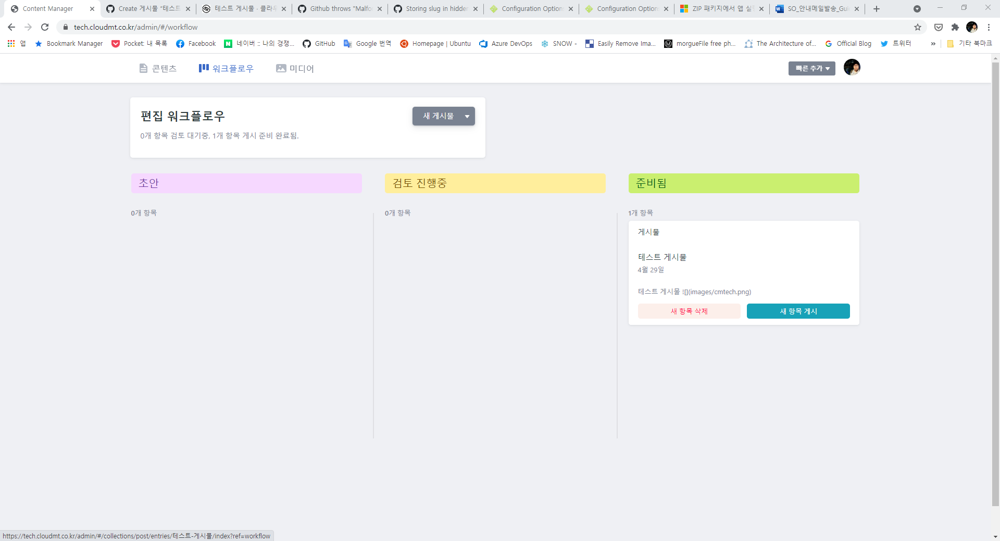

게시를 취소하려면, 해당 글 편집 화면의 `게시됨` 버튼을 누르고, `게시 철회` 버튼을 클릭하여 게시를 취소합니다.